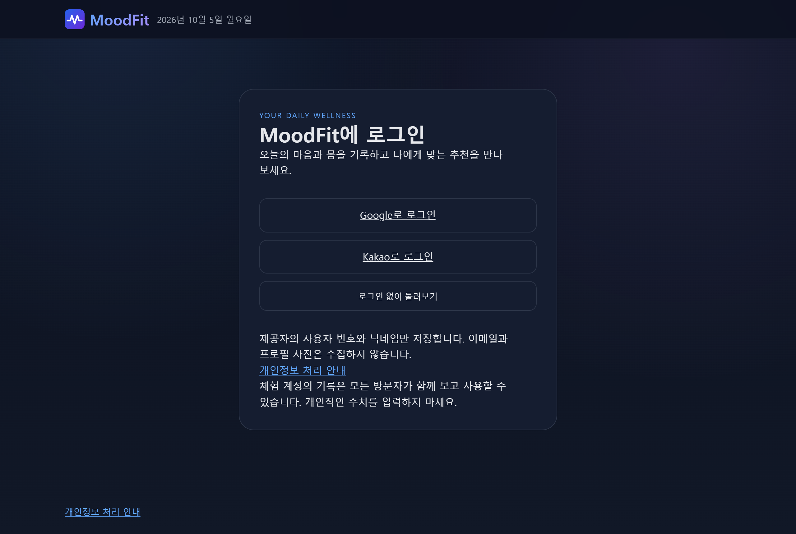
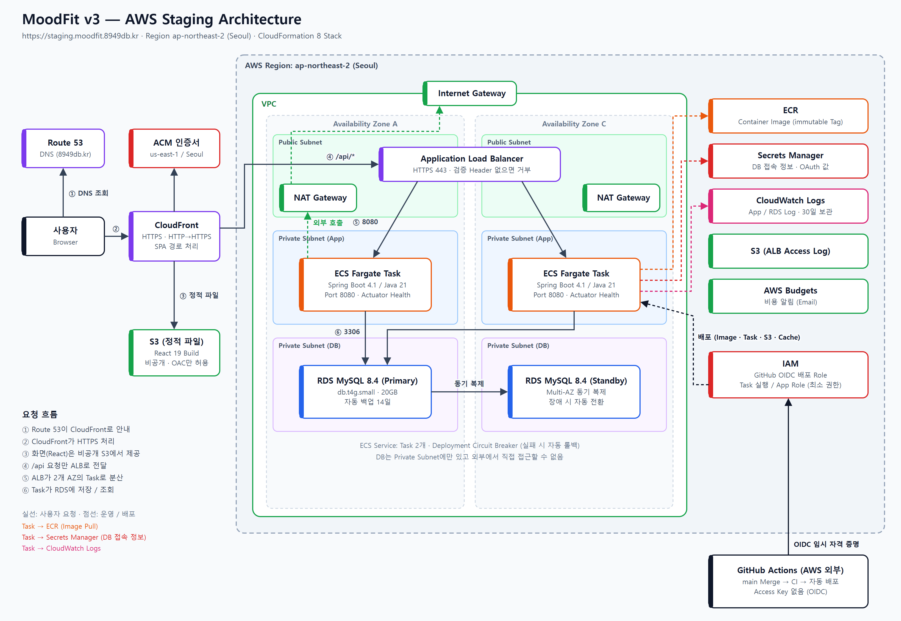

# MoodFit v3

Dashboard는 서울 날짜 기준 오늘 기록 여부를 구분합니다. 오늘 미입력이면 입력 안내를 먼저 표시하고 저장된 평균과 마지막 기록을 구분하며, 지난 기록의 AI 코멘트는 자동 생성하지 않습니다.

오늘 기록이 없으면 “오늘 날씨로 추천 받기”를 눌러 음식 2개와 음악 2곡을 볼 수 있습니다. 버튼을 누를 때만 위치를 조회하며 날씨와 추천은 저장하지 않습니다. 오늘 상태를 입력하면 기분까지 반영한 추천을 볼 수 있습니다.


[](https://github.com/youneedpython/MoodFit-v3/actions/workflows/ci.yml)

**신체 리듬과 날씨로 오늘의 컨디션을 읽고, 어울리는 음식과 음악을 추천하는 웰니스 웹 서비스**

수면, 스트레스, 에너지 같은 오늘의 상태를 입력하면 MoodFit이 Wellness Score와 Mood를 계산하고,
현재 위치의 날씨에 맞춰 음식 5개와 음악 5곡을 추천합니다.
기록이 쌓이면 나의 평소 값과 비교해 신체 긴장도를 알려 주고, AI가 오늘의 코멘트와 주간 리포트를 써 줍니다.


> MoodFit의 분석 기준은 교육용 Product Heuristic이며, 의학적 진단이나 치료 목적이 아닙니다.

| | |
|---|---|
| 화면 | Dashboard, Daily Check-in, History, 로그인, 개인정보 처리 안내 |
| 로그인 | Google / Kakao 소셜 로그인, 로그인 없이 둘러보는 체험 계정 |
| 분석 | 규칙 기반 Wellness Score / Mood, 개인별 평소 값 비교(신체 긴장도) |
| 추천 | 음식 5개 + 음악 5곡(YouTube 재생), 좋아요 / 별로예요 반영 |
| AI | Claude(Amazon Bedrock)가 쓰는 AI 코멘트와 주간 리포트 |
| 배포 | AWS(ECS Fargate, RDS, CloudFront) + GitHub Actions CI / CD |

---

## 주요 기능

**홈 화면에 설치**: Footer나 사용자 메뉴의 "앱 설치"로 휴대폰 홈 화면 / PC에 설치할 수 있습니다. Chromium은 설치 창, iOS는 설치 방법 안내를 제공합니다. [설치 안내](docs/27-PWA-INSTALL.md)를 참고하세요.

### 1. 로그인

Google / Kakao 계정으로 로그인하면 기록이 사용자별로 분리됩니다. "로그인 없이 둘러보기"를 누르면 체험 계정으로 바로 써 볼 수 있습니다.

- 제공자의 사용자 번호와 닉네임만 저장합니다. 이메일과 프로필 사진은 받지 않고, 닉네임 첫 글자로 아바타를 표시합니다.
- 체험 계정의 기록은 모든 방문자가 함께 봅니다.
- 아바타 메뉴에서 로그아웃하거나 회원 탈퇴(계정과 기록 모두 삭제)를 할 수 있습니다.
- 자세한 내용: [로그인 / Session 안내](docs/22-AUTH.md), [개인정보 처리 안내](docs/25-PRIVACY.md) (화면은 `/privacy`)



### 2. Daily Check-in — 오늘의 상태 입력

신체 리듬(심박수, 호흡수)과 컨디션(수면 점수, 스트레스, 에너지)을 입력합니다. 컨디션은 숫자로 입력하거나 Slider로 고를 수 있습니다.
날씨는 현재 위치로 자동 조회하며, 원하면 직접 입력으로 바꿔 고칠 수 있습니다.

- 날씨는 Open-Meteo, 지역 이름은 BigDataCloud에서 조회합니다.
- 좌표는 소수 둘째 자리로 반올림해 조회에만 쓰고 저장하지 않습니다. 지역 이름만 기록과 함께 저장합니다.
- 위치 권한이 없거나 조회에 실패하면 직접 입력으로 넘어갑니다.
- 자세한 내용: [위치 / 날씨 안내](docs/19-LOCATION-WEATHER.md)


저장하면 바로 분석 결과와 추천을 보여 줍니다.


### 3. Dashboard — 지금 컨디션 한눈에 보기

가장 최근 기록을 기준으로 다음을 보여 줍니다.

- Mood, Wellness Score, 상태 요약 문장, 날씨와 지역
- 5가지 Body Metric과 평소 대비 차이, 신체 긴장도
- AI 코멘트
- 추천 음식 5개와 추천 음악 5곡, 추천마다 이름 옆의 좋아요 / 별로예요 아이콘

기록이 없으면 Check-in으로 안내하는 Empty State를 보여 줍니다.

### 4. 개인별 평소 값과 신체 긴장도

같은 심박수라도 사람마다 평소 값이 다릅니다. 최근 14일 기록이 5건 이상 쌓이면 그 평균을 "평소 값"으로 삼아 오늘 값과 비교합니다.

| 신체 긴장도 | 기준 |
|---|---|
| 높음 | 심박수가 평소보다 15% 이상, 또는 호흡수가 20% 이상 높음 |
| 안정 | 두 값 모두 평소 대비 10% 이하 증가 |
| 보통 | 나머지 |

- 긴장도가 높으면 기분 판정과 추천을 차분한 쪽으로 조정합니다. Wellness Score는 바꾸지 않습니다.
- 체험 계정은 모든 방문자 기록의 평균과 비교하며, 화면에 그 사실을 안내합니다.
- 자세한 내용: [개인별 Baseline 안내](docs/26-PERSONAL-BASELINE.md)

### 5. 추천 음식 / 음악과 평가

- 음식 5개, 음악 5곡을 추천합니다. Mood 기준 3개와 날씨 기준 2개로 구성하고, 날짜에 따라 후보를 돌려 가며 고릅니다.
- 음악은 카드에서 바로 들을 수 있습니다. 재생 버튼을 누르기 전에는 YouTube Player를 불러오지 않습니다.
- 소셜 로그인 사용자와 체험 계정 모두 좋아요 / 별로예요를 남기면 다음 Check-in의 추천에 반영됩니다. 체험 계정의 평가는 모든 방문자가 함께 씁니다. 별로예요 항목은 건너뛰고, 좋아요 항목은 앞자리에 둡니다.
- 자세한 내용: [추천 음악 안내](docs/20-RECOMMENDATION-MUSIC-PLAYBACK.md)

### 6. AI 코멘트와 주간 리포트

Score와 추천은 규칙이 결정하고, AI는 그 결과를 읽기 쉬운 문장으로 풀어 줍니다.

- AI 코멘트: Check-in을 저장하면 자동으로 생성됩니다.
- 주간 리포트: History에서 최근 7일의 흐름을 요약합니다.
- Amazon Bedrock의 Claude Sonnet 5.5를 사용합니다. 이름과 지역 같은 식별 정보는 모델에 보내지 않습니다.
- 소셜 로그인 사용자만 쓸 수 있고 하루 생성 횟수에 제한이 있습니다. 생성에 실패해도 규칙이 만든 요약 문장은 그대로 보입니다.
- 자세한 내용: [LLM Insight](docs/23-LLM-INSIGHT.md)

### 7. History / Trend — 최근 7일 흐름

최근 7일의 Wellness Score 변화를 그래프로 보여 주고, 기록별 Mood, 신체 긴장도, 지표, 날씨와 지역, 추천 이력(접어 두고 눌러서 펼침)을 최신순으로 한 페이지에 5개씩 보여 줍니다.


### 8. 모바일 화면

모든 화면은 390px(모바일)부터 데스크톱까지 같은 기능을 제공합니다.

<p>
  
  &nbsp;&nbsp;
  
</p>

---

## 분석과 추천은 어떻게 동작하나요?

Score, Mood, 추천은 정해진 Rule로 계산합니다. 같은 날 같은 입력과 같은 평가에는 항상 같은 결과가 나옵니다. AI는 판정에 관여하지 않고 설명 문장만 씁니다.

| 단계 | 기준 |
|---|---|
| Wellness Score | 수면 35% + 스트레스(낮을수록 좋음) 35% + 에너지 30%의 가중 평균 (0 ~ 100) |
| Mood | 피곤함 → 활기 있음 → 차분함 → 균형 있음 순서로 조건을 확인해 결정 |
| 신체 긴장도 | 최근 14일 평균 대비 심박수 / 호흡수 증가율 (기록 5건 이상일 때) |
| 날씨 Context | 5°C 이하는 추위, 30°C 이상은 더위, 그 외에는 날씨 상태(맑음 / 흐림 / 비 / 눈) |
| 추천 | 음식·음악 각각 5개: Mood 기반 3개, 날씨 Context 기반 2개. 날짜별 순환과 개인 평가를 반영 |
| 요약 문장 | Mood와 날씨 Context 문장을 조합한 Template |

- 심박수와 호흡수는 점수에 반영하지 않고, 평소 값 비교(신체 긴장도)에만 사용합니다.
- 날씨와 기온은 점수에 반영하지 않고 추천과 요약에만 사용합니다.
- 저장된 기록의 추천과 긴장도는 나중에 다시 계산하지 않습니다.
- 상세 기준과 경계값은 [DEC-014](docs/09-DECISIONS.md)와 [Wellness Rule 제안서](docs/10-WELLNESS-RULE-PROPOSAL.md)에 있습니다.

---

## 구성

```text
Browser ── React (Vite) ──▶ /api ──▶ Spring Boot ──▶ MySQL
                                        │
                                        ├─▶ Google / Kakao (OAuth 로그인)
                                        └─▶ Amazon Bedrock (AI 코멘트 / 주간 리포트)
Browser ──▶ Open-Meteo / BigDataCloud (날씨 / 지역 이름), YouTube (재생)
```

| API | 설명 |
|---|---|
| `GET /api/auth/me` | 로그인 상태, 사용할 수 있는 로그인 방법 |
| `POST /api/auth/guest` · `POST /api/auth/logout` | 체험 계정 로그인, 로그아웃 |
| `DELETE /api/auth/account` | 계정과 기록 삭제 |
| `POST /api/check-ins` | Check-in 저장, 분석 / 추천 결과 반환 |
| `GET /api/check-ins/latest` | 최신 Check-in 조회 (없으면 `404 CHECKIN_NOT_FOUND`) |
| `GET /api/check-ins/history?days=7` | 최근 `days`일(1 ~ 30) 기록 조회 |
| `GET` · `POST /api/check-ins/{id}/insight` | AI 코멘트 조회 / 생성 |
| `GET` · `POST /api/reports/weekly` | 주간 리포트 조회 / 생성 |
| `GET` · `PUT /api/recommendations/feedback` | 추천 평가 조회 / 저장 |
| `GET /api/recommendations/today?temperature=19.0&weather=RAIN` | 로그인 후 날씨 기준 음식 2개 / 음악 2곡 조회 (저장 없음) |

모든 기록은 로그인한 사용자 것만 읽고 씁니다. 변경 요청은 CSRF 값을 확인합니다.
API 형식은 [API 명세](docs/05-API_SPEC.md)와 계약 파일 [`contracts/`](contracts/)에 정의되어 있습니다.

## AWS 배포

Infrastructure는 CloudFormation으로 정의하고, `main`에 Merge되면 GitHub Actions가 CI를 거쳐 자동으로 배포합니다.



- **화면**: 비공개 S3에 올린 Build를 CloudFront가 HTTPS로 제공합니다.
- **API**: CloudFront가 `/api` 요청만 Application Load Balancer로 넘기고, 두 가용 영역의 ECS Fargate Task가 처리합니다.
- **Database**: Private Subnet의 RDS MySQL(Multi-AZ)이며 외부에서 직접 접근할 수 없습니다.
- **값 관리**: DB 접속 정보와 OAuth 값은 Secrets Manager에 두고 Task가 실행될 때 주입합니다. 저장소에는 넣지 않습니다.
- **AI**: Amazon Bedrock은 별도 계정의 Role을 임시 자격 증명으로 빌려 호출합니다(그림 아래쪽).
- **로그인**: Google / Kakao OAuth는 Task가 NAT Gateway를 거쳐 호출합니다.
- **배포**: GitHub Actions가 OIDC 임시 자격 증명으로 Image Push → ECS 교체 → 화면 Upload → Smoke Test를 수행합니다. 저장된 Access Key가 없습니다. 문서만 바뀐 Commit은 배포를 건너뜁니다.

자세한 내용은 [AWS Architecture](docs/13-AWS-ARCHITECTURE.md), [Staging 배포 Runbook](docs/18-STAGING-DEPLOYMENT-RUNBOOK.md), [Staging CD](docs/21-STAGING-CD.md)를 참고합니다.

## 기술 스택

| 영역 | 기술 |
|---|---|
| Frontend | React 19, TypeScript 6, Vite 8, React Router 8 |
| Backend | Java 21, Spring Boot 4.1, Spring Data JPA, Spring Security(OAuth2 Client), Spring Session JDBC |
| Database | MySQL 8.4 (`mysql:8.4.11` 검증 기준), Flyway |
| AI | Amazon Bedrock (Claude Sonnet 5.5), Anthropic Java SDK |
| Infrastructure | AWS CloudFormation, ECS Fargate, RDS, CloudFront, S3, ALB, Secrets Manager |
| Test | Vitest, React Testing Library, JUnit, MockMvc, Testcontainers |
| CI / CD | GitHub Actions (OIDC) |

정확한 Version은 [DEC-015](docs/09-DECISIONS.md)를 따릅니다. (Node.js `24.21.0`, Gradle Wrapper `9.8.0`)

Release와 Version 규칙은 [Releases](https://github.com/youneedpython/MoodFit-v3/releases)와 [DEC-025](docs/09-DECISIONS.md)를 참고합니다.

## 품질 검증

| 검증 | 내용 |
|---|---|
| Frontend Test | 화면 / 입력 검증 / API Client / 날짜 표시(Timezone 고정) |
| Backend Test | API Validation, Wellness Rule 경계값, 사용자별 분리, 로그인 / 삭제 |
| DB 연동 테스트 | Testcontainers로 실제 MySQL에서 Schema / Migration / 저장 / 조회 검증 |
| API 계약 테스트 | Backend 응답, Frontend Type, API 명세 예시가 `contracts/`와 같은지 검증 |
| Container Smoke Test | 배포용 Image를 띄워 로그인, Check-in, DB 장애 시 동작을 확인 |
| Local Verification | `scripts/verify.ps1` / `scripts/verify.sh`로 CI와 같은 순서(설치 → Test → Build) 실행 |
| CI / CD | Push / Pull Request마다 바뀐 경로에 따라 필요한 Job만 실행(Test·Build), `main` 배포 뒤 Staging Smoke Test |

---

## Harness 기반 개발 방식

MoodFit v3는 기능 자체만큼 **AI Coding Agent와 함께 개발하는 과정**을 중요하게 다룬 프로젝트입니다.
Agent(Codex, Claude)가 코드를 작성하더라도 무엇을, 어떤 순서로, 어떤 기준으로 만들지는
문서와 규칙(Harness)으로 정하고, 중요한 결정은 사람이 승인합니다.

```text
Specification → Rules → Plan → Human Approval → Task → Implementation → Verification → Work Log
```

| 단계 | 하는 일 | 문서 |
|---|---|---|
| Specification | 제품 목표, 화면, 구조, API를 먼저 정의 | [01-PROJECT](docs/01-PROJECT.md), [03-UX_UI_SPEC](docs/03-UX_UI_SPEC.md), [04-ARCHITECTURE](docs/04-ARCHITECTURE.md), [05-API_SPEC](docs/05-API_SPEC.md) |
| Rules | Agent가 지켜야 할 작업 규칙 (Task 단위 실행, 승인 없는 Commit / Dependency 추가 금지 등) | [AGENTS.md](AGENTS.md) |
| Plan / Task | Milestone과 Task로 나누고, 한 번에 하나의 Task만 실행 | [06-PLAN](docs/06-PLAN.md), [07-TASKS](docs/07-TASKS.md) |
| Human Approval | Gate에서 사람이 검토하고 승인 | [09-DECISIONS](docs/09-DECISIONS.md) |
| Verification | Local Verification과 CI가 모두 통과해야 완료 | `scripts/`, `.github/workflows/` |
| Work Log | 작업 내용, 오류와 해결, 검증 결과를 기록 | [08-WORK_LOG](docs/08-WORK_LOG.md) |

### Gate

| Gate | 대상 | 예 |
|---|---|---|
| Gate A | 기술 Version | Spring Boot / Node.js / Gradle Version 결정 |
| Gate B | 제품 Rule | Wellness Score / Mood / 추천 Rule 확정 |
| Gate C | Dependency와 검증 도구 | Testcontainers 도입, API 계약 테스트 방식 선택 |

승인된 결정은 `DEC-xxx`로 [09-DECISIONS](docs/09-DECISIONS.md)에 남고, 이후 작업의 기준(Source of Truth)이 됩니다.

### Task 진행 흐름

```text
READY → IN_PROGRESS → 구현 → Local Verification → Commit / Push → Remote CI → REVIEW → Human Review → DONE
```

- Task가 DONE이 되면 GitHub Actions(`Sync Milestones`)가 해당 GitHub Milestone을 자동으로 닫습니다.
- 실행(Codex) → 범위 / 비밀 값 검사 → 검증 → 검토(Claude) → Draft PR까지는 Orchestrator(`scripts/orchestrator/`)가 순서대로 진행하고, Merge는 사람이 합니다. [Orchestrator 설계](docs/12-ORCHESTRATOR-DESIGN.md)
- Agent에게 준 실제 Prompt는 [prompts/](prompts/README.md)에 순서대로 남겨, 어떤 지시로 어떤 결과가 나왔는지 추적할 수 있습니다.
- 진행 내역과 Task별 상세 기록은 [07-TASKS](docs/07-TASKS.md)와 [08-WORK_LOG](docs/08-WORK_LOG.md)를 참고합니다.

### 버전별 비교

| 버전 | 개발 방식 |
|---|---|
| v1 | 자연어 요청 중심의 UI 프로토타입 |
| v2 | Markdown 명세 기반 Full-stack 구현 + GitHub Actions CI |
| v3 | Harness 기반 계획 · Task · 검증 · 기록 중심 개발 |

---

## 시작하기

### 준비

- Node.js `24.21.0` (`.nvmrc`)
- Java 21
- MySQL (Backend 직접 실행용, 개발 PC의 기존 8.0 서비스는 유지 가능)
- Docker (선택, DB 연동 테스트용)

Testcontainers / CI / Container Smoke는 DEC-030의 `mysql:8.4.11`을 사용합니다. 개발 PC를 8.4로 전환하는 선택적 절차와 호환성 확인 항목은 [MySQL 8.4 안내](docs/16-MYSQL-84-ALIGNMENT.md)를 참고합니다.

### 1. Database와 환경변수

```bash
# v3 전용 DB 생성 (최초 1회)
mysql -u root -p -e "CREATE DATABASE IF NOT EXISTS moodfit_v3 CHARACTER SET utf8mb4 COLLATE utf8mb4_0900_ai_ci;"

# .env.example을 복사해 .env.local 작성 (Commit 금지)
#   DB_URL=jdbc:mysql://localhost:3306/moodfit_v3
#   DB_USERNAME=...
#   DB_PASSWORD=...
```

### 2. Backend 실행

```bash
# Git Bash 기준, 새 터미널마다 환경변수 불러오기
set -a; source .env.local; set +a

cd backend && ./gradlew bootRun   # http://localhost:8080 (Flyway가 Table 자동 생성)
```

OAuth 값을 설정하지 않으면 로그인 화면에 "로그인 없이 둘러보기"(체험 계정)만 보입니다. AI 코멘트는 기본값이 꺼짐입니다. 설정 방법은 [로그인 안내](docs/22-AUTH.md)와 [LLM 환경 안내](docs/24-LLM-INFRA.md)를 참고합니다.

### 3. Frontend 실행

```bash
cd frontend
npm ci
npm run dev                        # http://localhost:5173 (/api는 Backend로 Proxy)
```

### 4. 전체 검증

```bash
sh scripts/verify.sh                                        # Git Bash / macOS / Linux
powershell -ExecutionPolicy Bypass -File .\scripts\verify.ps1  # Windows PowerShell
```

- Backend Test는 H2 In-memory DB로 실행되므로 MySQL 없이도 동작합니다.
- DB 연동 테스트는 Docker가 실행 중일 때만 동작하며, Docker가 없으면 건너뛰고(SKIPPED) 출력에 표시됩니다. CI에서는 Docker가 필수입니다.
- `.env.local`은 Git에 포함되지 않습니다. 프로젝트를 압축해 배포할 때는 `.env.local`과 `.git/`을 제외합니다.

---

## 프로젝트 구조

```text
MoodFit-v3/
├── frontend/            React + TypeScript + Vite
│   └── src/
│       ├── app/         Router, Layout
│       ├── components/  공통 UI Component
│       ├── features/    auth / checkin / dashboard / history / insight / privacy
│       ├── services/    API Client
│       └── contracts/   API 계약 Type 검사
├── backend/             Spring Boot
│   └── src/main/java/com/moodfit/
│       ├── controller/  REST API
│       ├── service/     Wellness Rule, 개인별 Baseline, Check-in 처리
│       ├── auth/  insight/  로그인 / AI 코멘트
│       ├── entity/  repository/  dto/  exception/  config/
├── contracts/           API 계약 파일 (Frontend / Backend 공유)
├── docs/                명세, 계획, Task, Work Log, 결정 기록
├── prompts/             Agent Prompt 기록
├── infra/cloudformation/  AWS Stack Template
├── harness/             Task Contract (허용 경로, 검증 명령)
├── scripts/             Local Verification, Orchestrator, 배포 / Smoke Test 도구
├── .github/workflows/   CI, Staging 배포, Milestone 자동 Close
└── AGENTS.md            Agent 작업 규칙
```
