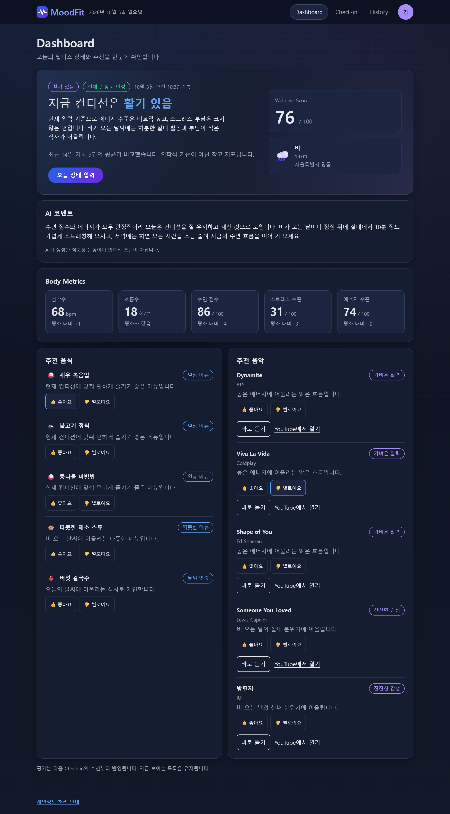
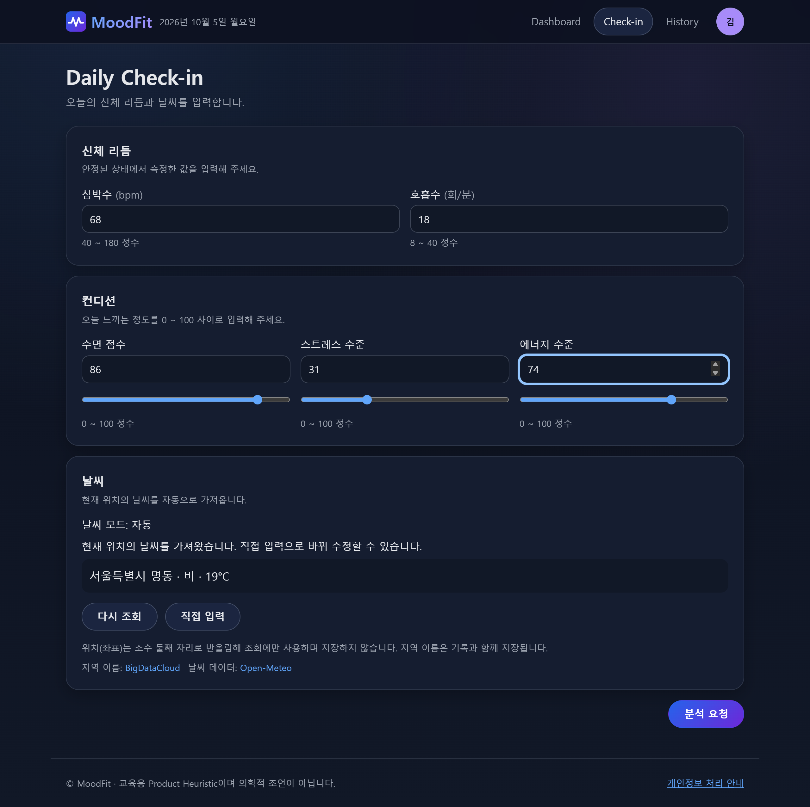
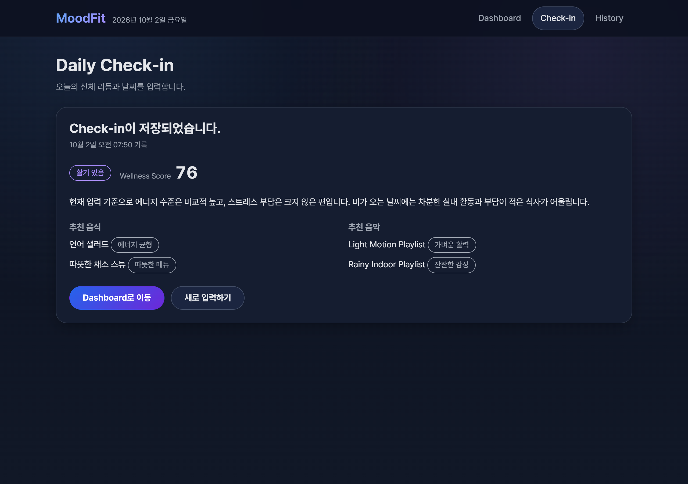
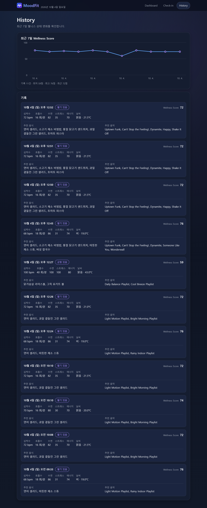
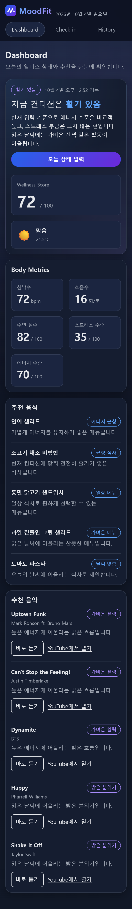
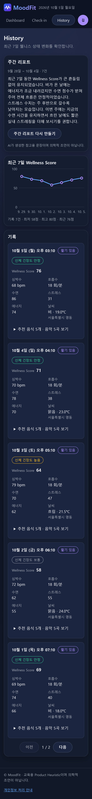

# MoodFit v3

Google / Kakao 소셜 로그인과 "로그인 없이 둘러보기" 체험 계정을 제공합니다. 개인 Check-in은 로그인 사용자별로 분리하며 체험 기록은 모든 방문자가 공유합니다. 이메일이나 프로필 사진은 저장하지 않고 닉네임 첫 글자로 아바타를 표시합니다. 제공자 값이 없는 환경에서는 체험 로그인만 제공하며 실제 OAuth 설정은 TASK-043에서 진행합니다. [로그인 / Session 안내](docs/22-AUTH.md)를 참고하세요.


[](https://github.com/youneedpython/MoodFit-v3/actions/workflows/ci.yml)

**신체 리듬과 날씨로 오늘의 컨디션을 읽고, 어울리는 음식과 음악을 추천하는 웰니스 웹 서비스**

수면, 스트레스, 에너지 같은 오늘의 상태와 기온·날씨를 입력하면
MoodFit이 Wellness Score와 Mood를 계산하고, 그날의 상황에 맞는 음식 2개와 음악 2개를 추천합니다.
기록은 저장되어 최근 7일의 컨디션 흐름을 그래프로 확인할 수 있습니다.



> MoodFit의 분석 기준은 교육용 Product Heuristic이며, 의학적 진단이나 치료 목적이 아닙니다.

---

## 주요 기능

### 1. Daily Check-in — 오늘의 상태 입력

날씨는 자동 조회가 기본이며 Check-in에 지역 · 날씨 · 기온을 표시합니다. Open-Meteo 날씨와 BigDataCloud 지역 이름 조회에 같은 소수 둘째 자리 좌표를 사용합니다. 직접 입력으로 바꾸면 조회된 값을 고칠 수 있고, 기존 직접 입력 설정은 유지합니다. 실패 시 직접 입력을 제공하며 좌표는 저장하거나 Backend로 보내지 않습니다. [동작과 개인정보 처리](docs/19-LOCATION-WEATHER.md)를 참고하세요.

자동 조회로 얻은 지역 이름만 기록과 함께 저장하여 Dashboard · History · Check-in 결과에서 날씨와 함께 보여 줍니다.

신체 리듬(심박수, 호흡수), 컨디션(수면 점수, 스트레스, 에너지), 날씨(기온, 날씨 상태)를 입력합니다.
입력 범위를 화면에서 먼저 확인하고, 서버 검증 결과도 해당 입력칸 옆에 표시합니다.



저장하면 바로 분석 결과를 보여 줍니다.



### 2. Dashboard — 지금 컨디션 한눈에 보기

가장 최근 기록을 기준으로 다음을 보여 줍니다.

- Mood와 Wellness Score, 상태 요약 문장
- 날씨와 기온
- 5가지 Body Metric
- 추천 음식 5개, 실제 곡 추천 5개와 추천 이유
- 음악 카드에서 바로 듣기와 YouTube에서 열기 (재생 클릭 전에는 외부 Player를 불러오지 않음)

기록이 없으면 Check-in으로 안내하는 Empty State를 보여 줍니다.

### 3. History / Trend — 최근 7일 흐름

최근 7일의 Wellness Score 변화를 그래프로 보여 주고, 기록별 Mood, 지표, 날씨, 추천 이력을 함께 보여 줍니다.



### 4. 모바일 화면

모든 화면은 390px(모바일)부터 데스크톱까지 같은 기능을 제공합니다.

<p>
  
  &nbsp;&nbsp;
  
</p>

---

## 분석과 추천은 어떻게 동작하나요?

외부 AI나 외부 API 없이 정해진 Rule로 계산합니다. 같은 입력에는 항상 같은 결과가 나옵니다.

| 단계 | 기준 |
|---|---|
| Wellness Score | 수면 35% + 스트레스(낮을수록 좋음) 35% + 에너지 30%의 가중 평균 (0 ~ 100) |
| Mood | 피곤함 → 활기 있음 → 차분함 → 균형 있음 순서로 조건을 확인해 결정 |
| 날씨 Context | 5°C 이하는 추위, 30°C 이상은 더위, 그 외에는 날씨 상태(맑음 / 흐림 / 비 / 눈) |
| 추천 | 새 기록의 음식·음악 각각 5개: Mood 기반 3개, 날씨 Context 기반 2개. 기존 기록은 저장된 추천을 유지 |
| 요약 문장 | Mood와 날씨 Context 문장을 조합한 Template |

- 심박수와 호흡수는 점수에 반영하지 않고 화면에 표시만 합니다.
- 날씨와 기온은 점수에 반영하지 않고 추천과 요약에만 사용합니다.
- 실제 곡은 승인된 YouTube 영상 목록을 사용합니다. 재생 버튼을 누르면 YouTube 내장 Player가 연결되며 외부 서비스로 요청이 나갑니다. 영상이 재생되지 않으면 카드의 YouTube 링크를 이용할 수 있습니다. [추천 음악 안내](docs/20-RECOMMENDATION-MUSIC-PLAYBACK.md)
- 상세 기준과 경계값은 [DEC-014](docs/09-DECISIONS.md)와 [Wellness Rule 제안서](docs/10-WELLNESS-RULE-PROPOSAL.md)에 있습니다.

---

## 구성

```text
Browser ── React (Vite) ──▶ /api ──▶ Spring Boot ──▶ MySQL
            Dashboard / Check-in / History      Check-in API      Flyway Schema
```

| API | 설명 |
|---|---|
| `POST /api/check-ins` | Check-in 저장, 분석 / 추천 결과 반환 |
| `GET /api/check-ins/latest` | 최신 Check-in 조회 (없으면 `404 CHECKIN_NOT_FOUND`) |
| `GET /api/check-ins/history?days=7` | 최근 `days`일(1 ~ 30) 기록 조회 |

API 형식은 [API 명세](docs/05-API_SPEC.md)와 계약 파일 [`contracts/`](contracts/)에 정의되어 있습니다.

## 기술 스택

| 영역 | 기술 |
|---|---|
| Frontend | React 19, TypeScript 6, Vite 8, React Router 8 |
| Backend | Java 21, Spring Boot 4.1, Spring Data JPA, Bean Validation |
| Database | MySQL 8.4 (`mysql:8.4.11` 검증 기준), Flyway |
| Test | Vitest, React Testing Library, JUnit, MockMvc, Testcontainers |
| CI | GitHub Actions |

정확한 Version은 [DEC-015](docs/09-DECISIONS.md)를 따릅니다. (Node.js `24.21.0`, Gradle Wrapper `9.8.0`)

Release와 Version 규칙은 [Releases](https://github.com/youneedpython/MoodFit-v3/releases)와 [DEC-025](docs/09-DECISIONS.md)를 참고합니다.

## 품질 검증

| 검증 | 내용 |
|---|---|
| Frontend Test | 화면 / 입력 검증 / API Client / 날짜 표시(Timezone 고정) |
| Backend Test | API Validation, Wellness Rule 경계값, Repository |
| DB 연동 테스트 | Testcontainers로 실제 MySQL에서 Schema / 저장 / 조회 검증 |
| API 계약 테스트 | Backend 응답, Frontend Type, API 명세 예시가 `contracts/`와 같은지 검증 |
| Local Verification | `scripts/verify.ps1` / `scripts/verify.sh`로 CI와 같은 순서(설치 → Test → Build) 실행 |
| CI | Push / Pull Request마다 Frontend / Backend Test·Build, 결과를 Step Summary로 기록 |

---

## Harness 기반 개발 방식

MoodFit v3는 기능 자체만큼 **AI Coding Agent와 함께 개발하는 과정**을 중요하게 다룬 프로젝트입니다.
Agent(Codex, Claude)가 코드를 작성하더라도 무엇을, 어떤 순서로, 어떤 기준으로 만들지는
문서와 규칙(Harness)으로 정하고, 중요한 결정은 사람이 승인합니다.

```text
Specification → Rules → Plan → Human Approval → Task → Implementation → Verification → Work Log
```

| 단계 | 하는 일 | 문서 |
|---|---|---|
| Specification | 제품 목표, 화면, 구조, API를 먼저 정의 | [01-PROJECT](docs/01-PROJECT.md), [03-UX_UI_SPEC](docs/03-UX_UI_SPEC.md), [04-ARCHITECTURE](docs/04-ARCHITECTURE.md), [05-API_SPEC](docs/05-API_SPEC.md) |
| Rules | Agent가 지켜야 할 작업 규칙 (Task 단위 실행, 승인 없는 Commit / Dependency 추가 금지 등) | [AGENTS.md](AGENTS.md) |
| Plan / Task | Milestone과 Task로 나누고, 한 번에 하나의 Task만 실행 | [06-PLAN](docs/06-PLAN.md), [07-TASKS](docs/07-TASKS.md) |
| Human Approval | Gate에서 사람이 검토하고 승인 | [09-DECISIONS](docs/09-DECISIONS.md) |
| Verification | Local Verification과 CI가 모두 통과해야 완료 | `scripts/`, `.github/workflows/` |
| Work Log | 작업 내용, 오류와 해결, 검증 결과를 기록 | [08-WORK_LOG](docs/08-WORK_LOG.md) |

### Gate

| Gate | 대상 | 예 |
|---|---|---|
| Gate A | 기술 Version | Spring Boot / Node.js / Gradle Version 결정 |
| Gate B | 제품 Rule | Wellness Score / Mood / 추천 Rule 확정 |
| Gate C | Dependency와 검증 도구 | Testcontainers 도입, API 계약 테스트 방식 선택 |

승인된 결정은 `DEC-xxx`로 [09-DECISIONS](docs/09-DECISIONS.md)에 남고, 이후 작업의 기준(Source of Truth)이 됩니다.

### Task 진행 흐름

```text
READY → IN_PROGRESS → 구현 → Local Verification → Commit / Push → Remote CI → REVIEW → Human Review → DONE
```

- Task가 DONE이 되면 GitHub Actions(`Sync Milestones`)가 해당 GitHub Milestone을 자동으로 닫습니다.
- Agent에게 준 실제 Prompt는 [prompts/](prompts/README.md)에 순서대로 남겨, 어떤 지시로 어떤 결과가 나왔는지 추적할 수 있습니다.
- 진행 내역과 Task별 상세 기록은 [07-TASKS](docs/07-TASKS.md)와 [08-WORK_LOG](docs/08-WORK_LOG.md)를 참고합니다.

### 버전별 비교

| 버전 | 개발 방식 |
|---|---|
| v1 | 자연어 요청 중심의 UI 프로토타입 |
| v2 | Markdown 명세 기반 Full-stack 구현 + GitHub Actions CI |
| v3 | Harness 기반 계획 · Task · 검증 · 기록 중심 개발 |

---

## 시작하기

### 준비

- Node.js `24.21.0` (`.nvmrc`)
- Java 21
- MySQL (Backend 직접 실행용, 개발 PC의 기존 8.0 서비스는 유지 가능)
- Docker (선택, DB 연동 테스트용)

Testcontainers / CI / Container Smoke는 DEC-030의 `mysql:8.4.11`을 사용합니다. 개발 PC를 8.4로 전환하는 선택적 절차와 호환성 확인 항목은 [MySQL 8.4 안내](docs/16-MYSQL-84-ALIGNMENT.md)를 참고합니다.

### 1. Database와 환경변수

```bash
# v3 전용 DB 생성 (최초 1회)
mysql -u root -p -e "CREATE DATABASE IF NOT EXISTS moodfit_v3 CHARACTER SET utf8mb4 COLLATE utf8mb4_0900_ai_ci;"

# .env.example을 복사해 .env.local 작성 (Commit 금지)
#   DB_URL=jdbc:mysql://localhost:3306/moodfit_v3
#   DB_USERNAME=...
#   DB_PASSWORD=...
```

### 2. Backend 실행

```bash
# Git Bash 기준, 새 터미널마다 환경변수 불러오기
set -a; source .env.local; set +a

cd backend && ./gradlew bootRun   # http://localhost:8080 (Flyway가 Table 자동 생성)
```

### 3. Frontend 실행

```bash
cd frontend
npm ci
npm run dev                        # http://localhost:5173 (/api는 Backend로 Proxy)
```

### 4. 전체 검증

```bash
sh scripts/verify.sh                                        # Git Bash / macOS / Linux
powershell -ExecutionPolicy Bypass -File .\scripts\verify.ps1  # Windows PowerShell
```

- Backend Test는 H2 In-memory DB로 실행되므로 MySQL 없이도 동작합니다.
- DB 연동 테스트는 Docker가 실행 중일 때만 동작하며, Docker가 없으면 건너뛰고(SKIPPED) 출력에 표시됩니다. CI에서는 Docker가 필수입니다.
- `.env.local`은 Git에 포함되지 않습니다. 프로젝트를 압축해 배포할 때는 `.env.local`과 `.git/`을 제외합니다.

---

## 프로젝트 구조

```text
MoodFit-v3/
├── frontend/            React + TypeScript + Vite
│   └── src/
│       ├── app/         Router, Layout
│       ├── components/  공통 UI Component
│       ├── features/    checkin / dashboard / history
│       ├── services/    API Client
│       └── contracts/   API 계약 Type 검사
├── backend/             Spring Boot
│   └── src/main/java/com/moodfit/
│       ├── controller/  REST API
│       ├── service/     Wellness Rule, Check-in 처리
│       ├── entity/  repository/  dto/  exception/  config/
├── contracts/           API 계약 파일 (Frontend / Backend 공유)
├── docs/                명세, 계획, Task, Work Log, 결정 기록
├── prompts/             Agent Prompt 기록
├── scripts/             Local Verification, Milestone 생성 도구
├── .github/workflows/   CI, Milestone 자동 Close
└── AGENTS.md            Agent 작업 규칙
```

AI 맞춤 코멘트와 최근 7일 주간 리포트는 기존 규칙의 Score·상태·추천을 참고 문장으로 설명합니다. 기능이 설정된 경우에만 소셜 로그인 사용자가 생성할 수 있으며, 결과를 저장해 재조회하고 실패 시 기존 규칙 문장을 유지합니다. 이름과 지역 같은 식별 정보는 모델에 보내지 않으며 의학적 조언을 제공하지 않습니다. 기본값은 꺼짐이고 실제 Bedrock 환경 연결은 TASK-046에서 진행합니다. 자세한 정책은 [LLM Insight](docs/23-LLM-INSIGHT.md)를 참고하세요.
