# 08. MoodFit v3 Work Log

## TASK-066 — Slider 접근성 / 로그인 버튼 높이 (2026-10-05)

- 최초 Working Tree는 clean이었다. Task source와 필수 Context를 확인하고 TASK-066만 IN_PROGRESS로 등록한 뒤 승인된 구현을 DONE으로 반영했다. Executor DONE은 구현 완료이며 검증 성공이나 Human 완료 승인을 대신하지 않는다. 다른 Task와 Current Task는 변경하지 않았다.
- 컨디션 Slider의 aria-describedby / aria-invalid를 제거하고 숫자 입력칸에는 기존 안내 / 오류 연결을 유지했다. 빈 값에만 aria-valuetext="입력 안 함"을 제공한다. 접근성 이름, 숫자 / Slider 동기화, 빈 값 유지, 검증과 제출은 유지했다.
- 세 항목의 접근성 속성 / 빈 값과 숫자 전환을 기존 동기화 Test에서 검사하고, 각 항목만 비워 제출할 때 필수 오류 / 숫자 입력칸 초점 / API 호출 차단을 검사하는 회귀 Test를 추가했다. 기존 Slider 제출 Test는 유지했다. 로그인 높이의 jsdom Test는 추가하지 않았다.
- 로그인 세 버튼의 최소 높이를 52px로 맞추고 border-box를 명시했다. 제공자 버튼의 세로 여백을 0으로 줄여 안쪽 내용이 높이를 더 키우지 않게 했다. 너비 / 색 / Logo / 문구 / 간격 / Hover / Focus와 로그인 흐름은 유지한다. 진행 문구도 같은 높이 규칙을 적용한다.
- 자체 `bash scripts/verify.sh`는 Node.js 24.21.0 확인 후 npm 캐시 stat EPERM으로 npm ci에서 중단됐다. Test / 타입 검사 / Frontend Build / Backend 검증을 실행하지 못했다. 자동 재시도나 Sandbox 우회는 하지 않았다. 판정 기준은 Sandbox 밖 Orchestrator Verify다.
- `git diff --check`와 변경 문서의 연속 물음표 치환 흔적 / U+FFFD를 직접 검사한다. Claude 세션의 로그인 세 버튼 실측과 390 / 1280px 캡처가 남는다. 캡처 경로는 allowed_paths 밖이므로 Executor가 생성하지 않았다. Git 작업은 수행하지 않았으며 Remote CI / Human Squash Merge는 후속 절차다.

## TASK-064 — PWA 설치 (2026-10-05)

- Run 2 (2026-10-05): 최초 Working Tree는 Run 1 구현과 Test 경로 수정이 포함된 clean 상태였다. Task source와 필수 Context를 읽고 React 실행 전 Listener 등록, 초기 / 지연 이벤트 구독, 단일 이벤트 소비와 처리 중 비활성화, 설치 완료 / 독립 창 / 미지원 환경의 숨김, Footer / 메뉴 위치와 기존 44px 터치 영역, iOS / iPadOS 판별 및 안내 창의 초점 / Esc / 바깥 클릭 / 복원, 새 Manifest와 iOS Meta Tag를 설계와 대조했다. 불일치를 발견하지 않아 구현과 통과한 Test 및 Task 상태는 수정하지 않았다. Manifest / HTML Test는 node:fs와 resolve(process.cwd(), ...)를 사용하며 import.meta.url을 사용하지 않는다. Task source의 Sandbox 밖 Frontend Test 260건 / tsc --noEmit / Build 통과, 배포 산출물 및 Claude 세션의 화면 / Chrome Manifest 확인은 전달받은 참고 증거다. 이번 자체 bash scripts/verify.sh는 Node.js 24.21.0 확인 후 npm 캐시 stat EPERM으로 npm ci에서 중단되어 Test / 타입 검사 / Build를 실행하지 못했다. 자동 재시도나 Sandbox 우회는 하지 않았다. git diff --check와 변경 문서의 연속 물음표 치환 흔적 / U+FFFD를 직접 확인한다. Sandbox 밖 Orchestrator Verify가 검증 기준이며 Executor DONE은 Run 2 재검토와 기록 완료만 뜻한다. Git 작업은 수행하지 않았고 Human Squash Merge와 Merge 후 Staging 실제 기기 설치 확인은 후속 작업이다.

- 초기 Working Tree는 clean이었다. 승인 Contract와 필수 Context를 확인하고 TASK-064만 IN_PROGRESS 등록 후 DONE으로 반영했다. 다른 Task와 Current Task는 유지한다.
- app.webmanifest / iOS Meta Tag, React 실행 전 초기화와 설치 상태 구독 / 단일 이벤트 소비, Footer / 아바타 메뉴 공통 버튼, iOS 안내 / 초점 가두기 / 복원 / Esc / 바깥 클릭을 구현했다. 기존 Footer / 메뉴 Test는 수정하지 않았다.
- 설치 수락 / 거절 / 재수신 / 지연 이벤트 / 완료 / 독립 창, iOS / iPadOS 안내, 메뉴 순서 / 미지원 환경, node:fs Manifest / HTML 검사를 추가했다. 새 Dependency / 아이콘 / Service Worker / Backend 변경은 없다.
- 자체 bash scripts/verify.sh는 Node.js 확인 후 npm ci의 캐시 stat EPERM으로 중단됐다. Test / 타입 검사 / Build는 실행하지 못했다. 재시도나 권한 우회는 수행하지 않았다. Sandbox 밖 Orchestrator Verify가 판정 기준이며 Executor DONE은 구현 완료만 뜻한다.
- git diff --check와 변경 문서의 연속 물음표 치환 흔적 / U+FFFD를 직접 확인한다. 문서는 UTF-8 apply_patch로 작성했다.
- Claude 세션의 390 / 768 / 1280px Footer / 메뉴 / iOS / 미지원 캡처와 Chrome Manifest 확인, Human Squash Merge 및 Merge 후 Staging 실제 기기 설치 확인이 남는다. 캡처 경로는 허용 범위 밖이므로 Executor는 추가하지 않았다. Git 후속 작업은 수행하지 않았다.

### TASK-062 — Login Buttons / Footer (2026-10-05)

- 최초 Working Tree는 clean이었다. Task source / 필수 Context와 승인 지시를 확인하고 TASK-062만 IN_PROGRESS로 등록한 뒤 Executor 구현 완료를 DONE으로 기록했다.
- 제공자 로그인 주소와 Link 의미를 유지하며 Google 4색 G / Kakao 검정 말풍선 Inline SVG, 지정 제공자 색과 48px 이상 버튼, Hover / 이중 초점 표시를 적용했다. 체험 로그인은 공통 secondary Button으로 바꾸고 요청 / 진행 중 비활성화 / 실패 문구는 유지했다. 안내 문구는 변경 없이 저장 항목 → 체험 계정 → 개인정보 Link 순서로 간격을 두었다.
- 공통 Footer에 승인 고지 문구 / 개인정보 Link와 구분선을 추가했다. 최소 화면 높이와 Flex 배치로 짧은 페이지에서도 하단에 위치하고 좁은 화면에서 줄바꿈한다. 개인정보 화면 CSS에 있던 Footer 규칙을 Layout으로 옮겼다. 사용자 메뉴 / 탈퇴 창은 수정하지 않았다.
- 제공자 Link 이름 / 주소 / 장식 SVG, 제공자 없는 환경, 체험 요청 진행 / 실패, 공통 Footer 고지 / Link Test를 추가하거나 유지했다. jest-dom Matcher와 CSS raw import는 사용하지 않았다.
- 자체 bash scripts/verify.sh는 npm ci의 사용자 캐시 stat EPERM / node_modules 정리 EPERM으로 설치 단계에서 중단됐다. Test / TypeScript / Frontend 및 Backend Build는 실행되지 않았다. 재시도 / Sandbox 우회는 하지 않았으며 검증 기준은 Sandbox 밖 Orchestrator Verify다.
- git diff --check와 변경 문서의 연속 물음표 치환 흔적 / U+FFFD를 직접 확인한다. 한글은 UTF-8 apply_patch로 작성했다. Git 후속 작업은 수행하지 않았다.
- Claude 세션의 로그인 / 체험만 있는 로그인 / Footer 390 / 768 / 1280px 화면 캡처가 남는다. 캡처 경로는 allowed_paths 밖이므로 Executor는 생성하지 않았다. Remote CI / Human Squash Merge 후 Staging 확인이 남는다. DONE은 구현 완료이며 Verify / Review / Human 승인을 대신하지 않는다.
### TASK-061 — Dashboard Recommendation Compact (2026-10-05)

- 제목 왼쪽 재생 / 닫기 아이콘과 aria-expanded, 가수 줄 YouTube 보조 Link를 적용했다. Player는 클릭 후 추천 이유 아래에만 생성하며 같은 버튼으로 제거한다. iframe / Link 속성, 평가 모양과 동작 및 추천 개수를 유지했다.
- 768px 미만에서는 이름 / 평가 첫 줄과 Badge 둘째 줄로 통일하고, 그 이상에서는 한 줄로 표시한다. 기존 색 / 크기 / 터치 영역 / 초점 Token을 사용하며 Card 높이를 강제로 맞추지 않았다.
- Dashboard와 결과 화면의 BaselineNotice를 Body Metrics 지표 아래로 옮겼다. 안내 문구와 보조 Style을 유지하며 중복 렌더링을 제거했다. 재생 토글 / 접근성 / Link 위치와 지표 안 안내 회귀 Test를 보완했다.
- Verification: 자체 npm Test는 vitest가 설치되지 않아 실행되지 않았다. bash scripts/verify.sh는 Node.js 버전 확인 후 npm 캐시 stat EPERM으로 npm ci에서 중단됐다. Test / tsc --noEmit / Build는 실행하지 못했으며 Sandbox 밖 Orchestrator Verify가 기준이다. 재시도나 권한 우회는 하지 않았다. git diff --check와 변경 문서의 연속 물음표 / U+FFFD를 직접 검사했다.
- Executor 구현 완료는 Verify / Review / Human 완료 승인이 아니다. Git 작업은 수행하지 않았다. Claude 세션의 390 / 768 / 1280px 재생 전 / 중 캡처와 Merge 후 Staging 확인이 남았다. 이미지 경로는 allowed_paths 밖이므로 Executor가 생성하지 않았다.

### TASK-051 — AI 코멘트 가독성 (2026-10-04)

- 초기 Working Tree는 clean이었다. Human이 제공한 승인 Contract와 Task 원문 / 필수 Context를 확인하고 allowed_paths 안에서 구현했다. Git 쓰기나 외부 호출은 수행하지 않았다.
- 코멘트는 한 문장에 한 줄, 리포트는 2 ~ 3개 문단으로 Prompt를 보완했다. 줄바꿈 없는 응답은 문장 끝 부호 뒤 공백에서 나누며 리포트는 두 문장씩 묶는다. 기존 줄바꿈 / 소수점 / 공백 없는 약어를 유지하고 줄 공백과 연속 빈 줄을 정리한 뒤 Unicode 길이 제한을 적용한다.
- 모델에 보내는 상태 / 날씨는 기존 WellnessRulePolicy와 WEATHER_LABELS의 한국어 이름을 사용한다. 허용 경로 밖의 이름 정의를 변경할 수 없어 InsightData에서 동일 이름을 투영한다. 전송 필드, 개인정보 제외, 저장 / 재사용 / 실패 처리는 유지한다.
- 결과 화면의 AI 코멘트를 추천 아래와 버튼 위로 옮기고 기존 간격 Token을 적용했다. 본문은 React escaping과 줄바꿈 보존 Class를 유지하며 본문 줄 간격 Token을 사용한다. Dashboard 위치와 저장된 본문은 그대로다.
- Backend 문장 분리 / 소수점 / 약어 / 기존 줄 정리 / 길이 제한 / 한국어 입력 Test와 Frontend 결과 DOM 순서 / 코멘트와 리포트 줄바꿈 Class Test를 추가했다.
- Executor 참고 검증: `bash scripts/verify.sh`는 Node Version 확인 뒤 npm 캐시 접근 EPERM으로 설치 단계에서 중단되어 Test / Build를 실행하지 못했다. 재시도나 Sandbox 우회를 하지 않았다. `git diff --check`와 변경 문서의 연속 물음표 / U+FFFD 직접 검사를 수행한다. 검증 판정은 Sandbox 밖 Orchestrator Verify다.
- Executor DONE은 구현 완료만 뜻한다. Claude 세션의 390 / 768 / 1280px 화면 캡처 확인과 Human Squash Merge 이후 Staging에서 새 코멘트 / 리포트 생성 확인이 남는다. 캡처 저장 경로는 이번 allowed_paths에 없으므로 Executor가 작성하지 않는다. 새로운 Human 결정은 없다.

## TASK-049 Run 2 — ErrorType Compile 수정 (2026-10-04)

- Run 1의 Optional<ErrorType> 문자열 기본값 Type 불일치를 문자열 변환 후 기본값을 적용하도록 수정했다.
- 같은 형태를 검색해 서비스 실패 로그 Test의 Optional<String> 반환도 SDK ErrorType 값으로 수정했다. 기존 설계는 유지했다.
- Executor 참고 검증: `bash scripts/verify.sh`는 npm 캐시 접근 EPERM으로 설치 단계에서 중단됐다. InsightTests 실행은 Gradle Wrapper 잠금 파일의 상위 디렉터리 생성 제한으로 시작하지 못했다. Test / Build 성공을 주장하지 않으며 검증 기준은 Sandbox 밖 Orchestrator Verify다.
- Git 후속 작업과 실제 Bedrock 호출은 수행하지 않았다. DONE은 Executor 수정 완료이며 Review / Human Merge 승인을 대신하지 않는다.

## TASK-049 — LLM Runtime Endpoint / Failure Diagnostics (2026-10-04)

- 초기 Working Tree는 clean이었다. Human 승인 Contract와 명시 실행 지시에 따라 허용 경로만 수정했다. Git 후속 작업 / AWS 변경 / 실제 Bedrock 호출은 수행하지 않았다.
- LLM_ENDPOINT가 mantle일 때만 기존 Backend를 선택하고 기본 / 빈 값 / 알 수 없는 값은 runtime Backend를 사용한다. 자격 증명 / AssumeRole, Region, 제한 시간, 재시도, 모델 환경 값과 요청 내용은 공유한다.
- HTTP 오류는 예외 Class / 상태 / 오류 종류와 getMessage() 정리본을 WARN으로 기록한다. 12자리 숫자와 ARN을 가리고 줄바꿈 / 제어 문자를 공백으로 바꾼 뒤 Unicode 기준 300자로 제한한다. 응답 body()와 요청 / 생성 본문은 읽거나 기록하지 않는다. 그 밖의 예외는 Class만 기록한다.
- 거절 / 길이 초과는 내부 실패 종류로 서비스에 전달하여 한 번만 기록하고 저장하지 않는다. 기존 빈 응답 fallback과 기능 꺼짐 동작을 유지한다.
- 설정 선택, null / 빈 Message, 계정 번호 / ARN 마스킹, 제어 문자 정리, 길이 제한, HTTP 오류 진단 / body 미사용과 거절·길이 초과 시도당 단일 로그 Test를 추가 / 갱신했다. 실제 Bedrock을 호출하는 Test는 없다.
- InvokeModel 권한 예시와 환경 값 / 404 경과 / 추론 Profile 요구 400 대응 / Human 운영 절차를 문서화했다. 다른 Task 상태와 Current Task는 유지했다.
- `bash scripts/verify.sh`: npm ci 단계에서 사용자 npm 캐시 stat EPERM으로 Exit 1. Test / Build와 Backend 검증은 실행되지 않았다. Sandbox 제약에 따른 결과이며 성공을 주장하지 않는다. 검증 기준은 Sandbox 밖 Orchestrator Verify다.
- `git diff --check`: PASS. 변경 문서의 연속 물음표 치환 흔적 / U+FFFD를 직접 확인한다. 한글 문서는 UTF-8 apply_patch로 작성했다.
- Executor DONE은 구현 완료이며 Verify / Review / Human Squash Merge나 실제 생성 성공을 대신하지 않는다. Merge / 자동 배포 뒤 Human이 다른 계정 Role에 권한을 추가하고 Staging 실제 생성을 확인한다.

## TASK-043 Run 2 문서 정합성 (2026-10-04)

- 초기 Working Tree는 clean이며 Run 1의 검토 미완료 WIP가 baseline이다. Run 1 Guard 중단과 Claude 세션의 Template 표기 수정·Sandbox 밖 사전 검사 기록은 Contract의 이력이며 이번 Executor 검증 결과로 간주하지 않는다.
- JSON Key를 `google_client_id`, `google_client_code`, `kakao_client_id`, `kakao_client_code`로 문서 / Runbook / DEC-035에 맞췄다. `client_code`는 Client Secret 값이며 Callback Authorization Code가 아님을 설명했다. Backend 환경 변수 이름은 유지했다.
- App / IAM의 빈 ARN Condition, 네 조건부 주입, ExecutionRole의 단일 Secret 읽기 Statement와 TaskRole 권한 유지, 필수 HTTPS origin 및 체험 로그인 기본값을 확인했다. 승인된 flow 목록과 `[:]` 패턴을 유지했다. Parameter 예시는 Placeholder만 있어 수정할 필요가 없었다.
- TASK-043 목록 행을 기존 상세 절과 같은 Milestone 43 / DONE으로 맞췄다. 다른 Task 상태와 Current Task는 유지했다. [Prompt 69](../prompts/69-TASK-043-RUN2.md)에 Run 2 실행 지시를 기록했다.
- Executor 참고 검증: `git diff --check` PASS. `bash scripts/iac-validate.sh`는 Sandbox Bash에서 AWS CLI를 찾지 못해 시작 단계에서 중단됐다. IaC 검증 성공을 주장하지 않으며 Sandbox 밖 Orchestrator Verify가 기준이다. 수정 문서의 연속 물음표와 U+FFFD 및 이전 JSON Key 잔존 여부를 직접 검사했다.
- 실제 Secret / ARN / 계정 ID를 읽거나 기록하지 않았고 AWS 변경 및 Git handoff를 수행하지 않았다. DONE은 Executor 구현 완료이며 Verify / Review / Human Merge / 실제 로그인 확인을 대신하지 않는다.

## TASK-043 OAuth Value Injection (2026-10-04)

- clean baseline에서 승인 Contract 범위의 App / IAM Template를 수정했다. OAuth ARN이 빈 경우 주입 / 권한을 생략하며 ExecutionRole에 해당 Secret 하나 읽기만 추가한다. DB / Health / TaskRole은 유지한다.
- 공개 HTTPS origin과 체험 로그인 Parameter, Placeholder 예시와 Secret 생성 → IAM → 현재 실행 digest의 App UPDATE → 안정화 → providers / Cookie / 실제 로그인 절차를 문서화했다. DEC-035와 [Prompt 68](../prompts/68-TASK-043-OAUTH-VALUE-INJECTION.md)에 승인·지시를 기록했다.
- Executor 참고 검증: `git diff --check` PASS. `bash scripts/iac-validate.sh`는 Sandbox의 Bash에서 AWS CLI를 찾지 못해 시작 단계에서 중단됐다. Template 검증 성공을 주장하지 않으며 Sandbox 밖 Orchestrator Verify가 기준이다. 변경 문서의 연속 물음표와 U+FFFD를 직접 검사했다.
- 실제 OAuth 값 / ARN / 계정 ID를 기록하지 않았으며 AWS / Git 작업은 수행하지 않았다. DONE은 구현 완료이며 Review / Merge / 실서비스 확인을 대신하지 않는다.

## TASK-041 — Header Logo Link / Alignment (2026-10-04)

- 승인 Contract에 따라 로고 그림과 MoodFit 이름을 하나의 SPA 홈 링크로 연결했다. 날짜는 링크 밖에 두고 장식 그림의 빈 alt와 gradient를 유지했다.
- 브랜드의 baseline 정렬을 center로 변경했다. 기존 간격과 모바일 메뉴 배치, 전역 focus-ring / radius Token을 유지했다.
- AppLayout 테스트에 루트 경로와 단일 접근 가능한 이름, Check-in / History에서 Dashboard로 이동하는 검증을 추가했다.
- Executor 참고 검증: `bash scripts/verify.sh`는 npm ci 중 Sandbox 밖 npm 캐시 접근 EPERM으로 중단됐다. Test / Build 성공을 주장하지 않으며 Sandbox 밖 Orchestrator Verify가 검증 기준이다.
- 화면 캡처 경로는 allowed_paths 밖이므로 추가하지 않았다. Claude 세션이 390 / 768 / 1280px 정렬과 키보드 focus를 확인한다.
- TASK-041 DONE은 Executor 구현 완료 반영이다. Verify / Review / Remote CI / Human Squash Merge 전 최종 완료 승인이 아니다. Git 작업과 다른 Task 상태 변경은 수행하지 않았다.

## TASK-038 — GitHub OIDC Immutable Subject Trust (2026-10-04)

- Human 사전 승인과 명시 실행 지시에 따라 두 배포 Role과 Trust 예시의 subject를 owner / repository 숫자 ID를 포함한 immutable 형식으로 변경했다. StringEquals의 값 하나, audience와 환경별 분리, wildcard 금지와 기존 권한을 유지했다.
- IAM Template에 숫자만 허용하고 빈 값을 거부하는 RepositoryOwnerId / RepositoryId를 추가했다. 예시에는 Placeholder만 사용하며 실제 ID는 기록하지 않았다. scripts/iac-validate.sh에는 subject / Parameter 목록 검사가 없어 변경하지 않았다.
- 접근 정책, 최초 배포 Runbook, Staging CD의 첫 실패 원인 / 후속 적용, DEC-029 변경 이력과 실행 Prompt를 기록했다. TASK-038 Milestone 38을 DONE으로 반영하며 Current Task TASK-030 / BLOCKED와 AGENTS.md는 유지했다. 다른 미등록 Task는 추가하지 않았다.
- Executor 참고 검증: git diff --check 통과. bash scripts/iac-validate.sh는 현재 실행 환경에서 AWS CLI를 찾지 못해 Exit 1로 시작 단계에서 정지했다. 설치·로그인·실제 AWS 호출은 하지 않았으며 Template 검증 성공을 주장하지 않는다. Sandbox 밖 Orchestrator Verify가 판정 기준이다.
- DONE은 Executor 구현 완료다. Orchestrator Verify / Claude Review / Remote CI / Human Squash Merge 전 완료 승인을 주장하지 않는다. Merge 후 승인된 Claude 세션이 실제 ID를 비추적 로컬 Parameter 파일에 넣고 Human이 IAM Change Set을 검토·실행한 뒤 실패한 배포를 재실행해 OIDC 단계 통과를 확인한다. Git 작업과 Stack 갱신은 수행하지 않았다.

## TASK-035 — 위치 / 날씨 자동 입력 (2026-10-04)

- WIP 이어서 확인: 기존 좌표 반올림 / WMO 코드 검증 / 기온 범위 / 입력 보호 / 설정 끄기 / 실패 시 직접 입력 흐름을 유지했다. Permissions API의 동기 예외를 처리하고, 설정 변경 또는 직접 조회 성공 뒤 늦은 권한 응답이 중복 조회를 시작하지 않도록 보완했다. 두 경우의 mock 회귀 Test를 추가했다.
- 이번 Executor 참고 검증: `bash scripts/verify.sh`는 Frontend 설치 단계에서 Sandbox의 npm 캐시 접근 EPERM으로 중단되어 Test / Build를 실행하지 못했다. 재시도나 권한 확대는 수행하지 않았다. `git diff --check` 통과, 변경 문서의 UTF-8 / 연속 물음표 / U+FFFD 검사 통과. 최종 검증 판정은 Sandbox 밖 Orchestrator Verify 기준이다.

- 승인 Contract와 명시 실행 지시에 따라 Frontend 날씨 조회 Service와 Check-in 버튼 / 자동 조회 설정 / 접근성 안내를 구현했다. 기온·날씨 입력과 Backend 요청 계약은 유지한다.
- 좌표는 소수 첫째 자리로 반올림한 값만 Open-Meteo로 전달하며 저장·Log에 남기지 않는다. localStorage에는 자동 조회 boolean만 기록한다. 위치·API 요청은 각각 10초로 제한하고 외부 응답의 타입 / 기온 범위 / 문서화된 WMO 코드를 검증한다.
- Permissions API가 이미 허용을 반환하고 저장된 설정이 켜진 경우에만 진입 시 조회한다. 직접 입력·수정·삭제한 날씨 값은 유지하며 자동 조회 끄기 / 저장 시작 / 화면 이탈 시 진행 중 요청을 취소한다.
- mock Test: WMO 코드 전체·미정의 코드, 좌표 반올림, 기온 범위·응답 검증, 성공 시 두 칸 채움, 위치·API 실패 / 시간 초과, 자동 권한 조건, 직접 입력 보호, 자동 조회 끄기를 추가했다.
- 참고 검증: 초기 npm Test / Build는 vitest / tsc 실행 파일 부재로 실행되지 않았다. `bash scripts/verify.sh`는 Frontend npm ci 단계에서 Sandbox의 npm cache 접근 EPERM으로 중단돼 Test / Build 및 Backend 검증에 도달하지 못했다. 자동 재시도·도구 설치·권한 우회는 하지 않았다. 최종 검증 기준은 Sandbox 밖 Orchestrator Verify다.
- `git diff --check` 통과. 수정 Markdown의 UTF-8 / 연속 물음표 / U+FFFD를 직접 검사했다. Backend / API 계약 / Dependency / 금지 문서는 수정하지 않았다.
- 화면 캡처는 Contract가 docs/images 경로를 허용하지 않아 저장하지 않았다. TASK-028 / TASK-029 Merge 뒤 Human Squash Merge, Staging CD 후 실제 권한 동작과 390 / 768 / 1280px 화면·영상 확인, Claude 세션의 Task / Decision 완료 기록 정리가 남아 있다. 새 Human 결정은 필요하지 않으며 Executor DONE은 Task 완료 승인을 대신하지 않는다.

## TASK-034 — Run 2 WIP Review 수정 (2026-10-03)

- R1-001: Human이 활성 Contract 허용 목록 변경만 Commit한 Source revision을 Resume에서 검증한다. 각 중간 Commit의 단일 부모 / 변경 파일 / 비목록 fingerprint / 목록 형식을 확인하고 Git 단계의 HEAD 및 parent 기준으로 전달한다. 기존 Workspace HEAD와 누적 Snapshot 검사는 유지한다.
- R1-002: WIP 경계 검사와 불완전 할당 거부를 확인하고 접미 값 / 단어 단독 / 값 없는 구분 기호 회귀 Test를 추가했다. Guard 추가 표시를 제거하여 실제 줄의 literal 경계를 검사한다.
- R1-003: JSON escape 형태는 직렬화 입력에만 적용한다. 원문에서 escape 형태가 승인되지 않는 회귀 Test와 직렬화 호출 명시를 보완했다.
- R1-004: 승인 문구 설명을 별도 상위 절로 옮기고 Resume 본문과 승인 예시를 같은 절로 복구했다. 경계 및 Human Contract Commit 흐름을 설계에 기록했다.
- TASK-034 DONE / TASK-026 READY의 기존 구현 완료 반영을 유지한다. Orchestrator Verify / Claude Review / Remote CI / Human Squash Merge는 완료 승인에 별도로 필요하다. 새 Human 결정과 실제 AWS 작업은 없다.
- Executor 참고 검증: 초기 WIP는 111개 중 JSON 직렬화 / Guard 경계 Test 2개가 실패했다. 수정 후 전체 Orchestrator Test 114개가 통과했다. Workspace 생성 후 Guard 정지 → Human Contract Commit → 승인 Resume와 TASK-022 Git handoff를 Fake CLI / 임시 Repository로 검증했다. `git diff --check` 통과, 변경 문서의 연속 물음표 / U+FFFD와 추가 줄의 기존 할당 차단 규칙 일치가 없음을 직접 확인했다. 최종 검증 기준은 Sandbox 밖 Orchestrator Verify다.

## TASK-032 — Run 4 Human 결정 A 반영 (2026-10-03)

- Secret 검사 변경을 TASK-032에서 제외하고 오탐 감소를 TASK-034의 Human 승인 허용 문구 목록으로 분리했다. 아래 이전 Run의 완화 구현 기록은 당시 이력이며 현재 구현 기준이 아니다.
- lib.mjs의 redact / sanitize / assertNoSecrets / guard를 main의 안정 Version과 동일하게 복원했다. Secret 판정용 보조 함수 / 정규식 / 분기는 제거했다. 관련 구간의 원문 동일성을 직접 확인했다.
- 완화 허용 및 완화 회귀 Test를 제거하고 실행 시 조합한 main 대표 차단 사례 Test를 유지했다. 기존 main Test와 PR 본문 assertNoSecrets 적용은 유지한다.
- 정책 / 설계에서 완화 판단 기준을 제거하고 기존 오탐 회피 작성 규칙의 지속 적용을 기록했다. PR / 자동 Rework / 짧은 작업 폴더 및 명시 정리 / AWS Preflight / 승인 Git 범위 확대는 유지했다.
- TASK-032 DONE / TASK-033 READY 완료 반영을 유지한다. Orchestrator Verify / Claude Review / Human Squash Merge 전 완료 승인을 주장하지 않는다. Git handoff 및 실제 AWS 호출은 수행하지 않았다.
- Prompt: `prompts/55-TASK-032-RUN-4-SECRET-RESTORE.md`.
- Executor 참고 검증: 최초 전체 실행에서 새 Private Key Fixture의 tracked Diff 구성 오류가 발견되어 untracked 전체 내용 검사로 수정했다. 수정 후 관련 Test 8 / 8 및 최종 전체 Test 103 / 103 통과(Exit 0, 실패 / skipped 0). git diff --check, main Secret 구현 동일성, 누적 경로 / Secret Guard, 추가 줄의 구 Version 금지 식별자 검사와 변경 문서 UTF-8 / 연속 물음표 / U+FFFD 검사도 통과했다. package.json / package-lock.json 변경 없음. Orchestrator Verify가 최종 검증 기준이다.

## TASK-032 — R4 Review Rework (2026-10-03)

- R4-001: 줄바꿈을 제외한 모든 공백을 구분 기호 / 설명 / 주석 경계에 적용했다. NBSP / 전각 공백 / form feed / vertical tab의 등호·콜론 할당을 Guard / JSON 입력 / Redaction 회귀 Test로 확인한다.
- R4-002: 후보 앞 경계를 소비하지 않아 ARN resource 콜론 바로 뒤의 할당도 검사한다. 기존 ARN 허용 사례를 유지한다.
- R4-003: JSON 민감 Key의 문맥을 중첩 배열 / 객체에 전달하고 Placeholder 외 모든 primitive를 가린다. 비민감한 숫자는 유지한다.
- R4-004: docs/11을 JSON 구조 검사 방식에 맞추고 docs/12에 공백 / ARN 경계 / 비문자열 값 기준과 빈 컨테이너 한계를 기록했다. R4-005는 조치 불필요로 유지한다.
- TASK-032 DONE / TASK-033 READY 완료 반영을 유지한다. Executor 구현 완료는 Orchestrator Verify / Claude Review / Human Squash Merge 승인을 대신하지 않는다. Git handoff는 수행하지 않았다.
- Prompt: `prompts/54-TASK-032-R4-REWORK.md`.
- Executor 참고 검증: `node --test "scripts/orchestrator/*.test.mjs"` 114 / 114 통과(Exit 0), `git diff --check` 통과. 누적 추가 줄의 구 Version 금지 식별자 형태 0건, 변경 Markdown / 비추적 Prompt의 연속 물음표와 U+FFFD 0건, package.json / package-lock.json 변경 없음. 검증 기준은 Sandbox 밖 Orchestrator Verify다.

## TASK-032 — Run 3 Review Rework (2026-10-03)

- R3-001: 후보별 독립 판정을 유지하면서 차단된 따옴표 없는 값의 마스킹 범위를 쉼표 / 줄 끝까지 복구했다.
- R3-002: JSON 내부 문자열은 복원한 원문으로 검사하고 객체 Key의 문자열 값은 구조적으로 검사한다. 줄 끝 Placeholder / IAM Action / 한글 설명 허용과 실제 할당 차단을 회귀 Test로 추가했다.
- R3-003 / R3-004: 따옴표 IAM Action을 허용하고 뒤의 할당은 계속 차단한다. ARN 예외에 partition / service 구획을 요구하며 자연어 설명의 시작 문자를 영문 / 한글로 제한했다. 설계 문서를 구현과 맞췄다.
- R3-005는 추가 구현 대상이 아니다. 승인 Git 범위의 별도 Decision 기록 여부는 Human / Claude 세션이 판단한다. Executor는 Git 작업을 수행하지 않았다.
- TASK-032 DONE / TASK-033 READY 반영을 유지한다. Executor 완료는 Orchestrator Verify / Claude Review / Human Squash Merge 승인을 대신하지 않는다.
- Executor 참고 검증: 최종 Orchestrator Test 111 / 111 통과(Exit 0), git diff --check 통과. 최초 검사에서 ARN resource 구분자 허용 Test가 실패하여 전체 ARN 구획 확인으로 수정한 뒤 회귀 Test 16개와 전체 Test를 다시 통과했다. 추가 줄의 구 Version 금지 식별자 형태 0건, 변경 Markdown과 비추적 Prompt의 연속 물음표 / U+FFFD 부재를 확인했다. package.json / package-lock.json 변경 없음.

## TASK-032 — Run 3 Secret 검사 / 승인 Git 범위 Rework (2026-10-03)

- R2-001 ~ R2-004를 수정했다. 같은 줄의 후보를 첫 단어 단위로 독립 검사하여 자연어 / ARN / Placeholder 뒤의 할당을 차단한다. 세로선을 자연어 근거에서 제외하고 숫자 / 기호가 있는 첫 단어도 차단한다. IAM Action의 Markdown 구두점을 허용하며 JSON 내부 치환 이후 직렬화 전체를 검사한다.
- Human의 2026-10-03 F-007 결정으로 TASK-022 이후 승인 Contract의 자동 Git 상한을 없앴다. Verify / Executor DONE / Claude PASS / 미해결 Gate 없음 / 승인 Branch 제한은 유지한다. 이전 Run의 F-007 결정 대기 기록은 이 승인으로 해소되었다.
- Fake CLI의 일반 실행 / Resume 시나리오는 Git 범위 밖 TASK-019로 격리했다. TASK-021은 Git 미실행, TASK-032 / TASK-033은 Git 단계 진입 후 승인 Branch Guard 유지 여부를 검증한다. 실제 Repository Git handoff는 수행하지 않았다.
- TASK-032 DONE / TASK-033 READY 완료 반영을 유지한다. 새 Task 실행은 하지 않는다. Orchestrator Verify / Claude Review / Human Squash Merge가 남아 있으며 Executor DONE은 완료 승인이 아니다.
- Prompt: `prompts/53-TASK-032-RUN-3-REWORK.md`. 이번 Run의 구 Version PR 제목 / 본문은 Claude 세션이 Merge 전에 한글 작업 설명으로 갱신한다.
- Executor 참고 검증: 최종 전체 Orchestrator Test 107개 통과 / 실패 0 / skipped 0 (Exit 0). 처음 Git 범위 확대 후 기존 TASK-999 Fixture가 승인 Branch Guard에서 실패하여 일반 시나리오를 TASK-019로 격리했다. Secret 관련 20개 Test와 최종 전체 Test로 재확인했다. git diff --check 통과, 추가 줄의 구 Version 금지 식별자 형태 0건, 변경 Markdown의 연속 물음표 / U+FFFD 부재를 직접 확인했다. package.json / package-lock.json 변경 없음. Orchestrator Verify가 검증 기준이며 이 결과는 참고 증거다.

## TASK-025 B단계 — 승인 정책 / AWS Profile Preflight (2026-10-03)

Run 2 Claude PASS 설계안(Commit 1d56112)을 Human이 모두 승인했다(DEC-029). 명시 지시된 Run 3 B단계에서 선택 aws_profiles Schema, 로컬 AWS 설정 Placeholder, 기록하지 않는 STS 호출, 정확한 Account / Role 비교, 관리자 / 금지 Profile 및 대체 자격 증명 공급원 차단을 구현했다. 최초 Preflight와 각 Verify 직전에 검사하고 실패 시 HUMAN_REQUIRED로 정지한다. 자동 로그인 / 재시도 / fallback은 없다.

민감한 로컬 AWS 기대값은 frozen.json에서 제외하고 Resume 시 다시 읽는다. Fake CLI로 성공, 계정 / Role / 부분 일치 거부, 관리자 / 금지 Profile, 만료 / 조회 실패 / Timeout, 대체 자격 증명, Verify 전 재확인 및 전체 Run 기록의 identity 비저장을 검증한다. Executor 참고 검증 node --test scripts/orchestrator/*.test.mjs는 기존 74개를 포함해 87개 통과 / 실패 0 / skipped 0, Exit 0이다. git diff --check와 누적 변경 경로 / Secret / AGENTS Guard, JSON 파싱, UTF-8 strict / 연속 물음표 / U+FFFD 검사도 통과했다. Orchestrator Verify가 최종 검증 기준이다. 정책 Parameter는 RepositoryArn / AccountId로 통일했다.

TASK-025 DONE / TASK-026 READY는 PR 완료 반영이며 Orchestrator Verify / Claude PASS 이후 Human Squash Merge가 완료 승인이다. 실제 AWS CLI / IAM / GitHub 설정 변경은 수행하지 않았다. Human의 Permission Set / Profile 구성과 실제 Profile Preflight 확인은 TASK-026 실행 선행 조건이며 후속 실행 지시는 별도로 필요하다.

## TASK-022 — 승인 구현 (2026-10-02)

- N1–N3 후속 구현: MERGED dependency_evidence에 merged_by login을 추가하고 전체 병합 근거를 회귀 Test로 확인한다. 병합 후에도 이전 CHANGES_REQUESTED가 남으면 REWORK_REQUIRED로 정지하며 Dismiss 후 MERGED가 되는 기존 판정 순서를 Test로 고정했다. 단일 parent의 Squash / Rebase 구분 한계와 Squash-only Ruleset 의존, 같은 실패 head 재관찰 시 Comment 반복(중복 제거 없음)을 설계 문서에 명시했다.
- N1–N3 Executor 참고 검증: 전체 Orchestrator Test 74 / pass 74 / fail 0, Exit 0(약 103초). git diff --check와 변경 문서의 UTF-8 / U+FFFD / 연속 물음표 치환 흔적 검사를 통과했다. Orchestrator Verify가 최종 검증 기준이다.
- E2E 진행 절차: 이번 Run의 승인된 Git Phase가 직접 생성하는 Draft PR → 최신 head frontend / backend CI success 관찰 → Human Squash Merge → 재관찰로 merged_by 포함 dependency_evidence 기록. 오래된 CHANGES_REQUESTED가 남으면 Human이 검토 / Dismiss 후 다시 관찰한다. PR 번호 / CI Run / Merge 결과는 Merge 후 Claude 세션이 기록하며 현재 E2E 미완료 / TASK-022 IN_PROGRESS를 유지한다.

- F1 Comment 실패 Rework: CI non-success Comment를 별도 try/catch로 처리하여 실패를 pr-comment-failure.json에만 기록하고 기존 pr-observation.json과 BLOCKED 결과를 보존한다. Comment 재시도는 하지 않는다. Exit 1 / Timeout 각각에 대해 Comment 1회, 관찰 기록 보존, 별도 실패 Audit 회귀 Test를 추가했다.
- F1 Rework 참고 검증: 전체 Orchestrator Test 71 / pass 71 / fail 0 (Exit 0, 약 101초). 변경 Markdown의 UTF-8 / U+FFFD / 연속 물음표 검사와 git diff --check를 통과했다. Orchestrator Verify가 검증 기준이며 TASK-022 IN_PROGRESS를 유지한다.

- Finding Rework: F1 / F2의 TASK-022 READY 잔여 문구를 IN_PROGRESS로 맞추고 Gate C의 2026-10-02 승인 범위를 표기했다. F3는 CI 성공 후 Merge 없이 닫힌 PR의 Audit 사유를 유지하고 허위 CI 실패 Comment를 생략하며 회귀 Test를 추가했다. F4는 strict Checks로 head SHA가 바뀔 때 Human의 Diff / 검증 / Review 검토와 명시적 저장 identity 갱신 승인, 기존 Audit 보존, 새 SHA 관찰 절차를 설계 문서에 기록했다. F5의 선행 Task 본문 참조 오탐 위험을 기록하고 설치 gh의 --paginate / --slurp 지원을 로컬 도움말로 확인했다. 매칭 코드 / CLI 설치·업데이트 / Git 작업은 수행하지 않았다.
- Rework 참고 검증: 전체 Orchestrator Test 69 / pass 69 / fail 0 (Exit 0, 약 98초), PR Gate Test 6 / pass 6 / fail 0. git diff --check와 변경 Markdown 전체의 UTF-8 디코딩 / U+FFFD / 연속 물음표 치환 흔적 검사를 통과했다. Orchestrator Verify가 최종 검증 기준이며 실제 GitHub E2E는 여전히 후속 작업이다.

- Gate C 권장안 A / PR 상태 Comment / strict Required Checks의 Human 승인을 반영했다. DEC-021 보류 Comment 자동화와 DEC-026 승인 변경 이력은 정책 문서에 기록했다. DEC 본문은 Claude 세션이 반영한다.
- CI Trigger / 명령 / contents: read / Milestone Workflow를 유지하고 Job Timeout 20분, PR 또는 ref concurrency(cancel-in-progress false), env 기반 Task / PR / head SHA Summary를 추가했다. AI Review / pull_request_target은 추가하지 않았다.
- Git 변경 전 전체 페이지의 중복 Task PR / 원격 SHA를 확인하고 PR 생성 후 고정 identity를 기록한다. 최신 current head CI frontend / backend success만 Human Review 대기로 인정한다. Changes Requested 근거와 Human Squash Merge dependency 근거를 보존한다. 실패 / 취소 / Timeout은 redacted Audit와 승인된 로컬 Comment에 남긴다.
- Fake CLI 회귀 Test는 양쪽 CI 실패, non-success, 이전 SHA / 누락 / 최신 queue, 중복 PR / 원격 충돌, Changes Requested, Approve 미완료, Squash 근거를 검사한다. 실제 GitHub E2E / Human Merge는 아직 수행하지 않았으며 TASK-022 IN_PROGRESS와 후속 Task BLOCKED를 유지한다.
- Executor는 Repository Commit / Push / PR / Merge를 수행하지 않았다. 실제 E2E 확인과 DEC 본문 반영은 승인된 역할의 후속 작업이다.
- Executor 참고 검증: 전체 Orchestrator Test 67 / pass 67 / fail 0, Exit 0(약 101초). 최종 Changes Requested 우선 정지 조정 후 PR Gate Test를 재실행한다. Orchestrator Verify가 최종 기준이다.
- 최종 PR Gate Test 5 / pass 5 / fail 0: Changes Requested의 CI 이전 정지와 Timeout Audit / 단일 Comment / 조회 재시도 없음도 확인했다. git diff --check 성공, 변경 Markdown의 UTF-8 / U+FFFD / 연속 물음표 치환 흔적 검사를 수행했다.

## TASK-001 — Project Bootstrap

### 상태

DONE

### 작업 내용

- Frontend Skeleton 생성
- Backend Skeleton 생성
- 승인 Version 및 Dependency 적용
- Local Test / Build 수행

### Frontend Verification

- `node --version`
  - PASS
  - 결과: `v24.21.0`
- `npm --version`
  - PASS
  - 결과: `11.19.0`
- `npm install`
  - PASS
  - 결과: 99 packages installed, 0 vulnerabilities
- `npm test`
  - PASS
  - 결과: 1 test file passed, 1 test passed
- `npm run build`
  - PASS
  - 결과: TypeScript type check 및 Vite production build 성공

### Backend Verification

- `java --version`
  - PASS
  - 결과: `java 21.0.10`
- `gradlew.bat --version`
  - PASS
  - 결과: Gradle 8.14.5, JVM 21.0.10
- `gradlew.bat test`
  - PASS
  - 결과: Spring Boot Application Context Test 성공
- `gradlew.bat build`
  - PASS
  - 결과: Backend build 성공

### Dependency 확인

Frontend:

- 승인된 direct dependency만 `package.json`에 기록했다.
- `react` 19.3.0
- `react-dom` 19.3.0
- `react-router` 8.4.0
- `vite` 8.3.1
- `typescript` 6.0.2
- `@vitejs/plugin-react` 6.1.1
- `vitest` 5.0.2
- `@testing-library/react` 16.3.3
- `@testing-library/dom` 10.4.2
- `jsdom` 30.1.1
- `@types/react` 19.3.0
- `@types/react-dom` 19.3.0
- `@types/node` 24.13.6
- `react-router-dom`, oxlint, ESLint, Prettier는 설치하지 않았다.
- `package-lock.json`을 생성했다.

Backend:

- 승인된 Gradle plugin과 dependency만 `build.gradle`에 기록했다.
- `org.springframework.boot` Gradle Plugin 4.1.1
- `io.spring.dependency-management` Gradle Plugin 1.1.7
- Java Toolchain 21
- `spring-boot-starter-webmvc`
- `spring-boot-starter-validation`
- `spring-boot-starter-webmvc-test`
- `spring-boot-starter-web`은 사용하지 않았다.
- `spring-boot-starter-test`는 직접 선언하지 않았다.
- 외부 MySQL 설정 없이 test/build를 성공했다.

### Secret / Generated File 확인

- 실제 Secret은 작성하지 않았다.
- `.env.example`에는 빈 환경변수 예시만 기록했다.
- `frontend/node_modules/`, `frontend/dist/`, `backend/.gradle/`, `backend/build/`는 Git ignored 상태임을 확인했다.
- Secret 키워드 스캔 결과 실제 비밀값은 발견되지 않았다. 문서의 `tokens.css` 표현과 lock file의 package name만 탐지되었다.

### 오류 및 해결

- 오류: 최초 `npm run build`에서 `vite.config.ts`의 `test` 설정이 Vite `UserConfig` 타입에 없다는 TypeScript 오류가 발생했다.
- 원인: `defineConfig`를 `vite`에서 import하면 Vitest의 `test` 설정 타입이 포함되지 않았다.
- 해결: 승인된 Vitest 범위 안에서 `defineConfig` import를 `vitest/config`로 변경했다.
- 재검증: `npm run build`를 다시 실행해 성공했다.

### Human Review

검토 일자: 2026-09-29

- Frontend / Backend 산출물을 DEC-015, DEC-016 기준으로 재검토했다.
- `package-lock.json`의 Frontend Dependency Version이 승인 Version과 일치함을 확인했다.
- `react-router-dom`이 lock file에 포함되지 않았음을 확인했다.
- Backend runtimeClasspath에서 Spring Boot 4.1.1, Spring Web MVC 7.0.9, Tomcat 11.0.24, Jackson 3.1.5(`tools.jackson`)를 확인했다.
- `gradlew.bat clean build`를 재실행해 성공했다.

Node.js Version 확인:

- Review 시점 Local 환경의 Node.js가 `v24.16.0` / npm `11.13.0`으로 확인되어 DEC-015 승인 Version과 달랐다.
- nodejs.org 공식 `node-v24.21.0-x64.msi`를 SHA256 검증 후 설치했다.
- 설치 후 `node --version` `v24.21.0`, `npm --version` `11.19.0`을 확인했다.
- Node.js 24.21.0 환경에서 `npm ci`, `npm test`, `npm run build`를 재실행해 모두 성공했다.

### 결과

Human Review 완료 / DONE

---

## TASK-002 — Initial Local Verification Harness

### 상태

DONE

### 작업 내용

- `scripts/verify.ps1` 생성
- `scripts/verify.sh` 생성
- Frontend Test / Build 검증 절차 구성
- Backend Test / Build 검증 절차 구성
- 실패 시 종료 코드가 전파되도록 구성

### Verification

- `powershell -ExecutionPolicy Bypass -File .\scripts\verify.ps1`
  - PASS
  - Frontend `npm test` PASS
  - Frontend `npm run build` PASS
  - Backend `gradlew.bat test` PASS
  - Backend `gradlew.bat build` PASS
- `bash scripts/verify.sh`
  - PASS
  - Frontend `npm test` PASS
  - Frontend `npm run build` PASS
  - Backend test PASS
  - Backend build PASS

### 검증 범위

- 초기 Frontend Test / Build를 포함한다.
- 초기 Backend Test / Build를 포함한다.
- 아직 존재하지 않는 Feature Test는 실패 조건으로 강제하지 않는다.
- 외부 MySQL 연결 없이 실행된다.
- 새로운 Dependency는 추가하지 않았다.

### 오류 및 해결

- 오류: 최초 `bash scripts/verify.sh` 실행 시 WSL 계열 Bash 환경에서 Java가 PATH에 없어 Backend Gradle 단계가 실패했다.
- 원인: PowerShell 환경에서는 Java 21이 사용 가능하지만, 해당 Bash 환경에서는 `java` command가 노출되지 않았다.
- 해결: `verify.sh`에서 Java가 없는 Windows Bash/WSL 환경이면 `cmd.exe /C gradlew.bat`를 통해 Windows Java 환경의 Gradle Wrapper를 호출하도록 보완했다.
- 재검증: `bash scripts/verify.sh`를 다시 실행해 성공했다.

### Human Review 보완

Human Review에서 `verify.ps1`의 PowerShell native command 실패 전파 문제가 발견되었다.

보완 내용:

- `$ErrorActionPreference = "Stop"`만으로는 Windows PowerShell 5.1에서 native command의 non-zero exit code를 안정적으로 예외 처리하지 못할 수 있음을 반영했다.
- `Invoke-NativeStep` helper를 추가했다.
- 각 native command 실행 직후 `$LASTEXITCODE`를 명시적으로 확인하도록 수정했다.
- Frontend 검증에서는 `npm.cmd`를 명시적으로 사용하도록 수정했다.
- 실패한 단계가 있으면 즉시 중단하고 `verify.ps1` 자체가 non-zero exit code를 반환하도록 수정했다.
- 모든 단계가 성공한 경우에만 `Local verification passed.`를 출력하도록 유지했다.

재검증 결과:

- `powershell -ExecutionPolicy Bypass -File .\scripts\verify.ps1`
  - PASS
  - Frontend `npm test` PASS
  - Frontend `npm run build` PASS
  - Backend `gradlew.bat test` PASS
  - Backend `gradlew.bat build` PASS
- `bash scripts/verify.sh`
  - PASS
  - 기존 WSL / Windows Bash 보완 경로 유지
  - Frontend Test / Build PASS
  - Backend Test / Build PASS

PowerShell 실패 경로 검증:

- 임시 디렉터리에 non-zero exit code를 반환하는 가짜 `npm.cmd`를 만들었다.
- 해당 임시 디렉터리를 현재 PowerShell Process의 `PATH` 앞에 추가한 뒤 `verify.ps1`을 실행했다.
- Frontend test 단계에서 즉시 실패했다.
- Frontend build / Backend test / Backend build 단계로 진행하지 않았다.
- `verify.ps1` process exit code는 `1`이었다.
- 실패 유도용 임시 디렉터리와 파일은 검증 후 제거했다.
- Repository 파일에는 테스트용 임시 변경을 남기지 않았다.

### Human Review

검토 일자: 2026-09-29

- `verify.ps1`, `verify.sh`의 성공 경로와 실패 경로를 재검증했다.
- `verify.ps1` 성공 경로: exit code `0`
- `verify.ps1` 성공 경로(stdout/stderr pipe 연결): Gradle stderr 경고로 인한 오탐 없이 exit code `0`
- `verify.ps1` 실패 경로: 가짜 `npm.cmd`(exit `7`)로 Frontend test 단계에서 즉시 중단, 이후 단계 미실행, exit code `1`
- `verify.sh` 성공 경로(Git Bash): exit code `0`
- `verify.sh` 실패 경로: 가짜 `npm`(exit `5`)로 첫 단계에서 즉시 중단, 원래 exit code `5` 전파
- 실패 유도용 임시 파일은 검증 후 제거했고 Repository 변경은 없었다.

### 결과

Human Review 완료 / DONE

---

## TASK-003 — Initial GitHub Actions CI

### 상태

DONE

### 작업 내용

- TASK-003 시작
- DEC-017 기준 GitHub Actions CI 구성 사용
- `.github/workflows/ci.yml` 생성
- Frontend CI Job 구성
- Backend CI Job 구성
- Cache 미사용 정책 반영
- MySQL Service Container 미사용 정책 반영

### Workflow 구성

- Workflow name: `CI`
- Workflow path: `.github/workflows/ci.yml`
- Trigger: `push` to `main`, `pull_request` to `main`
- Permissions: `contents: read`
- Runner: `ubuntu-latest`
- Jobs: `frontend`, `backend`

Frontend Job:

- `actions/checkout@v7`
- `actions/setup-node@v7`
- Node.js `24.21.0`
- `package-manager-cache: false`
- `npm ci`
- `npm test`
- `npm run build`

Backend Job:

- `actions/checkout@v7`
- `actions/setup-java@v6`
- Temurin Java `21`
- `gradle/actions/setup-gradle@v6`
- `cache-disabled: true`
- `./gradlew test`
- `./gradlew build`

제외 항목:

- npm cache 미사용
- Gradle cache 미사용
- MySQL Service Container 미사용
- Docker 미사용
- Deploy 미사용
- `continue-on-error` 미사용
- `chmod +x` step 미사용

### Local Verification

실행 명령:

```powershell
powershell -ExecutionPolicy Bypass -File .\scripts\verify.ps1
```

결과:

- PASS
- Frontend `npm test` PASS
- Frontend `npm run build` PASS
- Backend `gradlew.bat test` PASS
- Backend `gradlew.bat build` PASS

### Workflow 정적 확인

- Workflow path가 `.github/workflows/ci.yml`임을 확인했다.
- `push` main trigger 존재를 확인했다.
- `pull_request` main trigger 존재를 확인했다.
- `permissions: contents: read` 존재를 확인했다.
- `frontend`, `backend` Job 분리를 확인했다.
- `ubuntu-latest` 사용을 확인했다.
- `actions/checkout@v7` 사용을 확인했다.
- `actions/setup-node@v7` 사용을 확인했다.
- Node.js `24.21.0` 사용을 확인했다.
- `package-manager-cache: false` 사용을 확인했다.
- `npm ci`, `npm test`, `npm run build` 사용을 확인했다.
- `actions/setup-java@v6` 사용을 확인했다.
- Temurin Java `21` 사용을 확인했다.
- `gradle/actions/setup-gradle@v6` 사용을 확인했다.
- `cache-disabled: true` 사용을 확인했다.
- `./gradlew test`, `./gradlew build` 사용을 확인했다.
- MySQL Service Container가 없음을 확인했다.
- `continue-on-error`가 없음을 확인했다.
- `chmod` step이 없음을 확인했다.

### git diff --check

- PASS
- 출력: line ending warning만 있었고 whitespace error는 없었다.

### Remote GitHub Actions Verification

Codex 작업 시점에는 git commit과 git push를 수행하지 않아 Remote CI를 실행할 수 없었다.
Human 확인 후 commit `7c8c5e7`을 `main`에 push하여 최초 Remote CI를 실행했다.

- Workflow run: https://github.com/youneedpython/today-v3/actions/runs/36529263245
- Trigger: `push` to `main`
- 결과: PASS (`success`)

| Job | 결과 | 소요 시간 | 실행 Step |
|---|---|---|---|
| `frontend` | success | 약 11초 | Checkout, Setup Node.js, `npm ci`, `npm test`, `npm run build` |
| `backend` | success | 약 47초 | Checkout, Setup Java, Setup Gradle, `./gradlew test`, `./gradlew build` |

- `gradle/actions/setup-gradle@v6` 단계에서 Gradle Wrapper 검증을 포함해 성공했다.
- Cache 미사용 상태에서도 초기 CI 실행 시간은 약 1분 이내였다.
- Local Verification과 동일한 Frontend Test / Build, Backend Test / Build 범위가 Remote CI에서 성공했다.

Remote CI Verification 완료 후 TASK-003 상태를 REVIEW로 변경했다.

### Human Review

검토 일자: 2026-09-29

- `.github/workflows/ci.yml`이 DEC-017 항목과 일치함을 확인했다.
- Workflow YAML 구문과 Job / Trigger 구조를 확인했다.
- `backend/gradlew`, `scripts/verify.sh`가 Git에서 LF / executable bit `100755`로 추적됨을 확인했다.
- Remote CI의 `frontend`, `backend` Job이 모두 success임을 확인했다.
- Human Review 승인 후 TASK-003 상태를 DONE으로 변경했다.

### 결과

Human Review 완료 / DONE

---

## TASK-004 — Backend Domain / API Skeleton

### 상태

DONE

### 작업 내용

- TASK-004 시작
- `docs/05-API_SPEC.md`와 `docs/09-DECISIONS.md` 기준 Backend API Skeleton 구성
- `POST /api/check-ins` Request DTO와 Validation 구성
- `GET /api/check-ins/latest` Empty State `404 CHECKIN_NOT_FOUND` 처리 구성
- `GET /api/check-ins/history` 기본 `days=7`, 최대 `30` Validation 구성
- Error Response 구조 구성
- Controller / Service / Repository boundary 구성
- Controller Validation Test와 API 동작 Test 추가

### Backend 구현 범위

- Controller: `CheckinController`
- Service boundary: `CheckinService`, `CheckinServiceSkeleton`
- Repository boundary: `repository/package-info.java`
- Request DTO: `CreateCheckinRequest`, `WeatherCondition`
- Response DTO: `CheckinResponse`, `HistoryResponse`, `HistoryItemResponse`, `MoodResponse`, `MetricsResponse`, `WeatherResponse`, `FoodRecommendationResponse`, `MusicRecommendationResponse`, `ErrorResponse`
- Exception: `CheckinNotFoundException`, `PendingImplementationException`, `GlobalExceptionHandler`

### 제외한 항목

- Wellness Score 계산
- Mood 판정
- Weather / Temperature 영향 규칙
- Food Recommendation Rule
- Music Recommendation Rule
- Entity
- Spring Data JPA
- MySQL Connector
- Database Integration Test
- Auth / User / JWT / OAuth
- Frontend Feature
- scripts 변경
- GitHub Actions Workflow 변경

### Endpoint 동작 상태

- `GET /api/check-ins/latest`
  - 실행 가능
  - 저장된 Check-in이 없는 Skeleton 상태에서 `404 CHECKIN_NOT_FOUND` 반환
- `GET /api/check-ins/history`
  - 실행 가능
  - 기본 `days=7`과 빈 `items` 구조 반환
  - `days > 30`이면 `VALIDATION_ERROR` 반환
- `POST /api/check-ins`
  - Request Validation은 실행 가능
  - Valid 요청의 저장, 분석, 추천 생성은 DEC-014와 TASK-006 전까지 보류
  - 현재 valid 요청은 `NOT_IMPLEMENTED` 응답으로 보류 상태를 명시

### Backend Verification

- `.\gradlew.bat test`
  - 1차 FAIL
  - 원인: Spring Boot 4.1의 MockMvc 자동 구성 패키지가 기존 `org.springframework.boot.test.autoconfigure.web.servlet.AutoConfigureMockMvc`가 아니라 `org.springframework.boot.webmvc.test.autoconfigure.AutoConfigureMockMvc`에 위치함
  - 해결: 승인된 `spring-boot-starter-webmvc-test` 범위 안에서 import만 Spring Boot 4 구조로 수정
- `.\gradlew.bat test`
  - PASS
  - 결과: Backend Controller Test와 Application Context Test 성공
- `.\gradlew.bat build`
  - PASS
  - 결과: Backend build 성공

### Local Verification

- `powershell -ExecutionPolicy Bypass -File .\scripts\verify.ps1`
  - PASS
  - Frontend `npm test` PASS
  - Frontend `npm run build` PASS
  - Backend `gradlew.bat test` PASS
  - Backend `gradlew.bat build` PASS

### Contract 확인

- Endpoint path는 API Spec과 동일하게 유지했다.
- Request field는 API Spec과 동일하게 유지했다.
- Response DTO field는 API Spec 구조를 따른다.
- Latest empty 정책 `404 CHECKIN_NOT_FOUND`를 유지했다.
- History 기본값 `7`, 최대값 `30` 정책을 유지했다.
- Backend time 표현은 `Instant` 기반 DTO로 유지했다.
- DTO와 Entity는 분리되어 있으며 Entity를 생성하지 않았다.
- Recommendation Refresh는 구현하지 않았다.
- Auth/User 구조는 추가하지 않았다.
- Wellness Analysis Rule은 구현하지 않았다.

### Human Review 보완

Human Review에서 API 입력 Validation 누락 2건이 발견되어 보완했다.

발견 내용(실제 서버 실행 후 요청으로 확인):

- `GET /api/check-ins/history?days=0`, `days=-5`가 `200 OK`로 처리되었다.
- 알 수 없는 `weather` Enum 값, JSON 구문 오류, 숫자 필드의 문자열 값, `days=abc` 요청이 `ErrorResponse`가 아닌 Spring 기본 Error 형식(`timestamp` / `status` / `error`)으로 응답되었다.

보완 내용:

- `CheckinController`의 `days` parameter에 `@Min(1)`을 추가했다.
- `GlobalExceptionHandler`에 `HttpMessageNotReadableException` 처리를 추가했다.
  - `VALIDATION_ERROR`로 응답한다.
  - Jackson 오류 path에서 field 이름을 확인할 수 있으면 `fieldErrors`에 포함한다.
- `GlobalExceptionHandler`에 `MethodArgumentTypeMismatchException` 처리를 추가했다.
  - `VALIDATION_ERROR`로 응답하고 parameter 이름을 `fieldErrors`에 포함한다.
- `CheckinControllerTests`에 Test 6건을 추가했다.
  - `days=0`, `days=-5` Validation Error
  - `days=abc` Validation Error
  - 알 수 없는 `weather` 값 Validation Error
  - 숫자 필드 문자열 값 Validation Error
  - JSON 구문 오류 Validation Error
- 새로운 Dependency는 추가하지 않았다. Jackson 3는 `spring-boot-starter-webmvc`를 통해 이미 포함되어 있다.
- `days` 최소값 `1`은 기존 API Spec에 명시되어 있지 않았으므로 Human Approval을 받아 `docs/05-API_SPEC.md`와 DEC-004에 허용 범위 `1 ~ 30`을 추가했다.
- 요청 형식 오류(JSON 문법 오류, 없는 enum 값, 타입 오류)의 `VALIDATION_ERROR` 응답 정책도 Human Approval을 받아 `docs/05-API_SPEC.md` 8절에 추가했다.

재검증 결과:

- `.\gradlew.bat test`
  - PASS
  - `CheckinControllerTests` 10건, `MoodFitApplicationTests` 1건 성공
- `powershell -ExecutionPolicy Bypass -File .\scripts\verify.ps1`
  - PASS
- 실제 서버 실행 후 요청 확인
  - 알 수 없는 `weather`, JSON 구문 오류, 숫자 필드 문자열 값: `400 VALIDATION_ERROR`
  - `days=0`, `days=-5`, `days=31`, `days=abc`: `400 VALIDATION_ERROR`
  - `days=1`, 기본값 `7`: `200 OK`
  - `latest`: `404 CHECKIN_NOT_FOUND`
  - valid `POST`: `501 NOT_IMPLEMENTED` (TASK-006 전까지 보류 상태 유지)

### Remote CI Verification

Commit `3f12803`을 `main`에 push하여 Remote CI를 실행했다.

- Push 시 Remote `main`에 Human이 추가한 commit `af73c75`(`scripts/create-milestones.js`)가 있어 push가 거부되었다.
  - TASK-004 파일과 겹치지 않음을 확인한 뒤, 아직 push되지 않은 로컬 commit을 `origin/main` 위로 rebase하여 push했다.
- Workflow run: https://github.com/youneedpython/today-v3/actions/runs/36540515429
- 결과: PASS (`success`)

| Job | 결과 | 소요 시간 |
|---|---|---|
| `frontend` | success | 약 12초 |
| `backend` | success | 약 53초 |

Remote CI Verification 완료 후 TASK-004 상태를 REVIEW로 변경했다.

### Human Review

검토 일자: 2026-09-29

- Controller / DTO / Service / Exception 구조가 `docs/05-API_SPEC.md`와 일치함을 확인했다.
- 실제 서버 실행 후 요청으로 Validation / Error Response 동작을 확인했다.
- Human Review 보완 사항(`days` 최소값, 요청 형식 오류 응답 통일)과 API Spec / DEC-004 보완을 확인했다.
- Remote CI의 `frontend`, `backend` Job이 모두 success임을 확인했다.
- Human Review 승인 후 TASK-004 상태를 DONE으로 변경했다.

### 결과

Human Review 완료 / DONE

---

## Out-of-Task — GitHub Milestone Sync Workflow (DEC-018)

### 상태

DONE

### 작업 내용

- Human이 `scripts/create-milestones.js`(GitHub Milestone 1~12 생성 스크립트)를 추가했다.
- Human 요청에 따라 DONE Task의 Milestone을 자동 Close하는 Workflow를 Gate C로 승인받아 추가했다.
- `.github/workflows/milestones.yml` 생성
- DEC-018 기록, TASK-012 관련 메모 추가, README 보조 스크립트 안내 추가

### Verification

`gh` CLI를 가짜 명령으로 대체하고 Workflow의 run script를 로컬에서 실행했다.

| 시나리오 | 결과 |
|---|---|
| 현재 `docs/07-TASKS.md` (TASK-001~003 DONE) | Milestone 1, 2, 3만 Close 요청, exit `0` |
| TASK-004, TASK-010을 DONE으로 바꾼 사본 | Milestone 1, 2, 3, 4, 10 Close, `Milestone 1:`이 `Milestone 10:`과 혼동되지 않음, exit `0` |
| DONE Task 없음 | `No DONE tasks found.`, exit `0` |
| Milestone이 아직 없음 | `Closed 0 milestone(s).`, exit `0` |

Remote 실행 결과 (commit `03782ac`):

- `Sync Milestones` run https://github.com/youneedpython/today-v3/actions/runs/36542755169 (event: `push`) : success
  - Human이 push 이전에 `scripts/create-milestones.js`로 Milestone 1~12를 생성해 두었다.
  - 이 push run이 DONE Task에 해당하는 Milestone 1, 2, 3을 Close했다. (closed_at `2026-09-29T08:26:48Z`, run 시작 5초 후)
- `CI` run https://github.com/youneedpython/today-v3/actions/runs/36542755222 : success

GitHub API로 Milestone 상태를 확인했다.

- Milestone 1, 2, 3: `closed`
- Milestone 4 ~ 12: `open`
- 총 12개, 중복 없음

---

## TASK-005 — Wellness Analysis / Recommendation Rule Approval

### 상태

DONE

### 작업 내용

- TASK-005 시작
- Gate B Human Review를 위한 Rule Proposal 작성
- `docs/10-WELLNESS-RULE-PROPOSAL.md` 생성
- Wellness Score Option 검토
- Metric Weight 후보 검토
- Mood 판정 후보 검토
- Weather 영향 후보 검토
- Temperature 처리 후보 검토
- Summary Rule 후보 검토
- Food Recommendation Rule 후보 검토
- Music Recommendation Rule 후보 검토
- Boundary / Edge Case 검토
- API 예시 입력 계산 결과 작성
- Decision Matrix 작성

### Gate B 목적

TASK-006 Backend Domain / API Core 구현 전에 DEC-014 Wellness Analysis Rule의 후보를 Human Review 대상으로 제안한다.

### 검토한 Score Option

- Option A: Self-reported Metric 중심
  - `sleepScore`, `stressScore`, `energyLevel`만 Score 계산에 사용
  - Heart Rate / Respiratory Rate는 Summary와 Dashboard 보조 정보로 사용
- Option B: 모든 Metric 사용
  - Heart Rate / Respiratory Rate를 낮은 weight의 comfort score로 반영
  - Threshold는 의료 기준이 아닌 MoodFit 교육용 Product Heuristic으로 명시

### Mood 후보

- `CALM`
- `ENERGETIC`
- `TIRED`
- `BALANCED`

새 Mood Code는 추가하지 않았다.

### Recommendation Rule 후보

- 외부 Food API 또는 Music API를 사용하지 않는 deterministic rule 후보를 제안했다.
- Food Recommendation은 `name`, `tag`, `reason` 구조를 유지한다.
- Music Recommendation은 초기 MVP에서 가상 Playlist / Track Metadata 사용을 우선 후보로 제안했다.

### Edge Case 검토

다음 범주의 Boundary / Edge Case를 검토했다.

- 모든 입력이 낮은 경우
- 모든 입력이 높은 경우
- 높은 Energy와 높은 Stress가 함께 있는 경우
- 낮은 Energy와 낮은 Stress가 함께 있는 경우
- Mood 경계값
- Heart Rate / Respiratory Rate 최소값과 최대값
- Temperature `-30`, `50`
- Weather `CLEAR`, `CLOUDY`, `RAIN`, `SNOW`
- 같은 Score지만 Metric 조합이 다른 경우

### API 예시 입력 계산 결과

`docs/05-API_SPEC.md`의 예시 입력을 사용했다.

- Option A 예상 Score: `76`
- Option B 예상 Score: `79`
- 예상 Mood 후보: `ENERGETIC`

### 의료 진단 표현 배제 확인

- Proposal에서 정상/비정상 진단, 질환 가능성, 의학적 위험, 치료 필요, 건강 이상 판정 표현을 배제했다.
- Threshold와 score 기준은 MoodFit 교육용 Product Heuristic으로 명시했다.

### 코드 변경 여부

코드 변경 없음.

Backend Java Source, Frontend Source, Test Code, build.gradle, package.json, Dependency, CI Workflow, Milestone Workflow를 수정하지 않았다.

### DEC-014 상태

`docs/09-DECISIONS.md` DEC-014는 `Pending Human Approval` 상태로 유지했다.

### Milestone 4 상태 확인

`gh api repos/youneedpython/today-v3/milestones?state=all` 조회를 시도했으나 현재 환경에서 `gh` CLI가 PATH에 없어 확인하지 못했다.
Milestone 4 상태를 추정하지 않았다.

### Gate B Human Review 보완

검토 일자: 2026-09-30

- Human은 §15 Codex 추천 조합(Option A / M2 / Weather Context only / T-A / Deterministic Recommendation / Template Summary / Rule Policy class)을 그대로 승인했다.
- Human Review에서 Rule 정의 누락 6건이 발견되어, Human 지시에 따라 Claude가 `docs/10-WELLNESS-RULE-PROPOSAL.md` §16 확정 Rule로 보완했다.
  1. Food Score Band Rule이 우선순위상 도달 불가 → Score Band 제거, Mood Item + Context Item 구조
  2. Music Rule 적용 순서 / Temperature / CLEAR·CLOUDY 누락 → Food와 같은 구조로 정의
  3. 추천 개수 미정 → `foods`, `music` 각각 항상 2개
  4. Edge Case 표 중복·모호 → 입력값과 기대값을 수치로 명시한 20개 Case
  5. 반올림 방식 미정 → 정수 연산 공식 `(35*sleep + 35*(100-stress) + 30*energy + 50) / 100`
  6. Summary Metric 선택 Rule 없음 → Mood 문장 + Context 문장 Template
- Reference 구현(Scratch, Repository 미포함)으로 확인했다.
  - 입력 0 ~ 100 전체 조합에서 Score가 0 ~ 100 범위를 벗어나지 않음
  - Mood Item과 Context Item 이름이 겹치지 않음
  - §16.8 Edge Case 표 20개 행이 Reference 계산 결과와 모두 일치
- §16.9에 API Spec 예시와의 차이를 정리했다. DEC-014 확정 시 API Spec 예시와 Mood label 정렬이 필요하다.

### Gate B Human Approval

승인 일자: 2026-09-30

- Human이 `docs/10-WELLNESS-RULE-PROPOSAL.md` 16절 확정 Rule을 승인했다.
- 16절 16.1 ~ 16.8 내용을 `docs/09-DECISIONS.md` DEC-014에 반영하고 상태를 `Human Approved`로 변경했다.
- Human Approval을 받아 `docs/05-API_SPEC.md`를 DEC-014 기준으로 맞췄다. (API Contract 변경)
  - Mood Enum에 code / label 표 추가 (CALM label: 평온함 → 차분함)
  - POST / Latest Response 예시: Score 78 → 76, Mood CALM → ENERGETIC, Summary 문장 변경
  - `foods`, `music` 예시를 각각 2개(Mood Item, Context Item)로 변경
  - History Response 예시의 Mood / Score도 같은 입력 기준으로 변경
- 검증
  - DEC-014 Edge Case 표 20개 행을 Reference 계산 결과와 다시 대조: 불일치 0건
  - API Spec의 JSON 예시 4개가 모두 유효한 JSON임을 확인

### 결과

Gate B Human Review 완료 / DONE

---

## TASK-006 — Backend Domain / API Core

### 상태

DONE

### 작업 내용

- TASK-006 Persistence Gate C Human Approval 반영
- DEC-019 Persistence Dependency / DB Schema 기록
- Spring Data JPA, Flyway, H2 Test DB Dependency 추가
- Flyway 초기 Schema `V1__create_checkin_tables.sql` 생성
- `wellness_checkin`, `checkin_food_recommendation`, `checkin_music_recommendation` Table 구성
- `WellnessCheckin` Entity와 Food / Music Recommendation `@ElementCollection` 구성
- `recorded_at` UTC `Instant` ↔ UTC `LocalDateTime` 변환 구성
- `java.time.Clock` 주입 구성
- DEC-014 Wellness Analysis / Recommendation Rule 구현
- Check-in 생성, 최신 조회, History 조회 구현
- Temperature 소수 첫째 자리 Validation 추가
- Repository / Controller Test 보강

### 승인된 Persistence 정책

- Spring Data JPA 사용
- H2 In-memory Test DB 사용
- H2 MySQL Compatibility Mode 사용
- CI MySQL Service Container 미사용
- Flyway + Hibernate `ddl-auto=validate`
- Recommendation 전용 Repository 미생성
- 실제 MySQL / Testcontainers 검증은 TASK-011에서 재검토

### Backend Verification

- `.\gradlew.bat test`
  - 1차 FAIL
  - 원인: Repository Test에서 `@ElementCollection` 기본 lazy loading 컬렉션을 트랜잭션 밖에서 접근했다.
  - 해결: Repository Test에 `@Transactional`을 적용했다.
- `.\gradlew.bat test`
  - 2차 FAIL
  - 원인: `Instant` 정밀도 검증에서 같은 영속성 컨텍스트의 Entity를 다시 읽어 DB 변환 결과가 반영되지 않았다.
  - 해결: 저장 후 `EntityManager.clear()`를 호출해 DB에서 다시 조회하도록 수정했다.
- `.\gradlew.bat test`
  - PASS
  - 결과: 17 tests completed
- `.\gradlew.bat build`
  - PASS
  - 결과: BUILD SUCCESSFUL

### Local Verification

- `powershell -ExecutionPolicy Bypass -File .\scripts\verify.ps1`
  - PASS
  - Frontend `npm test` PASS
  - Frontend `npm run build` PASS
  - Backend `gradlew.bat test` PASS
  - Backend `gradlew.bat build` PASS
- `bash scripts/verify.sh`
  - PASS
  - Frontend `npm test` PASS
  - Frontend `npm run build` PASS
  - Backend test PASS
  - Backend build PASS

### Dependency 확인

Backend:

- `spring-boot-starter-data-jpa` 추가
- `spring-boot-starter-flyway` 추가
- `flyway-mysql` 추가
- `mysql-connector-j` 추가
- `h2` Test Runtime 추가
- `spring-boot-starter-data-jpa-test` Test Dependency 추가
- Version은 직접 지정하지 않고 Spring Boot 4.1.1 Dependency Management를 사용한다.

제외 유지:

- MySQL Service Container 미추가
- Testcontainers 미추가
- Recommendation Repository 미추가
- Spring Security / OAuth / Actuator / Lombok 미추가
- Frontend 변경 없음
- scripts 변경 없음
- GitHub Actions Workflow 변경 없음

### Human Review 보완

검토 일자: 2026-09-30

Human Review에서 다음 문제가 발견되어 Human 지시에 따라 Claude가 보완했다.

발견 내용:

- `WellnessRulePolicy`의 문구 3곳이 DEC-014와 달랐다. (DEC-014 문구 72개를 코드와 기계적으로 대조해 발견)
  - TIRED Food 이름: `따뜻한 수프와 곡물밥` → DEC-014 `따뜻한 수프와 곡물빵`
  - RAIN Music tag: `차분한 감성` → DEC-014 `잔잔한 감성`
  - TIRED Summary 문장이 DEC-014 문장과 달랐다.
- TASK-006 Verification 항목(Wellness Analysis / Recommendation / Rule Boundary / Edge Case Test)에 해당하는 Rule Test가 없었다. DEC-014 Edge Case 20개 중 E01만 Controller Test로 확인되고 있었다.
- Mood label이 `WellnessRulePolicy`와 `CheckinServiceImpl.labelFor()` 두 곳에 중복되어 있었다. (DEC-014: Rule 값은 Rule Policy 한 곳에서 관리)

보완 내용:

- `WellnessRulePolicy` 문구 3곳을 DEC-014와 일치하도록 수정했다.
- `WellnessRulePolicy.moodLabel(String)`을 추가하고 `CheckinServiceImpl.labelFor()`를 제거했다.
- `WellnessRulePolicyTests`(Spring 없이 실행되는 Unit Test 36건)를 추가했다.
  - DEC-014 Edge Case E01 ~ E20: Score, Mood, Food 2개, Music 2개
  - Mood Item 4종: label, Food / Music name·tag·reason, Summary Mood 문장
  - Context Item 6종: Food / Music name·tag·reason, Summary Context 문장
  - Summary 결합 형식, heartRate / respiratoryRate 무영향, Mood label 4종
- Test가 실제로 문구 차이를 잡아내는지 확인했다. 수정 전 문구로 하나씩 되돌려 실행한 결과:
  - `곡물밥` → 6건 실패, `차분한 감성` → 1건 실패, 이전 TIRED Summary 문장 → 1건 실패
  - 확인 후 올바른 문구로 복구했다.

재검증 결과:

- `.\gradlew.bat test`
  - PASS
  - `WellnessRulePolicyTests` 36건, `CheckinControllerTests` 13건, `WellnessCheckinRepositoryTests` 3건, `MoodFitApplicationTests` 1건
- `powershell -ExecutionPolicy Bypass -File .\scripts\verify.ps1`
  - PASS

참고:

- Test와 CI는 H2 In-memory DB로 실행되므로 MySQL이 필요 없다.
- Local에서 Backend를 직접 실행(`bootRun`)하려면 MySQL과 `DB_URL`, `DB_USERNAME`, `DB_PASSWORD` 환경변수가 필요하다.

### Remote CI Verification

Human Review 보완 후 commit `e89ca5e`를 `main`에 push하여 Remote CI를 실행했다.

- Workflow run: https://github.com/youneedpython/today-v3/actions/runs/36675278212
- 결과: PASS (`success`)

| Job | 결과 | 소요 시간 |
|---|---|---|
| `frontend` | success | 약 12초 |
| `backend` | success | 약 68초 |

- Remote CI에서도 H2 In-memory DB로 Backend Test가 실행되며 MySQL Service Container는 사용하지 않는다.

Remote CI Verification 완료 후 TASK-006 상태를 REVIEW로 변경했다.

### Human Review — Local MySQL 실행 확인

검토 일자: 2026-09-30

Human이 Local MySQL 8.0에서 Backend를 직접 실행(`./gradlew bootRun`)하고 API를 호출해 확인했다.

발생한 문제와 해결:

- `'url' must start with "jdbc"`: DB 환경변수를 불러오기 전에 실행해 발생했다. `.env.local`을 환경변수로 불러온 뒤 해결되었다.
- `Found non-empty schema(s) moodfit but no schema history table`: Local `moodfit` DB를 today-v2가 이미 사용 중이었다. (`recommendation_history` 등 3개 Table과 데이터 존재)
  - v2 데이터를 보존하기 위해 `baselineOnMigrate`를 사용하거나 v2 Table을 삭제하지 않았다.
  - v3 전용 DB `moodfit_v3`를 생성하고 `.env.local`의 `DB_URL`만 변경해 해결했다. Repository 파일은 변경하지 않았다.

확인 결과 (`moodfit_v3`):

- Flyway: `1 create checkin tables` 적용 성공
- `POST /api/check-ins` 저장 결과: Score `76`, Mood `ENERGETIC`, Weather `RAIN`, Temperature `19.0`
- Recommendation 저장: Food `연어 샐러드`(position 0), `따뜻한 채소 스튜`(position 1) / Music `Light Motion Playlist`, `Rainy Indoor Playlist`
- 한글 문구가 `utf8mb4`로 올바르게 저장됨을 저장 Byte로 확인했다.
- `recorded_at`은 UTC로 저장되었다.
- today-v2의 `moodfit` DB Table 3개는 그대로 유지되었다.

### Human Review 승인

승인 일자: 2026-09-30

- Human이 TASK-006 Human Review를 승인했다.
- TASK-006 상태를 DONE으로 변경하고, TASK-007을 READY로 변경했다.

### 결과

Human Review 완료 / DONE

---

## Cleanup Checkpoint — TASK-006 Post-completion Cleanup

### 상태

실행 완료 / Human Review 완료

- 별도 Feature Task가 아니라 TASK-006 완료 후 Cleanup Checkpoint이다. (`prompts/17-TASK-006-POST-COMPLETION-CLEANUP.md`)
- TASK-006 DONE 유지, TASK-007 READY 유지. TASK-007은 시작하지 않았다.

### Preflight

- `git status --short`: 변경 없음 (clean)
- `git log -5 --oneline`: 최신 commit `3b3dcdb`
- `docs/07-TASKS.md`: TASK-006 `DONE`, TASK-007 `READY`
- 예상하지 못한 변경 없음

### 작업 내용

- `repository/package-info.java`: TASK-004 시절 "Repository boundary reserved for TASK-006..." 설명을 현재 설명(Spring Data JPA, DEC-019 `WellnessCheckin` 저장)으로 교체했다.
- `PendingImplementationException` 사용 여부 확인 (`git grep`, Local Git Bash에 `rg` 없음)
  - Production 사용처: `GlobalExceptionHandler`의 Handler뿐이었다. 이 예외를 던지던 `CheckinServiceSkeleton`은 TASK-006에서 이미 삭제되었다.
  - Test 사용처: 없음
  - `POST /api/check-ins`는 TASK-006 `CheckinServiceImpl.create`로 실제 구현되어 있다.
- Dead Code 삭제
  - `PendingImplementationException.java` 삭제
  - `GlobalExceptionHandler`의 `PendingImplementationException` → `501 NOT_IMPLEMENTED` Handler 삭제
- README 동기화
  - Backend 구조에 `config/`, `entity/` 추가
  - Backend 설명 `Spring Boot + Gradle Wrapper Skeleton` → `Spring Boot + Spring Data JPA + Flyway (Check-in API)`
  - Prompt History `01 ~ 16` → `01 ~ 17`
  - Local 실행 안내에 `.env.local` Commit 제외, 공유용 ZIP / 학생 배포본에서 `.env.local`과 `.git/` 폴더 제외 안내 추가
- `prompts/README.md`에 Prompt 17 추가
- WORK_LOG 제어문자 수정
  - TASK-006 `Human Review 보완` 기록의 `scripts` 경로에 0x0B(Vertical Tab) 1개가 있어 원래 문자인 역슬래시 + `v`로 복구했다.
  - 원인: Claude가 Python으로 기록을 추가할 때 명령 문자열의 역슬래시가 한 번 해석되어 `\v`가 0x0B로 바뀌었다. 복구는 Byte 값으로 수행했다.
  - Tracked / 신규 Text 파일 전체(md, txt, properties, yml, sql, java, ts, tsx, json, gradle, ps1, sh, html) 재검사: 제어문자 없음 (정상 TAB / CR / LF 제외)
  - 같은 원인으로 TAB / CR 변형이나 경로 역슬래시 누락이 생긴 곳이 없는지도 확인했다: 없음

### Secret / 배포 파일 확인

- `git check-ignore -v .env.local`: `.gitignore:26:.env.*` 규칙으로 제외
- `git ls-files .env.local`: 결과 없음 (tracked 아님)
- `git log --all -- .env.local`: Commit 이력 없음
- Secret 값은 Console Report와 문서에 출력하지 않았다.

### Verification

- `.\gradlew.bat test`: PASS
  - `WellnessRulePolicyTests` 36건, `CheckinControllerTests` 13건, `WellnessCheckinRepositoryTests` 3건, `MoodFitApplicationTests` 1건
- `.\gradlew.bat build`: PASS
- `powershell -ExecutionPolicy Bypass -File .\scripts\verify.ps1`: PASS
  - Frontend Test / Build, Backend Test / Build
- Cleanup 후 재검색
  - `backend/src/main`의 `NOT_IMPLEMENTED` / `PendingImplementation` / `501`: 없음
  - `PendingImplementationException`은 TASK-004 Work Log와 Prompt 17의 과거 / 작업 기록에만 남아 있다.

### 변경하지 않은 것

- Feature, Controller, Service Logic, Wellness Rule, Repository Query, Entity Mapping 변경 없음
- API Contract, DTO, Validation, DB Schema, Flyway Migration 변경 없음
- DEC-014, DEC-019 변경 없음
- `build.gradle`, `package.json`, `scripts/verify.ps1`, `scripts/verify.sh`, `.github/workflows/*` 변경 없음

### Human Review

- 2026-09-30 Human이 Cleanup 결과를 승인했다.

### 결과

Human Review 완료

---

## TASK-007 — Frontend Foundation / Design System

### 상태

DONE

### 작업 내용

- Route 구조 (DEC-011): `/` Dashboard, `/check-in` Daily Check-in, `/history` History, 그 외 경로는 Not Found
  - `createBrowserRouter` + `RouterProvider` (`react-router` 8.4.0, `react-router-dom` 미사용)
  - Route 정의는 `src/app/router.tsx`의 `routes` 배열로 분리해 Test에서 `createMemoryRouter`로 재사용
- 공통 Layout (`src/app/AppLayout.tsx`): Brand, 오늘 날짜, 주요 메뉴(`NavLink`), 본문 건너뛰기 링크, `<main id="main-content">`
- 공통 Component (`src/components/`)
  - `Button` (primary / secondary / ghost, Hover / Focus / Disabled 상태), 화면 이동용 `ButtonLink`
  - `Card`, `Badge` (Text Label과 함께 사용), `MetricCard` (값이 없으면 임의 값 대신 "값 없음" 표시), `PageHeader`
  - `LoadingState` (`role="status"`), `ErrorState` (`role="alert"`, 선택적 재시도), `EmptyState` (다음 행동 안내)
- Style
  - `src/styles/tokens.css`: v1 Dark Wellness 방향의 색상 / 간격 / 반경 / Typography Token
  - `src/styles/global.css`: 기본 스타일, Focus Ring, Responsive Grid (Desktop > 860px, Tablet 561 ~ 860px, Mobile <= 560px), 한글 단어 단위 줄바꿈, `prefers-reduced-motion`
- API Client 기본 구조
  - `src/types/api.ts`: `docs/05-API_SPEC.md` / Backend DTO와 같은 Request / Response 타입
  - `src/services/api.ts`: `checkinApi.create`, `getLatest`, `getHistory`, `ApiError`(status, code, fieldErrors)
  - `getLatest`는 `404 CHECKIN_NOT_FOUND`를 오류가 아닌 Empty State로 보고 `null`을 반환한다. (API Spec 5절)
  - 네트워크 실패는 `NETWORK_ERROR`, ErrorResponse가 없는 오류는 `HTTP_ERROR`로 변환한다.
- 화면 3개는 TASK-008 ~ TASK-010 전까지 "준비 중인 화면입니다." 안내만 표시한다. Hard-coded 분석 결과를 표시하지 않는다.
- TASK-001 Bootstrap Placeholder(`src/App.tsx`, `src/App.test.tsx`)를 삭제하고 Router 구조로 대체했다.
- `index.html`: `lang="ko"`, title `MoodFit`
- Test 설정: `src/test/setup.ts`를 `vite.config.ts`의 `setupFiles`로 등록 (Vitest globals 미사용 환경에서 Test마다 DOM / Mock 정리)
- `src/vite-env.d.ts`: Vite 공식 Template과 같은 `vite/client` 타입 참조 (CSS import 타입 선언)

### Dependency

- 새로운 Dependency 추가 없음. `package.json`, `package-lock.json` 변경 없음.
- 승인된 React, React Router, Vitest, React Testing Library, jsdom만 사용했다. (Gate C 불필요)
- `@testing-library/user-event`, `jest-dom` 등 추가 Testing Utility 없이 `fireEvent`와 기본 Assertion을 사용했다.

### 오류 및 해결

- 오류: `npm run build`의 `tsc --noEmit`에서 CSS side-effect import에 대한 TS2882 오류가 발생했다.
  - 원인: TypeScript 6은 CSS import에 타입 선언이 필요하다.
  - 해결: `src/vite-env.d.ts`에 `/// <reference types="vite/client" />`를 추가했다.
- 오류: `api.test.ts`의 fetch Mock 호출 인자 타입이 빈 Tuple로 추론되어 TS2493 오류가 발생했다.
  - 해결: Mock 함수의 인자 타입을 명시했다.
- 화면 검토에서 발견: Page 제목이 Header에 붙어 보였다.
  - 원인: `global.css`가 Component CSS보다 나중에 로드되어 `.container`의 `padding` 축약형이 `.app-main`의 `padding-top`을 덮어썼다.
  - 해결: `.container`를 `padding-inline`으로 바꾸고, `main.tsx`에서 `global.css`를 먼저 import했다.
- 화면 검토에서 발견: 390px에서 한글 단어가 중간에서 줄바꿈되었다.
  - 해결: `body`에 `word-break: keep-all`, `overflow-wrap: break-word`를 적용했다.

### Verification

- `npm test`: PASS, Test File 5개 / Test 25건
  - Button / ButtonLink: 렌더링, 클릭, Disabled, Link 경로
  - Card / Badge / MetricCard: 렌더링, 값 없음 표시
  - Loading / Error / Empty State: `role`, 재시도, 다음 행동 안내
  - Route: 3개 화면, Not Found, 메뉴 이동, `aria-current` 현재 메뉴 표시, 건너뛰기 링크, Hard-coded 결과 미표시
  - API Client: POST 형식, `latest` 404 → `null`, History 기본 7일, 400 `fieldErrors`, 500 전파, ErrorResponse 없는 오류, 네트워크 오류
- `npm run build`: PASS (`tsc --noEmit` + `vite build`)
- 화면 검토: `vite preview` 결과를 Headless Edge로 캡처해 확인
  - Desktop 1280px, Tablet 768px, 560px, Mobile 390px
  - 390px는 Headless Edge 최소 창 너비 제한이 있어 iframe으로 정확한 너비를 만들어 확인했다.
  - 모든 너비에서 가로 넘침 없음, 메뉴 3개 표시, 현재 메뉴 강조, 560px 이하에서 Header / 메뉴 세로 배치
  - 캡처 (`docs/images/task-007/`)
    - 수정 전: Page 제목이 Header에 붙어 보임

      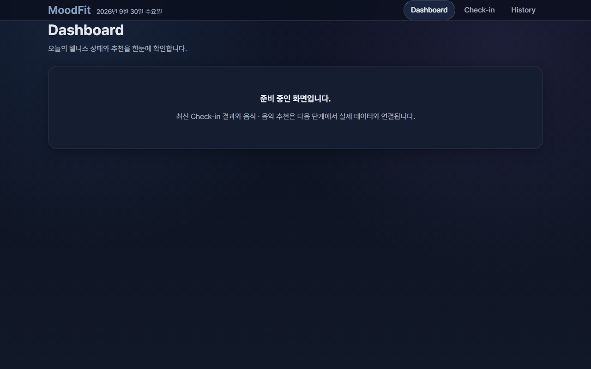

    - 수정 후: Desktop 1280px

      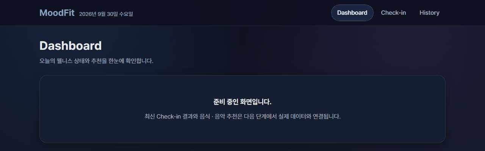

    - 수정 후: 390px / 560px / 768px

      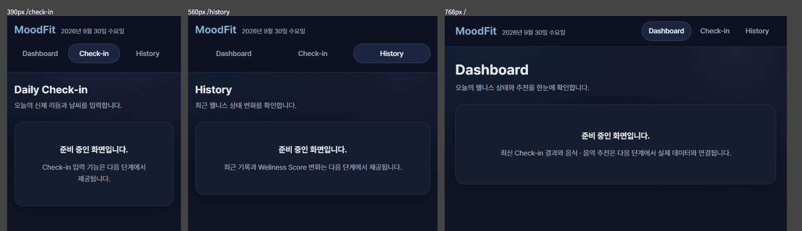

- Keyboard 접근성: 본문 건너뛰기 링크, 모든 Link / Button의 `:focus-visible` Focus Ring, 메뉴 Tap Target 최소 44px
- `powershell -ExecutionPolicy Bypass -File .\scripts\verify.ps1`: PASS
  - Frontend Test / Build, Backend Test / Build
  - 새 Frontend Test는 기존 `npm test`에 포함되므로 `verify.ps1`, `verify.sh`, CI Workflow 변경 없이 Local Verification과 CI 검증 범위가 확장된다.

### 변경하지 않은 것

- Backend, API Contract, DB Schema, DEC 문서 변경 없음
- `scripts/`, `.github/workflows/` 변경 없음

### Remote CI Verification

Commit `552ce70`을 `main`에 push하여 Remote CI를 실행했다.

- Workflow run: https://github.com/youneedpython/today-v3/actions/runs/36683691350
- 결과: PASS (`success`)

| Job | 결과 | 소요 시간 |
|---|---|---|
| `frontend` | success | 약 10초 (Test 25건 포함) |
| `backend` | success | 약 61초 |

- `Sync Milestones`: success (새로 DONE이 된 Task 없음, Close 대상 없음)

Remote CI Verification 완료 후 TASK-007 상태를 REVIEW로 변경했다.

### Human Review 승인

승인 일자: 2026-09-30

- Human이 TASK-007 Human Review를 승인했다.
- TASK-007 상태를 DONE으로 변경하고, TASK-008을 READY로 변경했다.

### 결과

Human Review 완료 / DONE

---

## TASK-008 — Daily Check-in

### 상태

DONE

### 작업 내용

- `src/features/checkin/checkinForm.ts`: 입력 정의와 Client-side Validation 보조
  - 기준은 `docs/05-API_SPEC.md` 4절 Validation, Backend `CreateCheckinRequest`와 같다.
  - Metric 5개는 정수, Temperature는 -30.0 ~ 50.0 소수 첫째 자리까지, Weather는 필수
  - 한국어 범위 안내 / 오류 메시지 제공
  - Backend `VALIDATION_ERROR`의 `fieldErrors`는 화면에 있는 필드만 같은 한국어 안내로 변환한다. (Backend 메시지는 실행 환경 Locale에 따라 언어가 달라질 수 있음)
- `src/features/checkin/CheckinPage.tsx`: Daily Check-in 화면 (UX Spec 4절 CHECK-001)
  - 입력 그룹: 신체 리듬(심박수, 호흡수), 컨디션(수면 / 스트레스 / 에너지), 날씨(기온, 날씨 상태 Radio)
  - 필드마다 Label, 단위, 범위 안내(`aria-describedby`)
  - Validation Error를 해당 필드 바로 아래에 표시하고 `aria-invalid`를 설정, 첫 번째 잘못된 필드로 Focus 이동
  - 입력을 수정하면 해당 필드 오류를 지운다.
  - 상태: Initial / Validation Error / Submitting / Success / API Error
  - 중복 제출 방지: 제출 중 Button과 입력 비활성화, `useRef` 기반 제출 중 Guard (Button 비활성화 전 연속 제출도 차단)
  - API Error: 네트워크 오류는 연결 안내, 그 외 오류는 일반 한국어 안내. 입력값을 유지하고 `다시 시도` 제공
- `src/features/checkin/CheckinResultSummary.tsx`: 저장 완료 후 결과 요약
  - Backend 응답의 Mood, Wellness Score, Summary, 추천 음식 / 음악, 기록 시각을 표시한다. (분석 Rule을 Frontend에 구현하지 않음)
  - 결과 제목으로 Focus 이동, `Dashboard로 이동` / `새로 입력하기` 제공
- `src/features/checkin/CheckinPage.css`: Form / 결과 Style (Desktop 3열, Tablet 2열, Mobile 1열, Mobile에서 Button 전체 폭)

### Dependency / Contract

- 새로운 Dependency 추가 없음. `package.json`, `package-lock.json`, `vite.config.ts` 변경 없음.
- API Contract, Backend, DB Schema 변경 없음. TASK-007의 `checkinApi.create`를 그대로 사용했다.

### Verification

- `npm test`: PASS, Test File 7개 / Test 57건 (TASK-008 추가 32건)
  - `checkinForm.test.ts`: 정상 변환, 필수 입력, 필드별 경계값 19건(범위 양끝 포함/초과, 정수 여부, Temperature 소수 둘째 자리), 한국어 메시지, 서버 오류 변환
  - `CheckinPage.test.tsx`: 입력 그룹과 범위 안내, 필드 옆 오류 / `aria-invalid` / 첫 오류 Focus / API 미호출, 수정 시 오류 해제, 제출 1회 / 제출 중 비활성화 / 결과 표시, 새로 입력하기, 서버 Validation 오류의 필드 표시, 네트워크 오류 후 입력 유지와 재시도, 서버 오류 일반 안내
- 중복 제출 Guard 검증: `useRef` Guard를 임시로 제거하면 "fetch 1회 호출" Test가 2회 호출로 실패함을 확인하고 원복했다.
- `npm run build`: PASS
- 화면 검토: `vite preview` 결과를 390px / 768px / 1280px로 캡처해 확인. 가로 넘침 없음, 입력 그룹 / 범위 안내 표시, 390px에서 1열과 전체 폭 Button
  - 캡처 (`docs/images/task-008/`): 390px / 768px / 1280px

    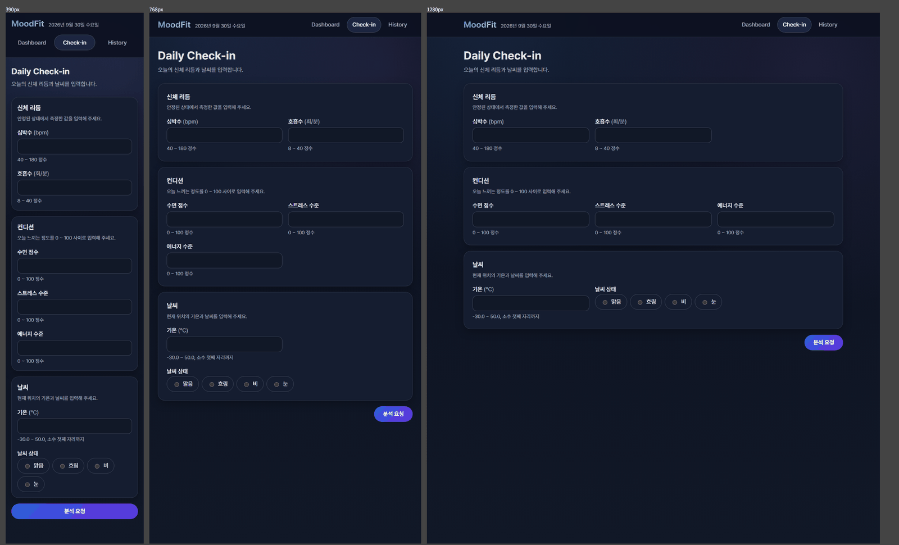

- Backend 관련 Test 재실행: PASS (`WellnessRulePolicyTests` 36건, `CheckinControllerTests` 13건, `WellnessCheckinRepositoryTests` 3건, `MoodFitApplicationTests` 1건)
- `powershell -ExecutionPolicy Bypass -File .\scripts\verify.ps1`: PASS
  - 새 Frontend Test는 기존 `npm test`에 포함되므로 Script / CI Workflow 변경 없이 검증 범위가 확장된다.

### Human Review 보완

검토 일자: 2026-09-30

발견 내용:

- Retry Validation UX 문제
  - API 오류 후 오류 상태에서도 입력을 수정할 수 있다.
  - 입력을 잘못된 값(예: 심박수 200)으로 고친 뒤 `다시 시도`를 누르면 `handleRetry`가 Validation 실패 시 아무 처리 없이 종료했다.
  - Field Error 미표시, Focus 미이동, 기존 API Error 상태 유지로 버튼이 반응하지 않는 것처럼 보였다.
- 같은 원인으로, 오류 상태에서 잘못된 값으로 고친 뒤 `분석 요청`을 누르면 Field Error는 표시되지만 API Error 알림이 함께 남아 있었다. (Claude 사전 검토에서 추가 확인)
- README가 `01 ~ 17 Prompt History`, Frontend `Skeleton` 표현으로 남아 있었다. (TASK-007, TASK-008 진행 중 갱신 누락)

보완 내용:

- `CheckinPage.tsx`: 제출과 재시도가 같은 `validateAndSubmit()` 경로를 사용하도록 통합했다.
  - Validation 실패 시 API를 호출하지 않고, Field Error 갱신, 이전 API Error 해제(`editing` 상태), 첫 번째 잘못된 필드로 Focus 이동
  - 기존 `handleRetry`를 제거하고 `ErrorState`의 재시도에 `validateAndSubmit`을 연결했다.
- `CheckinPage.test.tsx`: API 오류 후 입력을 잘못 고치고 `다시 시도` / `분석 요청`을 누르는 Test 2건 추가
  - API 추가 호출 없음, 필드 옆 오류, `aria-invalid`, 첫 오류 Focus, `role="alert"` 해제
  - API Error 해제 코드를 임시로 제거하면 두 Test가 모두 실패함을 확인하고 원복했다.
- README: Prompt History `01 ~ 19`, Frontend 설명 `React + TypeScript + Vite (Router / Design System / API Client / Daily Check-in)`로 동기화. 미구현 Dashboard / History 기능은 적지 않았다.

재검증 결과:

- `npm test`: PASS, Test File 7개 / Test 59건
- `npm run build`: PASS
- `powershell -ExecutionPolicy Bypass -File .\scripts\verify.ps1`: PASS
  - Backend Test Regression 없음 (`WellnessRulePolicyTests` 36건, `CheckinControllerTests` 13건, `WellnessCheckinRepositoryTests` 3건, `MoodFitApplicationTests` 1건)

### Remote CI Verification

Commit `0887711`을 `main`에 push하여 Remote CI를 실행했다.

- Workflow run: https://github.com/youneedpython/today-v3/actions/runs/36693834801
- 결과: PASS (`success`)

| Job | 결과 | 소요 시간 |
|---|---|---|
| `frontend` | success | 약 17초 (Test 59건 포함) |
| `backend` | success | 약 62초 |

- `Sync Milestones`: success (새로 DONE이 된 Task 없음)

Remote CI Verification 완료 후 TASK-008 상태를 REVIEW로 변경했다.

### Human Review 승인

승인 일자: 2026-09-30

- Human이 Local에서 Backend(MySQL `moodfit_v3`)와 Frontend 개발 서버를 함께 실행해 다음을 확인했다.
  - 빈 값 / 범위 밖 값 제출 시 필드 옆 Validation Error 표시
  - 정상 입력 제출 시 저장과 결과 요약 표시
  - Backend 중지 상태에서 제출 시 오류 안내와 `다시 시도` 표시
- Human이 TASK-008 Human Review를 승인했다.
- TASK-008 상태를 DONE으로 변경하고, TASK-009를 READY로 변경했다.

### 결과

Human Review 완료 / DONE

---

## TASK-009 — Dashboard

### 상태

DONE

### 작업 내용

- `src/features/dashboard/useLatestCheckin.ts`: 최신 Check-in 조회 Hook
  - 상태: loading / empty / error / ready
  - `404 CHECKIN_NOT_FOUND`는 `checkinApi.getLatest()`가 `null`로 반환하므로 오류가 아닌 empty 상태로 처리한다. (API Spec 5절, DEC-003)
  - 재시도 시 이전 요청의 늦은 응답이 최신 상태를 덮어쓰지 않도록 요청 번호로 구분하고, 화면을 떠난 뒤의 응답은 반영하지 않는다.
- `src/features/dashboard/WellnessHero.tsx`: Mood Badge / 기록 시각, 상태 Headline(`지금 컨디션은 {Mood label}`), Summary, `오늘 상태 입력` CTA, Wellness Score, 날씨 / 기온, 장식용 Weather Visual(`aria-hidden`)
- `src/features/dashboard/BodyMetrics.tsx`: 5개 Body Metric Card (심박수, 호흡수, 수면 점수, 스트레스 수준, 에너지 수준)
- `src/features/dashboard/RecommendationCards.tsx`: 추천 음식 / 추천 음악 Card (이름, Tag, 추천 이유, 음악은 Artist 포함)
- `src/features/dashboard/DashboardPage.tsx`: Loading / API Error + 다시 시도 / Empty State + Check-in CTA / 결과 화면
- `src/features/dashboard/DashboardPage.css`: Hero 2열 → Tablet / Mobile 1열, Metric 5 → 3 → 2열, 추천 2열 → 1열
- `src/constants/weather.ts`: 날씨 표시 이름을 Check-in / Dashboard 공통 상수로 분리 (`checkinForm.ts`의 `WEATHER_OPTIONS`는 같은 값을 사용, 동작 변경 없음)
- README: Frontend 설명에 Dashboard 추가, Prompt History `01 ~ 20` 동기화
- 모든 표시 값은 Backend 응답을 그대로 사용한다. 분석 Rule을 Frontend에 구현하지 않았다.

### 범위 밖

- 최근 7일 Wellness Trend는 UX Spec Dashboard 영역에 포함되지만 TASK-009 산출물 목록에 없고 TASK-010 History / Trend 범위이므로 구현하지 않았다.

### 오류 및 해결

- Test 작성 중 발견: 공통 `Card`의 `<section>`에 접근 가능한 이름이 없어 Screen Reader의 영역(region)으로 인식되지 않았다. (`Body Metrics`, `추천 음식` 등)
  - 해결: `Card`에 제목이 있으면 `useId`로 제목을 `aria-labelledby`에 연결했다. (TASK-007 공통 Component 접근성 보완)
  - `MetricCard.test.tsx`의 Card Test에 region 이름 확인을 추가했다.
- Route Test: Dashboard(`/`)가 이제 API를 호출하므로 `router.test.tsx`에서 fetch를 기록 없음(404)으로 Stub했다.
  - "준비 중 화면" 확인은 아직 준비 중인 `/history`로 옮기고, `/`의 Empty State 확인 Test를 추가했다.

### Dependency / Contract

- 새로운 Dependency, 외부 Chart / 시각화 Library 추가 없음. (DEC-010) `package.json`, `package-lock.json`, `vite.config.ts` 변경 없음.
- API Contract, Backend, DB Schema 변경 없음.

### Verification

- `npm test`: PASS, Test File 8개 / Test 67건 (TASK-009 추가 8건)
  - `DashboardPage.test.tsx`: Loading → 결과 표시(Hero의 Mood / Score / Summary / 날씨 / 기온 / CTA), 5개 Metric 값과 단위, 추천 음식 / 음악 이름 · Tag · 이유 · Artist, `404 CHECKIN_NOT_FOUND` → Empty State와 Check-in CTA, API 오류 → 다시 시도 → 결과 표시, 네트워크 오류 안내, Weather Visual 장식 처리
  - `router.test.tsx`: `/` Empty State 확인 추가
- `npm run build`: PASS
- 실제 Backend 연동 화면 검토
  - Local MySQL(`moodfit_v3`)로 Backend Jar를 실행하고, `vite preview`의 `/api` Proxy를 통해 최신 기록(id 3)을 조회했다.
  - 390px / 768px / 1280px로 캡처해 확인: 가로 넘침 없음, Hero / Metric / 추천 영역 Responsive 배치 정상
  - 표시된 Summary와 추천(기온 36.0°C → HOT Context)이 DEC-014 Rule 결과와 일치했다.
  - 확인 후 Backend와 Preview 서버를 종료했다.
  - 캡처 (`docs/images/task-009/`): 실제 Backend 데이터, 390px / 768px / 1280px

    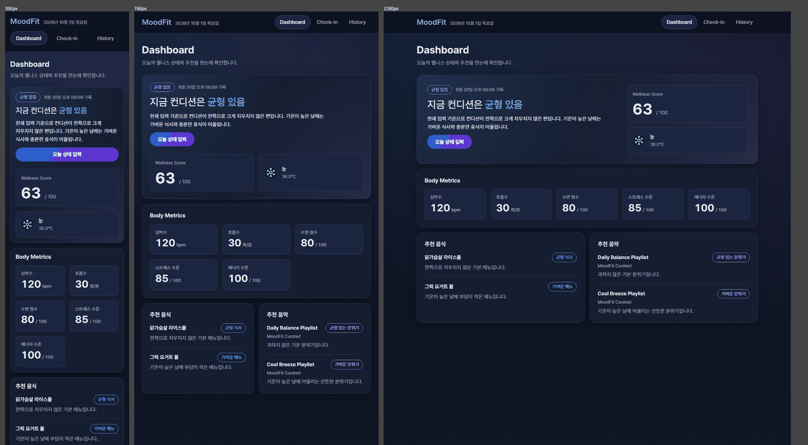

- Backend 관련 Test 재실행: PASS (`WellnessRulePolicyTests` 36건, `CheckinControllerTests` 13건, `WellnessCheckinRepositoryTests` 3건, `MoodFitApplicationTests` 1건)
- `powershell -ExecutionPolicy Bypass -File .\scripts\verify.ps1`: PASS

### Remote CI Verification

Commit `c78d438`을 `main`에 push하여 Remote CI를 실행했다.

- Workflow run: https://github.com/youneedpython/today-v3/actions/runs/36796003446
- 결과: PASS (`success`)

| Job | 결과 | 소요 시간 |
|---|---|---|
| `frontend` | success | 약 14초 (Test 67건 포함) |
| `backend` | success | 약 57초 |

- `Sync Milestones`: success (새로 DONE이 된 Task 없음)

Remote CI Verification 완료 후 TASK-009 상태를 REVIEW로 변경했다.

### Human Review 승인

승인 일자: 2026-10-01

- Human이 TASK-009 Human Review를 승인했다.
- TASK-009 상태를 DONE으로 변경하고, TASK-010을 READY로 변경했다.

### 결과

Human Review 완료 / DONE

---

## TASK-010 — History / Trend

### 상태

DONE

### 문서 충돌과 Gate C 결정 (DEC-020)

- 실행 전 확인한 충돌: TASKS / PLAN / UX Spec은 History에 "추천 이력 요약"을 요구하지만, API Spec 6절은 History 응답을 최소 정보로 두고 "상세 Recommendation은 최신 또는 상세 조회에서 처리"로 정했다. 상세 조회 API는 명세에 없다.
- AGENTS.md 3.1절에 따라 구현 전에 선택지(A: History에 추천 이름 추가 / B: 요구사항 제외 / C: 최신 추천 재표시)를 보고했다.
- Human이 A안을 승인했다. → DEC-020, `prompts/21-TASK-010-HISTORY-TREND.md`

### 작업 내용

Backend (DEC-020):

- `HistoryItemResponse`에 `foodNames`, `musicTitles` 추가 (기존 필드 변경 없음)
- `CheckinServiceImpl`: 저장된 추천을 순서대로(Mood Item, Context Item) 이름 목록으로 변환
- `WellnessCheckinRepository`: History 조회 메서드에 `@EntityGraph(foodRecommendations, musicRecommendations)`를 적용해 추천까지 하나의 Query로 조회 (N+1 방지)
- DB Schema, Flyway Migration 변경 없음

Frontend:

- `src/features/history/useHistory.ts`: 최근 7일 History 조회 Hook (loading / empty / error / ready, 늦은 응답 무시)
- `src/features/history/WellnessTrend.tsx`: 최근 7일 Wellness Score Trend
  - 외부 Chart Library 없이 SVG + CSS로 구현 (DEC-010)
  - SVG는 Grid와 선만 그리고, 점과 축 Label은 HTML로 % 위치에 배치해 화면 폭과 관계없이 글자 크기를 유지
  - 그래프는 장식(`aria-hidden`)으로 처리하고 "기록 N건 · 최저 · 최고 · 최근" Text 요약 제공
  - 기록이 1건이면 선 없이 점 하나만 표시
- `src/features/history/HistoryRecordList.tsx`: 최신 기록부터 날짜 / 시각(`<time>`), Mood, Wellness Score, 주요 Metric, 날씨 / 기온, 추천 음식 / 음악 이력
- `src/features/history/HistoryPage.tsx`: Loading / API Error + 다시 시도 / Empty State(UX Spec 문구 "아직 충분한 기록이 없습니다. 오늘의 상태를 입력해 보세요." + Check-in CTA) / 결과
- `src/types/api.ts`: `HistoryItem`에 `foodNames`, `musicTitles` 추가

문서:

- `docs/05-API_SPEC.md` 6절 예시와 설명 갱신, `docs/09-DECISIONS.md` DEC-020 추가
- README: Frontend 설명에 History 추가, Prompt History `01 ~ 21`, `docs/images/` 구조 추가
- 화면 검토 캡처 기록 (Human 요청)
  - TASK-007 ~ TASK-010 화면 검토 캡처 8장을 `docs/images/task-XXX/`에 저장하고 각 Task Verification에 연결했다.
  - Pillow(기존 Local Python 환경)로 가로 최대 1600px, 256색 PNG로 압축했다. (3.9MB → 1.25MB)
  - AGENTS.md 8.1절에 "화면이 바뀌는 Task는 캡처를 `docs/images/task-XXX/`에 남기고 WORK_LOG에 연결한다" 규칙을 추가했다.

### 오류 및 해결

- 화면 검토에서 발견: 처음에는 SVG 전체가 화면 폭에 맞춰 확대 / 축소되어 1280px에서는 축 글자가 지나치게 커지고 390px에서는 약 6px로 읽기 어려웠다. (`preserveAspectRatio="none"`을 쓰면 점이 타원으로 찌그러짐)
  - 해결: SVG는 Grid / 선만 그리고 점과 Label을 HTML로 배치하는 구조로 변경했다. 재캡처로 모든 폭에서 같은 글자 크기와 원형 점을 확인했다.
- Route Test: History(`/history`)도 API를 호출하므로 fetch Stub을 URL별로 나눴다. (History는 빈 목록, Latest는 404) 준비 중 화면이 더 이상 없으므로 "준비 중" 확인 Test를 History Empty State 확인으로 바꿨다.

### Dependency / Contract

- 새로운 Dependency, 외부 Chart Library 추가 없음. `package.json`, `package-lock.json`, `build.gradle` 변경 없음.
- API Contract 변경: History 응답 필드 추가(DEC-020, Gate C 승인). 기존 필드 변경 없음.

### Verification

- Backend `gradlew test`: PASS, 55건 (추가 2건)
  - `CheckinControllerTests`: 저장 후 History 응답의 `foodNames` / `musicTitles` 순서 확인
  - `WellnessCheckinRepositoryTests`: 3건 조회 + 추천 접근 시 SQL 1회 (Hibernate Statistics)
  - `@EntityGraph`를 임시로 제거하면 N+1 Test가 실패함을 확인하고 원복했다.
- Frontend `npm test`: PASS, Test File 9개 / Test 73건 (TASK-010 추가 6건 + Route Test 조정)
  - `HistoryPage.test.tsx`: `days=7` 요청과 Loading, Trend 점 수 / 선 / Text 요약, 1건일 때 점만 표시, 최신순 기록 / Mood / Metric / 날씨 / 추천 이력, UX Spec Empty State, 오류 후 다시 시도
- Frontend `npm run build`: PASS
- 실제 Backend 연동 화면 검토
  - 새 Backend Jar를 Local MySQL(`moodfit_v3`)로 실행해 History 응답(4건, 각 `foodNames` / `musicTitles` 2개)을 확인했다.
  - `vite preview` + `/api` Proxy로 390px / 768px / 1280px 캡처: 가로 넘침 없음, Trend 글자 크기 일정, 기록 목록 Responsive 배치 정상
  - 확인 후 Backend와 Preview 서버를 종료했다.
  - 캡처 (`docs/images/task-010/`): 실제 Backend 데이터, 390px / 768px / 1280px
    - Trend 수정 전: 화면 폭에 따라 축 글자 크기가 달라짐 (390px에서 읽기 어려움)

      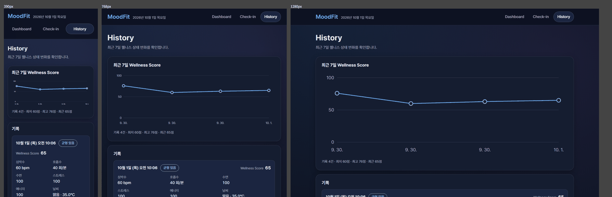

    - Trend 수정 후: 모든 폭에서 같은 글자 크기와 원형 점

      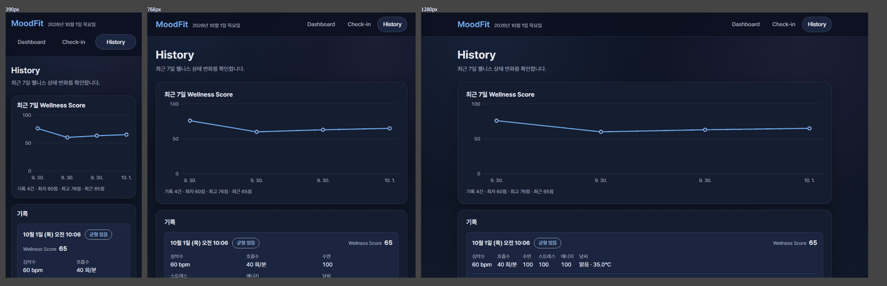

    - 기록 목록 (추천 이력 요약 포함)

      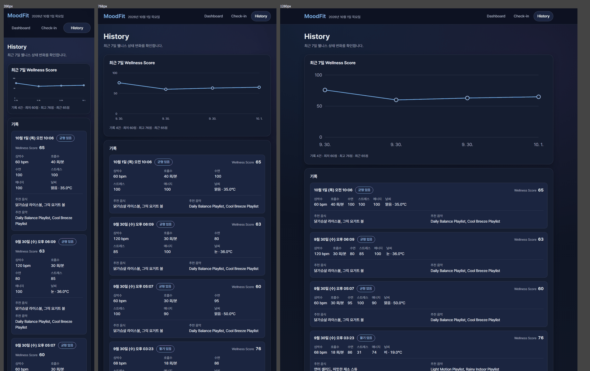

- 외부 Chart Library 미추가 확인: `package.json`에 Chart 관련 Dependency 없음
- `powershell -ExecutionPolicy Bypass -File .\scripts\verify.ps1`: PASS

### Remote CI Verification

Commit `c5bac2c`를 `main`에 push하여 Remote CI를 실행했다.

- Workflow run: https://github.com/youneedpython/today-v3/actions/runs/36802116810
- 결과: PASS (`success`)

| Job | 결과 | 소요 시간 |
|---|---|---|
| `frontend` | success | 약 20초 (Test 73건 포함) |
| `backend` | success | 약 67초 (Test 55건 포함) |

- `Sync Milestones`: success (새로 DONE이 된 Task 없음)

Remote CI Verification 완료 후 TASK-010 상태를 REVIEW로 변경했다.

### Human Review 승인

승인 일자: 2026-10-01

- Human이 TASK-010 Human Review를 승인했다.
- TASK-010 상태를 DONE으로 변경하고, TASK-011을 READY로 변경했다.
- Core Feature(Daily Check-in, Dashboard, History / Trend) 구현이 완료되었다.

### 결과

Human Review 완료 / DONE

---

## Out-of-Task — Repository 이름 변경 (`today-v3` → `MoodFit-v3`)

### 상태

DONE

### 작업 내용

- Human이 GitHub Repository 이름을 `today-v3`에서 `MoodFit-v3`로 변경했다. (2026-10-01)
  - 버전 표기는 관례에 따라 소문자 `v`를 사용했다.
- GitHub API로 변경을 확인했다.
  - `youneedpython/MoodFit-v3` 조회 성공
  - 이전 이름 `youneedpython/today-v3` 요청은 HTTP 301 Redirect
- Local `origin` Remote URL을 `https://github.com/youneedpython/MoodFit-v3.git`로 변경하고 `git fetch` / `git ls-remote`로 연결을 확인했다.
- `scripts/create-milestones.js`의 기본 `REPO_NAME`을 `MoodFit-v3`로 변경했다.
- README에 Repository 주소(이전 이름 포함)를 추가하고 구조의 Root 이름을 `MoodFit-v3/`로 변경했다.

### 변경하지 않은 것

- `docs/08-WORK_LOG.md`, `prompts/`의 과거 GitHub Actions 실행 링크(`today-v3`)는 과거 기록이므로 유지했다. GitHub Redirect로 열린다.
- `.github/workflows/`는 `$GITHUB_REPOSITORY`를 사용하므로 변경하지 않았다.
- Local 작업 폴더 이름(`today-v3`)은 변경하지 않았다.

---

## TASK-011 — Verification Hardening

### 상태

DONE

### 작업 내용

- Human이 TASK-011 실행을 승인했다.
- `docs/07-TASKS.md`의 TASK-011 상태를 `READY`에서 `IN_PROGRESS`로 변경한 뒤 Verification Hardening을 수행했다.
- Core Feature 완료 후 전체 Frontend / Backend Test와 Build를 Local Verification Harness로 다시 검증했다.
- Local Verification과 GitHub Actions CI의 검증 범위를 비교했다.
- 최신 Remote CI 실행 결과를 확인했다.
- TASK-012는 시작하지 않았다.

### Local Verification

PowerShell:

- Command: `powershell -ExecutionPolicy Bypass -File .\scripts\verify.ps1`
- Result: PASS
- Frontend Test: PASS, Test Files 9 passed / Tests 73 passed
- Frontend Build: PASS, `tsc --noEmit && vite build`
- Backend Test: PASS, `gradlew.bat test`
- Backend Build: PASS, `gradlew.bat build`

Bash:

- Command: `bash scripts/verify.sh`
- Result: PASS
- Frontend Test: PASS, Test Files 9 passed / Tests 73 passed
- Frontend Build: PASS, `tsc --noEmit && vite build`
- Backend Test: PASS, `./gradlew test`
- Backend Build: PASS, `./gradlew build`

### Local Verification / CI 범위 비교

| 검증 항목 | Local Verification | GitHub Actions CI | 동일 여부 |
|---|---|---|---|
| Frontend Test | `npm test` | `npm test` | 동일 |
| Frontend Build | `npm run build` | `npm run build` | 동일 |
| Backend Test | `gradlew test` | `./gradlew test` | 동등 |
| Backend Build | `gradlew build` | `./gradlew build` | 동등 |

### CI / Failure 정책 확인

- `.github/workflows/ci.yml`은 `frontend` / `backend` Job을 분리한다.
- Frontend Job은 `npm ci`, `npm test`, `npm run build`를 실행한다.
- Backend Job은 Java 21과 Gradle Wrapper를 사용해 `./gradlew test`, `./gradlew build`를 실행한다.
- MySQL Service Container는 사용하지 않는다.
- `continue-on-error`는 사용하지 않는다.
- Cache는 DEC-017 정책대로 사용하지 않는다.
- `git diff --check`: PASS. 단, Windows 작업 환경의 줄 끝 변환 경고가 표시되었으며 whitespace error는 없었다.

### Remote CI Verification

GitHub API로 최신 CI Workflow 실행 결과를 확인했다.

- Workflow run: https://github.com/youneedpython/MoodFit-v3/actions/runs/36807979956
- Head SHA: `c959f48cea85e9d10797017fdd4657d3d0ecc12a`
- Status: `completed`
- Conclusion: `success`
- Jobs: `frontend: success`, `backend: success`

현재 TASK-011의 문서 변경은 아직 Commit 전이므로, 이 문서 변경분에 대한 신규 Remote CI는 아직 실행되지 않았다.
다만 검증 대상 Source / Workflow는 최신 Commit `c959f48` 기준 Remote CI에서 성공했다.

### Verification Gap

> Human Review 보완(2026-10-01)에서 최초 기록("검증 공백은 발견하지 못했다")을 정정했다. 아래는 Claude 검토로 확인한 실제 Gap이다.

식별자: `GAP-n` = 검증 공백(Verification Gap), `FU-n` = 후속 보완 작업 후보(Follow-up). Gate A / B / C, DEC 번호와 구분하기 위해 두 글자 이상의 접두어를 사용한다.

Local Verification과 CI의 Core Test / Build 범위(Frontend Test / Build, Backend Test / Build)는 동일하거나 동등하다.
다만 다음 Verification Gap이 남아 있다.

| # | Gap | 내용 | 심각도 | 처리 |
|---|---|---|---|---|
| GAP-1 | History Rolling Window 미검증 | DEC-019 `days × 24시간` 규칙에서 Service가 Clock 기준으로 시작 시각을 계산하는 로직을 검증하는 Test가 없었다. (Repository Test는 시작 시각을 직접 전달) | 중 | **TASK-011에서 해결** (아래 Human Review 보완) |
| GAP-2 | Frontend / Backend Contract 자동 검증 없음 | Frontend Test는 모두 fetch Mock을 사용한다. Backend DTO 필드 이름이 바뀌어도 Frontend Test는 통과한다. 실제 연동은 수동 확인 / 캡처로만 검증했다. | 중 | 보완 Task 후보 FU-1 |
| GAP-3 | Local Verification의 의존성 설치 방식이 CI와 다름 | CI는 `npm ci`로 lock file 기준 설치, `verify.ps1` / `verify.sh`는 기존 `node_modules`를 사용한다. lock file 불일치가 Local에서 발견되지 않을 수 있다. | 하 | 보완 Task 후보 FU-2 |
| GAP-4 | Local Node.js Version 미강제 | CI는 Node.js `24.21.0` 고정, Local에는 `.nvmrc` / `engines`가 없다. (TASK-001 Review 당시 Local이 `24.16.0`이었던 사례 있음) | 하 | 보완 Task 후보 FU-2 |
| GAP-5 | 실제 MySQL 미검증 | Test / CI는 H2(MySQL Mode)만 사용한다. MySQL 고유 동작은 Human의 Local 실행으로만 확인했다. | 하 | 보완 Task 후보 FU-3 |
| GAP-6 | 날짜 / 시각 표시의 Timezone 의존 | 화면의 날짜 / 시각은 브라우저 Timezone을 따르며 이를 검증하는 Test가 없다. | 하 | 보완 Task 후보 FU-4 |

### 보완 Task 후보

| 후보 | 대상 Gap | 내용 | 필요 승인 |
|---|---|---|---|
| FU-1 | GAP-2 | API 계약 테스트 (Frontend / Backend): API 응답 형식을 양쪽이 지키는지 자동 검증 (예: 공유 예시 JSON 기반 Contract Test, 또는 E2E) | Gate C (검증 도구 / Dependency 추가) |
| FU-2 | GAP-3, GAP-4 | `verify.ps1` / `verify.sh`에 `npm ci` 단계 추가, `.nvmrc` 또는 `engines`로 Node.js Version 명시 | Human Approval (검증 Script 동작 변경) |
| FU-3 | GAP-5 | DB 연동 테스트 (실제 MySQL): Testcontainers 등으로 실제 MySQL에 연결한 Integration Test | Gate C (DEC-009 / DEC-019 재검토) |
| FU-4 | GAP-6 | 고정 Timezone 기준 날짜 표시 Test | Human Approval |
| FU-5 | — (TASK-012 CI Summary 관찰) | Gradle Wrapper Version 검토. `gradle/actions/setup-gradle` Summary가 승인 Version `8.14.5`(DEC-015)에 대해 "Gradle version is out of date"를 안내함. Spring Boot 4.1.1은 Gradle 8.14+ / 9.x를 지원 | Human Approval (DEC-015 기술 Version 변경) |

용어:

- API 계약 테스트(Contract Test): Frontend와 Backend를 함께 띄우지 않고, 약속한 API 형식을 양쪽이 각각 지키는지 검증한다.
- DB 연동 테스트(Integration Test): Backend를 실제 MySQL에 연결해 함께 동작하는지 검증한다.

FU-1 ~ FU-5는 2026-10-01 Human 지시로 TASK-013 ~ TASK-017에 등록되었다. (`docs/07-TASKS.md`)

| FU | 등록 Task |
|---|---|
| FU-2 | TASK-013 |
| FU-5 | TASK-014 |
| FU-4 | TASK-015 |
| FU-3 | TASK-016 |
| FU-1 | TASK-017 |

TASK-011 문서 변경분은 Commit / Push 후 Remote CI가 다시 실행된다.

### 오류 및 해결

- GitHub CLI(`gh`)가 Local 환경에 설치되어 있지 않아 `gh run list`는 사용할 수 없었다.
  - 해결: GitHub REST API를 사용해 최신 CI Workflow Run과 Job 결과를 확인했다.

### Human Review 보완

검토 일자: 2026-10-01

발견 내용:

- 최초 기록의 "Verification Gap 없음" 결론이 실제와 달랐다. TASK-011 완료 조건("남은 Verification Gap이 명확히 기록된다")을 충족하도록 위 Gap 목록(GAP-1 ~ GAP-6)과 보완 Task 후보(FU-1 ~ FU-4)로 정정했다.
- Claude가 `verify.ps1`, `verify.sh`를 다시 실행해 기록과 같은 결과(PASS)임을 확인했고, 인용된 Remote CI(`c959f48`)도 success임을 확인했다.

보완 내용 (GAP-1 해결, Human 지시):

- `CheckinControllerTests`에 History Rolling Window Test 2건 추가 (고정 Clock `2026-09-30T00:00:00Z`)
  - 기본 7일: 경계 1초 전 기록 제외, 정확히 7일 전 기록 포함, 오름차순
  - `days=1` / `days=30`: 각 경계의 포함 / 제외 확인
- Service의 기간 계산을 하루 늘리도록 임시 변경하면 두 Test가 모두 실패함을 확인하고 원복했다.
- Production Source, Dependency, 검증 Script, CI Workflow는 변경하지 않았다.

재검증 결과:

- Backend `gradlew test`: PASS, 57건 (`CheckinControllerTests` 16건, `WellnessRulePolicyTests` 36건, `WellnessCheckinRepositoryTests` 4건, `MoodFitApplicationTests` 1건)
- `powershell -ExecutionPolicy Bypass -File .\scripts\verify.ps1`: PASS
- Identifier 정리: Gate A / B / C와 혼동되지 않도록 `G1 ~ G6` → `GAP-1 ~ GAP-6`, `B1 ~ B4` → `FU-1 ~ FU-4`로 변경 (Human 승인)

Remote CI (commit `d799259`):

- Workflow run: https://github.com/youneedpython/MoodFit-v3/actions/runs/36810290844
- `frontend`: success, `backend`: success (Rolling Window Test 포함 57건)

### Human Review 승인

승인 일자: 2026-10-01

- Human이 TASK-011 Human Review를 승인했다.
- TASK-011 상태를 DONE으로 변경했다.
- TASK-012는 선행 조건을 충족했지만 Gate C 대상이므로 BLOCKED(Gate C 대기)로 유지했다.

### 결과

Human Review 완료 / DONE

---

## TASK-012 — GitHub Actions Bot

### 상태

DONE

### 작업 내용 (DEC-021)

- `.github/workflows/ci.yml`의 `frontend` / `backend` Job 마지막에 Step Summary 작성 Step 추가
  - `Write frontend summary`: `npm ci` / `npm test` / `npm run build` 결과
  - `Write backend summary`: `./gradlew test` / `./gradlew build` 결과
  - 공통: Commit SHA, Workflow Run URL, MySQL Service Container 미사용(DEC-009)
- 실패 시 기록 (DEC-021 Human Review 보완)
  - Summary Step은 `if: always()`로 실행한다.
  - 기존 Install / Test / Build Step에 `id`를 붙이고 `steps.<id>.outcome`을 그대로 기록한다. (success / failure / skipped / cancelled / 미실행)
  - Step outcome은 `env`로 전달해 Script에 직접 치환하지 않는다.
  - Summary Step은 항상 exit code 0으로 끝나며 Job의 성공 / 실패 판정을 바꾸지 않는다. `continue-on-error`는 사용하지 않는다.
- `.github/workflows/milestones.yml`(DEC-018)은 변경하지 않았다.

### 변경하지 않은 것

- Trigger(`push` / `pull_request` to `main`), Permissions(`contents: read`)
- 기존 Checkout / Setup / Install / Test / Build Step의 이름 · 명령 · 설정 (`id`만 추가)
- 추가 GitHub Action, Dependency, Secret / PAT 없음
- Source Code / 문서 자동 수정, Commit / Push / PR, Comment, Issue, Label, Release 없음
- Frontend / Backend Source, `scripts/verify.ps1`, `scripts/verify.sh`

### Verification

- Workflow 정적 확인 (이전 Commit의 `ci.yml`과 Python YAML 비교)
  - Trigger 동일, Permissions 동일(`contents: read`)
  - 기존 Step 이름 / 명령 / `uses` / `with` / `working-directory` 동일
  - 두 Summary Step 모두 `if: always()`, `continue-on-error` 없음, 추가 Action 없음
- Summary Script 실행 확인 (Workflow에서 Script를 추출해 Local bash로 실행)

| 시나리오 | 기록 결과 | Script exit code |
|---|---|---|
| Frontend 모두 성공 | Install / Test / Build `✅ success` | 0 |
| Frontend Test 실패 | Test `❌ failure`, Build `⏭️ skipped` | 0 |
| Frontend Install 실패 | Install `❌ failure`, Test / Build `⏭️ skipped` | 0 |
| Backend Build 실패 | Test `✅ success`, Build `❌ failure` | 0 |
| Backend Checkout 실패 (Step 미실행) | Test / Build `– not run` | 0 |

- 실패 경로의 실제 GitHub Actions 실행은 확인하지 않았다. 현재 Trigger가 `main` Push / Pull Request뿐이고 `main`에 실패 Commit을 올리지 않기 위해, 위 Local Script 시나리오와 Workflow 구조(`if: always()`, Step outcome)로 확인했다.
- `powershell -ExecutionPolicy Bypass -File .\scripts\verify.ps1`: PASS (Frontend 73건, Backend Test / Build)
- 화면(UI) 변경이 없는 Task이므로 AGENTS.md 8.1 캡처 대상이 아니다. Remote CI의 Summary 화면은 Human Review에서 확인한다.

### Remote CI Verification

Commit `e0f92de`를 `main`에 push하여 Remote CI를 실행했다.

- Workflow run: https://github.com/youneedpython/MoodFit-v3/actions/runs/36814475255
- 결과: PASS (`success`)

| Job | 결과 | 소요 시간 | Summary Step |
|---|---|---|---|
| `frontend` | success | 약 14초 | `Write frontend summary`: success |
| `backend` | success | 약 59초 | `Write backend summary`: success |

- GitHub REST API로 Job Step 목록을 조회해 두 Summary Step이 실행되었음을 확인했다.
- Step Summary 내용은 REST API로 조회할 수 없으므로 Human Review에서 Workflow Run의 Summary 화면으로 확인한다.
- `Sync Milestones`: success (새로 DONE이 된 Task 없음)

Remote CI Verification 완료 후 TASK-012 상태를 REVIEW로 변경했다.

### Human Review

검토 일자: 2026-10-01

- Human이 GitHub Actions Workflow Run의 Summary 화면을 확인하고 캡처를 첨부했다. (Run: https://github.com/youneedpython/MoodFit-v3/actions/runs/36814655358, commit `9c798e1`)
  - `## Frontend`: Install / Test / Build 모두 `✅ success`, Commit SHA, Workflow Run URL, MySQL 미사용 표시
  - `## Backend`: Test / Build 모두 `✅ success`, Commit SHA, Workflow Run URL, MySQL 미사용 표시
- 캡처 (`docs/images/task-012/`)

  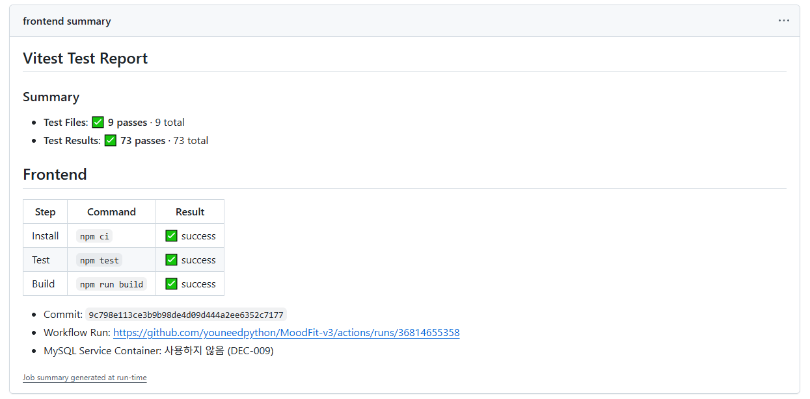

  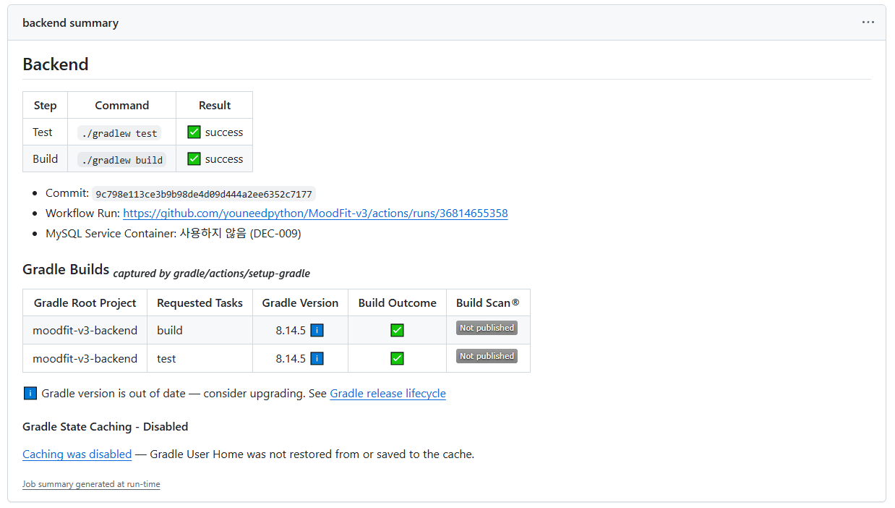

추가 관찰:

- Frontend Summary 위의 "Vitest Test Report"는 Vitest가 GitHub Actions 환경에서 자동으로 작성하는 Job Summary이다. (Test File 9개 / Test 73건) 설정 / Dependency 변경 없이 생성되며 DEC-021 범위와 충돌하지 않는다.
- Backend Summary 아래의 "Gradle Builds"는 `gradle/actions/setup-gradle`이 기본으로 작성하는 Summary이다.
  - "Caching was disabled"는 DEC-017(Cache 미사용)대로 동작함을 보여준다.
  - "Gradle version is out of date" 안내가 있어 Gradle Version 검토를 후속 보완 작업 후보 FU-5로 추가했다. (TASK-011 섹션, Human 승인)

### Human Review 승인

승인 일자: 2026-10-01

- Human이 TASK-012 Human Review를 승인했다.
- TASK-012 상태를 DONE으로 변경했다.
- TASK-001 ~ TASK-012 계획 Task가 모두 완료되었다.

### 결과

Human Review 완료 / DONE

---

## TASK-013 — Local Verification Environment Alignment

### 상태

DONE (Human Approval 완료: 2026-10-01)

### 작업 내용 (FU-2 — GAP-3 / GAP-4)

- Repository Root에 `.nvmrc` 추가: `24.21.0` (DEC-015, CI `setup-node`의 `node-version`과 동일)
- `scripts/verify.ps1`, `scripts/verify.sh`
  - 시작 시 Local Node.js Version을 `.nvmrc`와 비교한다.
    - 일치: `Node.js 24.21.0 (matches .nvmrc)` 출력
    - 불일치: 경고만 출력하고 검증은 계속 진행한다. (Version 강제는 범위 밖)
  - Frontend Test 전에 `Frontend install (npm ci)` 단계를 추가했다. CI와 같이 `package-lock.json` 기준으로 설치한다.
  - `npm ci` 실패 시 기존 단계와 같이 즉시 중단하고 exit code 1로 끝난다.

### 변경하지 않은 것

- `frontend/package.json`, `frontend/package-lock.json` (`engines` 미추가, Dependency 변경 없음 → Gate C 대상 아님)
- `.github/workflows/ci.yml` (`node-version: '24.21.0'` 유지)
- Backend 단계(`gradlew test` / `gradlew build`)

`engines` 대신 `.nvmrc`를 선택한 이유:

- `engines`는 npm 기본 설정에서 경고만 출력하고, Root package 변경이 `package-lock.json`에도 기록된다.
- `.nvmrc`는 lock file을 건드리지 않고, nvm / fnm 등 Version 관리 도구와 검증 Script가 같은 값을 읽을 수 있다.

### Local Verification / CI Frontend 단계 비교

| 단계 | CI (`frontend` Job) | `verify.ps1` | `verify.sh` |
|---|---|---|---|
| Node.js Version | `setup-node` `24.21.0` 고정 | `.nvmrc`와 비교, 불일치 시 경고 | `.nvmrc`와 비교, 불일치 시 경고 |
| 의존성 설치 | `npm ci` | `npm.cmd ci` | `npm ci` |
| Test | `npm test` | `npm.cmd test` | `npm test` |
| Build | `npm run build` | `npm.cmd run build` | `npm run build` |

남은 차이: CI는 Node.js Version을 설치해 고정하고, Local은 설치된 Node.js를 사용하며 불일치를 경고로 안내한다.

### Verification

성공 경로 (Local Node.js `24.21.0`):

| Script | 결과 |
|---|---|
| `sh scripts/verify.sh` | PASS (exit 0) — `npm ci` 99 packages, Frontend Test 73건, Build, Backend Test / Build |
| `powershell -ExecutionPolicy Bypass -File .\scripts\verify.ps1` | PASS (exit 0) — 같은 단계 모두 성공 |

실패 / 경고 경로 (임시 디렉터리의 가짜 `npm` / `node`를 PATH 앞에 두고 실행, 검증 후 삭제):

| 시나리오 | `verify.sh` | `verify.ps1` |
|---|---|---|
| `npm ci` 실패 | `Frontend install (npm ci)`에서 중단, exit 1, Test 미실행 | `Frontend install (npm ci) failed with exit code 1.`, exit 1, Test 미실행 |
| Node.js `22.0.0` (불일치) | `WARNING: Node.js 22.0.0 is in use, but .nvmrc expects 24.21.0` 출력 후 끝까지 진행, exit 0 | 같은 경고 출력 후 끝까지 진행, exit 0 |

- `git status` 확인: `npm ci` 실행 후 `frontend/package-lock.json` 변경 없음
- 화면(UI) 변경이 없는 Task이므로 AGENTS.md 8.1 캡처 대상이 아니다.

### 참고

- `npm ci`는 `node_modules`를 삭제 후 다시 설치한다. `npm run dev`(Vite) 등이 실행 중이면 Windows에서 파일 잠금으로 실패할 수 있으므로 검증 전에 종료한다.
- 검증 시간이 `npm ci`만큼(Local 약 3 ~ 9초) 늘어난다.

### Remote CI Verification

Commit을 둘로 나누어 `main`에 push했다. (Human 지시)

- `ffb8387` docs: Post-MVP 보완 Task 등록 및 Milestone 연결
- `db2567f` feat: TASK-013 Local Verification 환경 정렬

| Workflow | 결과 | 비고 |
|---|---|---|
| CI | success | Run: https://github.com/youneedpython/MoodFit-v3/actions/runs/36819501929 |
| `frontend` Job | success | 약 18초 (`npm ci` → `npm test` → `npm run build`) |
| `backend` Job | success | 약 66초 |
| Sync Milestones | success | 새로 DONE이 된 Task 없음 |

- CI Workflow는 변경하지 않았으므로 Local Script 변경이 CI 결과에 영향을 주지 않음을 확인했다.

Remote CI Verification 완료 후 TASK-013 상태를 REVIEW로 변경했다.

- REVIEW 반영 Commit `45f2c04`의 CI / Sync Milestones도 success (Run: https://github.com/youneedpython/MoodFit-v3/actions/runs/36820719335)

### Human Review 승인

승인 일자: 2026-10-01

- Human이 TASK-013 Human Review를 승인했다.
- TASK-013 상태를 DONE으로 변경했다. (Milestone 13은 `Sync Milestones`가 자동 Close)
- Current Task를 TASK-014(BLOCKED, Human Approval 대기)로 변경했다.

### 결과

Human Review 완료 / DONE

---

## TASK-014 — Gradle Wrapper Version Review

### 상태

DONE (Human Approval 완료: 2026-10-01, Human 결정: B안 `9.8.0`으로 변경)

### 검토 배경 (FU-5)

TASK-012 Human Review에서 `gradle/actions/setup-gradle` Summary에 "Gradle version is out of date" 안내가 표시되었다.

### 확인 자료 (2026-10-01 기준)

| 항목 | 내용 | 출처 |
|---|---|---|
| 현재 Wrapper | Gradle `8.14.5` (2026-05-07 배포, 8.14 계열 최신 Patch) | `backend/gradle/wrapper/gradle-wrapper.properties`, services.gradle.org |
| 최신 Gradle | `9.8.0` (2026-09-24 배포) | services.gradle.org `versions/current` |
| Spring Boot 4.1.1 지원 범위 | Gradle 8.x (8.14 이상)와 9.x | Spring Boot 4.1 System Requirements / Gradle Plugin 문서 |
| `io.spring.dependency-management` | `1.1.7` (현재 최신 배포) | Gradle Plugin Portal |
| Java | Local / CI 모두 Java 21 (Gradle 9 실행 요구 Java 17 이상 충족) | DEC-015, `ci.yml` |

### 검증

| 대상 | 명령 | 결과 |
|---|---|---|
| 현재 `8.14.5` (Repository) | `gradlew clean test build --warning-mode all --no-build-cache` | BUILD SUCCESSFUL, Test 57건 통과, Deprecation 경고 0건 |
| 후보 `9.8.0` (Repository 밖 임시 사본) | `gradlew clean test build --warning-mode all` | BUILD SUCCESSFUL, Test 57건 통과, Deprecation 경고 0건, 실행 Jar / plain Jar 생성 |

- 임시 사본은 `backend`를 Scratchpad에 복사하고 `distributionUrl`만 `gradle-9.8.0-bin.zip`으로 바꿔 실행했다. 검증 후 Daemon을 종료하고 사본을 삭제했다.
- Repository의 Wrapper 설정, Wrapper jar / Script, `build.gradle`, DEC-015는 변경하지 않았다.
- `build.gradle`은 Groovy DSL 기본 기능만 사용하며, 9.8.0에서 Build Script 수정 없이 동작했다.
- 9.8.0 실행 시 Configuration Cache 사용 권장 안내가 출력되었다. (선택 기능이며 이번 범위 밖)

### 선택지

| 선택지 | 장점 | 단점 / 영향 |
|---|---|---|
| A. `8.14.5` 유지 | 변경 없음, 이미 검증된 상태 | CI Summary의 "out of date" 안내가 계속 표시된다. Gradle 8은 이전 Major로 신규 기능 없이 중요 수정만 제공된다 |
| B. `9.8.0`으로 변경 | 최신 지원 Version, CI 안내 해소, Spring Boot 4.1.1 지원 범위 안 | `gradlew wrapper --gradle-version 9.8.0`으로 Wrapper jar / Script / properties 갱신, DEC-015 갱신, Local / Remote CI 재검증 필요 |

### Human 결정 및 변경 (B안)

Human이 B안(`9.8.0`으로 변경)을 선택했다.

- `gradlew wrapper --gradle-version 9.8.0 --distribution-type bin`을 두 번 실행했다. (첫 실행은 `8.14.5`로 properties 갱신, 두 번째 실행은 `9.8.0`으로 Wrapper jar / Script 재생성)
- 변경 파일
  - `backend/gradle/wrapper/gradle-wrapper.properties`: `distributionUrl` → `gradle-9.8.0-bin.zip`, Gradle 9 기본값 `retries=0`, `retryBackOffMs=500` 추가
  - `backend/gradle/wrapper/gradle-wrapper.jar`: SHA-256 `238e777f…21abd5`, Gradle 공식 `gradle-9.8.0-wrapper.jar.sha256`과 일치
  - `backend/gradlew`, `backend/gradlew.bat`: Gradle 9.8.0 표준 Template으로 재생성 (직접 수정 없음, 실행 권한 유지)
- `build.gradle`, `settings.gradle`, Plugin / Dependency Version은 변경하지 않았다.
- 문서: DEC-015 Version / 고정 정책 / 변경 이력, README 기술 스택, PLAN Gate A 규칙에 변경 사실 추가
- 과거 기록(Prompt 04 / 05 / 08 / 09, TASK-001 명세, 이전 Work Log)의 `8.14.5` 표기는 당시 결정 기록이므로 유지했다.

### Local Verification (`9.8.0`)

| 명령 | 결과 |
|---|---|
| `gradlew --version` | Gradle 9.8.0 |
| `sh scripts/verify.sh` (`gradlew clean` 후) | PASS (exit 0) — `npm ci`, Frontend Test 73건, Build, Backend Test / Build |
| `powershell -ExecutionPolicy Bypass -File .\scripts\verify.ps1` | PASS (exit 0) |

- Gradle 9.8.0은 Build마다 Configuration Cache 사용 권장 안내를 출력한다. 안내 문구일 뿐 결과에는 영향이 없으며, 사용 여부는 이번 범위 밖이다.
- Remote CI에서 `gradle/actions/setup-gradle`의 Wrapper jar 검증과 "out of date" 안내 해소를 확인한다.

### Remote CI Verification

Commit `3b33dff`를 `main`에 push하여 Remote CI를 실행했다.

- Workflow run: https://github.com/youneedpython/MoodFit-v3/actions/runs/36823802991
- 결과: PASS (`success`)

| Job | 결과 | 소요 시간 | 비고 |
|---|---|---|---|
| `frontend` | success | 약 17초 | 변경 없음 |
| `backend` | success | 약 61초 | `Setup Gradle`(Wrapper jar 검증 포함), Test, Build, Summary 모두 success |
| Sync Milestones | success | — | 새로 DONE이 된 Task 없음 |

- GitHub REST API로 Job Step 목록을 조회해 확인했다.
- Step Summary의 "Gradle Builds" 내용(Gradle Version, "out of date" 안내 해소)은 REST API로 조회할 수 없으므로 Human Review에서 Summary 화면으로 확인한다.

Remote CI Verification 완료 후 TASK-014 상태를 REVIEW로 변경했다.

- Human이 Summary 화면에서 "Gradle version is out of date" 안내가 사라진 것을 확인했다. (2026-10-01)

### Human Review 관찰 — Runner Annotation

Human이 Workflow Run 화면의 Annotations(notice 2건)를 캡처해 첨부했다.

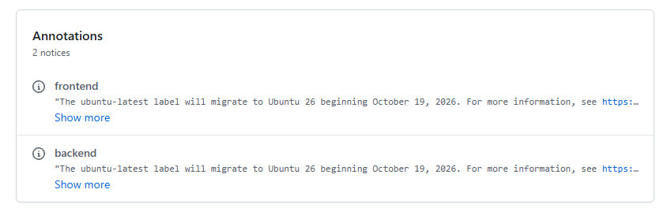

- `frontend` / `backend` Job: "The ubuntu-latest label will migrate to Ubuntu 26 beginning October 19, 2026."
- 의미: `runs-on: ubuntu-latest`를 사용하는 Job은 2026-10-19부터 Ubuntu 26 Runner에서 실행된다.
- 대상: `ci.yml`의 `frontend` / `backend`, `milestones.yml`의 Sync Job (DEC-017 / DEC-018 Runner: `ubuntu-latest`)
- 영향 예상: Node.js `24.21.0`(`setup-node`), Java 21(`setup-java`), Gradle Wrapper `9.8.0`은 Workflow에서 Version을 직접 지정하므로 OS 변경의 직접 영향은 작다. 다만 OS 기본 도구(`gh` 등) Version이 바뀔 수 있다.
- notice(정보) 수준이며 TASK-014 결과(Job 성공)에는 영향이 없다.
- 후속 보완 작업 후보 FU-6으로 기록한다.

| 후보 | 내용 | 필요 승인 |
|---|---|---|
| FU-6 | Runner OS 전환 대응: `ubuntu-latest` 유지 후 2026-10-19 이후 CI 결과 확인, 또는 `ubuntu-24.04`로 고정 | CI Workflow 변경 시 Gate C (DEC-017 / DEC-018) |

### Human Review 승인

승인 일자: 2026-10-01

- Human이 TASK-014 Human Review를 승인했다.
- TASK-014 상태를 DONE으로 변경했다. (Milestone 14는 `Sync Milestones`가 자동 Close)
- Current Task를 TASK-015(BLOCKED, Human Approval 대기)로 변경했다.
- FU-6의 Task 등록 여부는 Human 결정 대기이다.

### 결과

Human Review 완료 / DONE

---

## TASK-015 — Timezone-fixed Date Display Test

### 상태

DONE (Human Approval 완료: 2026-10-01)

### 작업 내용 (FU-4 — GAP-6)

- 화면의 날짜 / 시각 표시가 Runtime Timezone에 의존하던 문제를 보완했다.
- Frontend 날짜 / 시각 표시 기준 Timezone을 `Asia/Seoul`로 명시했다.
- 공통 포맷 유틸을 추가했다.
  - `frontend/src/utils/dateTime.ts`
  - `MOODFIT_TIME_ZONE = "Asia/Seoul"`
  - `formatDisplayDateTime`
  - `formatDisplayDateTimeWithWeekday`
  - `formatTrendDate`
  - `formatHeaderDate`
- 기존 날짜 표시 지점을 공통 유틸로 교체했다.
  - Header 오늘 날짜
  - Check-in 결과 기록 시각
  - Dashboard 최신 기록 시각
  - History 기록 목록 날짜 / 시각
  - History Trend 축 Label
- 고정 Timezone 기준 Frontend Test를 추가했다.
  - UTC 기준 `2026-09-30T15:30:00Z`가 `Asia/Seoul` 기준 `2026-10-01 00:30`으로 표시되는 경계값을 검증한다.

### 변경하지 않은 것

- 새로운 Dependency 추가 없음
- `package.json`, `package-lock.json` 변경 없음
- Backend Source 변경 없음
- CI Workflow 변경 없음
- TASK-016 이후 작업 시작하지 않음

### Verification

Frontend:

| Command | 결과 |
|---|---|
| `npm test` | PASS, Test Files 10 passed / Tests 76 passed |
| `npm run build` | PASS |

Local Verification:

| Script | 결과 |
|---|---|
| `powershell -ExecutionPolicy Bypass -File .\scripts\verify.ps1` | PASS, Node.js `24.21.0` matches `.nvmrc`, Frontend `npm ci` / Test / Build, Backend Test / Build |
| `bash scripts/verify.sh` | PASS, Frontend `npm ci` / Test / Build, Backend Test / Build |

`bash scripts/verify.sh` 실행 시 현재 Shell에서 `node --version` 탐지는 실패해 다음 경고가 출력되었다.

```text
WARNING: Node.js not found is in use, but .nvmrc expects 24.21.0 (CI uses 24.21.0).
```

이는 TASK-013에서 승인한 정책상 경고이며 검증은 계속 진행되었다. `npm ci`, `npm test`, `npm run build`는 모두 성공했다.

### Human Review 보완

검토 일자: 2026-10-01

Codex 구현 결과를 검토하며 다음을 확인했고, Human 결정에 따라 보완했다.

| # | 확인 내용 | Human 결정 / 보완 |
|---|---|---|
| 1 | Task 명세는 "고정 Timezone 기준 검증"이지만, 구현은 화면 표시 자체를 브라우저 Timezone → `Asia/Seoul`로 변경했다. 승인 기록(DEC)이 없었다. | A안 채택: `Asia/Seoul` 표시 유지, DEC-022로 기록 |
| 2 | 실행 Timezone이 `Asia/Seoul`이면 `timeZone` Option을 제거해도 Test가 통과했다. (회귀를 CI(UTC)에서만 발견) | `vite.config.ts`에 `test.env.TZ = "UTC"` 추가 |
| 3 | `docs/08-WORK_LOG.md`의 TASK-001 / TASK-002, TASK-002 / TASK-003 사이 구분선(`---`) 2개가 의도치 않게 삭제되었다. | 복구 |
| 4 | `verify.sh`가 `node`를 찾지 못한 Shell(WSL 등 `node.exe`만 실행 가능한 환경)에서 `Node.js not found is in use` 경고를 출력했다. (TASK-013 검사의 한계) | `node` 실패 시 `node.exe`로 재확인, 미탐지 시 별도 경고 문구. `verify.ps1`도 `node` 미탐지 시 별도 경고 후 계속 진행 |

보완 검증:

- 회귀 탐지 (`dateTime.ts`에서 `timeZone` Option을 임시 제거 후 실행, 검증 후 원복)

| 조건 | 보완 전 | 보완 후 (`test.env.TZ = "UTC"`) |
|---|---|---|
| Shell `TZ=Asia/Seoul` | 3건 모두 통과 (회귀 미발견) | 2건 실패 (회귀 발견) |
| Shell `TZ=UTC` | 2건 실패 | 2건 실패 |

- 실행 Timezone별 전체 Frontend Test (보완 전 구현 기준): `Asia/Seoul`, `UTC`, `America/Los_Angeles`, `Pacific/Kiritimati` 모두 76건 통과
- Node.js 탐지 (가짜 `npm` / `node.exe`를 PATH 앞에 두고 실행, 검증 후 삭제)

| 시나리오 | `verify.sh` | `verify.ps1` |
|---|---|---|
| `node` / `node.exe` 없음 | `WARNING: Node.js version could not be detected (node / node.exe not found)` 후 계속 진행 | `WARNING: Node.js version could not be detected (node not found)` 후 계속 진행 |
| `node.exe`만 있음 | `Node.js 24.21.0 (matches .nvmrc)` | 해당 없음 (PowerShell은 `node.exe`를 `node`로 찾음) |

- 보완 후 Local Verification: `sh scripts/verify.sh`, `verify.ps1` 모두 PASS (Node.js `24.21.0` matches `.nvmrc`, Frontend Test Files 10 / Tests 76, Build, Backend Test / Build)
- 화면 캡처: 생략 (Human 지시: 표시 형식이 이전과 같으면 생략)
  - 이전 구현(브라우저 Timezone, KST 환경)과 현재 구현(`Asia/Seoul` 고정)의 표시 문자열을 5개 표시 지점의 4개 형식 × 경계값 포함 3개 시각으로 비교한 결과 모두 같았다. (예: `10월 1일 (목) 오전 12:30`, `10. 1.`, `2026년 10월 1일 목요일`)

### Remote CI Verification

Commit `c8807a1`를 `main`에 push하여 Remote CI를 실행했다.

- Workflow run: https://github.com/youneedpython/MoodFit-v3/actions/runs/36828028771
- 결과: PASS (`success`)

| Job | 결과 | 소요 시간 |
|---|---|---|
| `frontend` | success | 약 19초 |
| `backend` | success | 약 52초 |
| Sync Milestones | success | — |

### Human Review 승인

승인 일자: 2026-10-01

- Human이 Commit / Push 지시와 함께 TASK-015 Human Review를 승인했다. ("커밋/푸시! 승인!")
- Remote CI 성공을 확인한 뒤 TASK-015 상태를 DONE으로 변경했다. (Milestone 15는 `Sync Milestones`가 자동 Close)
- Current Task를 TASK-016(BLOCKED, Gate C 승인 대기)으로 변경했다.

### 결과

Human Review 완료 / DONE

---

## TASK-016 — DB 연동 테스트 (실제 MySQL)

### 상태

DONE (Gate C 승인: DEC-023, 2026-10-01)

### Gate C 결정 (DEC-023)

| 항목 | 결정 |
|---|---|
| DB 연동 방식 | Testcontainers MySQL (Option A) |
| MySQL Image | `mysql:8.0.46` (Local 개발 MySQL과 동일) |
| Docker 없는 Local | 건너뛰고(SKIPPED) 표시 |
| CI Backend Summary | "MySQL: Testcontainers(`mysql:8.0.46`, DEC-023)"로 문구 변경 |

검토 자료: `prompts/29-TASK-016-DB-INTEGRATION-TEST-GATE-C-REVIEW.md`. DEC-009는 DEC-023으로 대체되었다.

### 작업 내용

- `backend/build.gradle`
  - `testImplementation` 추가 (Version은 Spring Boot `4.1.1` BOM 관리): `spring-boot-testcontainers` 4.1.1, `testcontainers-junit-jupiter` 2.0.5, `testcontainers-mysql` 2.0.5
  - `test` Task `testLogging.events 'skipped', 'failed'`: 건너뛴 / 실패한 Test를 Test 출력에 표시
- `backend/src/test/java/com/moodfit/mysql/MySqlIntegrationTests.java` (5건)
  - `@Testcontainers(disabledWithoutDocker = true)`, `@Container @ServiceConnection MySQLContainer("mysql:8.0.46")`

| Test | 검증 내용 |
|---|---|
| `connectsToMySqlAndAppliesFlywayMigration` | MySQL `8.0.46` 연결, Flyway V1 적용(`flyway_schema_history`), Table 3개 생성, `ddl-auto=validate` 통과 |
| `storesRecordedAtAsUtcWithMicrosecondPrecision` | DB에 저장된 원본 값이 `2026-09-30 12:34:56.123456`(UTC, Microsecond) — JVM Timezone(Local KST / CI UTC)과 무관 (DEC-019) |
| `preservesTemperatureDecimalAndKoreanText` | `DECIMAL(3,1)` 경계값 `-30.0` / `50.0`, 한글 Summary / 추천 이름 저장 / 조회 |
| `findsHistoryWithinRollingWindowInOneQuery` | Rolling Window 조회, 오름차순, 추천 순서, 추천까지 Query 1회 (DEC-020) |
| `createThenReadLatestAndHistoryThroughApi` | API 저장(`POST /api/check-ins`) → 최신 / History 조회 흐름 |

- `backend/src/test/java/com/moodfit/mysql/DockerAvailabilityTests.java`
  - `CI=true`일 때만 실행되어 Docker가 없으면 실패한다. (CI에서 MySQL 연동 테스트가 조용히 건너뛰어지는 것을 방지)
  - Local(`CI` 미설정)에서는 항상 SKIPPED로 표시된다.
- `.github/workflows/ci.yml`: Backend Summary의 MySQL 문구만 변경 (Frontend Summary의 "MySQL Service Container: 사용하지 않음" 문구는 Frontend가 MySQL을 사용하지 않으므로 유지)
- `README.md`: Local 실행 안내에 MySQL 연동 테스트 / Docker 조건 추가

### 변경하지 않은 것

- DB Schema / Flyway Migration, 운영 `application.properties`
- 기존 H2 Test(`src/test/resources/application.properties`, 기존 Test Class)
- `ci.yml` Trigger / Permission / Cache 정책 / 실행 명령 (GitHub Actions가 `CI=true`를 기본 설정)
- `scripts/verify.ps1`, `scripts/verify.sh`

### Verification

Docker 실행 / 미실행 경로 (`gradlew cleanTest test --tests "com.moodfit.mysql.*"`):

| 조건 | MySqlIntegrationTests | DockerAvailabilityTests | Build |
|---|---|---|---|
| Local, Docker 실행 | 5건 통과 (약 35초) | SKIPPED | 성공 |
| Local, Docker 미실행 | 5건 SKIPPED (출력에 표시) | SKIPPED | 성공 |
| `CI=true`, Docker 미실행 | 5건 SKIPPED | 실패 | 실패 |
| `CI=true`, Docker 실행 | 5건 통과 | 통과 | 성공 |

- Docker 미실행 경로는 `docker desktop stop`으로 실제로 중지해 확인한 뒤 `docker desktop start`로 다시 실행했다. (실행 중 Container 없음 확인 후)
- `DOCKER_HOST` / `TESTCONTAINERS_DOCKER_CLIENT_STRATEGY` 환경변수로는 재현되지 않았다. Testcontainers가 설정 Strategy 실패 시 다른 Strategy(Npipe)로 다시 연결하기 때문이다.
- 개발 중 오류: 트랜잭션 밖 Lazy 로딩(`LazyInitializationException`), 응답 JSON 경로(`$.weather.temperature`) — Test Code 수정으로 해결

Local Verification:

| Script | 결과 |
|---|---|
| `sh scripts/verify.sh` (Docker 실행) | PASS — Frontend Test 76, Build, Backend Test 63건(SKIPPED 1: CI 전용), Build |
| `powershell -ExecutionPolicy Bypass -File .\scripts\verify.ps1` (Docker 실행) | PASS |
| `sh scripts/verify.sh` (Docker 미실행) | PASS — Backend Test 출력에 MySQL 연동 테스트 5건 SKIPPED 표시 |

- Backend Test 시간: 약 2초 → 약 33 ~ 35초 (Container 시작 포함, Image 캐시 상태)
- 화면(UI) 변경이 없는 Task이므로 AGENTS.md 8.1 캡처 대상이 아니다.

### Remote CI Verification

Commit을 둘로 나누어 `main`에 push했다. (Human 지시)

- `74cdd3c` docs: TASK-016 Gate C 검토 및 승인 반영 (DEC-023)
- `2f693d4` test: TASK-016 MySQL DB 연동 테스트 (Testcontainers) 추가

- Workflow run: https://github.com/youneedpython/MoodFit-v3/actions/runs/36836934133
- 결과: PASS (`success`)

| Job / Step | 결과 | 소요 시간 |
|---|---|---|
| `frontend` | success | 약 17초 |
| `backend` | success | 약 97초 (이전 약 52 ~ 66초) |
| `backend` › Run backend tests | success | 약 89초 (MySQL Image Pull / Container 시작 포함) |
| Sync Milestones | success | — |

MySQL 연동 테스트 실제 실행 근거:

- GitHub Actions는 `CI=true`를 설정하므로 `DockerAvailabilityTests`가 실행된다. 이 Test는 Docker가 없으면 실패하며, `backend` Job이 성공했으므로 Runner에 Docker가 있었다.
- `MySqlIntegrationTests`는 Docker가 없을 때만 건너뛰므로(`disabledWithoutDocker`) CI에서 실행되었다.
- Job Log는 인증이 필요해 REST API로 조회하지 못했다(403). Test 출력의 SKIPPED 여부와 Backend Summary의 MySQL 문구는 Human Review에서 Workflow Run 화면으로 확인한다.

Remote CI Verification 완료 후 TASK-016 상태를 REVIEW로 변경했다.

### Human Review

검토 일자: 2026-10-01

- Human이 Workflow Run의 Backend Summary 화면을 캡처해 첨부했다.

  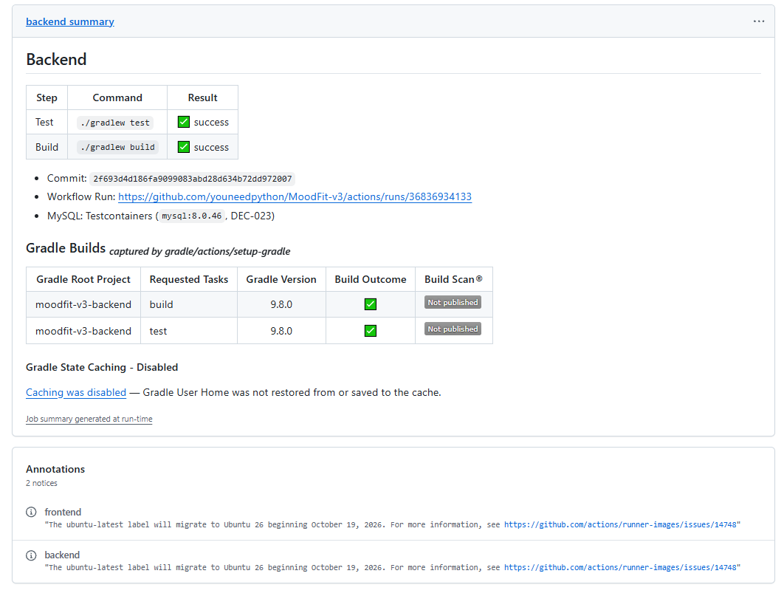

- 확인 내용
  - Backend Test / Build `✅ success`, Commit `2f693d4`
  - "MySQL: Testcontainers (`mysql:8.0.46`, DEC-023)" 문구 표시 (DEC-023 문구 변경 반영)
  - Gradle Builds: Gradle Version `9.8.0`(TASK-014), Caching Disabled(DEC-017)
  - Annotations: `ubuntu-latest` → Ubuntu 26 전환 안내(2026-10-19)가 계속 표시됨 (FU-6, Task 등록 여부 Human 결정 대기)
- Job Log의 Test 출력(SKIPPED 여부)은 캡처에 포함되지 않았다. MySQL 연동 테스트 실행은 위 Remote CI Verification의 근거(`CI=true` + `DockerAvailabilityTests` 성공)로 판단한다.

### Human Review 승인

승인 일자: 2026-10-01

- Human이 TASK-016 Human Review를 승인했다.
- TASK-016 상태를 DONE으로 변경했다. (Milestone 16은 `Sync Milestones`가 자동 Close)
- Current Task를 TASK-017(BLOCKED, Gate C 승인 대기)으로 변경했다.
- FU-6(Runner OS 전환 대응)의 Task 등록 여부는 Human 결정 대기이다.

### 결과

Human Review 완료 / DONE

---

## TASK-017 — API 계약 테스트 (Frontend / Backend)

### 상태

DONE (Gate C 승인: DEC-024, 2026-10-01)

### Gate C 결정 (DEC-024)

| 항목 | 결정 |
|---|---|
| 계약 테스트 방식 | Option A — 공유 계약 예시 JSON |
| 계약 파일 위치 | Repository Root `contracts/` |
| `05-API_SPEC.md` 예시 동기화 Test | 포함 |
| Frontend 화면 Test 가짜 응답 | 계약 파일로 교체 |

검토 자료: `prompts/31-TASK-017-API-CONTRACT-TEST-GATE-C-REVIEW.md`

### 작업 내용

- `contracts/` 계약 파일 5개 (현재 Backend 동작 기준)
  - 고정 시계(`2026-09-28T03:00:00Z`, API 명세 예시 시각)와 API 명세 Request 예시로 실제 응답을 받아 작성했다. (작성용 임시 Test는 삭제)
  - `id`는 API 명세 예시 값(`101`)을 사용하고 비교 시 숫자인지만 확인한다.

| 계약 파일 | 대상 |
|---|---|
| `checkin-create-201.json` | `POST /api/check-ins` 201 |
| `checkin-latest-200.json` | `GET /api/check-ins/latest` 200 (생성 응답과 동일) |
| `checkin-latest-404.json` | `GET /api/check-ins/latest` 404 `CHECKIN_NOT_FOUND` |
| `checkin-history-200.json` | `GET /api/check-ins/history` 200 |
| `checkin-create-400.json` | `POST /api/check-ins` 400 `VALIDATION_ERROR` (`heartRate: 200`) |

- Backend: `backend/src/test/java/com/moodfit/contract/CheckinContractTests.java` (5건)
  - 실제 API 응답 전체를 계약 파일과 JSON Tree로 비교한다. (필드 누락 / 추가 / 이름 / 값 / 배열 순서)
  - DB `id`는 정수인지 확인한 뒤 계약 값으로 맞춘다.
- Frontend: `frontend/src/contracts/`
  - `contracts.ts`: 계약 파일 import + `api.ts` Type과의 필드 구성 일치 Type 검사 (`npm run build`의 `tsc --noEmit`)
  - `apiSpecSync.test.ts` (5건): `docs/05-API_SPEC.md` Response 예시 ↔ 계약 파일 비교 (`@vitest-environment node`)
- Frontend 화면 Test 가짜 응답 교체
  - `CheckinPage.test.tsx`: 생성 응답 → `checkin-create-201`, 400 응답 → `checkin-create-400` 형식 + 시나리오 필드 오류
  - `DashboardPage.test.tsx`: 최신 응답 → `checkin-latest-200`, 404 → `checkin-latest-404`
  - `HistoryPage.test.tsx`: History Item 기본값 → `checkin-history-200` Item, 최신 기록은 계약 Item 그대로 (Trend용 이전 기록만 시나리오 값)
- `docs/05-API_SPEC.md`
  - 1절: 실행 가능한 계약(`contracts/`)과 계약 파일 대응표 추가
  - 5절: 404 Response 예시 추가
  - 8절: Error Response 예시를 실제 동작으로 정정 ("초안" 제거)

### 발견 사항

- API 명세 8절 Error 예시(초안)는 한국어 메시지(`입력값을 확인해 주세요.`, `40 이상 180 이하로 입력해 주세요.`)였지만, 실제 Backend 응답은 기본 메시지(`Request validation failed.`, `must be less than or equal to 180`)였다.
- Frontend는 `fieldErrors`의 필드 이름으로 한국어 안내를 표시하므로 화면 동작에는 문제가 없었다. (기존 화면 Test도 실제 메시지 사용)
- Gate C 원칙(계약은 현재 동작 그대로 고정)에 따라 API는 바꾸지 않고 명세 예시를 정정했다.
- 생성 / History 응답은 `id`를 제외하고 명세 예시와 정확히 같았다.

### 변경하지 않은 것

- API 형식 / Backend Main Code
- `package.json`, `package-lock.json`, `build.gradle` (새 Dependency 없음)
- `vite.config.ts` (`frontend/` 밖 `contracts/` import가 추가 설정 없이 동작)
- `ci.yml`, `scripts/verify.ps1`, `scripts/verify.sh`

### Verification

계약 위반 탐지 (임시 변경 후 실행, 검증 후 원복):

| 변경 | 결과 |
|---|---|
| 계약 파일에서 `summary` 삭제 | Frontend `tsc --noEmit` 실패 |
| 계약 파일 `foodNames` → `foodList` | Frontend `tsc --noEmit` 실패 |
| `api.ts`에 필드 추가 | Frontend `tsc --noEmit` 실패 |
| `api.ts` `wellnessScore` 형식 `number` → `string` | Frontend `tsc --noEmit` 실패 |
| Backend 응답 필드 이름 변경 (`HistoryItemResponse.foodNames` → `foodList`) | Backend `CheckinContractTests` 1건 실패 |
| 계약 파일 값 변경 (`wellnessScore` 76 → 80) | Backend 계약 Test 1건 실패, 명세 동기화 Test 2건 실패 |
| `docs/05-API_SPEC.md` 예시만 변경 | 명세 동기화 Test 1건 실패 |
| 원복 후 | 모두 통과 |

Local Verification:

| Script | 결과 |
|---|---|
| `sh scripts/verify.sh` (Docker 실행) | PASS — Frontend Test Files 11 / Tests 81, Build, Backend Test 68건(SKIPPED 1: CI 전용), Build |
| `powershell -ExecutionPolicy Bypass -File .\scripts\verify.ps1` | PASS |

- 화면(UI) 변경이 없는 Task이므로 AGENTS.md 8.1 캡처 대상이 아니다.

### Remote CI Verification

Commit을 둘로 나누어 `main`에 push했다. (Human 지시)

- `fcb7b80` docs: TASK-017 Gate C 검토 및 승인 반영 (DEC-024)
- `19f985c` test: TASK-017 API 계약 테스트 (contracts/) 추가

- Workflow run: https://github.com/youneedpython/MoodFit-v3/actions/runs/36841079709
- 결과: PASS (`success`)

| Job / Step | 결과 | 소요 시간 |
|---|---|---|
| `frontend` | success | 약 15초 |
| `frontend` › Run frontend tests / Build | success | 약 5초 / 약 2초 (계약 Type 검사 포함) |
| `backend` | success | 약 112초 |
| `backend` › Run backend tests | success | 약 71초 (계약 Test, MySQL 연동 Test 포함) |
| Sync Milestones | success | — |

- CI `frontend` / `backend` Job 모두 Repository 전체를 Checkout하므로 `contracts/`를 읽는다. (`ci.yml` 변경 없음)

Remote CI Verification 완료 후 TASK-017 상태를 REVIEW로 변경했다.

- REVIEW 반영 Commit `ebef142`의 CI / Sync Milestones도 success

### Human Review 승인

승인 일자: 2026-10-01

- Human이 TASK-017 Human Review를 승인했다.
- TASK-017 상태를 DONE으로 변경했다. (Milestone 17은 `Sync Milestones`가 자동 Close)
- TASK-001 ~ TASK-017이 모두 완료되어 Current Task를 "없음 (ALL DONE)"으로 변경했다.
- FU-6(Runner OS 전환 대응)의 Task 등록 여부는 Human 결정 대기이다.

### 결과

Human Review 완료 / DONE

---

## Out-of-Task — README 프로젝트 소개 개편

### 상태

완료 (Human 지시, 2026-10-02)

### 작업 내용

- Root `README.md`를 진행 기록 중심에서 **프로젝트 소개 중심**으로 다시 작성했다.
  - 제거: Current Task, Task별 진행 결과 표, 다음 단계 표, Prompt History 개수 (진행 기록은 `docs/07-TASKS.md`, `docs/08-WORK_LOG.md`에 유지)
  - 추가: 서비스 소개, 주요 기능과 실제 화면, 분석 / 추천 동작 방식, 구성과 API, 기술 스택, 품질 검증, Harness 기반 개발 방식(흐름 / 문서 / Gate / Task 진행), 시작하기, 프로젝트 구조, CI Badge
- README 소개용 화면 캡처 6장을 `docs/images/readme/`에 추가했다.

| 파일 | 화면 | 크기 |
|---|---|---|
| `dashboard.png` | Dashboard (Desktop) | 1280px |
| `checkin-form.png` | Daily Check-in 입력 (Desktop) | 1280px |
| `checkin-result.png` | Check-in 분석 결과 (Desktop) | 1280px (2x) |
| `history.png` | History / Trend + 최근 기록 (Desktop) | 1280px |
| `mobile-dashboard.png` | Dashboard (Mobile) | 390px (2x) |
| `mobile-history.png` | History (Mobile) | 390px (2x) |

### 캡처 방법

- Local MySQL(`moodfit_v3`)로 Backend(`bootRun`), Frontend(`npm run dev`)를 실행했다.
- 예시 기록 4건을 API(`POST /api/check-ins`)로 생성해 실제 Rule(DEC-014) 결과를 저장한 뒤, Trend 표시를 위해 기록 시각만 DB에서 `2026-09-26 ~ 09-29`로 옮겼다. (Human 허용)
- 캡처 과정의 Check-in 입력(API 명세 예시 값)으로 오늘 기록 1건이 추가되었다.
- Headless Chrome을 Chrome DevTools Protocol(Node.js 내장 WebSocket)로 제어해 정확한 화면 너비로 캡처했다. 새 Dependency와 Repository 파일 변경은 없다. (캡처 Script는 Scratchpad에서만 사용)
- History 화면은 기존 수동 확인 기록(극단 입력값 포함)이 노출되지 않도록 Trend와 최근 기록 1건까지만 잘라 사용했다. 기존 기록은 변경하지 않았다.

### 변경하지 않은 것

- Source Code, Test, CI, 다른 문서의 진행 기록
- `docs/images/task-xxx/` Task 검토용 캡처

### GitHub Repository About

- 현재 설명: "사용자의 신체 리듬 정보와 날씨 정보를 기반으로 현재 웰니스 상태를 추정하고, 음식과 음악을 추천하는 Full-stack 프로젝트" / Topics 없음
- 이 환경에는 GitHub 인증(`gh`)이 없어 About은 Human이 GitHub 화면에서 직접 수정한다. (문구 / Topics 초안 제공)

### 결과

완료 (`9bb1b9f`)

---

## Out-of-Task — v3.0.0 Release 준비

### 상태

완료 (Human 지시, 2026-10-02)

### 작업 내용

- DEC-025 Version / Tag / Release 규칙 추가 (Human 결정: `v3.0.0`, 과거 Tag `v3.0.0-mvp` 추가, 규칙 DEC 기록)
- Release 노트 `docs/releases/v3.0.0.md` 작성
- Annotated Tag 생성
  - `v3.0.0-mvp` → `84b21b8` (Core MVP 완료, TASK-012 DONE)
  - `v3.0.0` → DEC-025 반영 Commit
- GitHub Release는 이 환경에 GitHub 인증이 없어 Human이 GitHub 화면에서 `v3.0.0` Tag로 작성한다. (본문: `docs/releases/v3.0.0.md`)

### Push / Release

- Commit `f6d72c9`(DEC-025 반영) push 후 CI success 확인 (Run: https://github.com/youneedpython/MoodFit-v3/actions/runs/36939540052)
- DEC-025 규칙(CI 성공 Commit에만 Tag)에 따라 CI 성공 후 `v3.0.0` Tag를 만들고 두 Tag를 push했다.

| Tag | Commit | Tag Object |
|---|---|---|
| `v3.0.0` | `f6d72c9` | Annotated (`36af1cb`) |
| `v3.0.0-mvp` | `84b21b8` | Annotated (`c273dad`) |

- Human이 GitHub Release `MoodFit v3.0.0`을 발행했다. (2026-10-01T23:20:21Z, Latest, Pre-release 아님)
  - https://github.com/youneedpython/MoodFit-v3/releases/tag/v3.0.0
  - GitHub REST API로 Tag / 제목 / 발행 상태 / 본문을 확인했다.

### 결과

완료 / v3.0.0 Release 발행

---

## Out-of-Task — Agent 자동화 / AWS 배포 Roadmap 검토와 등록 (TASK-018 ~ TASK-031)

### 상태

완료 (Human 지시, 2026-10-02)

### 배경

Human이 앞으로의 개발을 Agent 2개로 자동화하고 AWS에 배포한 뒤 CI / CD로 진행하는 Roadmap 문서(TASK-018 ~ TASK-031)를 `docs/`에 추가하고, 다음 기준에 맞는지 검토를 요청했다.

- Agent 2개로 완전 자동화
- 실행: Codex, 검토: Claude, 승인: Human
- AWS SSO를 이용한 배포

### 검토 결과와 반영 (Commit `3ca9830`)

| 검토 사항 | 반영 |
|---|---|
| AWS SSO가 설계에 없음 (GitHub OIDC만 있음) | TASK-025를 AWS SSO / GitHub OIDC / IAM Gate로 확장. Human SSO 로그인 후 Agent 작업, Permission Set 분리(Production은 Human 전용), 만료 시 `HUMAN_REQUIRED` |
| DEC 번호 충돌 (정책을 DEC-025로 가정) | Multi-Agent 정책을 DEC-026으로 변경 (DEC-025는 Version / Tag 규칙) |
| RDS MySQL 8.0 지원 / 비용 | TASK-023에 RDS 8.0 유지 vs 8.4 전환 검토 항목 추가 (AWS 공식 문서로 확인) |
| Human 승인 채널 미정의 | TASK-019 Decision Matrix에 추가 (PR Approve / Label / Environment Reviewer) |
| AI 사용 방식 / 비용 | Human 결정: API Key 미사용, VS Code 로그인 계정으로 로컬 실행 → GitHub Actions의 Agent 실행을 제거하고 TASK-022를 GitHub CI Integration / PR Gate로 재정의 |
| AGENTS.md 반영 Task 없음 | TASK-019 완료 조건에 DEC-026 승인 후 AGENTS.md 반영 추가 |
| FU-6 일정 (2026-10-19 전환) | Human 결정: 순서 앞당김 → FU-6을 TASK-018로 이동, 기존 TASK-018 ~ TASK-021은 TASK-019 ~ TASK-022로 조정 |
| Release 연계 | TASK-030 Production 배포 단위를 Release Tag(`v3.x.y`, DEC-025)로 연결 |
| 문서 구조 | `docs/tasks/`로 이동, 공통 규칙 `COMMON.md`로 분리, Source of Truth 목록 정리, `docs/README.md`를 docs 색인으로 변경 |

- Human 결정: Orchestrator는 Node.js 24 + JavaScript(`.mjs`), Dependency 없음 (TASK-020)
- 원본 문서는 Repository 밖에 백업한 뒤 `docs/tasks/`로 재구성했다.

### Agent CLI 사전 검증 (Spike)

Repository 밖 임시 폴더에서 확인했다. 결과는 `docs/tasks/TASK-020_LOCAL_ORCHESTRATOR.md` "사전 검증 결과"에 기록했다.

- Claude: VS Code 확장 포함 `claude.exe` 2.1.286, `-p` 비대화형 / JSON 결과 / `--allowedTools "Read"`로 쓰기 차단 확인, API Key 없음
- Codex: Human 승인 후 `npm install -g @openai/codex`(0.160.0) 설치, 기존 ChatGPT 로그인 재사용, `exec` 비대화형 / `--output-schema` 결과 / 작업 폴더 쓰기 확인
- 발견 사항: Codex stdin을 닫지 않으면 입력 대기로 멈춤(4분 Timeout 발생), Windows에서는 `windows.sandbox` 설정 없이 `workspace-write`가 `read-only`로 낮아짐, Claude 결과가 Code Block으로 감싸질 수 있음

### Roadmap 등록 (0단계)

- `docs/07-TASKS.md`
  - Current Task: TASK-018(READY, Human 실행 지시 대기)
  - 전체 Task 목록에 TASK-018 ~ TASK-031 / Milestone 18 ~ 31 추가 (TASK-019 이후 BLOCKED)
  - Task별 요약 섹션(상태 / 목적 / Gate / 완료 조건)과 `docs/tasks/` 상세 Task Contract 링크
  - 5절 Human Approval 필요 Task, 6절 Pending Decision(DEC-026 예정) 갱신
- `docs/06-PLAN.md`: Milestone 18 ~ 31 목록 추가
- `scripts/create-milestones.js`: Milestone 18 ~ 31 정의 추가 (기존 Milestone은 제목 기준으로 건너뜀)
- `AGENTS.md`: Current Task TASK-018 READY, DEC-026 반영 전까지 기존 규칙 유지 명시

### 다음 단계

- Human: `node scripts/create-milestones.js`로 Milestone 18 ~ 31 생성 (`GITHUB_TOKEN` 필요)
- Human: TASK-018 실행 지시 → Codex 실행(VS Code) → Claude 검토 → Human 승인

- Commit `5d7d8b4` push 후 CI / Sync Milestones success
- Human이 Milestone 18 ~ 31을 생성했다. GitHub API로 31개(Closed 17 / Open 14), 중복 없음을 확인했다.

### Roadmap 재정렬 (Human 승인, 2026-10-02)

Human이 이번 작업의 핵심을 다시 확인했다: **Agent를 이용한 완전 자동화 개발**. Codex 실행 후 Claude가 자동으로 검토해야 하며, Human이 Agent 사이에서 결과를 옮기지 않고 승인이 필요한 사항에만 개입한다.

기존 순서는 TASK-018(FU-6)과 TASK-019(정책)가 Human이 결과를 옮기는 "수동 단계"여서 이 원칙과 맞지 않았다. 자동화 기반을 맨 앞으로 옮겼다.

| 번호 | 변경 전 | 변경 후 |
|---|---|---|
| TASK-018 | CI Runner OS Transition Hardening (FU-6) | **Multi-Agent Harness Bootstrap** (DEC-026 정책 + 최소 Orchestrator). Claude Code 세션이 임시 Orchestrator로 `codex exec`를 호출 / 자동 검토 (1회 예외) |
| TASK-019 | Multi-Agent Automation Policy | **CI Runner OS Transition Hardening (FU-6)** — Orchestrator로 실행하는 첫 Task |
| TASK-020 | Local Multi-Agent Orchestrator | **Orchestrator Hardening** (worktree / Resume / Lock / Guard / 전체 Test) |
| TASK-021 ~ TASK-031 | 변경 없음 | 변경 없음 (참조 문구만 갱신) |

- FU-6 일정: "`ubuntu-latest` 유지 후 확인" 전략을 선택하면 2026-10-19 전 Workflow 변경이 필요 없어 위험이 작다.
- 반영: `docs/tasks/`(TASK-018 신규, TASK-019 / TASK-020 재작성, 정책 Task 파일은 TASK-018에 통합), `docs/07-TASKS.md`, `docs/06-PLAN.md`, `AGENTS.md`, `scripts/create-milestones.js`
- `scripts/create-milestones.js`: 같은 번호의 Milestone이 있으면 제목 / 설명을 갱신하도록 보강했다. (Closed Milestone은 제목이 다를 때만 갱신) GitHub의 Milestone 18 ~ 20 제목은 Human이 Script를 다시 실행해 갱신한다.

### 결과

Roadmap 검토 / 문서 재구성 / 등록 / Milestone 생성 / 순서 재정렬 완료

---

## TASK-018 — Multi-Agent Harness Bootstrap

### 상태

```text
DONE
```

### A단계 작업 내용 (2026-10-02)

- Human 실행 지시에 따라 A단계(정책)만 수행했다. Human 제공 Context에 따라 Claude 세션이 임시 Orchestrator로 `codex exec`를 시작한 Bootstrap 실행을 기록한다.
- TASKS Current Task / 전체 목록 / TASK-018 섹션 상태를 IN_PROGRESS로 변경하고 시작 안내를 갱신했다.
- AGENTS.md는 3절 Current Task Status 값만 IN_PROGRESS로 변경했다. 정책 권한은 반영하지 않았다.
- DEC-026 Pending Human Approval 초안과 정책 문서를 작성했다. A. 정책 1~10과 전체 Human Decision Matrix를 포함하고 신규 결정은 미정으로 남겼다.
- Prompt 36과 Index 36번(진행 중)을 기록했다. Human 제공 선행 지시 "커밋/푸시 승인!"은 기록만 하고 이번 실행의 Git 작업 금지를 적용했다.

### Verification

- 문서 변경 범위이므로 Source Test / Build / 전체 verify Script / Fake CLI Test / 실제 CLI Smoke Run은 이번 A단계에서 실행하지 않았다. B / C단계 검증은 미수행이다.
- `git diff --check`: 통과 (Exit Code 0, whitespace 오류 없음). Git의 LF → CRLF 변환 안내만 출력되었으며 실제 파일은 LF로 확인했다.
- 허용된 7개 파일만 변경 / 생성했으며 LF / 제어 문자 없음 / AGENTS.md 단일 Status 변경 / TASKS 3개 상태 IN_PROGRESS를 확인했다.

### 남은 Gate / 다음 단계

- Claude A단계 자동 Review와 DEC-026 / Human Decision Matrix 승인 대기. PASS / Human Approved로 처리하지 않았다.
- B단계 구현은 수행하지 않았다. TASK-018 IN_PROGRESS, TASK-019 이후 BLOCKED 유지.
- 승인 후 B / C / D단계와 최종 Human Review가 필요하다.

### Review 2회차: Branch 전략 / 승인 채널 반영 (2026-10-02)

- Reviewer(Claude)의 `CHANGES_REQUIRED` Finding F1 ~ F6만 지정된 4개 파일에 반영했다.
- Human이 확정한 Task별 Branch / PR / Squash Merge 전략과 TASK-018 ~ TASK-020의 Human 승인 후 Claude 세션 또는 Human Git 작업, TASK-021 Script Git 자동화 경계를 기록했다.
- Task 완료 승인 = Human의 PR Squash Merge, Required approvals 0 / Required status checks / Auto Merge 비활성 유지, TASK-021 작성자 분리 검토를 반영했다.
- 기존 Codex Co-author Trailer의 Squash Commit 메시지 포함과 Human의 gh 설치 / 로그인 완료, Human 로그인 → Agent 사용 원칙을 기록했다. 계정명 / Token은 기록하지 않았다.
- DEC-026은 `Pending Human Approval`, TASK-018은 `IN_PROGRESS`로 유지하고 다른 Human 결정 항목은 미정으로 남겼다. Git 변경 작업과 B / C / D단계는 수행하지 않았다.

- Review 2회차 Verification: `git diff --check` 통과 (Exit Code 0, whitespace 오류 없음). 지정된 4개 파일 UTF-8 / LF / 제어 문자 없음 확인. 문서 Rework이므로 Test / Build는 실행하지 않았다.

### A단계 Human 승인 (2026-10-02)

- Reviewer(Claude) PASS(Review 2회차) 후 Human이 DEC-026 / Decision Matrix의 모든 항목을 권장안대로 승인했다.
- Windows Codex Sandbox는 `unelevated`로 시작한다 (사전 검증 완료, 추가 설정 없음). `elevated` 전환은 TASK-020(Orchestrator Hardening)에서 검증 후 다시 결정한다.
- Human 승인 후 Claude 세션이 `gh api`로 GitHub 설정을 적용했다 (2026-10-02).
- Squash Merge만 허용하고 Merge Commit / Rebase는 비활성화했다. Squash Commit 제목 = PR 제목, 본문 = PR 본문이며 Merge 후 Head Branch를 자동 삭제한다.
- Branch Ruleset `main-protection`: Active, 기본 Branch 대상, Bypass 없음. 삭제 금지 / Force Push 금지 / Linear History / PR 필수(Required approvals 0, Squash만 허용) / Required status checks `frontend` / `backend`를 적용했다.
- Agent가 Human의 GitHub 로그인을 사용하므로 Bypass가 있으면 Agent도 main에 직접 Push할 수 있어 Bypass를 두지 않았다. 긴급 시 Human이 Ruleset을 일시 Disabled로 전환한다.
- A단계 결과의 Task Branch Commit / Push / Draft PR 생성을 승인했다. Git 작업은 Claude 세션이 수행하며 이번 Executor 실행에서는 수행하지 않았다.
- A단계 완료(DEC-026 Human Approved), B단계 진행 예정. TASK-018 IN_PROGRESS / TASK-019 이후 BLOCKED 유지. AGENTS.md 정책 반영은 D단계에서 수행한다.

- Human 승인 반영 Verification: `git diff --check` 통과 (Exit Code 0, whitespace 오류 없음). 지정된 5개 파일 UTF-8 / LF / 제어 문자 없음 확인. 문서 변경이므로 Test / Build는 실행하지 않았다.

### B단계 최소 Orchestrator 구현 (2026-10-02)

- Human의 명시적 B단계 실행 지시와 DEC-026 Human Approved를 확인하고 설계 문서를 먼저 작성한 뒤 구현했다. 현재 Branch `task/TASK-018-harness-bootstrap`, 시작 Working Tree clean을 확인했다.
- `docs/12-ORCHESTRATOR-DESIGN.md`: 구성 / 폴더, Phase / Verdict / 최대 3회 Review, Agent 명령 / JSON Schema / stdin 종료 / Timeout / 오류 분류, Contract / 경로 / 실행 / 정지 / 기록 / Exit Code를 정의했다.
- `harness/`: Executor / Reviewer JSON Schema, 역할 Template, CLI 명령 배열 / unelevated / Timeout 설정 예시, TASK-019 조사 단계 Contract를 작성했다. TASK-019의 CI 변경은 Human Gate 전 forbidden_paths로 차단하며 승인 후 별도 Contract 검토가 필요하다. TASK-019를 실행하지 않았다.
- `scripts/orchestrator/`: Preflight → Execute → Guard → Verify → Review → Decide를 구현했다. Verify 실패는 승인 정책대로 BLOCKED이며 Rework하지 않는다. 세 번째 CHANGES_REQUIRED 후 HUMAN_REQUIRED로 정지한다.
- CLI는 shell:false, Prompt는 stdin.end로 전달한다. Windows npm .cmd Shim은 직접 실행하지 않고 node + Codex JS 경로 배열을 설정한다. Claude 실행 파일은 설정으로 받는다. Reviewer Read / Grep / Glob 도구 제한, 자기 설명 제외, 신규 파일 포함 Diff, 결과 JSON 추출 / Schema 검증을 구현했다.
- 실제 Git status와 누적 changed_files 대조, allowed / forbidden 경로, Symlink / 경로 탈출, Verify / Reviewer 변경 검사를 구현했다. Run 입력 / 출력 / Log / 최종 state는 Redaction 후 저장하며 Executor 원본 결과는 OS 임시 파일에서 읽고 삭제한다.
- `.gitignore`에 `.harness/runs/`, `harness/config.local.json`을 추가했다. Node 내장 Module만 사용했다. 실제 CLI / Git Commit·Push·PR·Branch / worktree / Resume / Lock / CI Workflow / AGENTS.md 변경은 수행하지 않았다.

### B단계 Verification

- `node --test scripts/orchestrator/`: 실패 (Exit Code 1). 현재 실행 환경에서 Node Test Runner의 자식 Process 생성이 `spawn EPERM`으로 차단되어 테스트 본체 실행 전 정지했다. 전체 통과를 주장하지 않는다.
- `node --test --test-isolation=none scripts/orchestrator/`: 실패 (Exit Code 1), Node 24.21.0의 `ERR_UNSUPPORTED_DIR_IMPORT`. 지정 디렉터리 명령을 지원할 `index.js` 호환 진입점 하나 또는 `.test.mjs` 직접 지정 명령 변경은 Human 확인 대기다. `.mjs` 확정 조건을 임의로 변경하지 않았다.
- `node --test --test-isolation=none scripts/orchestrator/orchestrator.test.mjs`: 실패 (Exit Code 1), 25개 중 1개 순수 Unit Test 성공 / 24개 Git·Fake CLI 통합 시나리오는 `spawn EPERM`으로 실행 차단. 테스트 Skip / 성공 강제 처리는 하지 않았다.
- `node --test --test-isolation=none scripts/orchestrator/lib.test.mjs`: 5 / 5 통과 (Exit Code 0). Guard 누적 파일 / Path 위반 / Schema / Reviewer JSON 추출 / Redaction / 실패 분류를 검증했다.
- `node --check`로 run.mjs / lib.mjs / orchestrator.test.mjs / lib.test.mjs / fixtures/fake-cli.mjs의 문법 검사 통과.
- `git diff --check`: 통과 (Exit Code 0). package.json / package-lock.json / build.gradle 변경 없음 확인. Frontend / Backend 무변경으로 전체 verify Script는 미실행.

### B단계 남은 검증 / Gate

- 구현 산출물 작성 완료, 필수 통합 Test 전체 통과와 Claude B단계 Review PASS는 미확인이다. 자식 Process를 실행할 수 있는 Human / Claude 환경에서 필수 Test 재실행이 필요하다.
- 지정 Test 명령 진입점에 대한 Human 확인 후 C단계에서 전체 Fake CLI Test / 실제 CLI Smoke Run을 수행한다. D단계 AGENTS.md 정책 반영 / 최종 Human Review가 남아 있다.
- TASK-018 IN_PROGRESS 유지, 상태 설명은 "B단계 구현 완료, C단계 검증 예정"으로 갱신하되 검증 차단을 함께 명시했다. TASK-019 이후 BLOCKED 유지.

### B단계 Review 1회차 (2026-10-02)

- Reviewer(Claude) 판정: `CHANGES_REQUIRED`. Finding F1 ~ F4만 허용된 문서 6개에 반영했다. 코드 / harness / Git 변경 작업은 수행하지 않았다.
- Executor의 `HUMAN_REQUIRED` 사유: Node 24 폴더 Test 명령의 진입점 / 명령 변경 확인과 Sandbox 자식 Process 차단으로 인한 전체 Test 미확인, Claude CLI 필수 옵션 확인. 두 항목은 Human 결정이 아니라 Reviewer가 해결했다.
- Reviewer가 Sandbox 밖에서 Node 24.21.0으로 `node --test "scripts/orchestrator/*.test.mjs"`를 직접 실행했다: tests 30 / pass 30 / fail 0, 약 22.7초. `.mjs` 조건을 유지하며 `index.js` 예외는 필요 없다.
- Reviewer가 Claude CLI 2.1.286의 `--tools`, `--strict-mcp-config`, `--allowedTools`, `--output-format` 옵션 존재를 확인했다.
- 설계 / TASK-018 / TASK-020의 Test 명령을 glob 명령으로 통일했다. 설계에 `unelevated` Sandbox의 `spawn EPERM` 제약, Orchestrator의 Sandbox 밖 Deterministic Verification, Executor verification은 참고 정보 / Orchestrator Verify가 기준임을 명시했다. `elevated` 전환 재검증은 TASK-020에 기록했다.
- TASKS의 미확인 문단을 Reviewer 확인 결과로 교체했다. TASK-018은 `IN_PROGRESS`, 설명은 "B단계 구현 / Review 진행, C단계 검증 예정"이다. Review PASS는 미확정이며 C단계 / D단계 / 최종 Human Review가 남아 있다. 기존 B단계 실패 / Human 확인 대기 기록은 당시 이력이며 이번 Reviewer 확인 결과로 해소되었다.
- Verification: `git diff --check` 통과 (Exit Code 0, whitespace 오류 없음). 수정 문서 6개 UTF-8 / LF / 제어 문자 없음 확인. 문서 Rework이므로 Test / Build는 재실행하지 않았으며 30 / 30 통과는 Reviewer 제공 결과다.

### C단계 Smoke Run 1회차 → CHANGES_REQUIRED / F1 ~ F4 Rework (2026-10-02)

- Reviewer(Claude) 실행: Repository 밖 임시 Git Repo에서 TASK-901(`hello.md` 생성)을 실제 codex / claude CLI로 실행했다. 첫 실행은 Reviewer가 실행 출력 파일을 저장소 안에 만들어 Preflight Dirty Working Tree Guard로 BLOCKED 되었다. Guard 정상 동작을 확인했다.
- 두 번째 실행은 codex --version / login status / claude --version Preflight를 통과했지만 Execute가 exit 1로 BLOCKED 되었다. Codex stderr: `invalid_json_schema` — `uniqueItems` is not permitted. codex `--output-schema`는 OpenAI Structured Outputs strict 규칙을 따른다.
- Human이 승인한 흐름에 따라 Reviewer가 F1 ~ F4를 지시했고, Codex는 Codex 전달용 strict Schema(`executor-result.codex.schema.json`)를 분리했다. run.mjs는 Codex에는 strict Schema를 전달하고, 결과 검증은 기존 내부 엄격 Schema(`uniqueItems` / `minLength` 포함)로 한다.
- Fake CLI가 `--output-schema` 파일을 읽어 strict 미지원 Keyword(`uniqueItems` / `minLength` 등)가 있으면 exit 1과 `invalid_json_schema`를 내도록 회귀 Test를 추가했다.
- Verification: run.mjs / fake-cli.mjs / orchestrator.test.mjs 문법 검사 통과. node --test --test-isolation=none scripts/orchestrator/lib.test.mjs는 tests 6 / pass 6 / fail 0이었다.
- 새 Fake CLI 회귀 Test는 Codex Sandbox에서 자식 Process 생성이 차단되어 실행되지 않았다(exit code null). Sandbox 밖 Reviewer 실행에서 tests 32 / pass 32를 확인했다.
- git diff --check: exit 0, 공백 오류 없음.
- TASK-018은 IN_PROGRESS 유지. C단계 Smoke 재실행 / Reviewer 확인 대기.

### C단계 Smoke Run (2026-10-02, Reviewer 실행 결과)

- Repository 밖 임시 Git Repo에서 TASK-901(`hello.md` 생성)과 실제 codex / claude CLI로 실행했다.
- 1회차: Reviewer가 실행 출력 파일을 임시 저장소 안에 만들어 Preflight Dirty Working Tree Guard로 `BLOCKED`. Guard 정상 동작을 확인했다.
- 2회차: Execute에서 `BLOCKED`. Codex `--output-schema`가 strict 규칙상 `uniqueItems`를 거부했다. C단계 Review 1회차 `CHANGES_REQUIRED`에 따라 Codex 전달용 strict Schema를 분리하고 Fake CLI 회귀 Test를 추가했다.
- 수정 후 Reviewer가 Sandbox 밖에서 `node --test "scripts/orchestrator/*.test.mjs"`를 실행했다: tests 32 / pass 32 / fail 0.
- 3회차: `PASS` (Exit 0, 약 39초). Preflight → Execute(`DONE`, changed_files `[hello.md]`) → Guard → Verify(`node check.mjs` 통과) → Review(Claude `PASS`, findings 없음) → Decide를 확인했다.
- 위 Test / 실제 CLI 결과는 Reviewer 제공 기록이며 이번 문서 작업에서 재실행하지 않았다. 앞선 C단계 Rework 기록의 검증 대기는 이 결과로 해소되었다.

### D단계 AGENTS.md 반영 (2026-10-02)

- DEC-026(Human Approved) / 확정 정책 / Orchestrator 설계에 따라 Multi-Agent 역할 / 권한 / 금지, 읽기 순서, 자동 Verify / Review / Rework 상한 / Human Gate 정지를 반영했다.
- Task Branch / PR / Human Squash Merge, TASK-018 ~ TASK-020의 승인 후 Git 수행 역할과 TASK-021 Git 자동화 경계, Commit / Codex Co-author Trailer / DEC-025를 반영했다.
- Agent API Key 미사용 / Human 로그인 / 자격 증명 출력 금지 / Run Redaction을 반영하고 기존 문서 읽기 / Task 단위 / 검증 / 기록 / Prompt / UI·UX / 보안 / 승인 규칙을 유지했다.
- A ~ D단계 완료, TASK-018 `REVIEW`, 최종 Human Review(PR Squash Merge) 대기. 이번 D단계 Claude 자동 Review는 후속 검토 대상이다. TASK-019 이후 `BLOCKED` 유지, 다음 Task는 실행하지 않았다.
- 허용된 문서 5개만 수정했다. 기존 B / C단계 변경을 유지했으며 TASK-018 Contract / scripts / harness / docs/11 / docs/12와 Git 변경 작업은 수행하지 않았다.
- Verification: `git diff --check` 통과 (Exit Code 0, whitespace 오류 없음). 수정 문서 5개 UTF-8 / LF / 제어 문자 없음 확인. 문서 변경이므로 Test / Build는 재실행하지 않았다.

### Human Review 승인

- 승인 방식: PR #1 Squash Merge. 이 Commit이 포함된 PR의 Merge가 Human Review 승인 시점이다.
- Human이 B ~ D단계 Commit / Push / PR Ready 전환을 승인했으며, Merge 전 마지막 Commit용 문서에 TASK-018 DONE / TASK-019 READY를 반영했다.
- Merge 후 Sync Milestones가 Milestone 18을 닫는다.
- 결과: Human Review 완료 / DONE (PR Squash Merge 시 확정).
- Verification: `git diff --check` 통과 (Exit Code 0, whitespace 오류 없음). 허용 문서 5개 UTF-8 / LF / 제어 문자 없음 확인. 문서 상태 변경이므로 Test / Build는 재실행하지 않았다.

## TASK-019 — Runner OS 조사 / Human Gate (2026-10-02)

### 실행 범위 / 상태

- Human의 명시적 TASK-019 조사 실행 지시, findings 없음. 최초 `git status --short`는 출력 없음(clean), Branch는 `task/TASK-019-ci-runner-os`다. 필수 Context와 Task 원문을 읽고 허용된 문서만 수정했다.
- TASK-019 IN_PROGRESS, Executor 결과 HUMAN_REQUIRED. Runner 전략 / CI 동작 변경은 TASK-019 Human Gate와 DEC-026 §4 승인 전 수행할 수 없다. FU-6은 미완료이며 TASK-020 이후는 BLOCKED다.

### 최신 공식 근거

- [Runner 전환 공지 #14748](https://github.com/actions/runner-images/issues/14748): 2026-10-19부터 단계적으로 전환하며 2026-11-19 완료 예정이다. 10/19부터 모든 Job이 Ubuntu 26.04로 실행된다고 해석하지 않는다. 공식 완화책은 24.04 고정 또는 26.04 명시 검증이다.
- [Runner Image 정책](https://github.com/actions/runner-images): latest는 점진적으로 이동하고 GA Image도 매주 갱신된다. OS label 고정은 설치 도구 전체 Version 고정이 아니다.
- 2026-10-02 조회한 [Ubuntu 24.04 목록](https://raw.githubusercontent.com/actions/runner-images/main/images/ubuntu/Ubuntu2404-Readme.md)과 [Ubuntu 26.04 목록](https://raw.githubusercontent.com/actions/runner-images/main/images/ubuntu/Ubuntu2604-Readme.md): Docker Client/Server 28.0.4 → 29.4.2, Bash 5.2.21 → 5.3.9. 26.04 목록은 Image 20260920.143.1이며 Java 21과 GitHub CLI가 포함된다. 목록은 계속 바뀌므로 실제 Run의 Set up job Image 정보를 다시 확인한다.
- 공지 표의 기본 Java 17과 26.04 목록의 기본 Java 25는 다르다. 기본값에 의존하지 않고 기존 setup-java Java 21 선택을 유지하므로 이 차이로 Version 변경을 제안하지 않는다.
- [Testcontainers 런타임 요구사항](https://java.testcontainers.org/supported_docker_environment/): Docker API 호환 런타임이 필요하다. 설치 목록만으로 프로젝트의 Testcontainers 2.0.5 / Docker 29 호환성이나 실제 daemon 접근 성공을 확정할 수 없다.

### 현재 Workflow 의존 조사

| 항목 | Repository 근거 / 영향 |
|---|---|
| Runner | ci.yml frontend / backend와 milestones.yml close-done-milestones 모두 ubuntu-latest다. 전환 중 Job마다 OS가 다를 수 있다. |
| Docker / MySQL | DEC-023은 기본 Runner Docker와 Testcontainers 2.0.5, mysql:8.0.46을 사용한다. MySqlIntegrationTests는 Local Docker 부재 시 skip하지만 DockerAvailabilityTests는 CI=true에서 부재를 실패시킨다. Docker API / socket / 네트워크 / image pull / Ryuk 실행이 실제 검증 대상이다. Runner에 설치된 MySQL은 사용하지 않는다. |
| Node / Java | setup-node@v7은 24.21.0, setup-java@v6은 Temurin 21을 선택한다. Runner 기본 Version 의존은 줄였으나 OS 라이브러리 / native binary 호환성은 Build로 확인해야 한다. |
| Gradle | setup-gradle@v6과 ./gradlew 사용, Wrapper 9.8.0이다. System Gradle에 의존하지 않는다. Wrapper download와 Java 실행 / jar 검증을 유지한다. |
| Shell / 도구 | Linux run의 Bash, summary 함수와 milestones의 set -euo pipefail / here-string / tab read / grep / awk를 사용한다. milestones는 기본 gh와 gh api --jq에 의존한다. OS 도구 Version은 고정되지 않았다. |
| Permission / Line Ending | git ls-files --stage에서 backend/gradlew 100755, --eol에서 gradlew와 두 Workflow의 index / working tree LF를 확인했다. .gitattributes는 없다. 현재 chmod / 줄바꿈 변환 Step 추가 근거는 없다. |
| Cache / CI 정책 | DEC-017 npm package-manager-cache:false / Gradle cache-disabled:true 유지. Trigger, Permission, Job 이름 frontend / backend, 실패 전파, DEC-021 Summary와 DEC-018 Milestone 동작은 승인 없이 변경하지 않는다. |

### Human 결정 대안 / 권장안

| 전략 | 승인 후 구체적 변경 | 장점 / 위험 / 롤백 |
|---|---|---|
| A: ubuntu-24.04 임시 고정 | 두 Workflow의 runs-on 3곳만 24.04로 변경 | 전환 시점을 직접 관리한다. 도구의 매주 갱신은 계속되며 26.04 검증을 미루는 비용이 있다. latest 복귀는 별도 승인 Diff로 처리한다. |
| B: ubuntu-latest 유지 (권장) | Workflow 변경 없이 기존 Test / Build와 전환 결과 관찰 | 이미 Runtime 선택과 Docker 실패 Guard가 있다. 불필요한 고정 / Dependency를 피할 수 있다. 실제 26.04 결과는 아직 미확인이고 전환 중 회귀 가능성이 남는다. 실패 시 A로 돌아가는 최소 Diff를 Human Gate에 제출한다. |
| C: ubuntu-26.04 명시 검증 | 승인된 Task Branch에서 runs-on 3곳을 26.04로 변경해 검증하고 최종 label을 재결정 | 10/19 전에 새 OS 증거를 얻을 수 있다. Workflow 변경 및 milestones 실행은 별도 범위 승인이 필요하다. 검증 후 latest 또는 24.04로 복귀하는 Diff도 승인 범위에 명시한다. |

B안을 권장한다. 실패가 확인되지 않은 상태에서 OS 고정 / 설치 Step / Cache / Container 전략 / Dependency 추가를 확정할 근거는 부족하다. 10/19 전 전략 승인을 받고, B안은 전환 이후 실제 26.04 Run을 확인해야 FU-6 완료 여부를 판단한다. 10/19 전에 완료 증거가 필요하면 C안을 선택할 수 있다. 이 권장안은 Human 승인이나 호환성 PASS가 아니다.

### 승인 후 검증 / 남은 Gate

1. Human이 A / B / C, 최종 label, 검증 및 롤백 범위를 TASK-019에 연결해 승인한다. 후속 실행 Contract를 검토·갱신하고 명시적으로 실행 지시한다. 현재 Contract는 .github/를 금지하므로 전략 승인만으로 쓰기 권한을 추론하지 않는다.
2. Orchestrator / 승인된 실행 환경에서 scripts/verify.ps1 또는 scripts/verify.sh로 Local Frontend / Backend 검증을 수행한다. Local Docker skip 결과는 Ubuntu 호환성 증거가 아니다.
3. Remote CI frontend의 npm ci / npm test / npm run build, backend의 ./gradlew test / ./gradlew build를 확인한다. Set up job의 실제 OS / Image Version과 MySqlIntegrationTests 실행(0 skip) / DockerAvailabilityTests 성공을 비민감 기록으로 남긴다. B안에서 24.04 Run만 성공하면 26.04 검증은 여전히 미완료다.
4. milestones는 승인된 실행에서 실제 OS, 기본 gh 동작, TASKS 파싱과 기존 동작 결과를 확인한다. 이번 조사에서는 외부 Milestone 수정이나 workflow_dispatch를 실행하지 않았다.
5. Claude 자동 Review / 필요한 Rework / Human Review 후 완료 절차를 따른다. Release v3.0.1은 DEC-025 PATCH 후보일 뿐 생성하지 않는다.

### 이번 Verification

- Workflow / Source / Dependency 수정 없음. 조사 문서만 변경하므로 Test / Build / 전체 verify Script / Remote CI는 실행하지 않았다. Ubuntu 26.04 호환성 PASS를 주장하지 않는다.
- git diff --check 결과와 누적 변경 경로 확인은 Executor 최종 결과에 기록한다. Orchestrator Verify는 별도로 수행해야 한다.

### TASK-019 승인 C→B — C 단계 적용 (2026-10-02)

- Human 결정은 `tasks/TASK-019_CI_RUNNER_OS_HARDENING.md`의 2026-10-02 승인 C→B를 따른다. 초기 Working Tree는 clean이며 기존 Task Branch에서 작업했다.
- `.github/workflows/ci.yml`의 frontend / backend와 `.github/workflows/milestones.yml`의 runs-on 3곳만 `ubuntu-latest` → `ubuntu-26.04`로 변경했다. Step / Trigger / Permission / Cache / Dependency 변경 없음.
- 공식 [Runner 전환 안내 #14748](https://github.com/actions/runner-images/issues/14748)를 다시 확인했다. 전환은 2026-10-19 시작 / 2026-11-19 완료 예정이며 명시적인 `ubuntu-26.04` 검증을 안내한다. 이 근거는 실제 프로젝트 호환성 PASS를 대신하지 않는다.
- Verification: `git diff --check`와 Workflow Diff를 확인한다. 이번 변경은 Runner label만 바꾸므로 Local Test / Build를 Ubuntu 26.04 검증으로 사용하지 않는다. Deterministic Verification은 Orchestrator가 담당한다.
- 실제 Remote CI / Milestone 실행은 아직 미수행이다. AGENTS.md §12 / DEC-026에 따라 Codex는 Commit / Push / PR / Branch 작업을 수행하지 않았다. 승인된 역할 또는 Human의 Git 작업과 Task Branch workflow_dispatch 실행이 필요하여 Executor는 HUMAN_REQUIRED로 정지한다. Runner 전략 재승인을 요청하는 것은 아니다.
- Remote 확인 항목: 각 Job Set up job의 실제 Ubuntu 26.04 / Image Version, Frontend npm ci / Test / Build, Backend Test / Build, MySqlIntegrationTests 실행(SKIPPED 0), DockerAvailabilityTests 성공, Milestone Workflow gh 동작. 비민감 Run URL / 검토 Commit / 결과를 후속 기록에 연결한다.
- B 단계 조건: 위 결과가 통과한 뒤 후속 Executor 실행에서 runs-on 3곳을 `ubuntu-latest`로 복귀하고 결과를 기록한다. 아직 복귀하거나 FU-6 / Task를 DONE으로 처리하지 않는다. 실패하면 원인과 3곳의 `ubuntu-24.04` 대체 최소 Diff를 정리해 Human Gate로 정지한다.
- Prompt: `prompts/38-TASK-019-CI-RUNNER-C-TO-B.md`. TASK-020 이후는 실행하지 않았다.

### TASK-019 승인 C→B — Remote 검증 / B 단계 복귀 (2026-10-02)

- 근거: Task 원문의 C단계 원격 검증 결과(Claude 세션 실행 / 확인). 검토 Commit은 3a59adb, Draft PR #2다. 이번 Executor는 Remote 실행을 재수행하지 않았다.
- [CI Run 36963139983](https://github.com/youneedpython/MoodFit-v3/actions/runs/36963139983): frontend success(약 20초), backend success(약 1분 46초). 두 Job Image ubuntu-26.04 / Version 20260927.149.1. Frontend npm ci / Test / Build 성공, Backend Test / Build 성공(BUILD SUCCESSFUL), MySqlIntegrationTests SKIPPED 0, DockerAvailabilityTests SKIPPED / FAILED 0. Test 출력은 skipped / failed만 표시한다.
- [Sync Milestones Run 36963140373](https://github.com/youneedpython/MoodFit-v3/actions/runs/36963140373): workflow_dispatch(Task Branch), Image ubuntu-26.04, success. Close milestones of DONE tasks의 gh Step 성공(변경 대상 없음).
- Ubuntu 26.04(Docker 29.4.2 / Bash 5.3.9)에서 기존 Test / Build / Testcontainers MySQL / gh 동작을 확인했다. 승인된 B 단계로 ci.yml frontend / backend와 milestones.yml의 runs-on 3곳만 ubuntu-latest로 복귀했다. 다른 Workflow 설정 변경 없음.
- FU-6 / TASK-019 DONE과 TASK-020 READY를 PR 안에서 반영했다. 이 PR의 Human Squash Merge 시 확정된다. Claude 자동 Review / 최종 Remote CI / Human Review는 후속 절차이며 Executor DONE은 Human Approval을 대신하지 않는다.
- 초기 Working Tree clean. Git 작업과 TASK-020 구현은 수행하지 않았다. AGENTS.md는 금지 경로여서 갱신하지 않았다. Release v3.0.1은 PATCH 후보이며 Tag / Release는 별도 Human 확인 대상이다.
- Verification: git diff --check 통과(Exit Code 0). Workflow Diff에서 runs-on 3곳만 복귀한 것을 확인했다. Local Test / Build / 전체 verify Script는 재실행하지 않았으며 위 Ubuntu 26.04 결과는 Task 원문 제공 기록이다. Orchestrator Verify는 별도 수행한다.
- Prompt: prompts/39-TASK-019-RUNNER-B-RETURN.md. Related Commit: Pending (검증 대상 C단계 Commit: 3a59adb).

## TASK-020 — Orchestrator Hardening (2026-10-02)

### Review 1회차 Rework

- Human의 명시적 TASK-020 실행과 Review 1회차 F1~F9 수정 지시를 반영했다. 기존 누적 Working Tree를 유지하고 Git 작업 / Dependency 추가 / 금지 경로 수정은 하지 않았다.
- TASK-020은 IN_PROGRESS다. 실제 CLI Run과 필수 검증 증거 전 REVIEW / DONE으로 승격하지 않는다.
- 기존 구현: Executor HUMAN_REQUIRED의 Verify / Review, handoff_actions 분리, detached worktree / Repository Lock / 승인 기반 Resume / frozen 설정 / checkpoint / Review 최대 3회.
- 기존 구현: 경로 / Secret / ignored Secret Guard와 오류 분류, AGENTS.md 3절 상태 동기화 제한, harness 문서 책임 정책. TASK-021로 미리 동기화하지 않는다.
- F2 / F3: guard의 누락된 diff 기본값과 Schema Test의 handoff_actions를 수정했다. mismatch / violation을 내용 검사 전에 유지했다.
- F4~F6 / F8: main 설계 원본을 확인하고 TASK-020 구현에 맞춰 한국어 문서를 UTF-8 apply_patch로 복구했다. 추가 빈 줄과 표 분리 빈 줄을 제거했다. 추가 내용의 연속 물음표 치환 흔적과 U+FFFD를 BLOCKED로 처리하는 Guard와 Test를 추가했다.
- F9: Template과 설계에 Sandbox 밖 Deterministic Verification을 명시했다. Sandbox 제약만으로 FAILED / HUMAN_REQUIRED를 반환하지 않으며 DONE은 Task 완료 승인이 아니다.

### Verification / 남은 항목

- 이전 Sandbox 밖 Verify: tests 42 / pass 40 / fail 2. 실패는 BLOCKED이며 Review로 진행하면 안 된다. 이번 수정은 Human의 명시적 지시다.
- 수정 후 전체 glob 명령: Exit 1, 파일 Runner 3개가 spawn EPERM으로 시작되지 않았다. Test 본문 결과가 아니며 전체 PASS로 보고하지 않는다.
- node --test --experimental-test-isolation=none scripts/orchestrator/lib.test.mjs: tests 7 / pass 7 / fail 0, Exit 0. 기존 두 실패와 새 인코딩 Guard 회귀 검증 통과.
- Sandbox 밖 전체 Verify 성공 후 다음 Review가 필요하다. 실제 CLI Run / scripts/verify.ps1 또는 verify.sh / elevated 검증은 미완료다. unelevated를 유지했다.
- 모든 Orchestrator .mjs 문법 검사와 git diff --check는 Exit 0이다. 변경 문서의 UTF-8 디코딩과 신규 내용의 치환 흔적 부재를 확인했다. WORK_LOG의 기존 TASK-018 기록(2472~2479줄)에 남은 손상은 main에도 존재하는 범위 밖 기록이므로 수정하지 않았다.
- Prompt: prompts/40-TASK-020-ORCHESTRATOR-HARDENING.md. Related Commit: 없음.

### Review 2회차 F1 / F2 / F10 Rework (2026-10-02)

- F1: syncAgents가 Current Task 코드 블록의 값만 교체해 CRLF를 보존한다. guardAgents는 줄바꿈을 정규화한 뒤 두 코드 블록 값 외의 변경을 차단한다. 실제 제목 형식과 CRLF / LF 비교, 본문 / 다음 절 변경 차단 회귀 Test를 추가했다.
- F2: 완료 기록의 AGENTS.md 편집은 Contract가 허용한 Executor가 수행하고 Orchestrator는 검증만 한다고 설계 / 정책에 명시했다. 실제 07-TASKS / AGENTS 제목 형식과 CRLF fixture로 Executor 편집 → Orchestrator Guard / Verify / Review를 검사하는 Fake CLI 통합 Test를 추가했다.
- main 기록 한글 손상 복구(TASK-018 C단계 기록, 원인: 당시 Codex 문서 저장 인코딩, Claude 검토에서 `?` 치환 검사 누락).
- Review 2회차 제공 Verify 결과는 tests 43 / pass 43 / fail 0, git diff --check exit 0이다. 이번 Executor가 재실행한 결과와 구분한다.
- 이번 전체 glob 명령은 spawn EPERM으로 파일 Runner 3개가 시작되지 않았다(Exit 1). isolation=none hardening Test는 tests 7 / pass 4 / fail 3이며 실패 3개는 임시 Git fixture 자식 Process 생성 차단(exit code null)이다. 새 CRLF 단위 Test는 통과했고 통합 Test는 Sandbox 밖 재검증이 필요하다.
- TASK-020은 IN_PROGRESS 유지. 실제 CLI Run / scripts/verify.ps1 또는 verify.sh / elevated 재검증(item 10)은 Orchestrator·Claude 세션의 완료 전 검증 항목이다. Git 작업 / Dependency 추가 / 금지 경로 변경 없음.
- 추가 검증: 자식 Process가 필요 없는 hardening Test만 선택해 tests 4 / pass 4 / fail 0(Exit 0), lib.test.mjs tests 7 / pass 7 / fail 0(Exit 0). 이번 수정 .mjs 3개의 node --check도 Exit 0이다.
- 변경 / 복구 문서 8개를 UTF-8 strict 디코딩하고 연속 물음표 / U+FFFD 치환 흔적이 없음을 확인했다. 남은 단일 물음표는 기존 URL Query와 위 복구 원인 기록의 인용 문자다. git diff --check Exit 0, 공백 오류 없음(autocrlf 줄바꿈 안내 경고만 있음).

### Review 3회차 → 승인된 4회차 Rework

- Review 3회차: CHANGES_REQUIRED(F1~F3), MAX_REVIEW_CYCLES=3 도달로 HUMAN_REQUIRED 정지. 제공된 Orchestrator Verify는 tests 45 / pass 45다.
- Human 승인: 같은 TASK-020 Finding 범위에서 추가 Rework 1회(4회차)를 명시적으로 승인했다. 자동 반복 상한은 변경하지 않았다.
- 4회차 반영: Verify 실패 우선 처리, CLI quota → auth → 실제 sandbox 거부 → schema → 기타 분류, 정보성 Header / Prompt Echo 제외, 실제 Header를 재현한 Fake CLI 회귀 Test와 설계 규칙을 반영했다.
- 4회차 Verification: isolation=none lib.test.mjs tests 8 / pass 8 / fail 0. 전체 Test는 파일 Runner 3개가 Sandbox spawn EPERM으로 시작되지 않아 통합 검증 미완료이며 Sandbox 밖 Verify가 필요하다. git diff --check 통과, UTF-8 및 물음표 치환 흔적 검사는 Executor 결과에 기록한다.

### Review 4회차 PASS / 완료 정리 (2026-10-02)

- Human 제공 증거: Review 4회차 Orchestrator Test tests 48 / pass 48, Reviewer PASS. MAX_REVIEW_CYCLES 초과 후 추가 Rework 1회는 Human 승인으로 수행했으며 자동 상한 3회는 유지한다.
- 실제 CLI Smoke Run(Claude 세션, Repository 밖 임시 Repo TASK-901, 강화된 Orchestrator): Preflight → Workspace(.harness/workspaces/<run-id> detached worktree) → Execute → Guard → Verify(node check.mjs 성공) → Review(PASS) → Decide. 약 46초, Exit 0, 최종 HANDOFF_PENDING. Human 작업 폴더 변경 없음.
- Smoke Run의 HANDOFF_PENDING은 Executor가 이미 성공한 Contract verify 명령 node check.mjs를 handoff_actions에 적은 결과다. Template / 설계에 verify 명령과 자동 단계 제외를 명시하고 Orchestrator 밖 Commit / Push / PR만 후속 작업으로 남긴다. 이 Run을 PASS로 바꾸어 기록하지 않는다.
- ignoredSecrets는 worktree에서만 실행돼 Human 폴더의 .env.local로 차단되지 않음을 확인했다.
- Human 제공 검증: sh scripts/verify.sh와 verify.ps1 PASS(Frontend 81, Backend Test / Build). Docker 미실행으로 MySQL 연동 Test는 SKIPPED 표시(정책대로). 이번 Executor가 재실행한 결과와 구분한다.
- Human 결정 A: 임시 Git Repo / codex 0.160.0에서 파일 쓰기와 node --version은 두 Sandbox 모두 성공했다. spawnSync 자식 Process는 unelevated EPERM, elevated child: 0 v24.21.0 성공. elevated 실행은 UAC 확인 창 없이 진행됐고 Sandbox 밖 접근은 UnauthorizedAccessException으로 격리됐으며 작업은 성공했다.
- config.sandbox는 elevated / unelevated만 허용하며 기본 elevated로 전환했다. 설정 인자 회귀 Test를 추가하고 fallback 분류 순서와 timeout 위치를 문서화했다. Orchestrator Verify가 기준이며 Executor 자체 Test는 참고다.
- N1: 설계 문서의 과거 실행 수치를 제거했다. N2: fallback quota → auth → timeout → sandbox → schema → 기타 순서를 명시했다. N3: 로그를 1 → 2 → 3 → 4회차 → 완료 정리 순서로 정리했다.
- TASK-020은 A ~ 완료 정리를 마쳐 DONE을 PR 안에 반영했다. 승인은 Human PR Squash Merge로 확정된다. Current Task TASK-021 / READY를 TASKS와 AGENTS 코드 블록에 동기화했다. TASK-021은 Human 실행 지시 후 시작하며 Git / GitHub 권한 Gate는 Task 안에서 승인한다.
- 직접 실행 검증 결과는 아래 완료 Verification에 기록한다. Git 작업 / Dependency 추가 / 금지 경로 변경 없음. Contract의 기존 승인 변경은 유지했다.

### 완료 Verification (Executor 직접 실행)

- `node --test "scripts/orchestrator/*.test.mjs"`: 최종 tests 53 / pass 53 / fail 0 / skipped 0, Exit 0(약 102초). 기존 48개와 Sandbox 설정 회귀 5개를 포함한다. 첫 실행은 Fake CLI의 unelevated 고정 검사로 elevated 1개가 실패(tests 53 / pass 52 / fail 1)했으며 fixture 수정 후 전체 재실행으로 통과했다.
- 변경 문서 11개 UTF-8 strict 디코딩 성공, 연속 물음표 치환 흔적 / U+FFFD 없음. 단일 물음표는 기존 Query / 기록 인용 문자다.
- TASKS / AGENTS Current Task와 Status는 syncAgents 결과와 일치한다. fallback quota / auth / timeout 우선순위 확인 PASS.
- `git diff --check`: Exit 0, 공백 오류 없음. autocrlf 줄바꿈 안내만 표시됐다.
- Smoke Run / Frontend·Backend verify Script / Sandbox 전환 비교 실험은 위 Human 제공 실행 증거이며 이번 직접 실행 Test와 구분한다. 최종 완료 승인은 PR Squash Merge다.

### 완료 정리 Review(HUMAN_REQUIRED) / Human 확인 H1 ~ H3

- 2026-10-02 완료 정리 Review는 HUMAN_REQUIRED였으며 Human이 H1 ~ H3를 확인하고 N2 ~ N4 수정을 지시했다. 아래 확인은 기존 승인 내용의 기록이며 정책 / Contract 내용을 추가 변경하지 않았다.
- H1: AGENTS.md 3.2절 Sandbox 문구 `unelevated` → `elevated` 변경은 Human 결정 A에 포함된 승인 변경이다. 3절 상태 동기화 범위 밖 예외로 승인됐다.
- H2: `elevated` 기본값 전환(DEC-026 변경 이력, docs/11, config.example.json, run.mjs 허용 값)은 Human 결정 A로 승인됐다.
- H3: TASK-020 Contract(harness/tasks/TASK-020.json)의 docs/09 / docs/11 허용 경로 추가는 Executor가 아니라 Claude 세션(임시 Orchestrator)이 Human 승인(A)에 따라 수정했다.
- N2: 전체 Task 목록의 TASK-019 승인 상태를 PR #2 Human Squash Merge로 DONE 승인 완료에 맞게 수정했다.
- AGENTS.md 3절 설명 문장 현행화(Human 승인 A, Review N2 반영)
- N3: hardening.test.mjs의 실제 파일 줄바꿈을 LF로 통일했다. CRLF 동작 검증용 문자열의 이스케이프는 유지했다.
- N4: finally의 Lock release 예외를 잡아 BLOCKED / error_category lock / lock_error를 state.json에 기록한다. Lock 파일 소실(ENOENT)과 소유자 변경(Stop BLOCKED)에서 예외 없이 종료하고 저장 상태와 반환 상태가 일치하는 회귀 Test를 추가했다.

### TASK-021 이후 개선 후보

1. 실행 중인 Task의 자기 Contract(harness/tasks/<id>.json) 변경을 금지하는 Guard.
2. scripts/verify.* 와 실제 CLI Run을 Contract의 결정적 Verify에 포함하는 방법(Docker 의존 고려).

후보 기록만 추가했으며 docs/tasks 수정이나 후속 Task 구현은 수행하지 않았다.

### 승인된 완료 정리 수정 Verification (Executor 직접 실행)

- `node --test "scripts/orchestrator/*.test.mjs"`: tests 54 / pass 54 / fail 0 / skipped 0, Exit 0(약 102초). Lock 해제 실패의 두 경우를 포함한다.
- 변경 Markdown의 추가 줄에서 연속 물음표 치환 흔적 / U+FFFD 없음. 수정한 TASKS / WORK_LOG UTF-8 strict 디코딩 성공.
- hardening.test.mjs 실제 파일에서 CR 바이트 없음: LF만 사용한다.
- `git diff --check`: Exit 0, 공백 오류 없음. Git autocrlf 안내 경고만 표시됐다. Git 변경 작업은 수행하지 않았다.

## TASK-021 — Git Automation / Branch / PR Harness (2026-10-02)

### 상태

DONE

### 승인 / 범위

- Human의 첫 실행 Git Gate 결정과 (b) 자동 실행 승인을 반영했다. TASK-021 자체 Git 작업은 Claude 세션 또는 Human이 수행하며 Executor는 Repository Branch / Commit / Push / PR을 수행하지 않았다.
- TASK-022 ~ TASK-031에만 승인된 Task Branch의 자동 Stage / Commit / Push / Draft PR을 연결했다. Dependency / GitHub Workflow / Frontend / Backend / 자기 Task Contract는 수정하지 않았다.
- Human 승인에 따라 DONE을 PR 안에 반영했다. 완료 승인은 이 PR의 Human Squash Merge로 확정된다. TASK-022는 READY이며 TASK-023 이후는 BLOCKED다.

### 구현

- git-automation.mjs: Executor DONE, 모든 Contract Verify 성공, Claude PASS, 미해결 Human Gate 없음과 Task Branch 일치 후에만 실행한다. main / 다른 Task Branch / Force Push / Merge / Auto Merge를 차단한다.
- Source HEAD / Branch / clean Working Tree와 검토된 worktree Diff를 다시 확인한다. 기존 gh 인증과 origin/main 읽기 접근을 확인하고 인증 미확인은 HUMAN_REQUIRED, Process 실패는 BLOCKED로 정지한다. 로그인 / 설치 / Credential 저장은 하지 않는다. 인증 출력은 계정 정보가 포함될 수 있어 Exit / Failure만 기록한다.
- 검토된 binary patch / 신규 파일을 Source에 전달하고 Diff를 대조한다. literal pathspec으로 파일별 Stage하고 staged Allowlist / 파일 내용 / Commit Tree / Parent를 검증한다. 고정 SHA를 같은 Task Branch로 Force 없이 Push하고 Draft PR을 생성한다.
- Base / Head / SHA / 신규 파일 포함 변경 목록 / Diff Summary / Verification / PASS / Human Gate / Codex·Claude Trailer를 비추적 Run Audit와 PR 본문에 기록한다. 명령별 Audit를 보존하며 실패 후 자동 재시도 / Rollback은 하지 않는다.
- 실행 중인 자기 Contract는 allowed_paths에 있어도 Guard로 차단한다. Human 결정 2에 따라 AGENTS.md 절 본문 예외를 Contract agents_sections로 제한한다. Review 한도에 도달한 Run은 Resume해도 추가 Review가 없음을 문서화했다.
- DEC-026 / 정책 / 설계 / TASKS / AGENTS / Prompt 기록을 승인 범위에 맞게 갱신했다. 작성자 분리는 새 Token / App을 도입하지 않고 기존 Human 로그인 계정을 유지한다.

### Verification (Executor 참고 증거)

- 최종 `node --test "scripts/orchestrator/*.test.mjs"`: tests 60 / pass 60 / fail 0 / skipped 0, Exit 0, 약 102초. 기존 54개와 신규 Git 계층 6개를 포함한다.
- 임시 local bare Remote / detached worktree Fixture로 실제 Stage / Commit / Push를 검증했다. 실제 프로젝트 History와 Remote는 변경하지 않았다. gh는 Fake 응답으로 인증 / Draft PR 호출 / 본문 / Audit를 확인했으며 실제 GitHub PR을 생성하지 않았다.
- 필수 실패 조건: main / Force / Merge / 다른 Branch, Forbidden / Secret Stage, Dirty Working Tree, Verify 실패, 비PASS Reviewer, Human Gate, gh 인증 없음. 실패 시 Mutation 호출 없음과 Source HEAD 보존을 확인했다. 자기 Contract Guard와 AGENTS 고정 문단 예외도 확인했다.
- 첫 전체 실행은 신규 파일의 Source realpath ENOENT로 tests 60 / pass 59 / fail 1이었다. 존재하는 부모 경로를 검사하고 신규 파일을 exclusive-create하도록 수정했다. 이후 집중 Test에서 Stage 후 untracked 표기가 바뀌어 Diff 비교가 실패했고, Stage 전 Diff 비교와 Stage 후 실제 파일 / Index / Commit Tree 비교로 수정했다. 최종 전체 재실행은 모두 통과했다.
- 변경 Markdown을 UTF-8 strict 디코딩하고 연속 물음표 치환 흔적 / U+FFFD가 없음을 직접 확인했다. 누적 변경 경로 / Secret / 인코딩 Guard와 TASKS / AGENTS 상태 및 승인 문단 Guard를 확인했다. Orchestrator Verify가 최종 검증 기준이다.
- 최종 git diff --check 결과와 누적 변경 경로는 Executor JSON에 기록한다. 자동 Review와 실제 GitHub 인증 / PR 결과를 미리 PASS로 기록하지 않는다.

### 후속 작업

- TASK-021 Branch / Commit / Push / Draft PR은 승인된 Claude 세션 또는 Human이 담당한다. Remote CI / Human Review 후 Human이 Squash Merge한다. 후속 Task 구현은 수행하지 않았다.

### 두 번째 실행 BLOCKED / Human 결정 2 / Rework

- 두 번째 Orchestrator 실행은 구현 Test 60 / 60 이후 AGENTS.md 12절 변경이 안정 Version의 3절 동기화 Guard에 막혀 BLOCKED됐다. Claude 세션이 미커밋 13개 파일을 Task Branch로 가져왔다.
- Human 결정 2는 승인 절 본문 예외와 TASK-021 Contract의 agents_sections ["12"]를 승인했다. Contract 변경은 Claude 세션이 수행했고 Executor는 자기 Contract를 수정하지 않았다. 안정 Version 재실행 대신 Workspace Rework와 동일 규격 Verify / Claude Review로 마무리한다.
- Schema / run.mjs / guardAgents를 Contract 기반 예외로 변경했다. 전체 절 제목을 보존하고 비승인 본문 / 잘못된 형식은 BLOCKED한다. LF / CRLF 혼용 Test를 포함하며 고정 문단 예외를 제거했다.
- AGENTS.md 12절 본문에 자동 Git 범위 / 기존 로그인 / Allowlist Stage / Draft PR / Human Squash Merge를 반영했다. 3절 Status IN_PROGRESS를 유지한다.
- Rework 중 기존 제목 Guard 메시지 기대값과 미지원 Schema pattern 기대값 때문에 전체 Test가 실패했다. Guard 메시지를 기존 exceeds 규약으로 맞추고, pattern 지원에 따라 미지원 키 Test를 maxLength로 변경하며 잘못된 pattern 값 차단도 검증했다. 실패를 완료 증거로 사용하지 않고 전체 Test를 다시 실행했다.
- 최종 Rework 검증: `node --test "scripts/orchestrator/*.test.mjs"` tests 61 / pass 61 / fail 0 / skipped 0, Exit 0, 약 99초. 누적 변경 경로 / 인코딩 / Secret Guard와 HEAD 기준 AGENTS 절 Guard 통과. 추가 줄 / 신규 파일에 연속 물음표 치환 흔적과 U+FFFD 없음. `git diff --check` Exit 0(autocrlf 안내만 표시). Claude Review / Human Task 승인 대기이며 IN_PROGRESS를 유지한다.

### Rework 2회차 — N-002 수정 / N-001 정리

- Human 제공 결과: Rework 1회차 Claude Review PASS. 후속 운영 결함 N-002는 Source의 ignored Secret 존재만으로 자동 Git이 BLOCKED되는 문제다.
- Source 존재 검사를 제거하고 changed_files / Stage 대상의 기존 Secret Guard와 실제 staged 목록의 Secret 검사 / Allowlist 대조를 적용했다. Commit 직전 staged 목록을 다시 검사한다. Workspace ignoredSecrets 검사는 유지한다.
- 임시 Git fixture에 Source ignored .env.local 정상 진행, changed_files의 .env.local / pem 차단, Stage에 주입된 .env.local / pem 차단, Workspace ignored Secret 차단 회귀 Test를 추가했다. 실제 Repository의 Git 변경 작업은 수행하지 않았다.
- N-001: AGENTS.md는 수정하지 않았다. TASK-021 완료(DONE) 반영 시 Claude 세션이 3절 설명 문장을 현행화한다.
- Verification 결과는 아래 기록한다. TASK-021 IN_PROGRESS 유지, 자기 Contract / Dependency / 금지 경로 변경 없음.
- Rework 2회차 Verification: `node --test "scripts/orchestrator/*.test.mjs"` tests 63 / pass 63 / fail 0 / skipped 0, Exit 0(약 113초). 기존 Git 실패 Test와 신규 Secret 경로 회귀 Test 모두 통과했다.
- 변경 Markdown 추가 줄 / 신규 Prompt에 연속 물음표 치환 흔적과 U+FFFD 없음. 이번 수정 문서 4개 UTF-8 strict 디코딩 성공. `git diff --check` Exit 0, 공백 오류 없음(autocrlf 안내만 표시).

### Human Review 승인

- Human 제공 결과: Rework 1회차 Claude Review PASS(Contract 기반 AGENTS 절 예외 / 승인된 Git 규칙 반영), Rework 2회차 Claude Review PASS(N-002 Source ignored Secret 처리 및 Stage 대상 Secret 차단 회귀 검증).
- Human이 TASK-021 완료 반영을 승인했다. DEC-026 / AGENTS.md 12절에 따라 DONE 상태 변경을 PR 안에서 처리하며, Task 완료 승인은 Human의 PR Squash Merge로 확정된다. Merge 후 Sync Milestones가 Milestone 21을 종료한다.
- 완료 반영 Contract의 agents_sections ["3", "12"]는 Human 승인으로 Claude 세션이 준비했다. Executor가 AGENTS.md 3절 설명과 TASK-022 / READY를 동기화해 N-001을 정리했으며 12절은 유지했다. 자기 Contract 수정과 후속 Task 실행은 수행하지 않았다.

### TASK-022 이후 개선 후보 (Review 참고)

- pre-TASK-021 frozen Run은 Git 단계 사용이 불가능함을 문서화한다.
- CLI ENOENT 오류 분류를 문서화한다.
- scripts/verify.*를 Contract의 결정적 Verification에 포함하는 방법을 검토한다.
- Secret Redaction 범위를 정밀화한다.

후속 후보만 기록했으며 이번 Task 범위에 추가 구현하지 않았다.

### 승인된 완료 반영 Verification

- `node --test "scripts/orchestrator/*.test.mjs"`: tests 63 / pass 63 / fail 0 / skipped 0, Exit 0(약 99초).
- 수정 문서 5개 UTF-8 strict 디코딩 성공. 추가 줄 / 신규 Prompt에 연속 물음표 치환 흔적과 U+FFFD 없음.
- `git diff --check`: Exit 0, 공백 오류 없음(autocrlf 안내만 표시). 누적 변경 파일은 Executor JSON에 기록한다. Repository Commit / Push / PR / Merge는 수행하지 않았다.

## TASK-022 — Git 단계 내용 검증 결함 수정 (2026-10-02)

- Human 제공 실행 근거: Review 3회차 PASS 후 Commit 직전 `Reviewed content changed before Commit`으로 BLOCKED. Stage된 11개 중 8개는 Source CRLF / Workspace LF 또는 혼합 줄바꿈으로 바이트가 달랐지만 CRLF→LF 정규화 후 모두 동일했다. Claude 세션이 검토 내용을 수동 Commit한 근거는 `6b63751`이다.
- 원인: core.autocrlf=true 환경에서 Source Working Tree와 Workspace의 readFile 바이트 비교가 실제 Commit 내용이 동일한 경우도 차단했다.
- 수정: Commit 직전 검토 Snapshot을 다시 확인하고 Source Git clean filter를 적용한 Workspace blob hash와 실제 index blob hash를 비교한다. 줄바꿈 변환은 Git 기준으로 처리하며 실제 문자 / binary 바이트 변경은 BLOCKED를 유지한다.
- 회귀 검증: 임시 Git Repository에서 autocrlf=true / Workspace LF / Source CRLF의 Commit 진행, 검토 후 Stage된 문자 한 글자 변경 차단, binary 바이트 변경 차단을 추가했다. 기존 Git 실패 Test도 전체 실행에 포함한다. 프로젝트 Repository의 Commit / Push / PR / Merge는 수행하지 않았다.
- Prompt: `prompts/43-TASK-022-GIT-CONTENT-CHECK.md`. TASK-022 IN_PROGRESS를 유지하며 자기 Contract / Dependency는 변경하지 않았다.
- Verification: `node --test "scripts/orchestrator/*.test.mjs"` tests 74 / pass 74 / fail 0 / skipped 0, Exit 0(약 103초). 신규 3개 회귀 Test와 기존 Git 실패 Test 모두 통과했다. 추가 내용 / 신규 Prompt에 연속 물음표 치환 흔적과 U+FFFD 없음. `git diff --check` Exit 0, 공백 오류 없음(autocrlf 안내만 표시).

## TASK-022 — E2E 결과 / DONE (2026-10-02)

- 재실행 Run(`2026-10-02T07-59-16-842Z-06da8316`): N1 ~ N3 처리 범위로 Codex 실행 → Verify → Claude Review 1회차 PASS → Orchestrator가 Commit(`b3336bb`) / Push / **Draft PR #5**를 자동 생성했다(Git 단계 결함 수정 후 첫 자동 PR).
- Claude 세션이 DEC-021 / DEC-026 변경 이력을 별도 Commit(`bdbc9a1`)했다.
- CI: 이전 head Run 36981960960 진행 중 새 head Run 36982029156이 `concurrency`(`cancel-in-progress: false`)로 대기 후 실행되었고 `frontend` / `backend` 모두 success. Required Check가 최신 head(`bdbc9a1`) 결과로 판정됨을 확인했다.
- Human이 Ready for review 전환 후 Squash Merge했다: merged_by `youneedpython`, 2026-10-02T08:17:34Z, main `f2d0936`. main push CI / Sync Milestones success.
- 결론: 로컬 Harness → Draft PR → 최신 head CI → Human Squash Merge E2E 1회를 검증했다. TASK-022 DONE, TASK-023 READY.
- Review 참고(비차단): N2 회귀 Test는 Dismiss를 별도 id의 DISMISSED Review로 모사한다. GitHub는 기존 Review의 state를 바꾸므로 Fixture 정밀화 후보다.

### TASK-023 이후 Orchestrator 개선 후보

- 자동 PR에 Task 완료 반영(07-TASKS DONE / 다음 Task READY / AGENTS.md 3절)이 포함되지 않아 Merge 후 Milestone이 닫히지 않았다. 이번에는 TASK-023 Branch의 첫 Commit으로 보완했다.
- 자동 PR / Squash Commit 제목이 `chore: TASK-022 승인 작업 반영`으로 일반적이다. `TASK-0xx <Task 제목>` 형식이 필요하다.
- 기존 후보(frozen Run 문서화, CLI ENOENT 분류, scripts/verify.* 포함, Redaction 정밀화)는 유지한다.

## TASK-023 — AWS Architecture / Cost Gate 초안 (2026-10-02)

### 상태 / 실행 근거

Human의 TASK-023 Contract와 명시적 실행 지시로 시작했다. 최초 Working Tree는 clean이었다. TASK-022 DONE 근거는 앞선 PR #5 Human Squash Merge 기록이다. TASK-023 IN_PROGRESS이며 DEC-027 Pending Human Approval, TASK-024 이후 BLOCKED를 유지한다.

### 산출물 / 남은 Gate

- `docs/13-AWS-ARCHITECTURE.md`: A 교육형 / B Production-like Resource와 Network Flow, Mermaid Diagram, SG / S3 OAC / API cache 경계, NAT / Endpoint 대안, 사람 SSO / Agent / OIDC / ECS Role 분리를 비교했다.
- RDS 8.0 유료 Extended Support와 8.4 전환을 비교하고 Local / Testcontainers / CI의 별도 변경 승인을 요구했다. 공식 지원 표 / 가격 참고와 서울 단가 / Engine / Class 가용성 확인 대기를 구분했다.
- 월 730시간 / 단기 80시간 산정 입력, 서비스별 산식 / 공식 URL, 상한 제안, Backup / Snapshot / 정리 / rollback / 인증 없는 공개 API 위험을 기록했다. 비용 합계는 미확인 견적을 확정하지 않았다.
- DEC-027 초안, TASKS Pending 상태, AGENTS 3절의 오래된 TASK-022 설명, Prompt 45를 동기화했다. Architecture / Region / 계정 / SSO / Network / RDS / ECS / Domain / Logging / 비용과 데이터 노출에 대한 Human 결정이 필요하다.

### Verification / 제한

Executor 자체 검증은 참고 증거이며 Orchestrator Verify가 기준이다. Contract Node Test 결과와 diff / UTF-8 검사는 아래 최종 기록한다. Reviewer PASS나 Human Approval을 미리 주장하지 않는다. AWS CLI / Resource 생성 / 실제 Repository Branch / Commit / Push / PR / Merge는 수행하지 않았다. Node Test의 임시 Git fixture 작업은 프로젝트 Git handoff가 아니다.

Human Gate에서 Claude 세션이 공식 문서로 미확인 단가 / 핵심 수치 / 가용성을 확인하고 선택값 및 이 Diff를 Human에게 제시한다. 실제 Resource / 후속 Task 실행은 별도 승인 범위다.

- Executor 참고 실행 `node --test "scripts/orchestrator/*.test.mjs"`: tests 74 / pass 74 / fail 0 / skipped 0, Exit 0, 약 98초(Executor 자체 측정). 별도 Orchestrator Verify는 2차 Run `2026-10-02T08-30-58-975Z-f32eb40a`에서 Test 74개와 `git diff --check` 성공으로 기록되었다(Task 문서 근거). Orchestrator 실행 시간은 제공되지 않았다.
- `git diff --check`: Exit 0, 공백 오류 없음. autocrlf 안내 경고만 표시됐다.
- 변경 문서 6개를 UTF-8 strict 디코딩하고 연속 물음표 치환 흔적 및 U+FFFD가 없음을 직접 확인했다. 누적 경로 / Secret / Encoding / AGENTS 승인 3절 Guard 통과.
- 처음 UTF-8 검사에 사용한 Node inline 명령은 PowerShell 인자 인용 때문에 SyntaxError로 실행되지 않았다. UTF-8 strict 검사와 문자 검사를 PowerShell .NET API로 수행해 통과했다. 이 도구 호출 오류를 Test 성공으로 기록하지 않았다.

## TASK-023 — Human Gate B안 반영 (2026-10-03)

- 초기 Working Tree clean. Task 문서 Human 결정에 따라 B Production-like / 서울 / 같은 계정 Staging 우선 / 환경별 VPC / 2 AZ NAT 2개 / S3 Gateway Endpoint를 반영했다.
- RDS 8.4 / small / gp3 20 GiB / Multi-AZ DB instance와 ECS 0.5 vCPU / 1 GiB × 2를 확정했다. 지원 일정과 서울 단가는 Claude 세션 2026-10-02 확인 기록을 출처 / 조회일과 함께 인용했다. 730시간 약 USD 250은 추정이며 월 상한 USD 300 / 환경과 별개다.
- Domain은 TASK-026 전 Human 확정, 기본 CloudFront Domain의 HTTP origin 도청 / 변조 위험을 기록했다. 기타 단가 / orderable 가용성은 TASK-026 전 확인한다. TASK-025 선행 최소 권한 Profile 준비를 명시했다. DEC-023 변경은 별도 Decision / Gate / Task이며 기존 결정은 수정하지 않았다.
- 앱 / ALB Log 30일, Backup 14일, final snapshot, 수동 Snapshot 30일 후 삭제 승인, 합성 데이터 제한과 기본 7일 후 Human 정리 / 연장 검토를 반영했다.
- DEC-027 Human Approved(2026-10-03), TASK-023 DONE / TASK-024 READY와 AGENTS 3절을 동기화했다. 완료는 이번 PR의 Human Squash Merge로 확정하며 Merge 완료를 주장하지 않는다. TASK-025 이후 BLOCKED 유지, 후속 구현 없음.
- F-001: TASK-023 제목 앞 빈 줄 / 구분선은 baseline에 이미 있어 보존했다. 2차 Run Orchestrator Verify 성공 근거와 Executor 자체 Test 시간의 차이를 위 기록에 명시했다.
- Prompt: prompts/46-TASK-023-HUMAN-GATE-B.md. AWS CLI / Resource / IaC / Workflow / Repository Git handoff는 수행하지 않았다. 회귀 Test의 임시 Git fixture는 프로젝트 handoff가 아니다.
- 이번 Executor 자체 검증은 참고 증거다. Orchestrator Verify가 기준이며 자동 Review 결과는 아직 주장하지 않는다.
- Executor 참고 Test: `node --test "scripts/orchestrator/*.test.mjs"` Exit 0, tests 74 / pass 74 / fail 0 / skipped 0, duration_ms 95369.1506. Sandbox 실행 제약 없음. Orchestrator의 이번 Run Verify 결과는 후속 실행 기록에서 확인한다.
- `git diff --check` Exit 0(autocrlf 안내만 표시). 변경 문서 6개 UTF-8 strict 검사 성공, 연속 물음표 치환 흔적 / U+FFFD 없음. 변경 경로는 allowed_paths 안이며 AGENTS 변경은 승인 3절 본문에 한정한다.

## TASK-023 — Human Domain 결정 반영 / Run 4 (2026-10-03)

- 초기 Working Tree clean. 승인된 Human 결정 2에 따라 Domain 8949db.kr, CloudFront 사용자 정의 hostname / ACM us-east-1, ALB 전용 origin hostname / ACM ap-northeast-2와 HTTPS origin을 Architecture / Diagram / DEC-027 / TASKS / AGENTS 3절에 반영했다. CloudFront prefix list와 검증 header 보호를 유지한다.
- 기본 Production / Staging / origin hostname과 Apex 미사용을 기록했다. Claude 세션 2026-10-03 DNS / RDAP 조회 기록의 REFUSED / lame delegation과 만료일 2027-02-26을 인용했다. TASK-026 전 Hosted Zone 준비 / Human 네임서버 변경 / DNS 응답 확인 및 hostname 최종 확정, Human 도메인 갱신 책임을 기록했다.
- Cost Matrix에 Route 53 Hosted Zone / 질의 비용을 명시했다. ACM 비내보내기 공개 인증서 비용은 공식 확인 필요로 표시하고 TASK-026 전 Claude 세션 확인으로 남겼다. Executor는 Web / AWS CLI를 사용하지 않았으며 비용을 확정한 것으로 주장하지 않는다.
- N-001: 초안 WORK_LOG의 TASK-023 제목 앞 빈 줄을 추가했다. 앞선 Gate 기록은 당시 이력으로 보존한다. TASK-023 DONE / TASK-024 READY와 TASK-025 이후 BLOCKED를 유지하며 완료 승인은 PR Human Squash Merge다.
- DEC-023은 변경하지 않았다. 별도 MySQL 전환 Decision / Gate / Task, 최소 권한 Profile 준비(TASK-025 전), Region 가용성 확인(TASK-026 전)은 후속 조건이며 이번 Run의 새 Human Gate가 아니다.
- Prompt: prompts/47-TASK-023-DOMAIN-DECISION.md. AWS Resource / IaC / Workflow / Repository Git handoff는 수행하지 않았다. Executor 자체 검증은 참고 증거이며 Orchestrator Verify가 기준이다. 최종 검증 결과는 Executor JSON에 기록한다.
- Executor 참고 Test: `node --test "scripts/orchestrator/*.test.mjs"` Exit 0, tests 74 / pass 74 / fail 0 / skipped 0, duration_ms 95392.1706. Sandbox 실행 제약 없음. 이번 Run의 Orchestrator Verify / Claude Review 결과를 미리 주장하지 않는다.
- `git diff --check` Exit 0(autocrlf 안내만 표시). 누적 변경 문서 6개 UTF-8 strict 디코딩 성공, 연속 물음표 치환 흔적 / U+FFFD 없음. 변경은 allowed_paths 안이며 AGENTS 변경은 3절 본문에 한정한다.

## TASK-024 — Deployment Artifact / Health Gate C 제안 (2026-10-03)

- 최초 Working Tree clean. Human 명시 실행 지시 / TASK-024 Contract / 필수 Context / DEC-027과 실제 설정을 확인하고 TASK-024만 IN_PROGRESS로 변경했다. TASK-025 이후 BLOCKED를 유지한다.
- `docs/14-DEPLOYMENT-ARTIFACT.md`: digest 고정 Java 21 runtime image / non-root Dockerfile / JAR-only context의 구체적 제안, full SHA / Release tag / 동일 artifact 승격, Frontend dist 절차, 현재 동일 origin `/api` 유지, 정적 화면만 SPA rewrite, DB runtime 설정을 기록했다. JVM memory / startup은 제안과 미측정을 구분했다.
- 기존 Endpoint에는 전용 Health가 없다. Actuator liveness / DB-aware readiness를 권장하고 Dependency 없는 새 API / 기존 history 재사용 대안을 비교했다. build.gradle / contracts / API 문서의 최소 변경과 Contract 허용 경로 확대안, Base Image 정책 / probe 도구 / Docker smoke 검증 포함 여부를 Gate C로 제안했다. Dockerfile / Dependency / Source / API 계약 / CI / scripts / harness는 수정하지 않았다.
- TASK-024는 IN_PROGRESS / Executor HUMAN_REQUIRED다. 승인 없이 Health / Base Image 정책을 확정하지 않으며 DONE / TASK-025 READY / PR 완료 반영은 마지막 승인 실행에서 처리한다. 승인된 Decision을 임의 추가하거나 수정하지 않았다.
- 참고 검증: `docker version --format '{{.Server.Version}}'` Exit 1. Docker CLI는 있으나 config 및 daemon named pipe 접근이 Access denied였다. credential 읽기 / 로그인 / 설치 / 권한 변경을 시도하지 않았다. Docker 접근 제약 자체를 Gate 사유로 삼지 않는다. Image build / start / Health smoke / image metadata / JVM 실측은 미실행이다.
- Gate 제안 단계이므로 Executor 전체 Test / Build는 미실행이다. Orchestrator의 Contract Verify가 검증 기준이며 자체 성공을 주장하지 않는다. `git diff --check` Exit 0(autocrlf 안내만 표시), 변경 문서 UTF-8 strict 디코딩 / 연속 물음표 치환 흔적 / U+FFFD 검사를 수행했다. 최종 결과와 누적 변경 경로는 Executor JSON에 기록한다.
- ALB fail-open / matcher / 설정 범위는 2026-10-03 [AWS 공식 Health Check 문서](https://docs.aws.amazon.com/elasticloadbalancing/latest/application/target-group-health-checks.html)로 확인했다. AWS CLI / Resource / Repository Branch / Commit / Push / PR 작업 없음. Prompt 48과 Index를 기록했다.

## TASK-024 — Gate C 승인 구현 / Run 2 (2026-10-03)

- 최초 Working Tree clean. Task 문서 Human 결정과 명시 Contract에 따라 승인된 범위만 구현했다. Run 1 Gate C 권장안 승인 근거를 DEC-028 Human Approved로 기록했다. 업무 API 계약 / 기존 Dependency Version / MySQL Image / Workflow / harness는 변경하지 않았다.
- Actuator Dependency 1줄과 Version 무관 bootJar app.jar를 추가했다. production properties에서 Health만 read-only HTTP 노출, 다른 Endpoint access none / JMX 제외, livenessState 및 readinessState + db group, 상세 / component 비노출을 설정했다.
- OperationalHealthTests는 production 설정을 로드하고 정상 DB probe / DataSource 연결 실패의 readiness 503·liveness 200 / status-only 전체 응답 / 다른 Endpoint 404를 검사한다. 실제 MySQL 장애는 Smoke에 분리했다.
- Dockerfile은 승인된 linux/amd64 Temurin manifest digest, UID/GID 10001, JAR 하나, exec Java PID 1 / heap 비율 / 포함 curl liveness를 사용한다. .dockerignore는 app.jar만 허용한다.
- container-smoke.sh는 Git Bash MSYS 경로 변환 방지 / 단계·Timeout / 무작위 DB 값 env-file / 실패 log 생성값 치환 / trap 정리를 구현했다. 전용 network의 mysql:8.0.46과 read-only root / tmpfs / 0.5 CPU / 1 GiB 앱에서 정상 probe → metadata·UID·파일 목록 → DB 정지 후 probe를 확인하도록 작성했다. Container 삭제 시 익명 DB volume도 정리한다. Working Tree에 산출물을 쓰지 않는다.
- docs/14는 승인된 Artifact / full SHA·Release 관계 / Frontend dist / 동일 origin /api / 운영 Health / 검증 한계를 확정 내용으로 갱신했다. prompts/README 누락 42~47을 채우고 Prompt 49를 기록했다.
- TASK-024 DONE / TASK-025 READY와 AGENTS 3절은 이번 Run PR의 완료 반영이다. Orchestrator Verify / Claude PASS 이후 Human Squash Merge가 완료 승인이다. TASK-025 실행은 별도 지시가 필요하며 TASK-026 이후 BLOCKED를 유지한다. AWS Resource / Git handoff는 수행하지 않았다.
- Executor 참고 검증: bash -n scripts/container-smoke.sh Exit 0. Backend gradlew.bat test --tests com.moodfit.health.OperationalHealthTests는 C:\.gradle wrapper lock parent 생성 불가로 Test 시작 전에 Exit 1이었다. Sandbox 파일 접근 제약이며 코드 Test 결과가 아니다. 자동 설치 / 권한 변경 / 우회를 시도하지 않았다.
- Docker 접근 불가가 Task 문서와 Run 1에서 확인된 Sandbox이므로 실제 Container Smoke는 미실행이다. startup / memory 실측 성공을 주장하지 않는다. 전체 verify.sh / Container Smoke는 Sandbox 밖 Orchestrator Verify가 기준이며 Claude 세션이 실제 Log 기준으로 WORK_LOG를 보완할 수 있다.
- Spring Boot 4.1.1 Health 설정은 2026-10-03 [공식 Actuator 문서](https://docs.spring.io/spring-boot/reference/actuator/endpoints.html)로 확인했다. 최종 diff / UTF-8 strict / 연속 물음표 치환 / U+FFFD와 누적 변경 경로 검사는 Executor JSON에 기록한다.

### Orchestrator Verify 실측 보완 (Claude 세션, 2026-10-03)

Run 2(`2026-10-03T03-02-29-144Z-c18f7254`)의 Sandbox 밖 Verify 결과다. 세 명령 모두 Exit 0, Claude Review 1회차 PASS, Orchestrator가 Commit `15aa478` / Push / Draft PR #8을 자동 생성했다.

- `bash scripts/verify.sh`: Frontend Test / Build, Backend Test / Build 성공. `OperationalHealthTests` 3개(skipped 0 / failures 0), DEC-023 `MySqlIntegrationTests` 실행. SKIPPED는 CI 전용 `DockerAvailabilityTests` 1건뿐이다.
- `bash scripts/container-smoke.sh` (첫 실행에서 통과):
  - linux/amd64 Image Build, 격리 network의 MySQL 8.0.46, 앱 0.5 CPU / 1 GiB / read-only root / tmpfs
  - readiness HTTP 200 도달 23초(polling 포함), 관측 Memory 340.3 MiB / 1 GiB(단일 시점 관측값이며 peak 보장 아님)
  - 실행 UID 10001(non-root), Image 내 자격 증명 계열 파일 없음, OCI revision label 일치
  - MySQL 정지 시 readiness 503 / liveness 200 확인
- Review 참고(비차단, 후속 Task 입력):
  - I-004: Smoke의 revision label은 실행 시점 HEAD(`4466285`) 기준이다. 배포 Image는 실제 Commit의 깨끗한 checkout에서 Build해야 하며 CI / CD Task(TASK-028 ~)에서 강제한다.
  - I-005: Dockerfile HEALTHCHECK는 ECS에서 무시되므로 ECS Task Definition에 같은 liveness 명령을 선언한다(TASK-027). CI Build는 `VCS_REF`를 필수로 전달한다.
  - I-006: `OperationalHealthTests`는 Gradle Test 작업 디렉터리가 `backend/`라는 전제에 의존한다.
- 이 PC에서 Run 작업 폴더 삭제 시 Windows 경로 길이 제한(`Filename too long`, `node_modules`)이 발생했다. Orchestrator 개선 후보(작업 폴더 정리 / long path 처리)로 추가한다.

## TASK-025 — A단계 AWS Access Policy Gate (2026-10-03)

- 최초 Working Tree clean과 필수 Context / Task / DEC-026 ~ DEC-028을 확인하고 명시 Contract의 A단계만 수행했다.
- docs/15-AWS-ACCESS-POLICY.md에 최소 권한 Permission Set / Profile / B단계 Preflight, 환경별 OIDC Trust, main Branch / Required Reviewer, 단일 Human self-review 잔여 위험, Session / 감사와 앱 비밀 정책 및 검토 Matrix를 작성했다.
- infra/iam/에 환경별 Trust / deploy, ReadOnly / Staging Permission Set, 기존 앱 Change Set service role, ECS runtime Trust / execution JSON을 작성했다. 환경 식별값은 외부 치환 Parameter다. API 전체 Resource 예외 / 정확한 PassRole 범위 / CloudFormation 기존 Role 위험 / cleanup 미허용과 비용·digest 입력 통제 한계를 설명했다.
- DEC-029 Pending Human Approval, TASK-025 IN_PROGRESS와 AGENTS 3절, Prompt 50 / Index를 기록했다. 정책 Gate에서 Executor HUMAN_REQUIRED로 정지하며 TASK-025 DONE / TASK-026 READY를 반영하지 않는다.
- AWS CLI / AWS·GitHub 설정 / Orchestrator Code / Workflow / Branch / Commit / Push / PR 작업은 수행하지 않았다. 승인 후 B단계 Contract 확대 / Preflight 구현 / Human Profile 구성은 후속 작업이며 정책 적용 승인과 구분한다.
- 2026-10-03 공식 OIDC / GitHub Environment / CloudFormation / PassRole / ECS 기능 문서를 조회하고 docs/15에 출처를 연결했다. 실효 권한 / 실제 만료 / GitHub 보호의 실환경 검증은 미실행이다.
- Executor 참고 검증: git diff --check Exit 0. node --test scripts/orchestrator/*.test.mjs Exit 0, 74 tests / 74 pass / 0 fail / 0 skipped. 신규 IAM JSON 10개 파싱 / Version·Statement 구조, 누적 17개 변경 파일 UTF-8 strict / 연속 물음표 치환 / U+FFFD / 추가 줄 민감 할당 표기 검사 통과. 기존 lib snapshot / guard로 실제 누적 경로와 allowlist / Secret 검사를 대조해 통과했다. Orchestrator Verify가 기준이며 정책 승인이나 Task 완료 승인을 대신하지 않는다.

## TASK-025 — Run 1 Review Rework / Run 2 (2026-10-03)

- Task source 기록에 따르면 Run 1 `2026-10-03T03-48-52-279Z-cdad7c20`은 Executor HUMAN_REQUIRED와 Claude CHANGES_REQUIRED로 정지했다. 이번 실행 시작 Working Tree는 clean이며 Task에 명시된 F-001~F-004만 수정한다.
- F-001: 단일 immutable ECR Repository 승격 모델을 docs/15에 명시했다. Production deploy Role에서 ECR 인증 / Push를 제거하고 동일 Repository 이미지 조회만 유지했다. 환경별 execution role은 같은 Repository를 Pull하며 Production은 Staging에서 검증된 digest만 배포한다.
- F-002: Staging SSO의 미사용 PassRuntimeRoles를 삭제하고 CloudFormation 앱 Change Set Role PassRole만 유지하도록 문서를 맞췄다.
- F-003: CloudFormation Trust에 AccountId / 정확한 StagingAppStackArn 조건을 추가했다. 공식 예제의 일반 Stack 지원 한계를 명시하고 적용 전 context 검증 / fail closed / 우회 금지를 기록했다.
- F-004: Build 이후 OIDC 취득, 요청 / 최대 3600초와 미실측 근거, 만료 시 자동 재취득·재시도 금지 및 Human의 부분 배포 확인 / 재실행·rollback 범위 승인을 Matrix / 흐름 / DEC-029에 반영했다.
- DEC-029 Pending Human Approval / TASK-025 IN_PROGRESS / TASK-026 이후 BLOCKED를 유지한다. AWS CLI / AWS·GitHub 설정 / Workflow / Orchestrator Code / Git handoff 작업 없음. 최종 참고 검증은 Executor JSON에 기록하며 Orchestrator Verify가 기준이다.

### TASK-025 B단계 Review 참고 / 후속 (Claude 세션, 2026-10-03)

Run 3(`2026-10-03T04-15-30-920Z-301f6f77`): Verify 성공(Orchestrator Test 87 / 87), Claude Review 1회차 PASS, Orchestrator가 Commit `da375ac` / Push / Draft PR #9를 자동 생성했다.

- N-001 / N-002(기록 문구)는 이 Commit에서 정리했다.
- N-003: TASK-026 READY는 이 PR에 포함하되, Human의 Permission Set / Profile 구성과 실제 Profile Preflight 확인을 TASK-026 실행 선행 조건으로 둔다. 실제 Preflight는 Fake CLI로만 검증된 상태이며 Human 구성 후 Claude 세션이 실제 Profile로 확인해 기록한다.
- 후속 개선 후보(Orchestrator): N-004 `AWS_ENDPOINT_URL` / `AWS_ENDPOINT_URL_STS` / `AWS_CA_BUNDLE` 차단 추가, N-005 aws 설정 전체 누락 시 정지 사유 종류 구분, N-006 Test의 host 환경변수 의존 제거. 기존 후보(Secret 검사 정밀화, 자동 PR 제목, Windows long path 정리)와 함께 TASK-026 전 개선 Task로 묶는 것을 제안한다.

### TASK-025 실제 Profile Preflight 확인 (Claude 세션, 2026-10-03)

Human이 조직 관리 계정의 IAM Identity Center에서 Permission Set `MoodFitReadOnly` / `MoodFitStagingDeploy`(초기 inline 정책은 `sts:GetCallerIdentity`만, Session 1시간)를 만들고 MoodFit 계정에 할당했다. Claude 세션이 Human 지시로 로컬 AWS config에 Profile `moodfit-readonly` / `moodfit-staging`을 추가했고(기존 파일 백업), Human이 `aws sso login`을 수행했다. Account ID / ARN / Role suffix / SSO URL은 기록하지 않는다.

- 참고: `student11` 멤버 계정의 관리자 권한으로는 Identity Center를 관리할 수 없어(`sso:ListPermissionSets` AccessDenied) 관리 계정 콘솔에서 Human이 수행했다. 할당 전에는 `GetRoleCredentials`가 No access였고, 할당 후 SSO 재로그인이 필요했다.
- 최소 권한 확인: 두 Profile 모두 `sts get-caller-identity` 성공. `ec2 describe-vpcs`(readonly), `s3api list-buckets` / `iam list-roles`(staging)는 거부되었다.
- 로컬 기대값: `harness/config.local.json`(Git 비추적)에 AWS CLI 경로, 허용 / 금지 Profile, Profile별 기대 Account / 정확한 Role 이름을 넣었다. 금지 목록에 `moodfit-production-human`, `default`, `student1` ~ `student11`을 포함했다.
- 실제 `awsPreflight` 실행 결과 (PR #9 head의 구현, 실제 AWS CLI):

| # | 사례 | 결과 |
|---|---|---|
| 1 | 허용 Profile 2개 | 통과 (matched, matched) |
| 2 | 관리자 Profile `student11` | HUMAN_REQUIRED `forbidden-profile` (CLI 호출 전 정지) |
| 3 | `default` Profile | HUMAN_REQUIRED `forbidden-profile` |
| 4 | Role 이름 부분 일치(suffix 없음) | HUMAN_REQUIRED `role-mismatch` |
| 5 | 기대 Account 불일치 | HUMAN_REQUIRED `account-mismatch` |
| 6 | 환경변수 `AWS_PROFILE` 설정 | HUMAN_REQUIRED `credential-source` |
| 7 | Contract에 `aws_profiles` 없음 | Preflight 미실행 (기존 동작) |

  모든 사례에서 Run 기록에 Account / ARN / UserId가 남지 않음을 확인했다.
- 주의: 이 PC의 `default` Profile은 MoodFit 계정에 관리자 권한(`aws login` 세션)으로 로그인되어 있다. `--profile` 없이 `aws`를 실행하면 이 세션이 쓰인다. TASK-026부터 Verify / Script의 모든 AWS 명령은 `--profile`을 명시해야 하며 Contract와 Review 기준에 넣는다.
- 이로써 TASK-026 실행 선행 조건 중 "Permission Set / Profile 구성과 실제 Profile Preflight 확인"을 충족했다. 실제 조회 / 배포 권한은 TASK-026 / TASK-027에서 Resource 이름 확정 후 Permission Set에 추가한다.

## TASK-032 / TASK-033 등록 (2026-10-03, Claude 세션)

- TASK-025 완료: PR #9 Human Squash Merge(2026-10-03, `caa38f0`), main CI / Sync Milestones success, Milestone 25 closed.
- Human 지적: 자동 PR 본문이 영어 고정 문구와 파일 목록뿐이다. Claude 세션이 PR #9(Merge 전)와 Merge된 PR #5 / #7 / #8의 제목 / 본문을 한글 작업 설명으로 다시 썼다. main의 Squash Commit 메시지는 바꾸지 않았다(History Rewrite 금지).
- Human 승인: TASK-026 전에 Orchestrator 개선과 MySQL 8.4 전환을 먼저 실행한다. Orchestrator / CI / Milestone 자동화가 `TASK-숫자 3자리`만 인식하므로 TASK-032 / TASK-033으로 등록했다(처음 제안한 TASK-025A / B 표기는 사용할 수 없다). Milestone 32 / 33을 Claude 세션이 `gh`로 만들었다.
- TASK-026은 BLOCKED로 되돌렸다(선행: TASK-032, TASK-033).

## TASK-032 — Orchestrator 개선 (2026-10-03, Executor)

- 승인된 Task만 구현했으며 Dependency / AWS 실제 호출 / Git 실행 권한은 변경하지 않았다. Executor는 Repository Commit / Push / Branch / PR 작업을 수행하지 않았다.
- 내부 / Codex strict Schema와 Prompt / Fake CLI에 PR 개요 / 주요 변경 / 후속 작업 필드를 추가했다. 제목은 Task ID와 Task 제목이고 한글 본문은 작업 내용 / 검증 / Review 판정·회차 / 잔여 위험 / 승인 안내와 Co-author를 포함한다. 파일 목록 / 통계는 접힌 영역이며 전체 본문 Secret 검사 후 항목별 생략으로 24,000자 상한과 필수 Section을 유지한다.
- Secret 검사는 필수 자격 증명 형식을 유지하며 Placeholder / ARN / IAM / Markdown 자연어 오탐을 제거했다. 차단 Fixture는 실행 시 조합한다. 기존 Task의 오탐 회피 문구는 삭제하지 않았다.
- Gate와 CHANGES_REQUIRED가 겹쳐도 최대 3회 Rework한다. Gate를 checkpoint에 보존하고 마지막 판정 / 회차를 정지 사유에 넣는다. PASS 후에도 Gate가 남으면 Git 없이 HUMAN_REQUIRED다. BLOCKED는 즉시 정지한다.
- 작업 폴더는 Run ID Hash 16자리로 생성하며 state / frozen에 대응을 저장한다. 기존 긴 경로 Resume를 검증했다. 명시 cleanup 명령은 성공 PR identity / Lock / realpath / HEAD / Snapshot을 확인하고 긴 경로를 정리한다. 정지 / 변경 Run과 Human Source는 보존한다.
- AWS endpoint / CA 환경변수 차단과 missing-config 구분, run env 주입을 추가했다. Fake CLI로만 검증했다.
- Executor 참고 검증: 기존 87개를 유지한 전체 99개 Test 통과. PR 형식 변경에 따른 기존 기대값 실패는 새 형식으로 수정 후 통과했다. Secret 보강 / 길이 제한과 필수 Section 유지 변경 후 전체 99개를 다시 통과했다. 마지막 Private Key Fixture 조합 방식 변경은 Secret 관련 16개 Test로 재확인했다. git diff --check, 구 Version Guard의 전체 누적 Diff / 신규 파일 검사, 허용 경로 / AGENTS 승인 절 / 변경 Markdown의 연속 물음표 및 U+FFFD 부재를 확인했다. package.json / package-lock.json 변경 없음. Orchestrator Verify가 최종 결정적 검증 기준이다.
- TASK-032 DONE / TASK-033 READY는 이번 PR 완료 반영이며 Claude PASS나 Executor DONE이 Human 완료 승인을 대신하지 않는다. TASK-033은 별도 명시 실행 지시 후 진행한다. 이번 Run은 구 Version이 실행하므로 Claude 세션이 Merge 전 PR 제목 / 본문을 한글 설명으로 갱신한다.
# TASK-032 Review Rework (F-001 ~ F-008)

- Secret 할당 경계 / JSON 직렬화 원문 / YAML 주석 / Placeholder 회귀를 보강했다. PR 길이 제한의 빈 배열과 Unicode 경계를 수정했다.
- pending_gate만 남은 Rework도 Human Resume 승인으로 진행하도록 수정하고 승인 없는 Resume 정지를 검증한다.
- AWS 설정 파일 endpoint 재지정과 PR 민감 식별값 검사 한계를 설계에 기록하고 Decide 표 / Test 이름을 구현에 맞췄다.
- Human 결정 필요: TASK-033 자동 Commit / Push / Draft PR은 현재 TASK-022~031 권한 범위 밖이다. 별도 범위 승인 전 자동 Git 조건을 변경하지 않는다. TASK-033 새 PR 형식 확인에는 해당 결정 또는 승인된 수동 후속 작업이 필요하다.
- Executor Test는 참고 증거이며 Orchestrator Verify / Claude Review / Human Squash Merge로 완료를 확정한다.
- Rework Verification: 전체 Orchestrator Test 101개 통과(0 실패), 이후 추가한 Unicode / 빈 배열 Test와 할당 Guard 회귀를 포함한 improvements.test.mjs 10개 통과. git diff --check 통과. 변경 Markdown의 연속 물음표 / U+FFFD 직접 검사 결과 이상 없음. package.json / package-lock.json 변경 없음.

## TASK-032 Run 2 WIP 확인 (2026-10-03, Executor)

- F-001~F-008의 기존 수정과 회귀 Test를 확인했다. 구 Version Guard에 걸리는 첫 단어 지역 변수 이름을 firstPart로 변경했다. Secret 판단 동작과 Git 허용 Task 번호 범위는 유지했다.
- 참고 검증: 전체 Orchestrator Test 102개 통과 / 실패 0. Diff 추가 줄의 구 Version 금지 식별자 형태 0건, git diff --check 통과. 변경 Markdown의 연속 물음표 및 U+FFFD 부재를 직접 확인했다. package.json / package-lock.json 변경 없음.
- F-007의 TASK-033 자동 Git 범위 확대는 별도 Human 결정 대상이며 이번 구현 완료를 막는 Gate로 사용하지 않는다. Claude 세션 / Human은 현재 Run의 PR 제목과 본문을 Merge 전에 한글 작업 설명으로 갱신한다. TASK-032 DONE / TASK-033 READY 반영을 유지하며 Orchestrator Verify / Claude Review / Human Squash Merge가 남아 있다.

### TASK-032 Run 4 확인 / 마무리 (Claude 세션, 2026-10-03)

- Run 4(`2026-10-03T07-04-31-876Z-3484ed7d`, main의 안정 Version Orchestrator로 실행): Verify 성공(Orchestrator Test 103 / 103, `git diff --check`), Claude Review 1회차 **PASS**.
- Review R6-002 권장 확인: `git diff main -- scripts/orchestrator/lib.mjs` 결과 차이가 없다. `redact` / `sanitize` / `assertNoSecrets` / `guard`가 main과 같음을 Claude 세션이 직접 확인했다.
- 이 Task는 안정 Version(자동 Git 범위 TASK-022 ~ TASK-031)으로 실행했으므로 Commit / Push / PR은 Claude 세션이 수행했다. 검토 미완료 WIP Commit 3개와 Run 4 Commit은 Squash Merge로 하나가 된다.
- DEC-026 변경 이력에 자동 Git 범위 확대와 PR 형식 변경을 기록했다(docs/09는 Contract 허용 경로 밖이라 Claude 세션이 기록).
- TASK-034 설계 입력(Review R6-003): 현재 검사는 URL에 포함된 자격 증명, 임시 Access Key ID 형식, 자격 증명 단어 뒤에 다른 단어가 이어지는 변수 이름을 차단하지 않는다. main의 기존 한계이며 TASK-034 Gate에서 다룬다.
- 새 PR 제목 / 본문 형식과 자동 Git 단계는 TASK-033 Run에서 처음 실제로 확인한다.

## TASK-033 — MySQL 8.4 Alignment (2026-10-03, Executor)

- DEC-030 Gate C 사전 승인과 명시 실행 지시에 따라 Testcontainers / Container Smoke를 `mysql:8.4.11`로 고정하고 서버 Version 확인을 `8.4.` 기준으로 맞췄다. CI는 Backend Summary 한 줄만 변경했다.
- DEC-023 변경 이력과 DEC-030을 기록했다. 현재 Architecture / Artifact / README 기준을 갱신하고 인증 기본값, 제거 설정, JDBC / Flyway / Hibernate와 DEC-019 / V1 Schema의 영향을 docs/16에 정리했다. 과거 승인 기록은 보존했다.
- Local 설치 MySQL 8.0 서비스는 변경하지 않았다. Human이 선택할 수 있는 백업 / Upgrade Checker / 별도 8.4 인스턴스 / 복원 / 앱 확인 / 복귀 주의점을 안내했다. Dependency / 운영 Code / Migration과 금지 경로는 변경하지 않았다.
- TASK-033 DONE / TASK-034 READY를 이번 PR 구현 완료 반영으로 기록하고 TASK-026의 TASK-033 선행 조건을 충족 표시했다. 최종 완료 승인은 Orchestrator Verify / Claude Review / Remote CI 이후 Human Squash Merge로 확정한다.
- Executor 참고 검증: `git diff --check`와 `bash -n scripts/container-smoke.sh` 통과. 변경 문서를 UTF-8로 직접 읽고 연속 물음표와 U+FFFD가 없음을 확인했다. Sandbox의 Docker 접근 제한으로 전체 Test / Container Smoke는 실행하지 않았으며 실제 호환성은 Sandbox 밖의 Orchestrator Verify가 판정한다. 검증 성공을 주장하지 않는다.

### TASK-033 Orchestrator Verify 실측 / 마무리 (Claude 세션, 2026-10-03)

Run(`2026-10-03T07-44-20-715Z-29577f23`, TASK-032로 개선된 Orchestrator의 첫 실행): Verify 3개 명령 성공, Claude Review 1회차 **PASS**, Orchestrator가 Commit `c676f19` / Push / Draft PR #11을 자동 생성했다. 자동 Git 범위 확대와 한글 PR 제목 / 본문 형식이 실제로 동작함을 확인했다.

- Review N-003 확인: 작업 폴더의 Gradle 결과 파일에서 `MySqlIntegrationTests` 5개 실행, skipped 0, failures 0을 확인했다. 이 Test는 서버 Version이 `8.4.`로 시작하는지 검사하므로 MySQL 8.4.11 Testcontainers에서 Flyway Migration과 저장 / 조회가 통과한 것이다. Dependency / Migration 변경은 필요하지 않았다.
- Container Smoke(MySQL 8.4.11): readiness 200 도달 34초(polling 포함), 관측 Memory 332.7 MiB / 1 GiB, UID 10001, MySQL 정지 시 readiness 503 / liveness 200.
- Review N-001: `docs/tasks/COMMON.md`의 승인된 기술 표기를 MySQL 8.4.11 기준으로 고쳤다(Executor 금지 경로라 Claude 세션이 수정).
- Review N-004: `prompts/README.md` 색인에 52 ~ 55(TASK-032) 행을 추가했다.
- 새 PR 형식 관찰(TASK-034 이후 개선 후보): Executor의 후속 작업 서술은 Verify / Review 전에 쓰이므로 "검증이 남아 있다" 같은 문구가 본문에 남는다. Review Finding 전문이 그대로 들어가 길다. Claude 세션이 PR #11 본문을 정리했다.

## TASK-034 — Secret Guard Allowlist (2026-10-03, Executor)

- Human의 사전 승인 1 ~ 5와 명시 실행 지시에 따라 Contract 선택 literal 배열, 길이 / 개수 / 형식 / 자격 증명 형태 거부를 구현했다. 긴 문구부터 원문 및 JSON escape 형태를 한 번에 치환하고 기존 판정에 전달한다. Preflight / Guard / PR / Commit의 차단에만 적용하며 Run 기록과 Agent 입력은 계속 엄격히 마스킹한다.
- URL 사용자 정보 / 임시 AWS Access Key ID / 접미 변수 할당을 차단과 마스킹에 추가했다. 기존 네 규칙을 좁히지 않았다. 값이 없는 위치 기록에 Guard의 실제 파일 / 새 줄 좌표 또는 입력 종류 / 규칙 종류를 남긴다.
- Resume은 현재 Contract에서 허용 목록만 갱신하며 나머지 중첩 필드는 frozen fingerprint와 비교한다. 마스킹된 문구를 원본 비교에 쓰지 않도록 Contract fingerprint와 baseline Task blob의 fingerprint를 보존했다. Workspace 생성 전 정지도 frozen / checkpoint를 남기며 Snapshot에서 활성 Contract의 Human 목록 변경만 제외한다. 기존 Resume 승인 파일 없이 진행하지 않는다.
- Fake CLI / 단위 Test 8개를 추가했다. 역사적 오탐 형태, 주변 / 부분 / 대소문자 불일치, JSON escape / 겹침, 형식과 자격 증명 거부, 엄격한 마스킹, 값 없는 위치 기록, Resume 승인 및 다른 필드 변경 차단, 강화 규칙과 PR 검사를 검증했다. Schema validator가 최대 길이를 지원하게 되어 기존 미지원 keyword Test는 다른 미지원 keyword로 바꾸고 최대 길이 거부도 검증했다.
- Executor 참고 검증: 전체 Orchestrator Test 111 / 111 통과(기존 103개 포함). frozen Task 원문 복원 보강 후 관련 Resume / Guard Test 18 / 18 재검증 통과. 초기 Test에서 발견한 Schema 마스킹과 Resume의 Contract 변경 Snapshot 문제를 수정한 뒤 통과했다. Sandbox 밖 Orchestrator Verify가 최종 검증 기준이다.
- 정책 / 설계 / Prompt / 상태 문서를 갱신했다. TASK-034 DONE / TASK-026 READY는 이번 PR 구현 완료 반영이며 Verify / Claude Review / Remote CI와 Human Squash Merge 전 최종 완료 승인을 주장하지 않는다. Git handoff / AWS / 금지 경로 변경은 수행하지 않았다.
- `git diff --check` 통과. 실행 시작 Version의 Guard를 누적 추가 줄과 untracked 전체에 적용하여 통과했다. 변경 Markdown 문서를 UTF-8로 직접 읽고 연속 물음표와 U+FFFD가 없음을 확인했다.

### TASK-034 독립 확인 / 마무리 (Claude 세션, 2026-10-03)

Run 2(`2026-10-03T08-38-20-550Z-97eb0dd0`, main의 안정 Version Orchestrator로 실행): Verify 성공(Orchestrator Test 114 / 114, `git diff --check`), Claude Review 1회차 **PASS**, Orchestrator가 Commit `8b7b8c0` / Push / Draft PR #12를 자동 생성했다.

- Claude 세션 독립 확인(main의 `lib.mjs`와 이 Branch의 `lib.mjs`를 직접 불러 비교, 값은 실행 시 조합):
  - 접두 10종 × 자격 증명 단어 9종 × 구분 기호 7종 × 값 10종 × 접미 6종 = 37,800개 조합에서 "main은 차단하고 새 Version은 통과"하는 경우 0건. 허용 목록이 없으면 기존 차단 범위가 그대로다.
  - 강화 규칙 3종(URL 안의 자격 증명, 임시 AWS Access Key ID 형식, 자격 증명 단어 뒤에 다른 단어가 이어지는 변수 이름 할당)은 main에서는 통과했고 새 Version에서는 차단된다.
  - 허용 목록: 정확히 일치하는 문구(TASK-023 형태의 목록 줄, Secrets Manager ARN)는 통과. 허용 문구 뒤에 값을 붙여 쓴 경우, 같은 줄의 다른 할당, 대소문자가 다른 경우는 차단. "단어 + 구분 기호"로 끝나는 항목, Token 형식 항목, 3자 미만 항목은 Contract 검증에서 거부.
- Run 1의 정지 사유 분류 오류(개선 후보): Codex CLI의 "Selected model is at capacity"(일시적 서버 용량 오류)가 `Executor: quota`로 분류되었다. Codex 출력에 포함된 Code Diff 본문이 사용량 한도 판정 정규식에 걸렸다. 판정 대상을 Codex의 오류 줄로 한정하고 용량 오류를 별도 종류로 구분하는 것을 후속 개선 후보로 둔다.
- Review R2-001 / R2-002(비차단)는 후속 개선 후보로 둔다: 구분 기호 뒤에 영숫자 값이 없는 허용 항목 거부, 세미콜론 / 괄호 접미 사례 Test, `run()` Resume → Git 단계 end-to-end Test. R2-003은 docs/12에, R2-004는 docs/07에 Claude 세션이 반영했다.
- 운영 방법: Guard가 Secret 판정으로 정지하면 Run 기록의 위치(파일 / 줄 / 규칙)를 보고 Human이 문구를 승인한다. Claude 세션이 Contract `secret_scan_allow`에 추가해 Task Branch에 Commit / Push한 뒤 `resume-approval.json`과 함께 `--resume`한다.


## 2026-10-03 — TASK-026 AWS IaC Foundation 구현

- Run 3: WIP 기준 IAM 정책 7개를 구조화된 YAML로 전환했다. 신뢰 조건 / Resource / Action 범위는 유지하고 Parameter를 값 단위 Ref로 표현했다. Secrets Manager 조회 Action은 기존 단독 Statement에서 승인된 한 줄 배열 형태로 작성했다. 다른 Template에는 정책 전체 JSON 문자열이 없음을 확인했다.
- Run 3 참고 검증: git diff --check와 Bash 구문 검사를 통과했다. Sandbox Python에 YAML 모듈이 없어 YAML 파싱 검증은 실행하지 못했다. 실제 cfn-lint / AWS 검증은 Sandbox 밖 Orchestrator 판정으로 남긴다. 새 Human 결정이나 AWS / Git 변경은 수행하지 않았다.

- 승인 범위: TASK-026 CloudFormation YAML / 정적 검증만. DEC-027 ~ DEC-030을 유지했다.
- 구현: 6개 Foundation Stack과 Placeholder Parameter 예시, Network 격리 / SG 최소화, immutable 공용 ECR, RDS MySQL 8.4.11 Multi-AZ 암호화 / 관리형 관리자 credential / Snapshot 정책, Private S3 OAC / CloudFront, DNS 검증 인증서와 최소 권한 IAM 표현.
- 문서: Foundation 의존 순서 / Change Set / Replacement / 잔존 비용 / TASK-028 승인 Checkpoint, Architecture / Access Policy 현재 입력, Prompt 기록을 갱신했다.
- 참고 Verification: Bash 구문과 git diff --check 통과. 6개 YAML 파싱 / Reference / Parameter 예시 일치 / 51,200 bytes 제한, IAM inline 정책과 승인 초안 내용 일치, 변경 파일 UTF-8 / 연속 물음표 / U+FFFD 검사 통과. Sandbox Python에서 cfn-lint 모듈을 확인하지 못했으며 AWS / 네트워크 조회는 실행하지 않았다. 실제 Lint / ValidateTemplate / 가용성 판정은 Sandbox 밖 Orchestrator Verify 기준이다.
- 상태: TASK-026 DONE / TASK-027 READY는 이번 PR 구현 완료 반영이다. Verify / Claude Review / Remote CI / Human Squash Merge 전 완료 승인을 주장하지 않는다. AWS Resource / 설정 변경과 Git 후속 작업은 수행하지 않았다.

### TASK-026 마무리 / 개선 후보 (Claude 세션, 2026-10-03)

- Run 3(`2026-10-03T09-36-13-001Z-6af32f55`): AWS Profile Preflight 통과(`moodfit-readonly`), Verify 성공(`scripts/iac-validate.sh`: cfn-lint 6개 / validate-template 6개 / 서울 가용성 5개 항목, `git diff --check`), Claude Review 1회차 **PASS**, Orchestrator가 Commit `5786e53` / Push / Draft PR #13을 자동 생성했다. Stack은 만들지 않았다.
- Human 선행 작업: `MoodFitReadOnly` Permission Set에 조회 Action 6개(Template 검증, RDS Engine / 주문 가능 Class, AZ, managed prefix list, Hosted Zone 조회)를 추가해 프로비저닝했다. Claude 세션이 적용을 확인했다: 서울에서 MySQL 8.4.11 제공, db.t4g.small Multi-AZ gp3 주문 가능, AZ 4개, CloudFront origin-facing prefix list 존재, `8949db.kr` Public Hosted Zone이 MoodFit 계정에 있음. DEC-027에서 미뤄 둔 가용성 확인이 끝났다.
- 검증 도구: cfn-lint 1.57.1을 이 PC에 `pip --user`로 설치했다(프로젝트 Dependency 변경 없음).
- 허용 목록(TASK-034)의 첫 실제 사용: Contract에 문구 2개를 Human이 승인했다(RDS 관리형 자격 증명 속성 줄, Secrets Manager 조회 Action을 단독 flow sequence로 쓴 형태). Guard가 정지 위치(파일 / 줄 / 규칙)를 기록했고 값은 남지 않았다.
- Review N-001 / N-002: `docs/17`의 서술을 구현에 맞게 고쳤다. N-004(IPv6 / AAAA alias)는 TASK-027 문서에 전달했다.
- Orchestrator 개선 후보:
  - Agent 입력의 Contract에서 `secret_scan_allow` 항목이 마스킹되어 Executor가 문서 충돌로 판단해 정지했다(Run 1). Human이 승인한 문구이므로 이 필드는 마스킹하지 않거나 마스킹 사실을 입력에 명시한다.
  - Executor가 변경 없이 `HUMAN_REQUIRED`로 정지했는데 Verify가 실행되어 검증 Script 없음(exit 127)으로 `BLOCKED` 되었다(Run 1). 변경이 없으면 Verify를 건너뛰고 Executor 요청으로 정지하는 편이 정지 사유가 분명하다.
  - 허용 문구 검증이 "자격 증명 단어로 끝나는 항목"을 모두 거부해 IAM Action 이름만으로는 승인할 수 없다. 주변 구두점을 포함한 형태로 우회했다. IAM Action 형식의 안전한 승인 방법을 검토한다.
  - 강화된 할당 규칙이 Secrets Manager 서비스 접두를 가진 IAM Action을 모두 차단한다. IaC / IAM 문서에서 반복될 수 있다.

## 2026-10-03 — TASK-027 Application Infrastructure 구현

- Human 사전 승인 Contract와 명시 실행 지시에 따라 Data 자격 증명 생성 / 동적 참조 / Retain, ECS Fargate / HTTPS ALB / origin 인증서·DNS / access log 30일 Template를 구현했다. 실제 AWS 조회 / Stack 생성·변경 / IAM 변경 / 비용 Resource 생성은 수행하지 않았다.
- Foundation SG를 재사용해 CloudFront prefix list 443 → ALB → App 8080 → Data 3306을 유지했다. Listener 기본 403과 origin header 검증, digest 고정, Private ECS / AZ 분산 / rolling 100·200 / circuit breaker / 120초 grace, readiness·liveness를 연결했다. IAM 소유의 30일 앱 Log Group을 Parameter로 받아 중복 생성하지 않는다.
- Frontend는 /api와 /api/*의 HTTPS-only origin / 캐시 비활성 / query·cookie·Host 외 header·method 전달 / 오류 보존, 사용자 AAAA alias를 추가했다. NoEcho 입력 값은 예시·문서에 남기지 않았다.
- DEC-031에 TASK-026 Gate 결정 3 대체와 승인 예외를 기록했다. 의존 순서 / 단계별 최초 Change Set / 비용 / 교체·삭제 / Flyway DB 잠금 / Schema rollback / TLS CA·hostname 검증 / writable 임시 경로의 한계를 문서화했다. Staging 관리자 계정 사용은 Production 전 TASK-030에서 분리해야 한다.
- Executor 참고 검증: bash -n scripts/iac-validate.sh 및 git diff --check 통과. 실행 시작 Version의 Guard로 누적 변경 경로·승인 문구·인코딩 검사 통과. 승인 literal 4개가 각각 한 번 그대로 사용됨을 확인했다. 변경 Markdown 전체를 UTF-8로 직접 읽고 연속 물음표 치환 흔적 / U+FFFD가 없음을 확인했다. App / Data / Frontend Template 크기 제한과 Parameter 예시 일치, AGENTS.md 3절 밖 무변경을 확인했다. 참고 검사 Script의 최초 실행은 CRLF 분리 처리 오류로 종료됐고 줄바꿈 정규화 후 통과했다. 제품 코드 오류가 아니다.
- Sandbox Python에서 YAML / cfn-lint 모듈이 없었고 Human 사용자 설치 경로 접근이 거부됐다. YAML parsing / cfn-lint / CloudFormation ValidateTemplate / RDS 통합 성공을 주장하지 않는다. 정적 검증 Script는 7개 Template를 대상으로 확장했으며 최종 판정은 Sandbox 밖 Orchestrator Verify다.
- TASK-027 DONE은 PR 구현 완료 반영이다. TASK-028은 BLOCKED를 유지하고 Human의 비용 승인과 Stack 생성 권한 결정 후 READY로 전환한다. 새 Human 결정은 이 구현에 필요하지 않으며 최종 완료는 Verify / Claude Review / Remote CI 이후 Human Squash Merge로 확정한다. Git 후속 작업은 수행하지 않았다.

### TASK-027 마무리 (Claude 세션, 2026-10-03)

- Run(`2026-10-03T10-16-19-497Z-f1b1efe1`): AWS Profile Preflight 통과, Verify 성공(`scripts/iac-validate.sh`: Template 7개의 cfn-lint / validate-template과 서울 가용성, `git diff --check`), Claude Review 1회차 **PASS**, Orchestrator가 Commit `a18a735` / Push / Draft PR #14를 자동 생성했다. 첫 Run에서 통과했다. Stack은 만들지 않았다.
- Gate 준비 중 Claude 세션이 AWS 공식 문서로 확인한 사실: RDS 관리형 관리자 자격 증명은 값을 기본 7일마다 자동 교체한다. TASK-026 Gate에서 이 점을 확인하지 않고 권장한 것은 Claude 세션의 누락이다. Stack 생성 전에 발견해 DEC-031로 방식을 바꿨다(Stack이 생성하는 자격 증명 Resource, 자동 교체 없음).
- 허용 문구 4개를 실행 전에 Guard로 미리 시험해 정했다. Codex는 Workspace의 Contract 파일에서 문구를 직접 읽어 그대로 사용했고 Guard 정지 없이 통과했다. 여러 줄 block 형태는 Guard가 줄을 이어서 판정해 차단하므로 한 줄 flow 형태를 썼다(개선 후보: 구분 기호 뒤 값 탐색이 줄바꿈을 넘지 않게 하는 방안을 검토).
- Review N-001 ~ N-003은 TASK-028 문서에 입력으로 기록했다. TASK-028은 BLOCKED를 유지한다(Human의 비용 승인과 Stack 생성 권한 결정 후 READY).

## 2026-10-03 — TASK-028 Run 2 Budget 경고 보완

- Run 1 W2001 원인인 미사용 Environment를 BudgetName의 Sub 참조에 사용했다. staging만 허용하며 기존 Budget 이름을 유지한다. Parameter 예시와 Human Script의 staging 검증도 그대로 유효하다. 경고를 무시하는 검증 완화는 하지 않았다.
- Budget Stack 생성·조회·검증 Region을 ap-northeast-2로 문서화했다. 기존 세 Script의 Region 선택과 일치하며 certificate만 us-east-1을 사용한다. TASK-028 IN_PROGRESS와 나머지 A단계 WIP 상태를 유지한다.
- Executor Python에 cfn-lint 모듈이 없어 lint 성공을 주장하지 않는다. 실제 AWS 호출과 Git 후속 작업은 수행하지 않았다. Orchestrator의 Sandbox 밖 검증이 기준이다.

## 2026-10-03 — TASK-028 A단계 Staging 배포 준비

- 승인 Contract와 명시 실행 지시에 따라 Human Change Set 생성·확인·명시 확인 입력 후 실행, clean SHA 기반 임시 checkout 이미지 Build / immutable Push, 임시 Frontend Build / 정적 업로드 / invalidation Script를 작성했다. Profile은 필수이며 moodfit-readonly / Production alias는 거부한다. AWS 쓰기 명령을 Executor가 실행하지 않았다.
- 고정 moodfit-readonly 상태 조회는 Stack / Change Set 개수 / Event 상태 / ECS rollout / Target Health만 출력한다. 공개 URL Smoke는 HTML·SPA·HTTP redirect·origin 차단·합성 Check-in 생성 / 최신 / History / 400 오류 계약을 검사한다. 실제 Staging Smoke 성공 증거는 없다.
- 월 USD 300 Budget과 실제 50 / 80 / 100%, forecast 100% 이메일 알림 Template, 로컬 비추적 Parameter 형식, 조회 정책 초안을 준비했다. Budget은 공유 Resource 누락을 피하는 계정 전체 보수적 알림이며 실제 Staging 비용은 별도 확인한다. 조회 권한 적용은 Human만 한다.
- TASK-027 N-001의 MoodFitEnvironment Tag를 Task Definition에 추가했다. 정적 CloudFront behavior에만 두 SPA 경로 rewrite를 추가하고 API 오류는 보존했다. docs/18에 Human 실행 / Agent 확인, 비용 시점 / 대기 추정 / 실패·재개 / TASK-031 정리 개요와 실환경 확인 항목을 기록했다.
- TASK-028 상태는 IN_PROGRESS이며 TASK-029 이후 BLOCKED를 유지한다. Executor DONE은 A단계 구현 완료만 의미한다. B단계 배포 결과를 같은 PR에 반영하기 전 Merge하지 않는다. Commit / Push / Branch / PR 작업은 수행하지 않았다.
- Executor 참고 검증: 6개 Bash Script 구문, inline Python AST, infra JSON 형식, 명시 Profile / 삭제 명령 없음, Human Script의 조회 Profile 거부를 확인했다. Fake AWS로 잘못된 확인 문구가 execute API를 호출하지 않고 정확한 입력만 실행하는 것을 확인했다. 조회 Script가 고정 조회 Profile과 읽기 API만 쓰는 것을 확인했다. 실제 AWS 호출은 없다.
- 참고 Test의 첫 Python subprocess는 Windows 기본 인코딩 / 시스템 bash 선택으로 실패했고 Git Bash 경로·UTF-8로 수정했다. 이후 stdin CRLF 자동 변환 때문에 확인 문구 비교가 실패해 Test 입력을 raw LF bytes로 수정한 뒤 통과했다. Script의 확인 조건을 완화하지 않았다.
- Smoke 모의 Test의 최초 PATH 주입은 Git Bash의 curl 우선 경로 때문에 실제 정적 URL을 호출했고 연결 실패로 중단됐다(데이터 생성 단계 전). BASH_ENV 함수로 Fake curl을 명시 주입한 뒤 네트워크 없이 전체 계약 성공과 HTML 오류 본문 차단을 확인했다. request의 연결 실패에는 단계·경로가 포함된 일반 사유를 출력하도록 보완했다. 실제 배포·Smoke 완료로 기록하지 않는다.
- Sandbox Python에는 YAML / cfn-lint 모듈이 없다. Template parsing / lint / AWS ValidateTemplate / 실환경 배포 성공을 주장하지 않는다. Orchestrator Verify가 Budget 포함 8개 Template를 검증한다. 최종 Diff 공백·문서 UTF-8 / 연속 물음표 치환 흔적 / U+FFFD 검사는 Executor 참고 증거다.

## TASK-028 — B단계 Staging 최초 배포 결과 / DONE (2026-10-04, Claude 세션 기록)

Human이 관리자 권한 Profile로 Change Set을 직접 만들고 실행했다. Claude 세션은 `moodfit-readonly`로 Change Set 내용과 Stack 상태를 확인했고, 이전 Stack의 출력값을 읽어 로컬 비추적 Parameter 파일(`infra/cloudformation/local/`)을 채웠다. Account ID / ARN / Zone ID / 이메일 / Origin 검증 값은 화면에 출력하거나 추적 파일에 쓰지 않았다.

### 생성 결과 (모두 첫 Change Set에서 성공, Rollback 없음)

| 순서 | Stack | Region | 결과 | 추가 Resource |
|---|---|---|---|---|
| 1 | budget | ap-northeast-2 | CREATE_COMPLETE | Budget 1 |
| 2 | network | ap-northeast-2 | CREATE_COMPLETE | 39 (VPC, Subnet 6, NAT 2, EIP 2, S3 Gateway Endpoint, SG 3 등) |
| 3 | ecr | ap-northeast-2 | CREATE_COMPLETE | Repository 1 |
| 4 | data | ap-northeast-2 | CREATE_COMPLETE | 6 (RDS MySQL 8.4.11 Multi-AZ, 자격 증명, Parameter / Subnet Group, Log Group 2) |
| 5 | certificate | us-east-1 | CREATE_COMPLETE | 인증서 1 (DNS 검증 자동 완료) |
| 6 | frontend | ap-northeast-2 | CREATE_COMPLETE | 8 (S3, CloudFront, OAC, Origin Request 정책, Function, DNS A / AAAA) |
| 7 | iam | ap-northeast-2 | CREATE_COMPLETE → UPDATE_COMPLETE | 6 (OIDC Provider, Role 4, Log Group). App 생성 후 실제 Role / Stack ARN으로 갱신(수정 2) |
| 8 | app | ap-northeast-2 | CREATE_COMPLETE | 11 (ECS Cluster / Task Definition / Service, ALB, HTTPS Listener / Rule, Target Group, origin 인증서 / DNS, access log Bucket) |

- Image: Commit `9f070f0`의 깨끗한 checkout에서 Build, Tag `sha-<full SHA>`로 Push, digest를 App Parameter에 사용했다.
- Frontend: `scripts/staging-frontend.sh`로 Build / 업로드 / invalidation.
- GitHub OIDC Provider는 계정에 없어서(Human 확인 0개) IAM Stack에서 새로 만들었다.

### 검증

- `scripts/staging-status.sh app`: ECS desired 2 / running 2 / pending 0, 배포 COMPLETED, Target 2개 healthy.
- `scripts/staging-smoke.sh`: 통과(정적 페이지와 SPA 경로, origin 보호, 합성 Check-in 생성 201 / 최신 / History 200과 계약, invalid 입력 400 본문 보존). 합성 기록 1건은 남겼다.
- Claude 세션 추가 확인: HTTP → HTTPS 301, ALB origin hostname 직접 접근은 연결 불가(CloudFront prefix list 외 차단), `/actuator/health`는 CloudFront로 노출되지 않음(403), `/api/check-ins/latest` / History 200.
- 정적 검증으로 확인하지 못했던 항목(TASK-027 Review N-003): ALB access log Bucket 정책은 ALB 생성 시 통과, origin 인증서 DNS 검증 자동 완료, 생성된 DB 자격 증명이 RDS와 ECS에 전달되어 readiness 통과, Task 2개 동시 시작이 Health 유예 시간 안에 healthy. Flyway 대기 시간과 header 전달의 상세 실측(로그)은 Human 로컬 확인 항목으로 남긴다.
- Budget Stack은 서울 Region에서 생성되었다(A단계 Review N-002 확인).
- 미확인: 앱 Change Set Role Trust의 Source 조건 동작(DEC-029)은 그 Role로 Change Set을 실행할 때 확인한다(TASK-029).

### 진행 중 발생한 일과 개선 후보

- Human의 SSO 사용자에게 `AdministratorAccess` Permission Set이 없어 기존 `student11` Profile을 쓸 수 없었다. 관리자 정책이 연결된 다른 Permission Set으로 새 Profile(`happyitlab_student11`)을 만들어 사용했다. AWS 설정 파일을 다시 만들면서 `moodfit-readonly` / `moodfit-staging` Profile이 사라져 Claude 세션이 복구했다(같은 SSO 세션에 연결). 새 관리자 Profile은 Orchestrator 금지 목록에 추가했다.
- `scripts/staging-changeset.sh create`는 실패 이유를 화면에 보여 주지 않는다(AWS CLI 오류 출력을 버린다). Budget Parameter의 이메일이 비어 있을 때 `PASS` 줄만 빠지고 이유가 보이지 않았다. 오류 종류를 표시하도록 개선한다.
- `docs/18`의 Agent 확인 문구(TASK-028 A단계 Review N-003): `staging-status.sh`는 `moodfit-readonly` 세션이 필요하고 자격 증명이 필요 없는 것은 `staging-smoke.sh`뿐이다. 문서 정리 후보다.
- Parameter 파일 8개를 손으로 채우는 절차는 번거롭다. 이번에는 Claude 세션이 Stack 출력에서 읽어 채웠다. 출력값을 다음 Stack의 로컬 Parameter 파일로 옮기는 보조 Script를 추적 파일로 만드는 것을 개선 후보로 둔다(TASK-030 Production 생성 전에 필요).
- Claude 실행 파일 경로가 VS Code 확장 갱신으로 바뀌어 Orchestrator Preflight가 정지했다(병행 Task). `harness/config.local.json`을 갱신했다.
- Background로 실행한 Orchestrator가 세션 종료로 중단되면 잠금 파일이 남는다. 소유 Process 종료를 확인한 뒤 Claude 세션이 제거했다.

### 비용

2026-10-04 오전부터 Staging 비용이 발생한다(DEC-027 기준 하루 약 USD 8). Human 결정: 검증과 영상 촬영 뒤 정리한다(TASK-031).

### 후속 Roadmap 후보 (Human 결정, 2026-10-04)

- **갤럭시 / Samsung Health 신체 정보 자동 연동은 이번 범위에서 제외한다.** Samsung Health Data SDK(v1.1.0)와 Health Connect는 Android 앱 전용이고 웹 API가 없다(Samsung Developer 문서 / 포럼 확인, 2026-10-04). Google Fit REST API는 신규 등록 중단 / 2026년 말 종료 예정이다. 웹 앱에서 자동 연동하려면 Android 연동 앱(Health Connect에서 읽어 MoodFit API로 전송)이 필요하다. 대안으로 Samsung Health 내보내기 파일 가져오기, 생체 정보 제공자 구조 준비가 있다.
- 병행 개발 중인 기능: TASK-035(위치 인식 + 날씨 자동 조회, Review PASS, PR #16), TASK-036(추천 5개 확대 / 추천 음악 YouTube 재생, 개발 중). 이후 소셜 로그인(Google, Kakao)을 Production 전에 넣는다.

### TASK-035 Merge 순서 변경과 등록 (2026-10-04, Claude 세션 기록)

- Human이 PR #16(TASK-035)을 PR #15(TASK-028)보다 먼저 Squash Merge했다(main `839195d`). 계획한 순서는 TASK-028 → TASK-029 → TASK-035였다. TASK-035는 Frontend만 바꾸므로 Infra / 배포 절차에 영향이 없다.
- TASK-028 Branch에 main을 Merge했다(충돌 없음). strict Required Check 때문에 PR #15는 최신 main 기준으로 다시 CI를 통과해야 한다.
- 병행 개발 중이라 미뤄 둔 TASK-035 등록을 이 PR에서 정리했다: `docs/07-TASKS.md`에 TASK-035 DONE 행과 절 추가(Milestone 35 자동 Close 대상), Prompt 색인 보완. Prompt 파일 번호 60이 두 Task에서 겹친다(파일 이름은 다르다).
- TASK-035 Review 비차단 지적(후속 후보): 수동 조회 실패 뒤 늦게 도착한 권한 응답으로 자동 조회가 한 번 시작되는 경로의 Test, 이미 채워진 값이 있을 때 버튼을 다시 누르면 값은 유지되는데 성공 문구가 나오는 점.
- Staging에는 아직 TASK-035가 배포되지 않았다(배포된 Frontend는 Commit `9f070f0` 기준).

## TASK-029 — Staging Continuous Deployment 구현 (2026-10-04)

- Gate C 사전 승인과 명시 실행 지시에 따라 main push CI 성공 후 Staging 자동 배포와 main 이력 full SHA 수동 재배포 / 롤백 Workflow를 작성했다. OIDC는 Backend Test / bootJar / Image Build 뒤에 취득하며 3600초 세션, 자동 재시도 없음, 단일 concurrency를 적용했다.
- 기존 immutable SHA Tag 재사용 / digest 형식 검사, 현재 Task Definition의 backend Image 교체와 staging 요청 Tag, ECS target revision 안정화 확인을 구현했다. Circuit Breaker로 이전 revision에 복귀했을 때 waiter 성공을 배포 성공으로 오인하지 않는다. Frontend asset 먼저 / HTML no-cache / 삭제 없음 / invalidation 완료 후 기존 Smoke를 실행한다.
- Summary는 Commit / digest / revision 번호 / 결과 / 실패 Step만 기록한다. AWS 원문과 식별값은 출력하지 않고 임시 파일을 정리한다. ECR 로그인 Action의 사용자·암호 출력을 Script가 직접 다루지 않는다. AWS 공식 Action 두 개의 Release Commit SHA를 공식 링크로 확인해 고정했다.
- docs/21에 Environment 설정, Secret 이름과 출처, 실패·부분 배포 대응, DB Migration 롤백 불가, 이전 SHA Frontend 재빌드, App Stack BackendImage drift 처리와 실제 배포 검증 한계를 기록했다. DEC-032와 DEC-021 변경 이력, 관련 배포 문서와 Prompt를 갱신했다. TASK-029 DONE은 Executor 구현 완료 반영이며 Current Task TASK-030 / BLOCKED, Production 생성 승인과 선행 기능 Task 후 READY 조건을 유지했다. TASK-036 / TASK-037은 새로 등록하지 않았다.
- Executor 참고 검증: Workflow의 12개 Bash run 블록 구문과 inline Python AST, staging-smoke Bash 구문, git diff --check가 통과했다. 네트워크 없는 Mock으로 Task Definition Image / Tag 변경과 나머지 설정 보존, target revision 정상 상태 수락 / 이전 revision 복귀 거부, Smoke 실패 Summary를 확인했다. 기존 Secret 검사 함수와 승인 literal 목록으로 신규 파일·추가 줄을 검사했고 AGENTS 승인 3절 범위 비교가 통과했다.
- 참고 검사 도중 PowerShell native 인자 전달로 Python 검사 문자열이 손상돼 첫 구문 검사가 시작 전에 실패했다. UTF-8 stdin으로 수정 후 통과했다. Mock 첫 실행은 inline snippet 추출 개수 가정 오류로 중단됐고 실제 standalone 블록 세 개를 검사하도록 수정 후 통과했다. 제품 검증 실패를 성공으로 바꾸지 않았다.
- Sandbox Python에 PyYAML이 없어 Contract YAML 검사를 실행하지 못했다. 설치·업데이트하지 않았으며 YAML 판정은 Sandbox 밖 Orchestrator Verify가 기준이다. GitHub Workflow / AWS 변경 / 실제 Smoke / Git handoff는 실행하지 않았다. 최소 두 번의 자동 배포와 실환경 IAM 수락 / 세션 시간 / 안전한 실패 경로 확인은 Merge 이후 기록한다. Orchestrator Verify / Claude PASS / Remote CI / Human Squash Merge 전 완료 승인을 주장하지 않는다.

### TASK-029 Review 결과와 Merge 전 정리 (2026-10-04, Claude 세션 기록)

- Orchestrator Claude Review: PASS(비차단 지적 6건). Draft PR #18.
- Claude 세션 확인: AWS Action 2개의 고정 Commit SHA가 upstream Tag(`configure-aws-credentials` v4.3.1, `amazon-ecr-login` v2.0.1)와 일치한다. Workflow가 교체하는 Container 이름 `backend`와 `workflow_run` 대상 이름 `CI`가 `app.yaml` / `ci.yml`과 일치한다.
- Review 지적 반영: DEC-021 변경 이력 한 줄이 구분선 밖에 놓여 있어 DEC-021 "변경 이력" 안으로 옮겼다.
- GitHub Environment `staging`(main Branch만 허용, 승인자 없음)과 Environment Secret 4개는 Human 승인에 따라 Claude 세션이 `gh`로 등록했다. 값은 Stack 출력에서 읽어 전달했고 출력 / 기록하지 않았다.
- 남긴 비차단 지적(후속 후보):
  - `concurrency`가 Workflow 단위라 수동 실행과 자동 실행이 한 줄로 대기한다(의도한 동작). 대기 중인 실행은 최신 1개만 남는다.
  - CD가 등록한 Task Definition revision에는 요청 Tag `MoodFitEnvironment`만 붙는다. Stack이 붙이던 다른 Tag는 없다.
  - AWS CLI 오류 출력을 숨겨 실패 원인 파악이 어렵다. 첫 배포가 실패하면 식별값을 가린 진단 출력을 추가한다.
  - HTML이 아닌 Root 파일(아이콘 등 Hash 없는 파일)에도 1년 immutable cache가 붙는다. 아이콘을 바꿀 때는 파일 이름을 바꾼다(로고 Task에서 다시 다룬다).
- 실제 검증은 Merge 뒤 첫 자동 배포다. 이 배포로 위치 인식 + 날씨 자동 조회(TASK-035)가 Staging에 올라간다. 결과는 Merge 후 기록한다.

## TASK-039 — Staging CD Rollout Wait Fix (2026-10-04)

- Human의 명시 실행 지시와 승인 Contract에 따라 ECS 대기 Step만 수정했다. services-stable 직후 rolloutState가 IN_PROGRESS일 수 있는 시간차를 최대 10분 / 15초 간격 DescribeServices 조회로 처리한다. 개별 조회는 최대 30초와 남은 시간으로 제한한다.
- Service와 단일 목표 Deployment의 Task Definition 일치, COMPLETED, desired 2 / running 2 / pending 0을 모두 요구한다. Service의 목표 불일치와 목표 Deployment FAILED는 즉시 실패하며 나머지는 제한 시간 안에서 기다린다. 조회 오류와 시간 초과에는 짧은 이유만 출력하고 AWS 원문 / 계정 ID / ARN을 출력하지 않는다.
- 다른 Step / 권한 / Trigger / Action 고정 SHA를 변경하지 않았다. docs/21에 이번 실패와 판정 방식을 기록하고 TASK-039를 Milestone 39 / DONE으로 반영했다. TASK-030 / Current Task BLOCKED와 AGENTS.md를 유지했다. 실행 지시는 Prompt 64에 기록했다.
- Executor 참고 검증: inline Python AST와 네트워크 없는 Mock 7개가 통과했다(IN_PROGRESS 후 성공, 롤백, FAILED, 복수 Deployment 후 성공, IN_PROGRESS / Task 수 / 복수 Deployment 시간 초과). git diff --check가 통과했다. 변경 문서의 UTF-8, 연속 물음표 치환 흔적과 U+FFFD 검사를 수행했다.
- Sandbox Python에 PyYAML이 없어 Contract YAML 구조 검사는 실행되지 않았다. 설치하지 않았으며 Sandbox 밖 Orchestrator Verify가 검증 기준이다. 실제 AWS 호출 / 배포 / Git handoff는 수행하지 않았다. DONE은 Executor 구현 완료이며 Verify / Review / Remote CI / Human Squash Merge 전 완료 승인이 아니다. Merge 후 Frontend 배포와 Smoke까지 자동 배포 전체 통과를 확인한다.

## 2026-10-04 — TASK-036 추천 5개와 음악 바로 듣기 구현

- 승인된 TASK-036 Contract에 따라 새 추천을 음식·음악 각각 Mood 3개 + Context 2개로 확대했다. 기존 음식 항목과 점수 / Mood / Context / Summary 판정은 유지했다. 음악은 승인된 실제 곡 22개와 정확한 영상 ID만 사용한다.
- nullable 영상 ID를 Entity / 응답 / Frontend 타입에 추가하고 비파괴적 Flyway V2로 저장한다. V1은 변경하지 않았다. 생성 / 최신 계약과 History 이름·제목 목록 예시, API 문서와 테스트를 동기화했다.
- Dashboard와 Check-in 결과는 공통 추천 카드를 사용한다. 재생 클릭 후에만 검증된 11자 ID로 nocookie iframe을 생성하고 접근성 이름과 보조 새 탭 링크를 제공한다. ID 없는 이전 기록과 잘못된 ID는 텍스트만 표시한다. 공유 추천 스타일과 기존 반응형 Grid를 사용한다.
- 테스트: 기존 판정 경계값 회귀를 유지하며 24개 Mood × Context 조합의 추천 개수 / 중복 / 승인된 곡 메타데이터 일치, H2 V1 → V2 기존 기록 보존, MySQL V2 / nullable 열 / 영상 ID 저장·조회 / 이전 2개 기록 최신·History 호환, Frontend 클릭 전·후 iframe / 잘못된 ID / 닫기 / 추천 변경 / 5개 표시를 추가했다.
- Executor 참고 실행: `bash scripts/verify.sh`는 npm 캐시 접근 EPERM으로 설치 단계에서 중단됐다. Backend 단독 `gradlew.bat test`도 Sandbox 밖 Gradle Wrapper lock 디렉터리를 만들 수 없어 시작하지 못했다. `bash scripts/container-smoke.sh`는 JAR 미생성과 Docker 접근 제한으로 실행되지 못했다. Test / Build / MySQL 통합 성공을 주장하지 않으며 최종 판정은 Sandbox 밖 Orchestrator Verify다.
- 정적 검토: 계약 / API 문서 예시 일치, 승인 곡 ID 일치, 판정 함수 불변, 누적 허용 경로, UTF-8 / 연속 물음표 / U+FFFD와 `git diff --check`를 확인했다. 초기 임시 Python 실행의 PowerShell stdin 인코딩이 한글 리터럴을 물음표로 바꾼 문제를 발견해 UTF-8 apply_patch 파일로 재생성한 뒤 임시 파일을 삭제했다. 최종 변경에 치환 흔적은 없다.
- 새 Human 결정은 필요하지 않다. Dependency / scripts / 인프라 / Decision 원본 / Task 상태 / AGENTS와 Git 작업은 변경하지 않았다. Merge 시 Task 등록과 Decision 이력 반영, Staging 재생·촬영과 화면 검토는 승인된 Claude 세션 / Human 후속 작업이다. 화면 캡처 기본 경로는 Contract 허용 경로 밖이라 Executor는 작성하지 않았다. 상세 운영과 Decision 초안은 [추천 음악 안내](20-RECOMMENDATION-MUSIC-PLAYBACK.md)에 기록했다.

### TASK-036 Run 2 — COLD 테스트 기대 문구 수정

- Run 2 승인 범위만 수정했다. `WellnessRulePolicyTests`의 COLD 사례에서 중복된 구절을 제거해 추천 이유를 "기온이 낮거나 눈 오는 날에 어울리는 따뜻한 분위기입니다."로 맞췄다.
- 구현은 COLD와 SNOW를 같은 switch 분기로 처리하고 두 곡에 동일한 자연스러운 한 문장을 사용한다. SNOW와 다른 Context / Mood 테스트의 기대 문구도 구현과 대조했으며 추가 수정은 필요하지 않았다. 판정 규칙과 Run 1의 나머지 WIP는 유지했다.
- Executor 참고 검증: `backend`에서 `./gradlew.bat test --no-daemon`을 실행했으나 Sandbox 밖 `C:\.gradle`의 Wrapper lock 상위 디렉터리 생성이 거부되어 테스트 시작 전에 종료됐다. Docker 없는 테스트도 실행 결과를 얻지 못했으며 테스트 통과를 주장하지 않는다. Docker 통합 테스트는 실행하지 않았다. 최종 검증은 Sandbox 밖 Orchestrator Verify 기준이다.
- 변경 문서를 UTF-8로 직접 읽어 연속 물음표 치환 흔적과 U+FFFD가 없음을 확인했고 `git diff --check`를 통과했다. 새 Human 결정이나 Git 후속 작업은 수행하지 않았다.

### TASK-036 Merge 전 정리 (2026-10-04, Claude 세션 기록)

- 최신 main(TASK-029 / 038 / 039 포함)을 Branch에 Merge했다. `docs/08-WORK_LOG.md` 충돌은 양쪽 기록을 모두 남겼다.
- 병행 개발 중이라 미뤄 둔 등록을 정리했다: `docs/07-TASKS.md`에 TASK-036 DONE 행과 절 추가(Milestone 36), Prompt 색인 보완.
- Staging Smoke는 계약 예시 파일과 실제 응답을 비교한다. 이 PR이 계약 예시를 5개 / 영상 ID 형식으로 바꿨고 Backend 계약 Test가 같은 파일을 검증하므로 배포 뒤 Smoke 기준도 함께 바뀐다.
- DB Migration `V2`는 Column 추가(nullable)라 이전 Version Task와 함께 실행되는 Rolling 배포 중에도 호환된다. Migration은 롤백되지 않는다.

## TASK-037 — Logo / Favicon (2026-10-04, Executor 구현)

- Human이 승인한 시안 A의 제공 Asset을 그대로 사용했다. HTML에 SVG / PNG 탭 아이콘, Apple 아이콘, manifest, 배경 theme-color와 서비스 설명을 연결했다.
- Manifest에 MoodFit 이름, Root 시작 경로, standalone 표시와 192 / 512 아이콘을 지정했다. 상단 메뉴에는 빈 alt의 장식용 로고를 넣고 기존 크기 / 간격 Token을 사용했다. 브랜드와 메뉴 글자는 줄바꿈하지 않으며 기존 Mobile 메뉴 배치를 유지한다. README에도 같은 원본을 상대 경로와 지정 크기로 연결했다.
- AppLayout Test는 로고 경로, 빈 alt, 접근성 트리에서 이미지 제외, MoodFit 텍스트 한 번 표시를 확인한다. Dependency / 제공 Asset / 상태 문서는 변경하지 않았다.
- Executor 참고 검증: 개별 Test는 설치된 Vitest가 없어 실행되지 않았다. `bash scripts/verify.sh`는 npm ci 단계에서 Sandbox 밖 npm cache 접근 EPERM으로 중단됐다. Test / Build 성공을 주장하지 않으며 Sandbox 밖 Orchestrator Verify가 최종 검증 기준이다.
- 배포 확인 사항: dist 전체가 Bucket에 업로드되므로 Root 아이콘과 manifest도 배포 대상이다. CloudFront SPA 처리는 /check-in, /history만 변경하여 아이콘 경로에 영향이 없다. Root 파일의 긴 cache 때문에 향후 로고 교체는 파일 이름 변경 또는 invalidation이 필요하다. 실제 배포는 수행하지 않았다.
- 화면 캡처는 Contract allowed_paths에 docs/images가 없어 추가하지 않았다. 브라우저에서 390 / 768 / 1280px 배치 확인 및 Merge 후 Staging 탭 아이콘 / 상단 로고 확인은 후속 확인 항목이다.
- Executor 구현 완료이며 Verify / Claude Review / Human Merge를 통한 Task 완료 승인 전이다. Git 후속 작업은 수행하지 않았다.

### TASK-037 Merge 전 정리 (2026-10-04, Claude 세션 기록)

- 최신 main(TASK-036 / 038 / 039 포함)을 Branch에 Merge했다. `docs/08-WORK_LOG.md` 충돌은 양쪽 기록을 모두 남겼다.
- Review가 남긴 화면 확인을 수행했다. 이 Branch의 Build를 로컬에서 띄우고 API는 Staging으로 연결해 390 / 768 / 1280px 상단 메뉴를 캡처했다(`docs/images/task-037/`). 로고와 이름, 날짜가 한 줄에 놓이고 390px에서는 메뉴가 둘째 줄에 온전히 놓인다. 메뉴 항목 줄바꿈은 없다. 로고와 날짜 글자의 세로 정렬은 눈에 띄게 어긋나지 않아 CSS는 바꾸지 않았다.
- Human 요청(2026-10-04)으로 README 화면 이미지 6장(`docs/images/readme/`)을 현재 화면(로고, 추천 5개, 추천 음악 재생 버튼)으로 교체했다. 같은 방식으로 캡처했다.
- 병행 개발 중이라 미뤄 둔 등록을 정리했다: `docs/07-TASKS.md`에 TASK-037 DONE 행과 절 추가(Milestone 37).
- 배포 참고: 아이콘 파일은 Hash 없는 이름으로 긴 cache가 붙는다. 로고를 바꿀 때는 파일 이름을 바꾼다.

## 2026-10-04 — TASK-040 날씨 자동 기본 / 지역 표시

- Human 사전 승인과 명시 실행 지시에 따라 TASK-040만 구현했다. 기본 자동 / 기존 false 유지, 자동 요약과 직접 입력 전환, 다시 조회, 결과 값 유지, 실패 후 입력 화면과 권한 거부만 설정 저장을 구현했다.
- BigDataCloud 지역 이름 요청을 추가하고 두 API에 같은 소수 둘째 자리 좌표를 전송한다. 지역 문자열 타입 / 빈 값 / 중복 / 길이를 검증하며 실패 시 현재 위치로 대체한다. 지역 요청은 시간 제한 / 중단 / 쿠키와 Referrer 제외를 적용한다. 좌표와 지역 이름은 저장 / 로그 / Backend 요청에 포함하지 않는다.
- 기존 요청 검증과 늦은 응답 보호를 유지하고 모드 / 진행 안내와 요약에 접근성 상태를 제공한다. 기존 Token과 줄바꿈 규칙으로 작은 화면을 지원한다. 새 Dependency / Backend / API 계약 / Infra는 변경하지 않았다.
- Test는 자동 기본 / false 유지 / 성공 요약 / 지역 실패 / 지역 시간 초과 / 위치 오류 / 날씨 실패 후 제출 / 늦은 응답 / 조회 중 검증을 반영했다. 기존 수동 입력 Test는 저장된 직접 입력 모드를 명시한다.
- Executor 참고 검증: 개별 Vitest 명령은 설치된 Vitest가 없어 실행하지 못했다. `bash scripts/verify.sh`는 npm ci 단계에서 Sandbox 밖 npm cache 접근 EPERM으로 중단됐다. Test / Build 전체 성공을 주장하지 않으며 Sandbox 밖 Orchestrator Verify가 기준이다.
- Node.js 24의 TypeScript 실행으로 서비스의 기본 설정, 좌표 반올림 / 범위, 지역 문자열 검증, 두 API 전송 좌표와 개인정보 옵션, 지역 실패 후 날씨 유지, 권한 거부 오류를 네트워크 없는 Mock으로 검증해 통과했다. `git diff --check`와 변경 문서 UTF-8 / 연속 물음표 / U+FFFD 확인을 수행했다.
- DEC-033, 위치 안내, README, Milestone 40 / TASK-040 DONE 및 Prompt 65 / 색인을 반영했다. DONE은 Executor 구현 완료이며 Verify / Review / Human Merge 승인 전이다. 기존 TASK-030 BLOCKED와 다른 Task 상태는 유지했다. Git 후속 작업은 수행하지 않았다.
- Contract가 docs/images를 허용하지 않아 화면 캡처는 추가하지 않았다. 승인된 후속 작업으로 390 / 768 / 1280px 화면과 Staging 실제 권한 / 자동 조회 / 지역 표시 / 실패 후 제출을 확인한다. BigDataCloud 조건은 공식 문서에서 확인한 범위만 기록하고 나머지는 확인 필요로 남겼다.

### TASK-040 Run 2 — 날씨 테스트 Response Mock 수정 (2026-10-04)

- 승인된 Run 2 범위에 따라 날씨 서비스 테스트만 수정했다. 두 API 요청마다 새 Response를 생성하도록 mockImplementation을 사용하고, 지역 응답은 빈 객체로 지정해 현재 위치 대체 표시를 명시적으로 검증한다. HTTP / JSON / 응답 형식 실패 사례의 같은 Response 재사용도 제거했다.
- 좌표와 개인정보 요청 옵션 검증은 호출 순서 대신 URL origin으로 날씨 / 지역 요청을 구분한다. 요청이 정확히 두 번 발생하고 두 origin이 모두 존재하는지도 확인한다. 구현 코드와 Run 1 문서 및 다른 Task 상태는 유지했다.
- Executor 참고 검증: bash scripts/verify.sh는 npm ci에서 Sandbox 밖 npm cache 접근 EPERM으로 중단됐다. Test / Build는 시작되지 않았으며 통과를 주장하지 않는다. 최종 검증 기준은 Sandbox 밖 Orchestrator Verify다. git diff --check와 변경 문서의 UTF-8 / 연속 물음표 치환 흔적 / U+FFFD 직접 검사를 수행했다.
- 새 Human 결정과 Git 작업은 없다. DONE은 Run 2 수정 완료이며 Verify / Review 성공이나 Human 완료 승인을 대신하지 않는다.

### TASK-040 Merge 전 확인 (2026-10-04, Claude 세션 기록)

- Run 1은 Orchestrator Verify에서 Test 1건 실패로 멈췄다(두 fetch에 같은 Response 객체를 돌려준 mock 문제). Run 1 구현을 WIP로 Commit하고 Run 2에서 Test만 고쳤다. Run 2 Verify 통과(Test 117건), Claude Review PASS.
- Review가 남긴 화면 확인을 Claude 세션이 수행했다. 이 Branch의 Build를 로컬에서 띄우고 API는 Staging으로 연결해 캡처했다(`docs/images/task-040/`): 자동 모드 390 / 768 / 1280px, 직접 입력 전환, 위치 권한이 없을 때.
  - 위치 허용: 화면에 들어오면 자동으로 조회해 "서울특별시 명동 · 맑음 · 23°C"처럼 표시한다.
  - "직접 입력"으로 바꾸면 조회한 기온이 입력란에 그대로 남는다.
  - 위치 권한이 없으면 기온 / 날씨 입력란이 보여 제출할 수 있다.
- README의 Check-in 입력 화면 이미지(`docs/images/readme/checkin-form.png`)를 새 화면으로 교체했다.
- 후속 후보(비차단): 자동 모드에서 조회 결과 줄이 안내 문구 아래에 놓인다. 결과를 위로 올리면 더 잘 보인다. 자동 모드에서 값 없이 제출할 때 focus가 갈 대상이 없다(Review INFO-004).

### TASK-041 Run 2 — 로고 Link 테스트 타입 오류 수정 (2026-10-04)

- 명시 승인된 Run 2 범위에 따라 AppLayout 테스트의 두 역할 조회에서 지원하지 않는 `exact` 옵션을 제거하고 `name: /^MoodFit$/`로 바꿨다. 접근 가능한 이름의 정확한 일치와 Dashboard 내부 이동 검증 의도를 유지한다. app 경로의 다른 테스트에는 같은 표기가 없었다. 구현 코드와 CSS, 다른 Task 상태는 변경하지 않았다.
- Executor 참고 검증: `bash scripts/verify.sh`는 Frontend 설치 단계에서 Sandbox 밖 npm cache 접근 EPERM으로 중단됐다. Test / Build는 실행되지 않았으며 통과를 주장하지 않는다. 최종 검증 기준은 Sandbox 밖 Orchestrator Verify다.
- 변경 문서의 UTF-8 / 연속 물음표 치환 흔적 / U+FFFD와 `git diff --check`를 확인했다. DONE은 Executor 수정 완료이며 Verify / Claude Review / Human 완료 승인을 대신하지 않는다. 새 Human 결정과 Git 작업은 없으며 화면 정렬 캡처 확인은 승인된 Claude 세션의 후속 작업이다.

### TASK-041 Merge 전 확인 (2026-10-04, Claude 세션 기록)

- Run 1은 Orchestrator Verify의 타입 검사에서 멈췄다(Test의 `getByRole` 옵션 `exact`). Run 2에서 Test만 고쳤다. Run 2 Verify 통과(Test 123건), Claude Review PASS.
- 화면 확인(`docs/images/task-041/`): 이 Branch의 Build를 로컬에서 띄워 390 / 768 / 1280px 상단 메뉴를 캡처했다. 1280px에서 로고 그림 / "MoodFit" 글자 / 날짜의 세로 중심이 같은 위치(34px)로 측정됐다.
- Keyboard로 로고 Link에 focus하면 focus 표시가 보이고(`header-focus-1280.png`), History 화면에서 Enter를 누르면 `/`(Dashboard)로 이동했다. Link의 접근 가능한 이름은 "MoodFit" 하나다.

## TASK-042 — Dependency 확인 선행 조건 정지 (2026-10-04)

- Human의 명시 실행 지시와 `docs/tasks/TASK-042_SOCIAL_LOGIN.md`를 확인했다. 초기 `git status --short` 출력은 비어 있었다. 실행 지시는 [Prompt 65](../prompts/65-TASK-042-SOCIAL-LOGIN.md)에 기록했다.
- Backend는 Spring Boot 4.1.1 / Gradle Wrapper 9.8.0이다. 승인된 새 Security / OAuth2 Client / Session JDBC Dependency의 BOM 해석을 확인하기 전 Wrapper 실행 가능 여부를 확인했다.
- `backend`에서 `gradlew.bat --version`은 Exit 1로 종료했다. Sandbox 밖 `C:\.gradle\wrapper\dists`의 Wrapper lock 상위 디렉터리를 만들 수 없어 Gradle 자체가 시작되지 않았다. 별도 설치된 `gradle` 명령도 발견하지 못했다. Dependency 해석 / Test / Build는 실행 결과를 얻지 못했다.
- Task Contract Dependency 절의 "해석할 수 없으면(Sandbox Network 등) 문서에 적고 human_decisions_needed로 보고한다"에 따라 HUMAN_REQUIRED로 정지한다. 단순 Test 실행 제한을 제품 오류로 판정한 것이 아니라, Contract가 별도로 요구한 Dependency 확인 근거가 없는 상태다.
- 권장안은 Human이 접근 가능한 Gradle 실행 환경과 해당 Boot BOM의 공식 모듈 해석 근거를 제공한 뒤 같은 Task를 재개하는 것이다. 대안은 Human이 Dependency 해석을 Sandbox 밖 Orchestrator로 넘기고 Executor의 선행 해석 조건을 대체하도록 명시 승인하는 것이다. Version 변경이나 CLI 설치 / 업데이트는 수행하지 않았다.
- 인증 Source / DB Migration / API Contract / Smoke / Task 상태는 변경하지 않았다. 이번 변경은 실행 지시와 정지 근거 기록뿐이며 TASK-042 구현 완료를 주장하지 않는다. Git handoff는 수행하지 않았다.

## TASK-042 — 전체 구현 Rework (2026-10-04)

- 승인 Dependency 해석 근거를 포함한 최신 Contract와 F-001 ~ F-007을 기준으로 구현했다. 초기 Git Working Tree는 clean이었다. [Prompt 66](../prompts/66-TASK-042-REWORK.md)에 실행 범위를 기록했다.
- 승인 Starter 5개를 Version 없이 추가했다. Java 제공자 등록은 값 두 개가 모두 있을 때만 활성화하며 미설정 환경에서도 시작한다. Redirect는 검증된 공개 origin과 고정 경로를 사용한다. JDBC Session은 7일 / Session id 교체 / HttpOnly / HTTPS Secure / SameSite Lax를 적용한다.
- CSRF Cookie를 `/me`에서 발급하고 Frontend / Smoke가 Header로 전달한다. 미인증 조회 401과 CSRF / 권한 오류 403은 기존 JSON 형식이다. 로그인 완료 후 앱 사용자 Principal만 Session에 남기며 Authorized Client를 저장하지 않는다.
- V3는 사용자 / 공유 체험 사용자 / Check-in 외래 키·조회 Index / Spring Session 구조를 추가했다. 기본값 1로 기존 기록과 이전 Version INSERT를 체험 계정에 연결한다. 새 저장 / 최신 / 이력은 인증 사용자 조건을 사용한다.
- 로그인 화면 / 수집 정보 안내 / 제공자 버튼 / 체험 로그인 / 401 상태 초기화 / 아바타 메뉴를 추가했다. Esc / 바깥 클릭 / Focus / 로그아웃 Test를 추가했으며 기존 로고 / 날짜 Source는 변경하지 않았다.
- Backend Test는 미설정 제공자, 체험 Session / 로그아웃, Cookie 기반 실제 CSRF 흐름, 사용자 간 분리, OAuth 가짜 사용자 정보와 고정 Location, 최소 저장 필드, H2 / MySQL 업그레이드와 이전 INSERT 호환을 포함한다. 기존 계약 Test에는 체험 사용자 인증과 CSRF를 적용했다.
- 두 Smoke는 로그인 전 401과 체험 로그인 뒤 API를 확인한다. 권한 제한 임시 Cookie / Header 파일을 종료 시 지우며 값을 출력하지 않는다. Staging 합성 기록은 유지한다.

### Verification

- `npm test`: 16 Test Files / 126 Tests PASS. 인증 Test 4개를 별도로 실행해 PASS를 확인했다.
- `npm run build`: TypeScript 검사와 Vite Build PASS.
- `bash -n scripts/staging-smoke.sh`, `bash -n scripts/container-smoke.sh`, `git diff --check`: PASS.
- Contract 승인에 따라 Gradle을 실행하지 않았다. Cache에 Security / Session 모듈의 메타데이터는 있으나 읽을 수 있는 관련 Jar를 찾지 못했다. Boot 4 / Security / Session API 호환성, H2 / MySQL Migration과 실제 Session 동작은 Verify에서 확인 필요다. 실제 실패를 Sandbox 제약으로 판정한 것은 아니다.
- UI 캡처는 기존 Chrome Headless로 390 / 768 / 1280px를 시도했으나 Capture 파일을 얻지 못했다. 로그인 화면과 사용자 메뉴의 해당 폭 캡처 / 시각 검토는 Human 후속 작업으로 남긴다. CLI / 라이브러리는 설치하지 않았다.
- Executor DONE은 구현 완료만 뜻한다. 실제 OAuth 로그인은 TASK-043 이후 확인하고 Merge 뒤 Staging 체험 Smoke를 확인한다. Git handoff는 수행하지 않았다.

### TASK-042 Run 3 — CSRF Cookie 명시 발급 (2026-10-04)

- 초기 Working Tree는 clean이었다. Run 3 승인 범위에 따라 `/api/auth/me`에서 Cookie 저장소의 Token을 직접 읽고, 없으면 생성한 뒤 매 응답에 명시적으로 저장한다. 기존 Cookie가 있으면 같은 값을 다시 내려 준다. 지연 Token 인자에 기대던 처리를 제거했다.
- Cookie가 실제 내려오는 기존 기대값을 유지하고, 기존 Cookie 재발급 / 체험 로그인 → me → Cookie와 Header를 사용한 Check-in 저장 201 / Token 없는 저장 403 / 로그아웃 → me → 체험 재로그인 흐름을 보강했다.
- Frontend는 체험 로그인과 로그아웃 후 refresh로 me를 호출한다. 두 Smoke도 체험 로그인 직후 me와 CSRF Header 재생성을 수행하므로 수정할 필요가 없었다. Token과 Cookie 값은 출력하지 않았다.
- Executor 참고 정적 검증: 두 Smoke의 Bash 구문 검사와 `git diff --check` PASS. 변경 문서의 연속 물음표 치환 흔적과 U+FFFD를 직접 확인했다. Contract에 따라 Gradle / Backend Test / Container 실행은 수행하지 않았다. 추가한 회귀 Test의 실행과 Backend 동작은 Sandbox 밖 Orchestrator Verify에서 확인 필요다.
- 구현 완료 보고는 Verify 성공이나 Task 완료 승인을 뜻하지 않는다. Run 2 전체 구현의 Claude Review와 Merge 후 Staging 체험 Smoke는 아직 남아 있다. 새로운 Human 결정과 Git 작업은 수행하지 않았다. 실행 지시는 [Prompt 67](../prompts/67-TASK-042-CSRF-COOKIE-REWORK.md)에 기록했다.

### TASK-042 Merge 전 확인 (2026-10-04, Claude 세션 기록)

- 진행: Run 1은 Executor Sandbox에서 Gradle을 실행할 수 없어 구현 없이 정지했다. Claude 세션이 Sandbox 밖에서 Dependency 5개의 해석을 확인해 Task 문서에 근거로 적었다. Run 2에서 전체를 구현했고 Backend Test 1건(`GET /api/auth/me`가 CSRF Cookie를 싣지 않음)으로 Verify가 멈췄다. Run 3에서 고쳤고 Verify 4개 명령 통과, Claude Review PASS.
- 최신 main(TASK-040 / 041)을 Merge했다. 문서 충돌은 양쪽을 모두 남겼고, 번호가 겹친 Decision은 이 Task 쪽을 **DEC-034**로 바꿨다(DEC-033은 TASK-040). `AppLayout.tsx`는 TASK-041의 로고 Link와 이 Task의 사용자 메뉴를 함께 유지했다. Merge 뒤 Frontend Test 124건과 타입 검사가 통과했다.
- 화면 확인(`docs/images/task-042/`): 이 Branch의 Build를 로컬에서 띄우고 인증 API는 가짜 응답으로 대신해 캡처했다. 로그인 화면과 아바타 메뉴를 390 / 768 / 1280px에서 확인했다. 미로그인 상태로 `/history`에 들어가면 `/login`으로 이동하고, "로그인 없이 둘러보기" 뒤 `/`로 이동하며, 아바타 메뉴는 Esc로 닫히고, 로그아웃하면 `/login`으로 돌아간다. 실제 Backend와 연결한 흐름은 Container Smoke(체험 로그인)와 Merge 뒤 Staging Smoke가 검증한다.
- Merge 뒤 Staging 상태: OAuth 값과 `APP_PUBLIC_URL`이 아직 주입되지 않아 **체험 로그인만** 보인다. Cookie의 `Secure`도 TASK-043 전까지 붙지 않는다(Review F-003). 이 기간에는 공유 체험 계정만 쓸 수 있다.
- 후속 후보(비차단): 제공자가 설정된 상태의 Context / Redirect Test(F-002, TASK-043에서 실측), 사용자 조건 없는 Repository Method 정리(F-004), 로그인 버튼의 제공자별 모양(지금은 같은 모양의 글자 버튼).

## TASK-044 — 지역 이름 기록 (2026-10-04)

- 승인된 Task 범위에서 선택 region 검증 / V4 nullable 컬럼 / 생성·최신·이력 응답과 세 화면 표시를 구현했다. 좌표는 Backend로 보내거나 저장하지 않는다. 지역 이름에 대한 DEC-033 변경을 DEC-036에 기록했다.
- H2 / MySQL 공통 API 검증, V3 → V4 Migration / 이전 버전 INSERT, 사용자 분리, 자동 조회 / 직접 입력 / 대체 문구 전송, 표시 / 미표시 / React escaping 테스트를 추가했다. 지역 없는 Smoke 예시는 null을 유지한다.
- `bash scripts/verify.sh`: npm ci 단계에서 Sandbox의 사용자 npm 캐시 stat EPERM으로 중단했다. Frontend Test / Build와 후속 Backend 단계는 실행되지 않았다.
- `backend/gradlew.bat test`: Sandbox에서 Gradle wrapper의 잠금 파일 부모 디렉터리를 생성할 수 없어 Test가 시작되지 않았다.
- `bash scripts/container-smoke.sh`: app.jar가 없어 preflight에서 중단했다. Docker 설정과 daemon 접근도 Access denied였다. Container / 실제 MySQL 동작을 검증한 결과는 없다.
- 최종 검증 기준은 Sandbox 밖 Orchestrator Verify다. 자체 실행 불가를 코드 검증 PASS로 취급하지 않는다. Dependency / Git / AWS 변경은 하지 않았다.
- `git diff --check` 통과. 변경 문서의 UTF-8 / 연속 물음표 / U+FFFD 직접 검사, API 명세 JSON과 계약 예시 일치 / region null, Task 표 번호 순서 검사 통과. 실행 테스트 성공을 주장하지 않는다.
- 앱 실행을 준비하지 못해 390 / 768 / 1280px 화면 캡처를 남기지 못했다. 캡처와 시각 검토, Merge 후 Staging의 지역 저장 / 표시 확인을 후속 작업으로 남긴다. Executor DONE은 구현 완료이며 Task 완료 승인이나 Verification 성공이 아니다.

### TASK-044 Merge 전 확인 (2026-10-04, Claude 세션 기록)

- Orchestrator Verify 3개 명령 통과(Container Smoke 포함), Claude Review PASS(1회).
- 화면 확인(`docs/images/task-044/`): 이 Branch의 Build를 로컬에서 띄우고 API는 계약 예시를 바탕으로 한 가짜 응답(지역 있음 / 없음 / 긴 이름)으로 대신해 390 / 768 / 1280px를 캡처했다.
  - Dashboard 날씨 카드: 날씨와 기온 아래에 지역이 한 줄로 보인다. 지역이 없으면 지금과 같다(`dashboard-noregion-1280.png`).
  - History: 각 기록의 날씨 아래에 지역이 보이고, 지역이 없는 기록은 빈 자리 없이 날씨만 보인다.
  - 긴 지역 이름에서도 세 폭 모두 가로 넘침이 없었다(문서 폭 측정).
- 실제 Backend와 연결한 저장 → 표시 흐름은 Merge 뒤 Staging에서 확인한다. Review F-002(MySQL Testcontainers Test의 실제 실행 여부)는 Remote CI의 backend Job 기준으로 본다.

## TASK-045 — LLM Insight Run 2 (2026-10-04)

- 최초 Working Tree는 clean이었다. Human Approved Contract와 명시 실행 지시에 따라 이 Task의 허용 경로만 수정했다. Git 쓰기, AWS 호출, 실제 Bedrock 호출, Infra / Workflow / Script / npm manifest 변경은 하지 않았다.
- 기능 꺼짐 기본값과 지연 Bedrock Client / AssumeRole A안, 본인 기록의 코멘트 조회·별도 생성·DB 재사용, 주간 리포트, 시도 한도와 실패 fallback을 구현했다. V5는 새 Table 3개만 만들며 unique 충돌 시 기존 코멘트를 반환한다. DB 사용자 행 잠금과 독립 Transaction으로 한도를 예약해 실패도 센다.
- 허용 필드만 JSON으로 만들어 보내고 사용자·기록 식별자, 이름, 지역을 제외한다. 예외 본문과 입력 / 출력은 로그에 남기지 않는다. Prompt는 규칙 결과 불변과 의료 권유 금지를 적용하며 제어 문자 / 빈 응답 / 거절 / 길이 초과 종료를 처리한다.
- 결과 / Dashboard의 AI 코멘트와 History 주간 리포트, 꺼짐 숨김 / 체험 안내 / 생성 진행 / 실패 / 422 / 429 안내 및 참고 문장 고지를 구현했다. 기록·사용자가 바뀌면 이전 비동기 응답이 새 화면을 덮지 않도록 분리했다.
- Backend 가짜 Generator / 권한 / 저장 재사용 / 한도 / 개인정보 투영 / 응답 정리 / 동시 한도 및 저장 충돌, SDK 응답 처리, H2 / MySQL V4 → V5 Migration Test를 추가했다. 새 계약 예시를 실제 Backend 응답과 Frontend Test에서 공유한다. Test는 실제 Bedrock을 호출하지 않는다.
- `bash scripts/verify.sh`: npm ci에서 Sandbox의 사용자 npm 캐시 stat EPERM으로 중단했다. Frontend Test / Build와 Backend Compile / Test는 실행되지 않았다. Contract가 Gradle 자체 실행 생략을 허용하므로 추가 Gradle 실행은 하지 않았다.
- `bash scripts/container-smoke.sh`: app.jar가 없어 preflight에서 중단했고 Docker 설정 및 daemon 접근도 Access denied였다. Container / 실제 MySQL 검증 성공을 주장하지 않는다.
- 캐시 Jar의 javap 출력에서 AnthropicClient.close, Message.stopReason, StopReason.asString / 종료 상수, JsonNode.propertyNames를 확인했다. javap 종료 시 캐시 접근 거부도 관찰했다. SDK 나머지 Builder는 Contract의 확인된 API를 사용했다. 전체 Compile과 Test는 Verify에서 확인 필요다.
- `git diff --check` 통과. 신규 파일과 추가 줄의 Secret 검사, 변경 문서의 연속 물음표 / U+FFFD 직접 검사, 새 계약 JSON 파싱 검사 통과. 한글 문서는 UTF-8 apply_patch로 작성했다.
- 앱 Build를 준비하지 못해 390 / 768 / 1280px 화면 캡처와 시각 검토를 실행하지 못했다. 승인된 Orchestrator/Human의 화면 확인을 후속 작업으로 남긴다. 실제 Bedrock / IAM / 환경 값 및 Staging 확인은 TASK-046이다.
- TASKS에 Milestone 45의 Executor 구현 완료와 TASK-046 READY를 등록하고 DEC-037 / API / 기능 문서 / README / Prompt를 갱신했다. 다른 Task 상태와 기존 Current Task는 유지했다. Executor DONE은 Orchestrator Verify / Claude PASS / Human Squash Merge를 대신하지 않는다.

### TASK-045 Review Rework (2026-10-04)

- F-001: `/api/reports/**`를 Spring Security 인증 대상으로 추가하고 미인증 주간 리포트 GET / CSRF 포함 POST의 401 `UNAUTHENTICATED` 회귀 Test를 추가했다.
- F-002: CRLF / CR을 LF로 정규화하고 줄바꿈을 보존한다. Tab은 공백으로 바꾸고 나머지 제어 문자만 제거한다. 문단과 제어 문자가 섞인 응답 Test를 추가했다.
- F-003: 생성 예외는 Class 이름과 Anthropic HTTP 오류의 상태 Code만 기록한다. 거절과 출력 길이 초과 종료도 고정된 종류만 기록한다. 빈 응답은 종류만 남긴다. 예외 Message / 입력 / 응답 본문 / Stack trace는 기록하지 않으며 로그 내용 회귀 Test를 추가했다. 캐시 Jar의 `javap` 출력에서 `AnthropicServiceException.statusCode()`가 int를 반환하는 API임을 확인했다(출력 후 캐시 AccessDenied 진단도 발생).
- F-004: 재생성 응답의 본문이 null이면 기존 주간 리포트 본문 / 기간 / 기록 수와 다시 만들기 버튼을 유지하고 실패 안내만 표시한다. Frontend 회귀 Test를 추가했다.
- Executor 참고 검증: InsightCard Test 8건 PASS, `git diff --check` PASS. Backend Compile / Test는 Contract에 따라 자체 Gradle 실행을 생략하며 Sandbox 밖 Orchestrator Verify에서 판정한다.
- F-005: 사용 가능한 Browser 도구와 설치된 Playwright / Puppeteer를 확인했으나 이 실행 환경에서 사용할 수 없었다. 화면 캡처는 수행하지 않았고 이미지 연결을 완료했다고 주장하지 않는다. 승인된 Orchestrator/Human이 Merge 전에 기능 켜짐 상태의 체험 안내 / 생성 결과 / 실패 문구 / 주간 리포트를 390 / 768 / 1280px에서 캡처해 `docs/images/task-045/`에 저장하고 이 Verification 절에 Markdown 이미지로 연결해야 한다. 이는 후속 작업이며 새로운 Human 결정 요청은 아니다.
- 변경 문서의 연속 물음표 치환 흔적과 U+FFFD를 직접 검사해 해당 흔적이 없음을 확인했다. Rework는 제공된 Finding 범위에 한정하며 Git 작업, 새로운 Dependency, Infra 수정, 실제 Bedrock 호출은 수행하지 않았다.

### TASK-045 Merge 전 확인 (2026-10-04, Claude 세션 기록)

- 진행: Run 1은 구현 전에 정지했다. Executor가 Task 문서의 설계 누락(체험 계정에서 "기능 꺼짐"과 "소셜 로그인 안내"를 응답으로 구분할 수 없음)을 보고했고, Claude 세션이 새 응답에 `enabled`를 추가하도록 문서를 고쳤다. Run 2에서 전체를 구현했다. Review 1회차 CHANGES_REQUIRED(주간 리포트 경로 인증 누락, 줄바꿈 제거, 실패 로그 없음, 재생성 실패 시 기존 리포트 사라짐) → 수정 → 2회차 PASS. Verify 3개 명령 통과.
- Dependency와 SDK API는 Claude 세션이 Sandbox 밖에서 Gradle 해석과 `javap`로 확인해 Task 문서에 근거로 적었다.
- 화면 확인(`docs/images/task-045/`): 이 Branch의 Build를 로컬에서 띄우고 API는 가짜 응답으로 대신해 캡처했다. Dashboard의 AI 코멘트와 History의 주간 리포트를 390 / 768 / 1280px에서, 체험 계정 안내 / "AI 코멘트 받기" 버튼 / 생성 실패 문구를 1280px에서 확인했다. 세 폭 모두 가로 넘침이 없다.
- **실제 Bedrock 호출은 아직 검증되지 않았다.** TASK-046(환경 값 주입, Task Role 권한, 다른 계정의 Role 생성) 뒤 Staging에서 확인한다. 그때까지 Staging에서는 기능이 꺼져 있어 화면에 영역이 나타나지 않는다.
- 후속 후보(비차단, Review N-003 ~ N-005): Deprecated API 경고 확인, 거절 / 길이 초과 종료의 로그 중복, 한도 환경 값이 숫자가 아닐 때의 기본값 처리.

## 2026-10-04 TASK-046 — LLM Value Injection (Infra)

- Human 승인 LLM Gate / A안과 명시 실행 지시에 따라 App의 네 Parameter / 조건부 Role 환경 변수, IAM TaskRole의 특정 ARN AssumeRole 권한을 추가했다. ExecutionRole과 기존 자격 증명 주입 목록 / Health / Image / Log 설정은 유지했다.
- 환경별 Stack에 TaskRole 하나가 생성되는 구조를 확인했다. Production을 실행하지 않고 환경별 Parameter / Trust 분리와 Human 전용 다른 계정 콘솔 절차를 문서화했다. Resource 모델 제한 형식 미확정 사항과 승인된 단일 Action / Resource * 예시를 기록했다.
- TASK-045 문서가 없어 docs/24-LLM-INFRA.md를 사용했다. Parameter / 호출 Role Policy 예시, 배포 Runbook / 접근 정책 / DEC-038 / TASK-046 Milestone 46과 Prompt 70을 갱신했다.
- Verification: bash scripts/iac-validate.sh는 AWS CLI가 실행 환경에 없어 첫 단계에서 Exit 1로 중단됐다. Template 검증 성공을 주장하지 않으며 Sandbox 밖 Orchestrator Verify가 기준이다. git diff --check는 Exit 0이었다. 변경 문서의 연속 물음표 치환 흔적 / U+FFFD를 직접 검사한다.
- Executor 구현 완료를 DONE으로 반영했다. Merge 후 Human Role 생성 / IAM·App UPDATE / 실제 AI 응답 확인이 남아 있다. Git 작업과 AWS 변경은 수행하지 않았다.

## 2026-10-04 TASK-047 — UI Polish

- 승인 Contract와 명시 실행 지시에 따라 Frontend만 구현했다. Dashboard도 결과 화면처럼 저장된 AI 코멘트가 없으면 이용 가능한 소셜 계정에 자동 생성 요청을 보낸다. 기록별 자동 시도 표시로 StrictMode / 재Render / 실패 후 중복 생성을 막고 생성 진행과 실패 후 수동 "다시 시도"를 제공한다.
- 추천 음식 Card에 음식 낱말 기반 Emoji를 추가했다. 현재 규칙의 23개 음식 이름 대응, 모르는 이름의 기본 아이콘과 aria-hidden 장식의 접근성 이름 Test를 추가했다. 음악과 Backend 규칙 / API / Dependency / Asset은 변경하지 않았다.
- History 기록만 최신순 5개씩 나눈다. 이전 / 다음 disabled, 현재 위치 aria-live, 페이지 이동 후 제목 focus, 기록 수 감소 시 마지막 페이지 보정 Test를 추가했다. 그래프와 주간 리포트는 전체 기록을 유지한다.
- AI Test는 StrictMode 자동 요청 1회, 재Render와 null / 403 / 429 / Network 실패 후 반복 없음, 수동 재시도, 생성 진행, 꺼짐 / 체험 계정의 생성 차단과 저장된 문장 재사용을 포함한다.
- Executor 참고 검증: 관련 npm Test는 vitest 실행 파일이 없어 시작하지 못했다. `bash scripts/verify.sh`는 npm ci의 사용자 캐시 stat EPERM으로 설치 단계에서 중단됐다. Frontend Test / Build와 Backend 검증은 실행되지 않았으며 성공을 주장하지 않는다. 검증 기준은 Sandbox 밖 Orchestrator Verify다.
- `git diff --check` 통과. 변경 문서의 연속 물음표 치환 흔적과 U+FFFD를 직접 검사했다. 한글 문서는 UTF-8 apply_patch로 작성했다.
- 화면 캡처는 실행하지 않았다. Contract에 따라 Claude 세션이 390 / 768 / 1280px에서 자동 생성 / 실패 재시도 / 음식 아이콘 / 기록 이동을 확인한다. 캡처 경로는 Executor 허용 경로 밖이다.
- TASKS에 Milestone 47 / DONE을 Executor 구현 완료로 기록하고 기능 문서 / README / Prompt를 갱신했다. Verify / Claude Review / Remote CI / Human Squash Merge를 대신하지 않으며 다른 Task 상태와 Current Task는 유지했다. Git 후속 작업은 수행하지 않았다.

### TASK-047 Merge 전 확인 (2026-10-04, Claude 세션 기록)

- Orchestrator Verify 통과(Frontend Test 176건, Build, Backend Test / Build), Claude Review PASS(1회).
- 화면 확인(`docs/images/task-047/`): 이 Branch의 Build를 로컬에서 띄우고 API는 가짜 응답으로 대신해 390 / 768 / 1280px를 캡처했다.
  - Dashboard: 저장된 코멘트가 없는 상태로 들어가면 생성 요청(POST)이 **한 번** 나가고 코멘트가 표시됐다(요청 수를 세어 확인).
  - 추천 음식 각 항목 앞에 Emoji 아이콘이 보인다.
  - History: 기록 8건에서 첫 페이지 5건 / "1 / 2", "이전" 비활성. "다음"을 누르면 나머지 3건 / "2 / 2", "다음" 비활성, focus가 "기록" 제목으로 이동했다. 세 폭 모두 가로 넘침이 없다.
- 후속 후보(비차단, Review INFO-002 / 003): "기록" Card의 제목 Markup 복제 정리, 한 글자 낱말(차 / 죽 등)로 고르는 아이콘 대응은 추천을 늘릴 때 대응표와 Test 목록을 함께 갱신해야 한다.

## TASK-050 — 문서 전용 변경의 Staging CD 생략 (2026-10-04)

- Human 직접 지시 / 승인 Contract의 Gate C에 따라 TASK-050만 IN_PROGRESS로 시작하고 Executor 구현 완료를 DONE으로 반영했다. 다른 Task와 Current Task는 유지했다.
- contents read 판정 Job에서 SHA 형식과 첫 번째 부모 대비 NUL 파일 목록을 검사한다. 문서 전용일 때 Environment / OIDC 배포 Job을 생략하고 성공 Summary를 남긴다. 수동 실행과 판정 실패 / 빈 변경은 배포한다.
- Rename은 양쪽 경로를 검사하며 파일 이름은 Shell 평가 없이 처리하고 Summary에서 JSON / HTML 이스케이프한다. CI / Trigger / concurrency와 기존 배포 Step은 변경하지 않았다.
- DEC-039와 DEC-032 변경 이력, 운영 판정 예시 / 직전 코드 배포 실패 한계 및 실행 Prompt를 기록했다.

### Verification / 후속 작업

- 자체 참고 검증: Script 구문 및 문서 전용 / 코드 포함 / 파일 0개 / docs 밖 비 .md / 특수 파일 이름 / git 실패 / 수동 실행 / Checkout 실패의 8개 분기 PASS.
- HEAD와 대조해 기존 배포 Job 본문, Trigger, concurrency 보존 확인 PASS. git diff --check PASS.
- Contract YAML 구조 검사는 현재 Python의 PyYAML 미설치로 실행하지 못했다(ModuleNotFoundError). 추가 설치하지 않았다. Sandbox 밖 Orchestrator Verify가 검증 기준이다.
- 실제 Workflow / AWS / 배포는 실행하지 않았다. Executor DONE은 Verify / Claude Review / Human Squash Merge 승인이 아니다. Merge 후 문서 전용 자동 실행의 성공 / 배포 생략과 코드 포함 자동 배포, 문서 SHA 수동 배포를 확인한다.

## 2026-10-04 TASK-048 — 추천 다양화 + History 여백

- 승인 Contract와 명시 실행 지시에 따라 음식 / 음악 후보 Pool을 Code 상수로 확대했다. 기존 곡과 oEmbed 확인 40곡만 사용하며 주입된 Clock의 서울 날짜 epochDay로 기분 3개 / 상황 2개를 순환 선택한다. 상황 후보에서 중복을 건너뛰고 기존 판정 / 요약 / 응답 형식 / 저장 기록을 유지한다.
- 고정 시각 epochDay 20724의 생성 / 최신 / History 계약과 API 예시, 날짜별 추천은 형식만 검사하는 두 Smoke를 동기화했다. Container Smoke는 인증 자료를 복사하지 않고 응답 본문만 호스트에서 검사한다.
- Backend는 후보 크기 / 승인 메타데이터 전체 집합 / 24조합 × 366일 / 결정성 / 하루 이동 / 중복 / 순환 / 서울 UTC 15시 경계 Test를 추가했다. 기존 판정 경계값 Test는 epochDay 0 고정 Clock으로 유지했다.
- Frontend는 51개 메뉴 전체의 기대 Emoji를 이름별로 고정했다. 한 글자 낱말의 오인식을 피하고 History의 리포트와 나머지 Card에 동일 .history / --space-4 간격을 적용했다. 리포트가 null이면 빈 간격이 없음을 구조 / CSS Test로 확인하도록 했다.
- Executor 참고 검증: bash scripts/verify.sh는 npm 캐시 stat EPERM으로 설치 단계에서 중단됐다. Backend 단독 gradlew.bat test는 Sandbox 밖 Gradle Wrapper lock 생성 제한으로 시작하지 못했다. Container Smoke는 JAR 미생성으로 preflight 중단됐고 Docker 접근도 제한됐다. 실제 Test / Build / 통합 성공을 주장하지 않는다. Sandbox 밖 Orchestrator Verify가 판정 기준이다.
- bash -n으로 두 Smoke 구문 검사, git diff --check를 수행했다. 변경 문서의 연속 물음표 치환 흔적 / U+FFFD와 추천 계약 / 승인 목록 / 아이콘 동기화를 직접 검사한다. 문서는 UTF-8로 작성했다.
- 보조 검증: 실제 WellnessRulePolicy / 추천 Value Java를 임시 디렉터리에서 javac로 컴파일하고 실행했다(프레임워크 Annotation / 요청 DTO만 Stub). 8,784개 조합의 개수 / 중복 / 결정성 / 하루 이동 / 요약 유지, 고정 시각 계약, 상황 중복 건너뛰기와 서울 날짜 경계가 통과했다. 처음 발견한 Pool 상수 괄호 오류와 예시 계산 스크립트의 마지막 후보 누락을 수정하고 다시 통과했다. 이는 Spring / DB / 전체 JUnit 검증을 대신하지 않는다.
- Python 보조 검사로 Pool 최소 크기, 승인 제목 / 가수 / ID 62개 전체 집합, 음식 후보와 이름별 아이콘 Test 51개, API JSON 예시 동기화가 일치함을 확인했다. 두 Smoke의 실제 Python 검사 함수를 실행해 추천 내용 변화는 허용하고 개수 / 타입 / 키 / videoId 오류와 추천 외 값 불일치는 거부함을 확인했다. 변경된 모든 텍스트 파일의 UTF-8 / 연속 물음표 / U+FFFD 검사도 통과했다.
- 화면 캡처는 Frontend 의존성 설치 제한으로 실행하지 못했다. 승인된 Claude 세션 / Human이 실행 가능한 환경에서 390 / 768 / 1280px, 리포트 표시 / 꺼짐을 확인하고 docs/images/task-048/에 캡처와 이 문서의 이미지 링크를 기록한다. Merge 후 Staging 추천 변화 / Smoke 확인이 남는다.
- Executor 구현 완료를 DONE으로 기록한다. 다른 Task 상태와 Current Task TASK-030 / BLOCKED는 유지하며 Git 후속 작업은 수행하지 않았다. Verify / Review / Remote CI / Human Squash Merge 대기다.

### TASK-048 Run 2 — History 간격 Test 수정 (2026-10-04)

- Run 1 WIP Commit 이후 clean Working Tree에서 시작했다. 명시 승인된 Run 2 범위에 따라 History Test와 실행 기록만 수정했다.
- Vitest에서 빈 문자열이 되는 `HistoryPage.css?raw` import와 CSS 문자열 정규식 검사를 제거했다. 리포트 표시 / 미표시 각각에서 두 묶음의 동일 `history` Class, 리포트의 직접 형제 관계, 자식 수와 마지막 요소를 검사해 불필요한 Wrapper가 남지 않는 구조 검증을 유지했다.
- Executor 참고 검증: `npm.cmd test -- --run src/features/history/HistoryPage.test.tsx`는 설치된 Vitest 실행 파일이 없어 시작하지 못했다. 의존성 설치나 Backend 재검증은 수행하지 않았다. Contract가 허용한 구조 검사만 유지하며 간격 Token과 반응형 CSS 자체는 변경하지 않았다.
- `git diff --check` 및 변경 문서의 연속 물음표 / U+FFFD 직접 검사를 수행한다. 결정적 검증의 기준은 Sandbox 밖 Orchestrator Verify이며 실행하지 못한 Test를 PASS로 보고하지 않는다.
- Backend 통과는 Task 문서의 Claude 세션 실행 기록에 근거한 참고 사항이다. Container Smoke와 전체 Verify / Review는 대기이며 Executor DONE은 구현 완료만 뜻한다. Git 후속 작업은 수행하지 않았다.

### TASK-048 Run 3 — Smoke 경로 검토와 기록 (2026-10-04)

- 최초 Working Tree는 clean이었다. 승인된 Run 3 범위에 따라 두 Smoke의 경로 / 정리 / 비출력 흐름을 읽고 문서와 Prompt만 갱신했다. 다른 구현과 Task 상태는 변경하지 않았다.
- Claude 세션이 수정한 `docker exec` / `cat` 응답 추출과 `python - "$(docker_path "$work_dir")"` 두 줄은 그대로 유지했다. tmpfs 파일을 실행 중 Container에서 읽고 create / latest / history만 호스트 파일에 저장하므로 Cookie / 인증 Header를 복사하거나 로그로 출력하지 않는다. 성공 시 인증 디렉터리를 제거하며 실패 시 EXIT 정리가 Container와 호스트 임시 파일을 제거한다.
- `docker_path`는 Windows Git Bash에서 cygpath로 호스트 경로를 변환하고 Linux에서는 경로를 그대로 반환한다. Staging은 호스트 curl로 파일을 만들고 MSYS 변환을 끄지 않아 같은 문제가 적용되지 않는다. Staging Script 수정은 필요하지 않았다.
- Task 문서에 따르면 Run 2의 전체 Verify는 통과했고, Container Smoke는 tmpfs 추출 실패와 Windows Python 경로 실패 후 Claude 세션의 두 줄 수정으로 Sandbox 밖 exit 0을 확인했다. 이는 이전 실행의 참고 근거이며 이번 Executor가 통합 검증을 실행했다는 뜻은 아니다.
- Executor 참고 검증: `bash -n scripts/container-smoke.sh`, `bash -n scripts/staging-smoke.sh`, `git diff --check` 통과. 문서만 변경한 이번 Run에서는 전체 Test / Build / Container 실행을 반복하지 않았다. Sandbox 밖 Orchestrator Verify가 판정 기준이며 Executor DONE은 구현 완료만 뜻한다.
- 한글 문서는 UTF-8 apply_patch로 작성하고 변경 문서의 연속 물음표 치환 흔적과 U+FFFD를 직접 검사했다. Git 쓰기와 외부 배포는 수행하지 않았다. 화면 캡처와 Merge 후 Staging 날짜별 추천 / Smoke 확인은 기존 후속 작업으로 남는다.

### TASK-048 Merge 전 확인 (2026-10-04, Claude 세션 기록)

- 진행: Run 1은 새 History Test 2건 실패(Test 환경에서 CSS 파일 내용을 읽지 못함), Run 2는 `scripts/container-smoke.sh` 실패(tmpfs의 파일을 `docker cp`로 읽지 못함, Windows 경로 형식)로 멈췄다. Claude 세션이 Smoke Script 두 줄을 고쳐 Sandbox 밖에서 끝까지 통과하는 것을 확인했고, Run 3에서 Verify 4개 명령 통과, Claude Review PASS.
- 최신 main(TASK-049 포함)을 Merge했다. `docs/07-TASKS.md` 충돌은 양쪽을 모두 남겼다. Decision 번호는 병행 중인 다른 Task와 겹치지 않게 이 Task를 **DEC-040**으로 했다.
- 화면 확인(`docs/images/task-048/`): 이 Branch의 Build를 로컬에서 띄우고 API는 가짜 응답으로 대신했다. History에서 "주간 리포트" / "최근 7일 Wellness Score" / "기록" Card 사이 간격을 측정했고 390 / 768 / 1280px 모두 16px, 16px로 같았다. Dashboard의 새 음식에도 아이콘이 표시된다.
- 후속 후보(비차단, Review N-01 / N-02): Container Smoke 성공 문구에 실제로 검사하지 않는 "400"이 들어 있다. 몇 곡이 분위기와 맞지 않는 Pool에 들어 있다(선곡 조정).

### TASK-051 Merge 전 확인 (2026-10-04, Claude 세션 기록)

- Orchestrator Verify 통과(Frontend Test 209건, Build, Backend Test / Build), Claude Review PASS(1회).
- 화면 확인(`docs/images/task-051/`): 이 Branch의 Build를 로컬에서 띄우고 API는 줄바꿈이 들어간 가짜 응답으로 대신해 390 / 768 / 1280px를 캡처했다.
  - Check-in 결과 화면: 요약 → 날씨 / 지역 → 추천 → AI 코멘트 → 버튼 순서다(Text 위치로 확인). AI 코멘트가 문장마다 줄이 바뀌어 보인다.
  - 주간 리포트: 문단 사이 빈 줄이 표시된다.
  - 세 폭 모두 가로 넘침이 없다.
- 실제 모델이 줄을 어떻게 나누는지, 한국어 상태 이름으로 영문 Code가 사라지는지는 Merge 뒤 Staging에서 새로 생성해 확인한다.
- LLM 호출 설정 경과(Staging, Claude 세션이 Human 승인 범위에서 App Stack 설정값을 변경): 호출 주소를 `bedrock-runtime`으로 바꾼 뒤 기본 모델 ID는 400("inference profile을 쓰라")으로 거부됐고, 모델 ID를 global 추론 Profile ID로 바꾸자 생성에 성공했다. 이후 Human 지시로 호출 Region을 서울로 되돌렸다.

## 2026-10-04 TASK-052 — Music Pool Curation (선곡 조정)

- 최초 Working Tree는 clean이었다. 승인 Contract와 명시 실행 지시에 따라 TASK-052를 IN_PROGRESS로 시작하고 구현 완료를 DONE으로 반영했다. 다른 Task / Current Task 상태는 유지했다.
- 승인 표의 7곡을 지정 Pool에서 제거 / 끝에 추가했다. 기존 제목 / 가수 / 영상 ID와 나머지 순서를 유지하고 목적지 tag / reason을 적용했다. ENERGETIC 끝은 Hype Boy, As It Was 순서다.
- 기존 Matrix / 계약 Test는 그대로 두고 별도 MusicPoolCurationTests에서 이동한 곡의 전체 Pool 소속, 목적지 문구, 모든 Pool 크기, ENERGETIC 앞 5곡 / 끝 2곡과 RAIN 9곡 순서를 검사한다.
- Container Smoke는 성공 문구 한 줄에서 400만 제거했다. 기능 문서와 Prompt를 갱신했고 Git 작업 / 외부 배포는 수행하지 않았다.

### Verification / 후속 작업

- `bash scripts/verify.sh`: npm ci에서 사용자 캐시 stat EPERM으로 중단. Frontend / Backend Test와 Build는 실행되지 않았다.
- Backend 대상 Test: Gradle Wrapper가 Sandbox 밖 lock 파일의 부모 디렉터리를 만들지 못해 시작하지 못했다. Test 성공을 주장하지 않는다.
- `bash scripts/container-smoke.sh`: app.jar 미생성으로 preflight 중단, 정리 과정에서도 Docker 설정 / daemon 접근이 거부됐다. 통합 검증은 실행되지 않았다.
- Python 정적 대조 PASS: 승인 크기, RAIN / BALANCED / COLD / CLEAR 전체 불변, 음식 / 판정 / 선택 규칙 불변, 제목 / 가수 / ID 전체 집합 불변, 기존 곡 순서 보존 / 끝 추가, 목적지 문구, ENERGETIC 계약 앞 5곡과 끝 2곡, Smoke 한 줄 변경.
- `bash -n scripts/container-smoke.sh`와 `git diff --check` PASS. 변경 문서의 UTF-8 / 연속 물음표 치환 흔적 / U+FFFD를 직접 확인한다.
- 검증 기준은 Sandbox 밖 Orchestrator Verify다. Executor DONE은 구현 완료이며 Verify / Claude PASS / Human 완료 승인을 대신하지 않는다. Human Squash Merge와 Merge 후 자동 배포 Smoke 확인이 남는다.

### TASK-052 Run 2 — Pool 재확인과 기록 (2026-10-04)

- 최초 Working Tree는 clean이었다. 승인된 Run 2 범위에 따라 Pool과 기존 MusicPoolCurationTests를 다시 읽고 기록만 추가했다. Claude 세션이 고친 마지막 곡 줄의 닫는 괄호 5곳을 유지했으며 코드 / Test / Smoke / Task 상태는 변경하지 않았다.
- 승인된 7곡의 전체 Pool 소속과 목적지 tag / reason, 10개 Pool 크기, ENERGETIC 앞 5곡 및 끝의 Hype Boy → As It Was 순서, RAIN 9곡 순서를 Node 정적 대조로 확인했다(PASS). TIRED / ENERGETIC / CALM / SNOW / HOT 마지막 곡과 CLOUDY 마지막 양화대교를 직접 확인했다.
- Task 문서의 Claude 세션 기록에 따르면 괄호 수정 후 Sandbox 밖 `gradlew test bootJar`가 통과했다. 이는 이전 실행의 참고 증거이며 이번 Executor의 Test 실행 결과가 아니다. 기록만 추가하는 Run 2에서는 전체 Test / Build / Container Smoke를 반복하지 않았으며 판정 기준은 Sandbox 밖 Orchestrator Verify다.
- `git diff --check` PASS. UTF-8 apply_patch로 기록을 작성하고 변경 문서의 연속 물음표 치환 흔적과 U+FFFD를 직접 검사했다. Executor DONE은 Run 2 작업 완료이며 Verify / Review / Human 완료 승인을 대신하지 않는다. Git 후속 작업은 수행하지 않았다.

## 2026-10-04 TASK-053 — AI Card Layout

- clean Working Tree에서 승인 Contract와 필수 문맥을 확인하고 TASK-053만 IN_PROGRESS로 시작했다. Executor 구현 완료를 DONE으로 기록했다. 다른 Task 상태와 Current Task는 유지한다.
- 결과 화면 AI 코멘트를 날씨 / 지역 뒤, 추천 앞에 배치했다. 기존 --space-5 구역 간격과 기능 꺼짐 시 빈 Wrapper 없는 구조를 유지한다. Dashboard 배치는 유지한다.
- AI Card 본문과 버튼 구역은 --space-4, 기간 줄과 본문은 --space-2로 구분한다. 기간 줄에 기존 보조 색 / 작은 글자 Token을 적용했고 버튼 아래 안내도 --space-4를 쓴다. 문구와 동작은 유지한다.
- 결과 DOM 순서와 주간 리포트 본문 / 버튼 / 안내 구조, 실패 재시도 구역 Test를 보완했다. CSS ?raw 검사는 사용하지 않았다.
- 자체 참고 검증: bash scripts/verify.sh는 npm ci의 사용자 캐시 stat EPERM으로 Exit 1, 설치 단계에서 중단됐다. Test / 타입 검사 / Build를 실행하지 못했으며 성공을 주장하지 않는다. Sandbox 밖 Orchestrator Verify가 검증 기준이다.
- git diff --check와 변경 문서의 연속 물음표 치환 흔적 / U+FFFD 직접 검사를 수행한다. 한글 문서는 UTF-8 apply_patch로 작성했다.
- Claude 세션의 390 / 768 / 1280px 캡처와 간격 측정이 남는다. 캡처 저장 경로는 Executor 허용 경로 밖이다. Git 후속 작업은 수행하지 않았으며 DONE은 Verify / Review / Remote CI / Human Squash Merge를 대신하지 않는다.

### TASK-053 Merge 전 확인 (2026-10-04, Claude 세션 기록)

- Orchestrator Verify 통과, Claude Review PASS(1회). 최신 main(TASK-052)을 Merge했고 문서 충돌은 양쪽을 모두 남겼다.
- 화면 확인(`docs/images/task-053/`): 이 Branch의 Build를 로컬에서 띄우고 API는 가짜 응답으로 대신해 390 / 768 / 1280px를 캡처했다.
  - Check-in 결과 화면: 요약 → 날씨 / 지역 → AI 코멘트 → 추천 → 버튼 순서다(Text 위치로 확인).
  - 주간 리포트 Card: 본문 마지막 줄과 버튼 사이, 버튼과 안내 문구 사이 간격이 세 폭 모두 16px로 측정됐다(이전에는 본문과 버튼이 붙어 있었다). 기간 줄은 보조 글자로 표시되고 본문과 떨어져 있다.
  - 세 폭 모두 가로 넘침이 없다.
- 후속 후보(비차단, Review F-001): 본문이 비어 있을 때도 버튼 위 간격이 남는다.

## 2026-10-04 TASK-054 — Privacy Notice / Account Deletion / SPA Route Fix

- 최초 Working Tree는 clean이었다. Task source / COMMON / 필수 Context와 승인 Decision을 읽고 명시된 Task만 구현했다. 기존 Current Task TASK-030 / BLOCKED 및 다른 Task 상태는 유지하며 TASK-054를 IN_PROGRESS → DONE(Executor 구현 완료)으로 기록했다.
- 로그인 없이 열리는 `/privacy`를 추가했다. 로그인 상태 조회 실패에도 안내를 읽을 수 있으며 확인된 정보 / 외부 전달·국외 처리 / 암호화 / 보관 기간 / 공유 체험 계정 주의 / 삭제 / GitHub 문의 / 시행일을 한국어로 표시한다. 로그인 화면, 사용자 메뉴, Footer에서 연결한다.
- 소셜 본인의 추천 / AI 코멘트 / 주간 리포트 / 생성 시도 / 체크인 / 사용자 행을 하나의 Transaction으로 삭제한다. 사용자 행 잠금과 자식 → 부모 삭제를 사용하며 계정의 JDBC 세션도 제거하고 성공 후 현재 Session / Security Context / CSRF Cookie를 정리한다. 체험 사용자 삭제는 고정 오류 403으로 거부한다. Migration / Dependency는 추가하지 않았다.
- 삭제 Dialog는 취소 기본 초점, Esc, Tab / Shift+Tab 가두기와 초점 복귀를 제공한다. 되돌릴 수 없음과 백업 14일을 안내하고 삭제 성공 후 로그인 화면에 완료 문구를 보여 준다.
- CloudFront Function은 알려진 네 경로를 한 배열에서 관리하며 Query는 수정하지 않는다. Smoke의 새 경로 / 로그인 오류 Query 검사는 엄격한 실패를 유지한다. Runbook에 Merge 직후 Human Frontend Stack UPDATE를 먼저 적용하는 순서를 기록했다.
- H2와 MySQL Testcontainers에 같은 삭제 전체 / 다른 사용자 보존 / 체험·미로그인·CSRF / 재로그인 / Rollback 검사를 추가했다. 실제 JDBC 세션 Cookie로 삭제 전후 인증 상태도 검사한다. Frontend에 공개 안내·Link·체험 예외·Dialog·삭제 이동, 계약 예시와 SPA 함수 회귀 Test를 추가했다.

### Verification / 한계

- `bash scripts/verify.sh`: npm ci 단계에서 사용자 캐시 stat EPERM으로 중단. Frontend Test / TypeScript / Build와 Backend Test / Build는 실행되지 않았다.
- Backend 삭제 대상 Test: Gradle Wrapper가 Sandbox 밖 lock 파일 부모 경로를 만들지 못해 시작하지 못했다. H2 / MySQL 실행 성공을 주장하지 않는다.
- `bash scripts/container-smoke.sh`: app.jar 미생성으로 preflight 중단. Docker 설정과 daemon 접근도 거부됐다. 통합 검증은 실행되지 않았다.
- `scripts/iac-validate.sh`는 AWS 조회를 포함하므로 이번 Executor에서 실행하지 않았다. 오프라인 cfn-lint도 설치된 Python에서 import할 수 없었다. 설치 / 로그인 / AWS 호출은 하지 않았다. Sandbox 밖 승인 Profile을 사용하는 Orchestrator Verify가 기준이다.
- Node 정적 실행 PASS: `/check-in`, `/history`, `/login`, `/privacy`만 index로 변환하고 Query 객체를 보존하며 `/api`, API 하위 경로, 정적 파일, 미지 경로는 유지한다. 새 공유 JSON 계약도 파싱했다.
- `bash -n scripts/staging-smoke.sh`, `git diff --check` PASS. 변경 문서는 UTF-8 apply_patch로 작성하고 연속 물음표 치환 흔적과 U+FFFD가 없음을 직접 검사했다. 누적 변경 경로가 허용 범위에 있고 추가 내용 / 신규 파일에 자격 증명 할당 패턴이 없다는 정적 검사도 PASS다.
- Sandbox에 Frontend 의존성과 사용 가능한 브라우저 도구가 없어 390 / 768 / 1280px 실행 화면 캡처를 만들지 못했다. 캡처를 만든 것으로 기록하지 않는다. 후속 화면 확인 때 `docs/images/task-054/`에 저장하고 이 항목에 연결한다.
- Executor DONE은 구현 완료이며 Orchestrator Verify / Claude PASS / Human 완료 승인을 대신하지 않는다. Git / AWS 후속 작업은 수행하지 않았다. Merge 직후 Human Frontend Stack 갱신과 Staging 직접 접근 / 별도 테스트 소셜 계정 삭제 / 재로그인 확인이 남는다.

### TASK-054 Run 2 — Dialog 초점 / 인증 Test 격리 (2026-10-05)

- 최초 Working Tree는 clean이었다. 승인된 Run 2 범위의 두 실패와 기록만 수정했다. 다른 기능, Task 상태, API / Infra / Dependency는 변경하지 않았다.
- Dialog 닫기에서 즉시 아바타에 초점을 주면 아직 등록된 focusin 가두기가 취소 버튼으로 다시 옮기고, Dialog 제거 뒤 body에 초점이 남는다. 닫기는 상태만 변경하고 Dialog Effect 정리에서 이벤트를 해제한 뒤 화면에 남아 있는 아바타에 초점을 복귀하도록 수정했다. 취소 기본 초점과 양방향 Tab 검사를 유지하며 외부 초점 가두기와 Esc 후 아바타 복귀 단언을 추가했다.
- 새 삭제 Test의 CSRF 보조기를 실제 `/api/auth/me` Cookie / Header 흐름으로 교체했다. Spring Security의 `csrf()` 보조기가 공유 Filter의 Repository를 Test용으로 바꾸는 상태 영향을 피한다. 기존 Test가 먼저 실행된 경우에도 실제 Cookie Repository로 시작하도록 공통 삭제 Test에 클래스 전후 Context 격리를 적용했다(H2 / MySQL 공통). 기존 AuthTests와 Production 보안 설정은 수정하지 않았다. 새 UUID 사용자만 삭제하는 정리 범위를 유지하며 체험 사용자나 다른 Test의 Data를 삭제하지 않는다.
- `bash scripts/verify.sh`: npm ci에서 사용자 캐시 stat EPERM으로 중단되어 Frontend Test / TypeScript / Build 및 Backend Test / Build는 실행되지 않았다. 별도 `gradlew.bat test --tests com.moodfit.auth.AccountDeletionTests --tests com.moodfit.auth.AuthTests`도 Sandbox 밖 Gradle lock 부모 경로를 만들지 못해 시작하지 못했다. 두 실패의 해소는 Sandbox 밖 Orchestrator 실행으로 확인해야 하며 Test PASS를 주장하지 않는다.
- `bash scripts/container-smoke.sh`: app.jar 미생성으로 preflight 중단, Docker 설정 / daemon 접근도 거부됐다. `scripts/iac-validate.sh`는 AWS 조회를 포함하므로 이번 Run에서는 실행하지 않았다. AWS 로그인 / 조회 / 변경은 하지 않았다.
- `bash -n scripts/staging-smoke.sh`와 `git diff --check` PASS. UTF-8 apply_patch로 기록을 작성하고 변경 문서의 연속 물음표 치환 흔적과 U+FFFD를 직접 검사했다. 포커스 동작만 수정하여 새 화면 캡처는 만들지 않았다.
- Executor DONE은 Run 2 구현 완료이며 Verify / Review / Human 완료 승인을 대신하지 않는다. Git 후속 작업과 AWS 적용은 수행하지 않았다. 기존 Merge 이후 Frontend Stack 갱신 / Staging 기능 확인 / 화면 캡처 후속 작업은 유지한다.

### TASK-054 Run 3 — 삭제 완료 안내 저장 고지 (2026-10-05)

- 최초 Working Tree는 clean이었다. 승인된 Run 3 범위만 수행했다. Claude 세션의 sessionStorage 완료 표시 전달과 Backend Helper 닫는 괄호 / BEFORE_CLASS 수정이 설계에 맞음을 읽고 확인했으며 그대로 유지했다. 다른 기능과 Task 상태는 변경하지 않았다.
- 개인정보 처리 안내 화면과 문서의 브라우저 저장 항목에 삭제 완료 표시용 일회용 sessionStorage 값, 로그인 화면에서 읽은 직후 삭제, 좌표 / 개인 정보 미포함을 추가했다. 표시 상수를 작은 공용 accountDeletionNotice Module로 이동하고 두 화면에서 참조하게 했다. 저장 / 읽기 / 제거 / Query 호환 동작은 유지했다.
- Task source에 기록된 Claude 세션의 Sandbox 밖 Frontend Test 215건 / TypeScript 및 Backend test bootJar 통과는 이전 실행의 참고 증거이며 이번 Executor의 실행 결과가 아니다.
- 이번 `bash scripts/verify.sh`는 npm ci에서 사용자 캐시 stat EPERM으로 중단했다. Frontend Test / TypeScript / Build와 Backend Test / Build는 실행되지 않았다. Container Smoke / IaC 검증은 이번 Run에서 실행하지 않았다. 판정 기준은 Sandbox 밖 Orchestrator Verify다.
- `bash -n scripts/staging-smoke.sh`와 `git diff --check` PASS. 상수의 저장 / 읽기 / 제거 참조를 정적으로 확인했다. UTF-8 apply_patch로 기록을 작성하고 변경 문서의 연속 물음표 치환 흔적과 U+FFFD를 직접 검사했다. 실행 화면 캡처는 만들지 못했으며 기존 화면 확인 후속 작업은 유지한다.
- Executor DONE은 Run 3 구현 완료이며 Verify / Review / Human 완료 승인을 대신하지 않는다. Git / AWS 작업을 수행하지 않았다. Human Squash Merge 이후 Frontend Stack을 먼저 갱신하고 Staging 직접 접근 / 삭제 / 재로그인 흐름을 확인한다.

### TASK-054 Merge 전 확인 (2026-10-05, Claude 세션 기록)

- 진행: Run 1은 구현 뒤 AWS SSO Session 만료로 Verify가 시작되지 못했다. Run 2는 Frontend Test 1건에서 멈췄다. Claude 세션이 Sandbox 밖에서 Test를 돌려 고쳤다 — 삭제 뒤 완료 안내가 사라지는 결함(인증 Guard가 `/login`으로 다시 보내며 Query가 지워짐 → 1회용 `sessionStorage` 값으로 전달), Test Helper의 Compile 오류 2건. Run 3에서 Verify 5개 명령 통과, Claude Review PASS.
- 최신 main을 Merge했고 문서 충돌은 양쪽을 모두 남겼다.
- 화면 확인(`docs/images/task-054/`): 이 Branch의 Build를 로컬에서 띄우고 API는 가짜 응답으로 대신했다.
  - `/privacy`: 로그인 없이 열리고 390 / 768 / 1280px에서 가로 넘침이 없다. 로그인 화면에 안내 Link 2개(본문, Footer).
  - 삭제 확인 창: 열리면 "취소"에 focus, Esc로 닫으면 아바타로 focus가 돌아온다. "삭제" 뒤 `/login`으로 이동하고 완료 문구가 보인다.
- Merge 직후 Frontend Stack Change Set을 적용해야 `/login`, `/privacy` 직접 접근과 Staging Smoke가 통과한다(Human 승인에 따라 Claude 세션이 실행).
- 후속 후보(비차단): 삭제 확인 창의 버튼이 기본 모양이다. 삭제 요청 진행 중에도 확인 창을 닫을 수 있다(Review R3-INFO-4).

### TASK-055 — 추천 피드백 (2026-10-05)

- 최초 Working Tree는 clean이었다. TASK-055 승인 Contract와 필수 Context를 확인하고 해당 Task만 IN_PROGRESS로 등록한 뒤 Executor 구현 완료를 DONE으로 반영했다. Current Task TASK-030 / BLOCKED와 다른 상태, 기존 Check-in 계약 / Infra / Dependency / Smoke는 유지했다.
- V6에 사용자 / 종류 / 항목별 평가, 갱신 시각, 복합 유일성 / 외래 키 / 값 제약을 추가했다. GET은 본인 목록, PUT은 Pool 검증 후 저장·교체·null 삭제하며 체험 계정은 고정 오류로 차단한다. 계정 삭제와 저장은 같은 사용자 행 잠금으로 직렬화하고 삭제 트랜잭션에 본인 평가를 포함했다.
- 추천은 기존 날짜 순환에서 DISLIKE를 건너뛰고 부족하면 순환 보충한다. Pool당 가장 가까운 사용 가능한 LIKE 하나만 앞세우고 Pool 간 중복을 막는다. 음식 / 음악을 분리하고 평가 없음의 결과, 개수, 판정과 저장 기록을 유지한다.
- Dashboard / 결과 진입당 평가 목록을 조회하여 공통 Card에 전달한다. 항목별 접근 가능한 Toggle, 즉시 반영 / 실패 복구, 같은 항목 요청 중 재입력 방지와 안내를 추가했다. 체험과 videoId 없는 곡에는 버튼을 숨긴다. 개인정보 화면 / 삭제 설명 / API·추천·인증 문서 / DEC-042 / Prompt / README를 동기화했다.
- Backend: 모든 기분 × 상황 × 여러 날짜의 독립적인 원래 순환 비교, 전체 DISLIKE 보충, LIKE 이동 / 교체 / 중복 / 결정성 Test를 추가했다. H2 / MySQL Testcontainers 공통 API 저장·교체·삭제 / 분리 / 검증 / 체험·인증·CSRF / 다음 Check-in / 기존 기록 보존 / 계정 삭제를 검사한다. 기존 계정 삭제 보존 / Rollback Test에도 평가 행을 포함했다.
- Frontend: 공유 GET 계약을 사용하는 Toggle / aria-pressed / 교체 / 삭제 / 실패 복구 / 체험 안내 / 이전 곡 Test를 추가했다. 기존 Dashboard / Check-in·날씨 Test는 별도로 검증하는 평가 Hook을 격리하여 기존 요청 수의 전제를 유지했다.
- 자체 `bash scripts/verify.sh`: npm ci에서 사용자 캐시 파일 open EPERM으로 중단됐다. Frontend Test / TypeScript / Build와 Backend Test / Build는 실행되지 않았다. 별도 Backend 대상 Test도 Gradle Wrapper 잠금 부모 경로 생성 제한으로 시작하지 못했다.
- `bash scripts/container-smoke.sh`: app.jar 미생성으로 preflight 중단, Docker 설정 / daemon 접근도 제한됐다. 실제 Code / Test 성공을 주장하지 않으며 Sandbox 밖 Orchestrator Verify가 기준이다.
- `git diff --check`와 변경 문서 / 계약의 UTF-8 및 치환 흔적 검사를 수행했다. 실행 화면 캡처는 설치 / 실행 제한으로 만들지 못했다. 승인된 Claude 세션이 390 / 768 / 1280px 화면 검토와 캡처를 남기고, Merge 뒤 Staging에서 평가 후 새 추천 / 기존 기록 보존 / 삭제 흐름을 확인한다.
- Git / AWS 후속 작업은 수행하지 않았다. Executor DONE은 구현 완료이며 Verify / Review / Human Squash Merge 승인을 대신하지 않는다.

### TASK-055 Run 2 — 기존 구현 재확인 (2026-10-05)

- Run 2 최초 Working Tree는 clean이었다. 승인된 Task source와 필수 Context, DEC-042 및 Run 1 구현을 읽고 재확인했다. 구현 수정이 필요한 불일치는 발견하지 않아 Source와 다른 Task 상태는 유지했다.
- 평가 없음의 기존 순환 결과를 모든 기분 / 상황과 여러 날짜에서 독립적으로 비교하는 Test, DISLIKE 건너뛰기와 부족분 보충, Pool별 LIKE 하나 이동 / 교체, 중복 방지와 결정성을 확인했다. Check-in 저장 시 본인 평가를 전달하고 이미 저장된 추천은 수정하지 않는다.
- 로그인 / 기존 CSRF 적용, 체험 계정 GET 비활성 / 빈 목록과 PUT 고정 403, 현재 Pool 항목만 저장하는 검증, 본인 목록과 사용자별 저장 조건을 확인했다. 계정 삭제와 평가 저장의 동일 사용자 행 잠금 및 평가 삭제도 확인했다.
- Dashboard / 결과 화면별 목록 조회, 항목별 Toggle / 접근성 / 낙관적 갱신과 실패 복구, 체험 안내 및 videoId 없는 곡의 버튼 제외, 개인정보 화면 / 삭제 설명 / 문서 연동을 확인했다. H2와 MySQL은 같은 API 검증 Helper를 사용한다.
- Task source에 기록된 Run 1 Frontend Test 220건 / Build와 Claude 세션의 Sandbox 밖 Backend test bootJar 통과는 이전 실행의 참고 증거이며 이번 Executor의 실행 결과가 아니다.
- Run 2 지시에 따라 Gradle을 실행하지 않았다. Gradle을 포함하는 verify.sh 및 Container Smoke도 이번 Executor에서는 실행하지 않았다. 판정 기준은 Sandbox 밖 Orchestrator Verify이며 Smoke 통과는 아직 확인되지 않았다.
- 이번 변경은 Run 2 기록과 Prompt뿐이다. git diff --check 및 변경 문서의 UTF-8 / 연속 물음표 치환 흔적 / U+FFFD 검사를 수행한다. 화면 캡처와 Merge 뒤 Staging 확인은 승인된 Claude 세션 / Human의 후속 작업으로 유지한다.
- Git / AWS 작업은 수행하지 않았다. Executor DONE은 Run 2 재확인과 기록 완료이며 Verify / Review / Human 완료 승인을 대신하지 않는다.

### TASK-055 Run 3 — Sandbox 밖 검증 경과 기록 (2026-10-05)

- Run 3 최초 Working Tree는 clean이었다. Task source의 Run 3 범위와 필수 Context, 승인 Decision을 확인하고 WORK_LOG와 Prompt에 기록만 추가했다. 구현과 Test, Task 상태는 변경하지 않았다.
- Task source에 따르면 Run 2는 scripts/verify.sh를 통과했으나 Container Smoke 사전 점검에서 Docker Desktop 미실행으로 중단됐으며 Review는 아직 수행되지 않았다.
- Claude 세션은 Docker Desktop을 시작한 뒤 Sandbox 밖 backend gradlew test 통과를 확인했다. MySQL Testcontainers Test가 포함됐고 Skip은 DockerAvailabilityTests 1건뿐이다. bash scripts/container-smoke.sh도 exit 0으로 통과했다고 Task source에 기록되어 있다. 이는 전달받은 이전 실행의 참고 증거이며 이번 Executor가 실행한 결과가 아니다.
- Run 3 지시에 따라 Gradle과 전체 Verify / Container Smoke를 실행하지 않았다. 판정 기준은 이번 Sandbox 밖 Orchestrator Verify다. git diff --check와 변경 문서의 연속 물음표 치환 흔적 / U+FFFD 직접 검사를 수행한다.
- 한글 기록은 UTF-8 apply_patch로 작성했다. Git / AWS 작업은 수행하지 않았다. Executor DONE은 Run 3 기록 완료이며 Verify / Review / Human 완료 승인을 대신하지 않는다. Claude 세션의 화면 확인 / 캡처와 Human Squash Merge, Merge 뒤 Staging에서 평가 후 새 Check-in 추천 변화 확인은 후속 작업으로 유지한다.

### TASK-055 Merge 전 확인 (2026-10-05, Claude 세션 기록)

- 진행: Run 1에서 구현이 끝났고 Verify가 환경 문제로 두 번 멈췄다 — Gradle Cache 잠금("Timeout waiting to lock jars", 남아 있던 Daemon 25개), Docker Desktop 미실행. Claude 세션이 Daemon을 정리하고 Docker Desktop을 시작한 뒤 Sandbox 밖에서 `gradlew test`(MySQL Testcontainers 포함)와 `scripts/container-smoke.sh` 통과를 확인했다. Run 3에서 Verify 3개 명령 통과, Claude Review PASS.
- Docker가 꺼져 있으면 MySQL Testcontainers Test가 실패하지 않고 건너뛰어진다(이번에 18건). Local 검증 결과를 볼 때 Skip 수를 함께 확인해야 한다.
- 화면 확인(`docs/images/task-055/`): 이 Branch의 Build를 로컬에서 띄우고 API는 가짜 응답으로 대신해 390 / 768 / 1280px를 캡처했다. 저장된 평가(좋아요 1, 별로예요 1)가 `aria-pressed`로 표시되고, 버튼 이름에 항목이 들어간다("새우 볶음밥 좋아요"). 누르면 저장 요청이 1회 나가고, 저장 실패 시 되돌아가며 오류 문구가 보인다. 체험 계정에는 버튼이 없고 안내 문구가 보인다. 세 폭 모두 가로 넘침이 없다.
- 후속 후보(비차단, Review INFO-3 ~ 5): Prompt 색인에 Run 2 / 3 행 추가, 실제 Pool에서 LIKE 첫 자리 단언 추가, Pool에서 빠진 항목의 평가 정리.

### TASK-056 — Personal Baseline 구현 (2026-10-05)

- 최초 Working Tree는 clean이었다. AGENTS / 프로젝트 / UX / Architecture / API / 계획 / 상태 / 공통 규칙 / Task source / DEC-014·042 / Orchestrator 정책과 LLM / 개인정보 Context를 확인했다. Human 승인 B안과 체험 계정 평소 값 적용 지시만 구현했다.
- 같은 사용자 최근 14일 이전 기록 5건 이상 평균과 차이, 정확한 15% / 20% / 10% 경계 판정, V7 nullable 평균 / 표본 수 / 긴장도 snapshot 저장과 API를 추가했다. 기존 행은 null이며 조회 시 재계산하지 않는다. Score는 유지하고 HIGH일 때만 기분 / 차분한 추천 Pool / 휴식 문장을 조정한다.
- Dashboard / 결과 다섯 Metric 차이와 비교 안내 / 긴장도 Badge, 체험 공유 평균 설명, History Badge, 한국어 AI 지표와 진단 금지 Prompt, 개인정보 안내 / DEC-043 / 기능 문서 / API 예시 / 실행 Prompt를 추가했다. 다른 Task 상태와 Current Task는 유지했다.
- Backend Test는 기간 / 표본 / 소유자 / 현재 기록 제외 / 체험·소셜 / 긴장도 경계 / Score 유지 / Pool·피드백·요약 / snapshot / 응답 계약 / AI 식별 정보 제외와 nullable H2·MySQL Migration을 다룬다. 기존 H2·MySQL 계정 삭제 공통 Test의 fixture에 Baseline을 저장해 기록과 함께 삭제됨을 확인한다. Frontend는 있음 / 없음 / 체험 / Badge / 다섯 차이와 부호를 검사한다.
- 자체 `bash scripts/verify.sh`는 npm ci의 캐시 stat EPERM 및 node_modules 정리 EPERM으로 설치 단계에서 중단됐다. Frontend Test / tsc / Build와 Backend Test / Build는 실행되지 않았다. Backend 단독 `gradlew.bat test`도 Gradle wrapper 잠금 부모 디렉터리 생성 제한으로 시작하지 못했다. 자동 재시도 / 설치 / 설정 변경 / Sandbox 우회는 하지 않았다.
- 자체 `bash scripts/container-smoke.sh`는 선행 app.jar 부재로 preflight에서 중단됐으며 Docker 설정과 daemon 접근에도 권한 제한이 있었다. 실제 Container / MySQL 통합 성공은 주장하지 않는다. 검증 기준은 Sandbox 밖 Orchestrator Verify다.
- `bash -n scripts/staging-smoke.sh` 통과. 두 Smoke의 내장 Python 비교 함수를 합성 응답으로 검사해 Baseline / 기분 / 이력 긴장도 형식 허용, 잘못된 타입 / Code / 지표 집합 거부, Score / metrics / weather 값 변경 거부를 확인했다. API 문서의 생성 / 이력 JSON이 공유 계약과 일치했다. `git diff --check`와 변경 문서의 연속 물음표 치환 흔적 / U+FFFD 직접 검사를 수행했다.
- 한글은 UTF-8 apply_patch / 명시 UTF-8 쓰기로 작성했다. Git 후속 작업과 AWS 작업은 수행하지 않았다. DONE은 구현 완료이며 Verify / Review / Human 완료 승인이 아니다. Claude 세션의 390 / 768 / 1280px 화면 캡처와 Human Squash Merge, Merge 뒤 Staging 소셜 사용자 기록 5건 이상 비교 확인이 남는다.

### TASK-056 Run 2 — 기존 구현 재확인 (2026-10-05)

- 최초 Working Tree는 clean이었다. 승인 Task source와 필수 Context, DEC-043을 읽고 최근 14일 / 5건 / 사용자 분리 / 현재 기록 제외, 비율 경계, 평균 snapshot과 HIGH 전용 기분 / 추천 / 요약 조정을 재확인했다. Score 공식, Baseline 부족 시 기존 결과, AI 식별 정보 제외, 화면 / 개인정보 안내와 두 Smoke의 값·형식 비교 구분에 수정이 필요한 불일치는 발견하지 않았다. Claude 세션이 수정한 Frontend Test의 toBeTruthy / textContent 검사를 유지하고 구현과 통과한 Test, Task 상태는 변경하지 않았다. Task source의 Sandbox 밖 Frontend 223건 / tsc / Build, Backend Test(건너뜀 DockerAvailabilityTests 1건), Container Smoke 통과는 전달받은 참고 증거이며 이번 Executor 결과가 아니다. 이번 bash scripts/verify.sh는 npm 캐시 stat EPERM과 node_modules 정리 EPERM으로 설치 단계에서 중단되어 Test / Build를 실행하지 못했다. bash scripts/container-smoke.sh는 app.jar 부재로 preflight에서 중단됐고 Docker 설정 / daemon 접근도 제한됐다. 자동 재시도나 Sandbox 우회는 하지 않았다. bash -n scripts/staging-smoke.sh는 통과했다. git diff --check와 변경 문서의 UTF-8 / 연속 물음표 치환 흔적 / U+FFFD 직접 검사를 수행한다. 판정 기준은 Sandbox 밖 Orchestrator Verify이며 Executor DONE은 재확인과 기록 완료만 뜻한다. Git / AWS 작업은 수행하지 않았다. 화면 캡처와 Merge 뒤 Staging 소셜 기록 5건 이상 비교 확인은 Claude 세션 / Human 후속 작업으로 유지한다.
- 화면 확인(Claude 세션, `docs/images/task-056/`): 이 Branch의 Build를 로컬에서 띄우고 API는 가짜 응답으로 대신해 Dashboard / Check-in 결과 / History를 390 / 768 / 1280px로 캡처했다. 긴장도 Badge(높음 / 보통 / 안정), 다섯 지표의 "평소 대비" 차이, 비교 안내 문구가 보이고, 기록이 5건 미만이면 Badge 없이 안내 문구만 보인다. 체험 계정에는 평소 값과 함께 공유 평균 안내가 붙는다. History는 기록마다 그때의 Badge를 보이고 이전 기록에는 Badge가 없다. 세 폭 모두 가로 넘침이 없다. 실제 Staging 흐름은 Merge 뒤 확인한다.

### README 정리 (2026-10-05, Claude 세션, Human 지시)

- Human 지시("Readme.md 파일도 수정해")에 따라 README를 현재 기능 기준으로 다시 썼다. Task마다 맨 위에 덧붙던 문단을 기능별 절로 옮기고, 지금과 맞지 않는 설명(추천 2개, 외부 AI / API 없음, 이후 Task 예고)을 고쳤다.
- 로그인, 개인별 평소 값 / 신체 긴장도, 추천 평가, AI 코멘트 / 주간 리포트, AWS 배포 절과 API 목록, 기술 스택, 프로젝트 구조를 추가 / 갱신했다.
- `docs/images/readme/`의 화면 캡처 6장을 새로 찍고 로그인 화면과 AWS Architecture 그림을 추가했다. 캡처는 `main`(TASK-056 포함) Build를 로컬에서 띄우고 API와 날씨 조회는 가짜 응답으로 대신했다.
- 문서와 이미지 변경뿐이라 Test는 실행하지 않았다. 코드, 계약, Infrastructure는 바꾸지 않았다.

### TASK-057 — Account Menu (2026-10-05)

- Human 승인 Contract와 명시 실행 지시에 따라 TASK-057만 IN_PROGRESS로 등록하고 구현 완료를 DONE으로 반영했다. 최초 Working Tree는 clean이며 기존 Current Task TASK-030 / BLOCKED와 다른 Task 상태는 유지했다.
- 소셜 메뉴와 확인 창 / 개인정보 안내의 이름을 “회원 탈퇴”로 맞췄다. 닉네임 / 제공자 → 개인정보 처리 안내 → 로그아웃 → 구분선 → 회원 탈퇴 순서와 첫 항목 초점, 기존 간격 / 위험 색 Token, 44px 이상 터치 영역을 적용했다. 체험 계정에는 탈퇴와 구분선을 숨긴다.
- 확인 창은 공통 Button의 secondary / primary Variant를 사용한다. React 19 Button에 표준 ref 전달 타입을 추가해 취소 초점을 유지한다. 진행 중 취소 / 실행 버튼을 비활성화하고 Esc 닫기를 차단하며 초점은 Dialog 안에 둔다. 실패하면 버튼과 취소 초점을 복원하고 취소 / Esc로 닫을 수 있다. 삭제 대상과 API / 완료 안내는 유지했다.
- 메뉴 순서 / 첫 초점 / 새 이름 / 체험 계정, 확인 창 제목 / 초점 가두기 / 요청 1회 / 완료 안내, 진행 중 취소 / Esc 차단과 실패 뒤 두 닫기 경로 Test를 보완했다. jest-dom Matcher / CSS raw import / Dependency 추가는 없다.
- Verification: `bash scripts/verify.sh`는 Node.js 24.21.0 확인 후 npm 캐시 stat EPERM으로 설치 단계에서 중단됐다. Test / tsc --noEmit / Build는 실행하지 못했으며 성공으로 주장하지 않는다. 자동 재시도나 Sandbox 우회는 하지 않았다. Sandbox 밖 Orchestrator Verify가 검증 기준이고 자체 결과는 참고 증거다. `git diff --check` 통과 및 변경 문서의 연속 물음표 치환 흔적 / U+FFFD를 직접 확인한다.
- 확인 창은 화면 폭 안의 너비, viewport 높이 제한과 내부 스크롤, 버튼 줄바꿈을 적용했다. Claude 세션의 390 / 768 / 1280px 캡처와 실제 화면 확인은 후속 작업이며 allowed_paths 밖 이미지 경로에는 쓰지 않았다.
- Executor DONE은 구현 완료이며 검증 / Review / Human Squash Merge 승인과 다르다. Git 작업은 수행하지 않았다. Remote CI / Human Squash Merge 이후 Staging 소셜 / 체험 메뉴와 탈퇴 확인 흐름을 확인한다.
- 화면 확인(Claude 세션, `docs/images/task-057/`): 이 Branch의 Build를 로컬에서 띄우고 API는 가짜 응답으로 대신해 사용자 메뉴와 회원 탈퇴 확인 창을 390 / 768 / 1280px로 캡처했다. 메뉴는 닉네임 / 제공자 → 개인정보 처리 안내 → 로그아웃 → 구분선 → 회원 탈퇴 순서이고, 체험 계정 메뉴에는 회원 탈퇴가 없다. 확인 창의 버튼은 공통 Button 모양이다. 세 폭 모두 가로 넘침이 없다.
## TASK-058 — Feedback Icons (2026-10-05)

- 승인된 TASK-058 Contract와 Human 명시 실행 지시를 기준으로 추천 영역만 수정했다. 초기 Working Tree는 clean이었다. 계정 영역 / API / 추천 규칙 / Dependency는 변경하지 않았다.
- 공통 RecommendationCards에서 음식과 음악 이름 줄에 Badge와 평가 묶음을 배치하고 추천 이유 아래 평가 줄을 제거했다. Badge와 묶음은 함께 줄바꿈되며 이름은 긴 낱말도 줄바꿈한다.
- Inline SVG 엄지 아이콘 두 개를 하나의 알약 테두리와 구분선으로 묶었다. 보이는 글자를 없애고 접근성 이름 / aria-pressed / 항목별 평가 그룹 / title을 제공한다. 눌림은 채움과 강조 색으로 구분하고 기존 Token으로 44 × 44px 터치 영역 / Hover / 초점 표시를 유지한다.
- 기존 저장 / 교체 / 지우기 / 실패 복구 / 평가 불가 조건 / 안내 / 재생을 유지했다. 이름 줄 자손 / 글자 없음 / SVG 접근성 / 채움 전환 / 저장 중 양쪽 비활성화 Test를 보완했다.
- Verification: bash scripts/verify.sh는 Node.js 버전 일치 후 npm ci에서 npm 캐시 stat EPERM으로 중단됐다. 설치된 TypeScript / Vitest 실행 파일도 없어 Test / 타입 검사 / Build를 실행하지 못했다. 자동 재시도나 우회는 하지 않았으며 실제 통과를 주장하지 않는다. Sandbox 밖 Orchestrator Verify가 검증 기준이다.
- git diff --check 및 변경 문서의 UTF-8 / 연속 물음표 치환 흔적 / U+FFFD를 직접 확인한다. Executor DONE은 구현 완료만 뜻하며 검증 / Review / 최종 완료 승인을 대신하지 않는다.
- 화면 캡처는 Contract에 따라 Claude 세션이 390 / 768 / 1280px에서 확인한다. 캡처 경로는 Executor allowed_paths 밖이므로 생성하지 않았다. 검증 / Review 후 승인된 Git 후속 작업과 Human Squash Merge, Merge 뒤 Staging 화면 확인이 남는다.

### TASK-058 Run 2 — 기존 구현 재확인 (2026-10-05)

- 최초 Working Tree는 clean이었다. 승인 Task source와 필수 Context를 읽고 이름 줄의 Badge / 평가 묶음 배치, 알약 테두리 / 구분선 / Inline SVG, 글자 없는 버튼의 접근성 이름 / title / aria-pressed / 평가 그룹, 채움과 강조 색 전환, 기존 44px 터치 Token / 초점 표시, 평가 불가 조건 및 저장 / 지우기 / 교체 / 실패 복구와 음악 재생 유지 여부를 재확인했다. 수정이 필요한 불일치는 발견하지 않아 구현과 통과한 Test, 다른 Task 상태를 유지했다. Task source의 Run 1 Frontend Test 224건 및 Backend Test / Build 통과와 동시 검증으로 인한 제한 시간 초과, Claude 세션의 390 / 768 / 1280px 화면 확인은 전달받은 참고 증거이며 이번 Executor 실행 결과가 아니다. 이번 bash scripts/verify.sh는 npm ci에서 사용자 캐시 stat EPERM과 node_modules 정리 EPERM으로 중단되어 Test / 타입 검사 / Build를 실행하지 못했다. 자동 재시도나 Sandbox 우회는 하지 않았다. git diff --check와 변경 문서의 연속 물음표 치환 흔적 / U+FFFD 직접 검사를 수행한다. 판정 기준은 Sandbox 밖 Orchestrator Verify이며 Executor DONE은 재확인과 기록 완료만 뜻한다. Git 작업은 수행하지 않았다. Claude 세션의 화면 캡처 기록과 Human Squash Merge, Merge 뒤 Staging 화면 확인은 후속 작업으로 유지한다.
- 화면 확인(Claude 세션, `docs/images/task-058/`): 이 Branch의 Build를 로컬에서 띄우고 API는 가짜 응답으로 대신해 Dashboard(390 / 768 / 1280px), 체험 계정, Check-in 결과(390px)를 캡처했다. 평가 버튼이 이름 줄 오른쪽의 알약 모양 아이콘 묶음으로 보이고 눌린 쪽은 채워진 강조 색이다. 체험 계정에는 묶음이 없다. 390px에서 이름이 긴 항목은 Badge와 묶음이 다음 줄로 내려가며 가로 넘침은 없다.
### TASK-059 — Weather Card Layout (2026-10-05)

- 최초 Working Tree는 clean이었다. Task source와 필수 Context, 승인 Decision을 확인하고 TASK-059만 IN_PROGRESS로 등록했다. Check-in 날씨 영역만 구현하고 Executor 완료를 DONE으로 기록했다.
- 모드 / 상태 / 결과 또는 직접 입력, secondary 버튼, 좌표 안내 / 출처를 DOM 순서대로 세 묶음으로 배치했다. 기존 Token으로 간격과 결과 글자 강조를 적용하고 출처 / 버튼 줄바꿈을 허용했다. 자동 설명 외 문구, 링크, 동작, 오류와 접근성 속성을 유지했다.
- compareDocumentPosition으로 자동 성공 / 직접 입력 / 위치 실패 순서를 검사하고 모드별 설명, secondary Variant와 aria-live를 검사하는 Test를 추가했다. 기존 날씨 Test는 유지했다.
- 자체 bash scripts/verify.sh는 npm ci의 캐시 stat EPERM / node_modules 정리 EPERM으로 설치 단계에서 중단됐다. Test / TypeScript / Frontend 및 Backend Build는 실행되지 않았다. 재시도 / 설치 변경 / Sandbox 우회는 하지 않았다. 검증 기준은 Sandbox 밖 Orchestrator Verify다.
- git diff --check 및 변경 문서의 연속 물음표 치환 흔적 / U+FFFD를 직접 검사한다. UTF-8 apply_patch로 한글을 기록했다. Git 후속 작업은 수행하지 않았다.
- Claude 세션의 390 / 768 / 1280px 자동 / 직접 입력 / 실패 화면 확인과 캡처가 남는다. 캡처 경로는 이번 allowed_paths 밖이며 앱 설치도 제한되어 Executor에서는 생성하지 않았다. Remote CI / Human Squash Merge 이후 Staging 화면 확인이 남는다. DONE은 구현 완료이며 검증 / Review / Human 완료 승인을 대신하지 않는다.
- 화면 확인(Claude 세션, `docs/images/task-059/`): 이 Branch의 Build를 로컬에서 띄우고 날씨 / 지역 조회는 가짜 응답으로 대신해 날씨 영역을 자동 / 직접 입력 / 위치 권한 거부 세 경우로 390 / 768 / 1280px에서 캡처했다. 자동 모드는 모드 → 상태 문구 → 조회 결과 → 버튼 → 좌표 안내 → 출처 순서이고, 직접 입력 모드는 조회 결과 자리에 입력칸이 온다. 버튼은 덜 강조되는 모양이다. 모든 경우에 가로 넘침이 없다.

### UI / UX 개선 Task 등록 (2026-10-05, Claude 세션, Human 지시)

- Human이 Staging 화면을 보고 지적한 두 가지(회원 탈퇴 메뉴가 보이지 않음, 추천 평가 버튼이 복잡함)와 Check-in 날씨 영역 배치를 TASK-057 / 058 / 059로 진행했다. UI / UX 수정은 화면(성격)별로 나눠 진행하기로 했다.
- Human 요청으로 Claude 세션이 Dashboard / Check-in / History / 로그인 화면을 훑어 개선 후보를 뽑았고, Human이 모두 Task로 정리하도록 지시했다. TASK-060(History), TASK-061(Dashboard 추천 영역), TASK-062(로그인 / Footer), TASK-063(Check-in 입력 / 결과)을 READY로 등록했다.
- 후보 가운데 "History 그래프의 시간 방향"은 Claude 세션의 오인이었다(캡처용 가짜 데이터의 순서가 거꾸로였다). 실제 그래프는 과거 → 현재 순서라 Task에서 뺐다.
- 이 변경은 Task 문서, Contract, Task 목록만 더한다. 코드는 바꾸지 않았다.
### TASK-057 후속 — 불안정한 Test 안정화 (2026-10-05, Claude 세션)

- TASK-060 Orchestrator Verify에서 `privacy.test.tsx`의 "blocks closing while pending and permits cancel after failure"가 한 번 실패했다. 같은 Test는 그 전 두 번의 Verify와 Remote CI에서는 통과했다.
- 원인: 탈퇴 실패 뒤 "취소"로 초점을 돌려놓는 동작은 실패 상태가 그려진 뒤 Effect에서 일어나는데, Test는 실패 문구가 보이자마자 초점을 바로 검사했다. 실행 시점에 따라 Effect보다 먼저 검사할 수 있었다.
- 조치: 초점 검사를 `waitFor`로 감쌌다. 검사 내용과 구현은 바꾸지 않았다. 같은 Test 파일을 20회 반복 실행해 모두 통과했다.

### TASK-060 — History Record Compact (2026-10-05)

- 최초 Working Tree는 clean이었다. Task source / 공통 규칙과 프로젝트 필수 Context를 읽고 Human 승인 H2 / H3만 구현했다. TASK-060만 IN_PROGRESS 등록 후 Executor 구현 완료를 DONE으로 반영했다.
- 추천 dl을 기본 닫힌 details로 감싸 실제 음식 / 음악 개수를 summary에 표시한다. 빈 쪽의 개수는 생략하고 둘 다 없으면 details를 숨긴다. 기존 이름 목록과 머리 줄 / 지표 / Pagination / 그래프는 유지했다. 기본 Browser 동작과 기존 44px 터치 영역 / 초점 / 간격 Token을 사용했다.
- 기간 날짜를 문자열로 나누는 변환 함수와 원본 time dateTime을 추가했다. 서울 기준 현재 연도를 인자로 고정할 수 있고 올해가 아니거나 서로 다른 해이면 양쪽 연도를 표시한다. 잘못된 형식 / 달력 날짜는 원문을 유지한다.
- 추천 개수 / 빈 목록 / 기본 닫힘 / 페이지 복귀, 같은 해 / 과거 해 / 해 경계 / 잘못된 기간, Card 기간 / 건수 / 원본 time 회귀 Test를 보완했다. jest-dom Matcher / CSS raw import / Dependency 추가는 없다.
- Verification: bash scripts/verify.sh는 Node.js 24.21.0 확인 후 npm 캐시 stat EPERM 및 node_modules 정리 EPERM으로 npm ci에서 중단됐다. Test / tsc --noEmit / Build는 실행하지 못했다. 자동 재시도나 Sandbox 우회는 하지 않았으며 Sandbox 밖 Orchestrator Verify가 검증 기준이다. git diff --check와 변경 문서의 연속 물음표 치환 흔적 / U+FFFD를 직접 확인한다.
- UTF-8 apply_patch로 문서를 작성했다. Git 작업은 수행하지 않았다. Executor DONE은 Verify / Review / Human 완료 승인이 아니다. Claude 세션의 390 / 768 / 1280px 접힘 / 펼침 캡처와 Merge 후 Staging 확인은 후속 작업이며 allowed_paths 밖 이미지 경로에는 쓰지 않았다.

### TASK-060 Run 2 — 기존 구현 재확인 (2026-10-05)

- 이번 실행도 clean Working Tree에서 승인된 Run 2 검토 범위만 확인했다. 기존 구현과 Test에서 설계 불일치를 발견하지 않아 추가 수정은 없다. 기본 닫힘 / 개수 생략 / 페이지 이동 시 새 DOM 생성, 기존 44px Token과 초점 표시, 문자열 분리와 서울 연도 기준 / 원본 time 속성을 확인했다. 자체 `bash scripts/verify.sh`는 npm 캐시 stat EPERM으로 설치 단계에서 중단되어 Test / 타입 검사 / Build는 실행하지 못했다. Task source의 Frontend 236건 / Build 통과는 이전 Orchestrator의 참고 증거이며 이번 검증 결과가 아니다. 재시도와 권한 우회 및 Git 작업은 하지 않았다. Sandbox 밖 Orchestrator Verify가 기준이고 화면 캡처 / Merge 후 Staging 확인은 후속 작업이다. 이번 변경 문서의 인코딩과 `git diff --check`를 직접 검사한다.

- 이번 재검토는 이전 Run 2 기록까지 포함된 clean Working Tree에서 시작했다. 승인된 H2 / H3 구현과 기존 회귀 Test를 다시 대조했으며 기본 닫힘, 음식 / 음악 개수와 빈 목록 처리, 페이지 이동 뒤 닫힘, 기존 44px 터치 영역 / 초점 Token, 문자열 기반 기간 변환 / 연도 규칙 및 원본 time dateTime이 설계와 일치해 코드와 Test는 수정하지 않았다. 이번 `bash scripts/verify.sh`는 Node.js 24.21.0 확인 후 npm 캐시 stat EPERM으로 npm ci에서 중단되어 Test / 타입 검사 / Build를 실행하지 못했다. 재시도나 권한 우회는 하지 않았으며 Sandbox 밖 Orchestrator Verify가 검증 기준이다. Run 1의 Frontend Test 236건 / Build 통과 및 Backend 제한 시간 초과는 Task source에서 전달된 참고 증거다. 변경 문서의 인코딩과 `git diff --check`를 확인하며, Executor DONE은 재검토와 기록 완료를 뜻한다. Git 작업은 수행하지 않았고 Claude 세션의 화면 캡처와 Merge 후 Staging 확인은 후속 작업으로 남긴다.

- 최초 Working Tree는 clean이었다. Task source와 필수 Context를 확인하고 기본 닫힌 details / summary, 실제 추천 개수와 빈 목록 처리, 기존 이름 순서, 페이지 이동 뒤 닫힘, 기존 터치 영역 / 초점 Token, 문자열 기반 기간 변환과 서울 기준 연도 규칙, 원본 time dateTime 및 회귀 Test를 재확인했다. 설계와 어긋난 구현은 발견하지 않아 코드 / 통과한 Test / Task 상태는 변경하지 않았다. Task source의 Run 1 Frontend Test 236건 / Build 통과와 Backend Test 중 10분 제한 시간 초과는 전달받은 참고 증거이며 이번 Executor 결과가 아니다. 이번 bash scripts/verify.sh는 Node.js 24.21.0 확인 후 npm 캐시 stat EPERM 및 node_modules 정리 EPERM으로 npm ci 단계에서 중단되어 Test / 타입 검사 / Build를 실행하지 못했다. 자동 재시도나 Sandbox 우회는 하지 않았다. git diff --check와 변경 문서의 연속 물음표 치환 흔적 / U+FFFD를 직접 검사한다. 판정 기준은 Sandbox 밖 Orchestrator Verify이며 Executor DONE은 Run 2 재확인과 기록 완료만 뜻한다. Git 작업은 수행하지 않았다. Claude 세션의 390 / 768 / 1280px 접힘 / 펼침 화면 캡처와 Merge 후 Staging 확인은 후속 작업으로 유지한다.
- 화면 확인(Claude 세션, `docs/images/task-060/`): 이 Branch의 Build를 로컬에서 띄우고 API는 가짜 응답으로 대신해 History를 접힌 상태와 첫 기록을 펼친 상태로 390 / 768 / 1280px에서 캡처했다. 기록 5건의 추천 이력이 모두 접힌 채 시작하고 요약 줄은 "추천 음식 5개 · 음악 5곡 보기"이다. 주간 리포트 기간은 "9월 28일 ~ 10월 4일 · 7건"으로 보인다. 세 폭 모두 가로 넘침이 없다.
- Run 1 ~ 3이 멈춘 경위: Run 1 / 2는 개발 PC에서 VS Code Java 확장이 작업 복사본까지 분석하면서 Backend Test의 MySQL Container 접속이 실패해 제한 시간을 넘겼다(확장을 끈 뒤 해소). Run 3은 TASK-057의 불안정한 초점 Test 1건이 실패했다(별도 PR로 안정화). Run 4에서 Verify와 Claude Review를 통과했고, PR 단계는 다른 열린 PR 본문에 이 Task 번호가 있어 멈췄다. Human 지시로 Claude 세션이 PR을 직접 만들었다.
- 화면 확인(Claude 세션, `docs/images/task-062/`): 이 Branch의 Build를 로컬에서 띄우고 API는 가짜 응답으로 대신해 로그인 화면(390 / 768 / 1280px), 체험 로그인만 있는 로그인 화면, Footer(개인정보 처리 안내 / History)를 캡처했다. Google은 흰 버튼에 4색 Logo, Kakao는 노란 버튼에 말풍선 Symbol로 보이고 Link 주소는 그대로다. 세 버튼의 너비가 같고 높이는 48px 이상이다(제공자 52px, 체험 48px). Footer는 구분선 아래 한 줄이며 390px에서 두 줄로 내려간다. 모든 캡처에서 가로 넘침이 없다.
- TASK-061 Run 2 (2026-10-05): 최초 Working Tree는 clean이었다. Task source와 필수 Context를 읽고 기존 구현 / 회귀 Test를 설계와 대조했다. 제목 왼쪽 재생 / 닫기 SVG와 접근성 이름 / title / aria-expanded, 클릭 후에만 추천 이유 아래 생성되는 iframe과 기존 속성, 가수 이름 span 및 같은 줄 YouTube Link의 주소 / 새 탭 / rel / 접근성 이름, 기존 44px 터치 / 초점 Token을 확인했다. 768px 미만 이름 / 평가 첫 줄과 Badge 둘째 줄의 Grid 배치, Dashboard / Check-in 결과의 지표 아래 한 번만 표시되는 BaselineNotice도 확인했다. 설계 불일치를 발견하지 않아 코드 / 통과한 Test / Task 상태는 변경하지 않았다. Task source에 기록된 Sandbox 밖 Frontend Test 242건 / tsc --noEmit / Build 통과와 화면 확인은 전달받은 참고 증거다. 이번 bash scripts/verify.sh는 Node.js 24.21.0 확인 후 npm 캐시 stat EPERM과 node_modules 정리 EPERM으로 npm ci에서 중단되어 Test / 타입 검사 / Build를 실행하지 못했다. 재시도나 Sandbox 우회는 하지 않았으며 Sandbox 밖 Orchestrator Verify가 검증 기준이다. git diff --check와 변경 문서의 연속 물음표 치환 흔적 / U+FFFD를 직접 확인한다. Executor DONE은 Run 2 재검토 / 기록 완료이며 Verify / Review / Human 완료 승인이 아니다. Git 작업은 수행하지 않았고 Claude 세션의 390 / 768 / 1280px 재생 전 / 중 캡처 기록과 Merge 후 Staging 확인은 후속 작업이다.
- 화면 확인(Claude 세션, `docs/images/task-061/`): 이 Branch의 Build를 로컬에서 띄우고 API는 가짜 응답으로 대신해 Dashboard(390 / 768 / 1280px), 재생 중인 Dashboard(1280px), Check-in 결과(390px)를 캡처했다. 재생 아이콘 버튼이 곡 제목 왼쪽에 있고 누르기 전에는 Player가 없으며 누르면 항목 안에 펼쳐진다. "가수 · YouTube에서 열기"가 한 줄이다. 비교 안내 문구는 Body Metrics Card 안에 한 번만 나온다. 390px에서는 모든 항목이 이름과 평가 묶음이 첫 줄, Tag가 아래 줄이다. 모든 캡처에서 가로 넘침이 없다.

### TASK-063 — Check-in Form / Result (2026-10-05)

- 승인 Contract와 Human 명시 실행 지시로 clean baseline에서 TASK-063만 IN_PROGRESS 후 Executor DONE으로 반영했다. 다른 Task와 Current Task 상태는 유지했다.
- Dashboard의 Score / 날씨 마크업과 스타일을 WellnessTiles로 추출해 결과 화면에서도 공유한다. Dashboard 표현을 유지하고 결과는 제목 / 시각 → Badge / 요약과 Tile → AI 코멘트 → Body Metrics → 추천 → 버튼 순서로 바꿨다. 지역 없는 기록에서도 날씨 / 기온을 표시하고 제목 초점 이동을 유지한다.
- 컨디션 세 항목에 숫자 입력과 0 ~ 100, step 1 Slider를 함께 제공한다. 빈 값은 채우지 않고 Slider만 50으로 표시하며 범위 밖 숫자는 기존 검증을 유지한다. 기존 터치 영역 / 강조 색 / 초점 Token을 사용하고 신체 리듬은 넓은 화면 2열, 컨디션은 3열로 채운다. 날씨 입력과 평가 / 재생 동작은 유지한다.
- Test는 Slider의 양방향 동기화 / 빈 값 필수 오류 / 범위 밖 숫자 / 제출 값 / 저장 중 비활성화와 결과 Tile / 지역 없음 / compareDocumentPosition 순서를 보완했다.
- 자체 `bash scripts/verify.sh`는 Node.js 24.21.0 확인 후 npm 캐시 stat EPERM으로 npm ci에서 중단됐다. Test / 타입 검사 / Frontend Build / Backend 검증은 실행하지 못했다. 재시도나 권한 우회는 하지 않았으며 Sandbox 밖 Orchestrator Verify가 판정 기준이다.
- `git diff --check` 통과. 변경 파일의 연속 물음표 치환 흔적과 U+FFFD를 직접 검사하고 UTF-8을 확인했다. Executor DONE은 구현 완료이며 검증 성공이나 Human 최종 완료 승인이 아니다.
- Claude 세션의 390 / 768 / 1280px 입력 / 결과 화면 캡처와 가로 넘침 / 터치 영역 확인, Remote CI / Human Squash Merge 및 Merge 후 Staging 확인이 남는다. Contract 허용 경로에 캡처 저장 경로가 없어 Executor는 캡처 파일을 추가하지 않았다.

### TASK-063 Run 2 — 기존 구현 재확인 (2026-10-05)

- 최초 Working Tree는 clean이었다. 승인된 Run 2 범위와 필수 Context를 읽고 공유 WellnessTiles의 마크업 / 스타일, 결과 제목 초점과 기록 시각, Badge / 요약 및 Tile → AI 코멘트 → Body Metrics → 추천 → 버튼 순서, 지역 없는 날씨 표시를 확인했다. 컨디션 세 Slider의 접근성 이름 / 범위 / 양방향 동기화 / 빈 값 유지 / 범위 밖 숫자의 기존 검증, 기존 터치 영역 / 강조 색 / 초점 Token, 신체 리듬 2열 / 컨디션 3열과 반응형 배치도 설계와 일치했다. CheckinWeather Test의 세 조회에 숫자 입력 selector가 적용되어 있어 구현과 통과한 Test, Task 상태는 수정하지 않았다. Task source의 Sandbox 밖 Frontend Test 251건 / tsc --noEmit / Build 통과 및 Claude 세션의 390 / 768 / 1280px 화면 확인은 전달받은 참고 증거이며 이번 Executor 결과가 아니다. 이번 bash scripts/verify.sh는 Node.js 24.21.0 확인 후 npm 캐시 stat EPERM으로 npm ci에서 중단되어 Test / 타입 검사 / Build를 실행하지 못했다. 자동 재시도나 Sandbox 우회는 하지 않았다. git diff --check와 변경 문서의 연속 물음표 치환 흔적 / U+FFFD를 직접 검사한다. 판정 기준은 Sandbox 밖 Orchestrator Verify이며 Executor DONE은 재확인과 기록 완료만 뜻한다. Git 작업은 수행하지 않았고 Claude 세션의 화면 캡처 기록, Human Squash Merge와 Merge 후 Staging 확인은 후속 작업으로 유지한다.
- 화면 확인(Claude 세션, `docs/images/task-063/`): 이 Branch의 Build를 로컬에서 띄우고 API와 날씨 조회는 가짜 응답으로 대신해 Check-in 입력 / 결과를 390 / 768 / 1280px로, 빈 입력 화면과 Dashboard를 1280px로 캡처했다. 결과 화면에 Score Tile과 날씨 Tile이 보이고 순서는 요약과 Tile → AI 코멘트 → Body Metrics → 추천 → 버튼이다. Slider를 40으로 움직이면 숫자 입력칸이 40이 되고 숫자를 86으로 바꾸면 Slider가 86이 된다. 빈 값에서는 숫자 입력칸이 비어 있고 Slider만 가운데에 놓인다. 신체 리듬은 2열, 컨디션은 3열이다. Dashboard 모양은 그대로이고 모든 캡처에서 가로 넘침이 없다. 캡처는 Run 1 구현(WIP Commit) 기준이며 Run 2는 작업 기록만 더했다.

### README 화면 캡처 갱신 — UI / UX 개선 반영 (2026-10-05, Claude 세션)

- TASK-057 ~ 063(회원 탈퇴 메뉴, 평가 아이콘, 날씨 영역, History 추천 접기, Dashboard 추천 영역, 로그인 버튼 / Footer, Check-in 결과 / Slider)이 모두 Merge된 `main`의 Build로 `docs/images/readme/`의 캡처 7장을 다시 찍었다. API와 날씨 조회는 가짜 응답으로 대신했다.
- 이전 README의 History 캡처는 캡처용 가짜 데이터의 순서가 실제 API와 반대여서 그래프가 최신 → 과거로 찍혀 있었다. 실제 API와 같은 순서(오래된 순)로 바로잡아 그래프가 과거 → 현재로 보인다.
- README 본문에서 바뀐 화면을 설명하는 네 문장(회원 탈퇴, Slider, 평가 아이콘, 추천 이력 접기)을 고쳤다. 코드는 바꾸지 않았다.
### v3.3.0 Release Note 작성 (2026-10-05, Claude 세션, Human 지시)

- Human이 남은 순서를 "Release Note → 홈 화면 설치(PWA) → 영상 / 정리"로 정했다. 첫 단계로 `docs/releases/v3.3.0.md`를 작성했다.
- 범위는 v3.2.0(TASK-041) 이후 TASK-042 ~ TASK-063이다: 소셜 로그인과 사용자별 기록, AI 코멘트 / 주간 리포트, 개인별 평소 값과 신체 긴장도, 추천 다양화와 평가, 지역 기록, 화면 다듬기, 배포 보완.
- Tag와 GitHub Release는 만들지 않았다. `v3.1.0`, `v3.2.0`도 Release Note만 있고 Tag가 없다. 만들지는 Human 결정이다(DEC-025: Tag는 옮기거나 지울 수 없다).
- 화면 확인(Claude 세션, `docs/images/task-064/`): 이 Branch의 Build를 로컬에서 띄우고 API는 가짜 응답으로 대신했다. 설치 Event를 흉내 내 Footer와 아바타 메뉴의 "앱 설치"(390 / 768 / 1280px), 로그인 화면, 설치 수락 뒤, 지원하지 않는 환경, iOS 안내 창(390px)을 캡처했다. Chrome의 Manifest 해석 오류는 없었고 설치 조건 검사에서 남은 항목은 검사 환경(시크릿 창)뿐이었다. 실제 기기 설치는 확인하지 못했다.

### `docs/07-TASKS.md` 형식 통일 (2026-10-05, Claude 세션, Human 지시)

- Human이 "TASK 작성 스타일이 이전과 달라. 스타일을 맞춰."라고 지시했다. TASK-018 ~ 037은 "상태 / 목적 / Human Approval 또는 Gate / 완료 조건 / 상세 Task Contract" 형식인데, TASK-038 ~ 040은 다른 제목을 썼고 TASK-041 ~ 064는 제목 없이 Bullet만 나열했다.
- TASK-038 ~ 064의 27개 절을 TASK-018 ~ 037과 같은 형식으로 다시 썼다. 목적과 완료 조건은 각 Task 문서(`docs/tasks/`)에서 가져왔고, 기존 Bullet 가운데 무엇을 만들었는지 적은 것은 "상태" 아래 구현 요약으로 남겼다. "Merge 대기", "최종 완료 승인이 아니다", Sandbox에서 실행하지 못한 검증 같은 지난 진행 메모는 뺐다(같은 내용이 이 문서에 남아 있다). PR 번호와 Merge 사실을 적었다.
- 구조도 바로잡았다. TASK-042 ~ 064 절이 "5. Human Approval 필요 Task" / "6. 현재 Pending Decision" 뒤(문서 끝)에 붙어 있어 5 / 6절 앞으로 옮겼다. 표 맨 위(TASK-001 앞)에 끼어 있던 TASK-042 / 043 중복 행을 지웠고, TASK-043이 READY와 DONE 두 행으로 있던 것을 DONE 하나로 정리했다. 표의 "Human Approval" 칸에 남아 있던 "Merge 대기" 문구를 지웠다.
- "3. Current Task"의 설명을 현재 상태(TASK-064까지 DONE, 남은 것은 TASK-030 / 031)로 고쳤다.
- 다시 어긋나지 않도록 `docs/tasks/COMMON.md`에 "9. `docs/07-TASKS.md` 작성 형식"을 추가했다. 이후 Task를 실행하는 Agent는 이 형식을 따른다.
- 문서만 바꿨다. Task의 상태(DONE / BLOCKED)와 내용은 바꾸지 않았다.
### TASK-065 — 모바일 설치 버튼 / History 확대 (2026-10-05)

#### Run 3 — Touch Events / 최초 평균 안내 재확인

- clean Working Tree에서 승인된 Run 3 범위를 검토했다. 두 손가락의 touchmove에만 preventDefault를 적용하는 비수동 Listener와 해제 처리, 한 손가락 기본 스크롤, Viewport의 기존 간격 Token 여백, 초기 배율 1 / 평균 전환 / 확대 범위 / 요약 유지 및 Footer secondary / 480px 이하 DOM 순서를 확인했다. 구현 불일치는 발견하지 않아 기존 동작과 통과한 Test는 유지하고, 30건 Test의 최초 평균 안내 검사만 추가했다. UX 명세의 Pointer 설명을 승인된 Touch Events 방식으로 맞추고 TASK-065 절을 상태 / 목적 / Human Approval 또는 Gate / 완료 조건 / 상세 Task Contract 순서로 정리했다. 이번 bash scripts/verify.sh는 Node.js 24.21.0 확인 후 npm 캐시 stat EPERM 및 node_modules 정리 EPERM으로 npm ci에서 중단되어 Test / 타입 검사 / Build를 실행하지 못했다. 재시도나 Sandbox 우회는 하지 않았다. Contract에 적힌 Chrome 조작 확인과 Frontend Test 265건 / 타입 검사 / Build 통과는 Claude 세션의 이전 참고 증거이며 이번 Executor 검증 결과가 아니다. UTF-8 apply_patch로 작성한 변경 문서의 연속 물음표 치환 흔적 / U+FFFD와 git diff --check를 직접 검사한다. 판정 기준은 Sandbox 밖 Orchestrator Verify이며 Executor DONE은 구현과 기록 완료만 뜻한다. Git 작업은 수행하지 않았으며 Claude 세션의 화면 캡처와 Merge 후 Human의 실제 기기 확인이 남는다.

#### Run 2 — 날짜별 평균 / 개별 기록 전환

- Human 추가 지시에 따라 초기 배율을 1로 변경했다. 기록 수 × 24가 측정 너비보다 크면 서울 시간대 날짜별 반올림 평균을 표시하고 확대 시 개별 기록으로 전환한다. 첫 확대는 읽기 가능한 배율로 이동하며 축소 / 날짜별 평균 버튼 / Pinch 1.05 경계로 기본 표시로 돌아간다. Pinch의 가운데 위치 보정은 점 개수와 독립적인 너비 좌표를 사용한다. 요약은 항상 전체 기록 기준이며 안내 전환은 aria-live로 알린다. Footer는 그대로 유지했다.
- 서울 자정 경계 / 정렬 / 평균 반올림 / 빈 입력 Test와 30건 3일 전환, 요약 유지, Label 변화, Pinch 경계 Test를 보완하고 ByRoleOptions의 exact 타입 오류를 제거했다.
- 자체 bash scripts/verify.sh는 Node.js 확인 후 npm ci의 npm 캐시 stat EPERM / node_modules 정리 EPERM으로 중단됐다. Test / tsc / Build는 실행하지 못했다. 우회나 자동 재시도 없이 Sandbox 밖 Orchestrator Verify에 판정을 맡긴다. Executor DONE은 구현 완료만 의미한다. git diff --check 및 UTF-8 문서의 연속 물음표 / U+FFFD를 직접 확인한다.
- Claude 세션의 390 / 768 / 1280px 평균 / 개별 기록 전후 캡처와 Merge 후 Human의 실제 휴대폰 Pinch / 밀어 보기 확인이 남는다. 캡처 경로는 allowed_paths 밖이며 Executor는 Git 작업을 수행하지 않았다.

- 최초 Working Tree는 clean이었다. 승인된 Contract와 필수 Context를 확인하고 TASK-065만 IN_PROGRESS 등록 후 구현 완료를 DONE으로 반영했다. Git 작업은 수행하지 않았다.
- Footer 앱 설치는 기존 secondary 버튼, 본문 크기 / 44px 이상 높이로 변경했다. 480px 이하에서는 첫 줄 전체 너비, 고지 문구 / 안내는 아래이며 matchMedia 변경에 맞춰 DOM 순서도 갱신한다. 메뉴 / iOS 안내 / 설치 동작은 유지한다.
- History는 고정 Y축 옆 가로 Viewport와 ResizeObserver 측정, 24px 기준 초기 확대 / 48px 기준 최대 확대, 초기 최신 기록 위치, 수동 배율 유지 / 범위 보정, 두 Pointer 거리 비율과 가운데 위치 기준 Pinch를 제공한다. 기본 가로 / 세로 스크롤과 Keyboard, 44px 확대 버튼 및 밀어 보기 안내, 너비에 따른 Label / 마지막 Label을 추가했다. 점 하나당 기록 하나, 선 / 점 Style, 글자 요약을 유지한다.
- Test를 보완했다: Footer secondary, 측정 미지원 / 30건 320px 초기 225% / 1.5배 조작 / 범위 비활성화 / 전체 보기 / Label 변화와 마지막 위치 / 3건 기본 배율, 순수 Pinch 함수. 기존 장식 영역 검사는 새 안쪽 영역을 확인한다.
- 자체 bash scripts/verify.sh는 Node.js 버전 확인 후 npm ci의 캐시 stat EPERM으로 중단됐다. Test / 타입 검사 / Build는 실행하지 못했으며 자동 재시도 / 권한 우회는 하지 않았다. 판정은 Sandbox 밖 Orchestrator Verify다. git diff --check와 변경 문서의 연속 물음표 / U+FFFD 검사를 수행한다.
- Claude 세션의 390 / 768 / 1280px 기록 많음 / 적음, 확대 전후 / Footer 캡처가 남는다. 캡처 경로는 allowed_paths 밖이므로 Executor가 추가하지 않았다. Remote CI / Human Squash Merge 이후 실제 휴대폰 Pinch / 밀어 보기를 Human이 확인한다. Executor DONE은 검증 성공 / 최종 완료 승인이 아니다.
- 화면 확인(Claude 세션, `docs/images/task-065/`): 최종 Build를 로컬에서 띄우고 API는 가짜 응답으로 대신했다. 휴대폰 화면(390px, Touch)을 흉내 낸 Chrome에 두 손가락 터치 입력을 직접 보내 확인했다. 기록 30건(4일)에서 처음에 점 4개와 평균 안내, 벌리면 점 30개와 밀어 보기 안내, 오므리면 다시 점 4개다. 그래프 위 한 손가락 세로 밀기는 화면을 세로로 스크롤한다. 기록 3건이면 버튼과 안내가 없다. Footer의 "앱 설치"는 358 × 44px 전체 너비 버튼이다. 768 / 1280px 포함 가로 넘침이 없다. 실제 기기에서의 Pinch는 확인하지 못했다.

