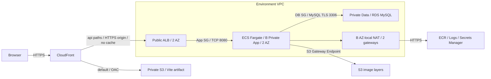
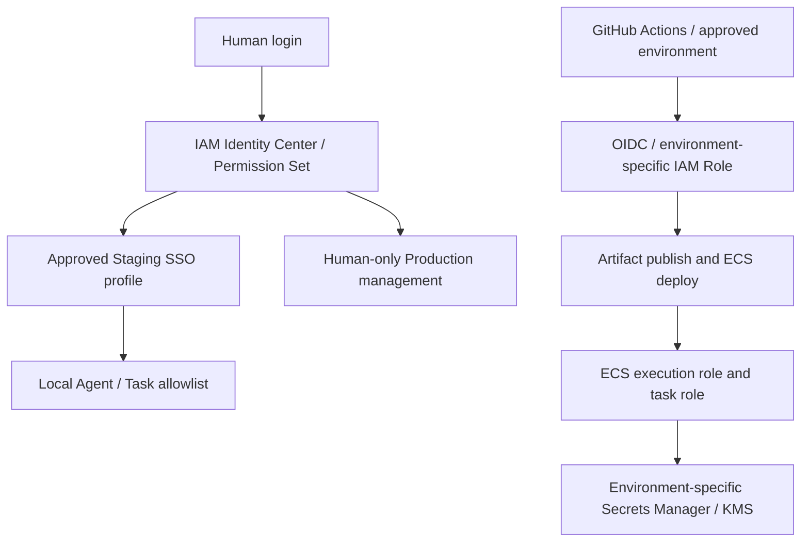

# 13. AWS Deployment Architecture / Cost Gate

작성일: 2026-10-02. 승인 반영일: 2026-10-03. TASK-023 / DEC-027 **Human Approved**.

이 문서는 승인 검토용 설계다. Resource 생성, IAM 설정, GitHub Environment 변경, 배포를 허가하지 않는다. TASK-022 완료 근거는 WORK_LOG의 PR #5 Human Squash Merge 기록이다. 승인된 DEC-019 / DEC-023 / DEC-024 / DEC-026을 유지한다.

## 1. 승인안과 적용 조건

Human은 2026-10-03 **B안 Production-like**을 승인했다. 서울(ap-northeast-2)의 같은 계정에서 Staging을 먼저 운영한다. A안은 비용이 낮지만 단일 Task / Single-AZ DB와 Public ECS를 사용하므로 격리 / HA 학습 목표에 따라 기각했다. Production 생성은 TASK-030 전 별도 승인이 필요하며 계정 분리를 다시 검토한다. 현재 MVP에는 인증/인가가 없으므로 Private App Subnet만으로 사용자 데이터 접근이 보호되지는 않는다. 합성 데이터만 사용하며 실제 개인 데이터 입력과 공개 Production 운영은 인증 / 접근 제한 Task 승인 전까지 금지한다.

크기와 비용 상한은 승인된 설계 기준이며 실측 용량이나 확정 AWS 견적이 아니다. 공식 사실 확인은 Task 문서의 Claude 세션 2026-10-02 조회 기록을 인용한다. Executor는 Web / AWS CLI를 사용하지 않았다. 미해소 항목의 담당 Task와 시점은 8절을 따른다.

## 2. Architecture Option 비교

| 항목 | A — 교육 / 비용 최적화 | B — Production-like (승인) |
|---|---|---|
| 공통 Resource | Private S3, CloudFront, ACM, ECR, ECS Fargate, Public ALB, RDS MySQL, Secrets Manager, CloudWatch, Budget | A와 같은 서비스, 환경별 전용 Resource |
| Network | VPC 1개, 2 AZ의 Public Subnet(ALB / ECS), 2 AZ의 Private Data Subnet(RDS), IGW | 환경별 VPC, 2 AZ Public(ALB / NAT), 2 AZ Private App(ECS), 2 AZ Private Data(RDS), IGW |
| App outbound | ECS Public IPv4 → IGW → ECR / S3 image layer / Logs / Secrets Manager HTTPS | ECS Private App → 같은 AZ NAT → AWS HTTPS endpoint; Data Subnet에는 인터넷 기본 경로 없음 |
| NAT / Endpoint | NAT 없음, 유료 Interface Endpoint 없음 | NAT 2개(AZ별 1개), S3 Gateway Endpoint; Interface Endpoint는 초기 제외 |
| ECS 기준 | x86_64 Linux, 0.5 vCPU / 1 GiB, Desired Count 1 | x86_64 Linux, 0.5 vCPU / 1 GiB, Desired Count 2, AZ 분산 |
| RDS 기준 | db.t4g.micro, gp3 20 GiB, Single-AZ, Public access 비활성 | db.t4g.small, gp3 20 GiB, Multi-AZ DB instance(primary + standby), Public access 비활성 |
| 비용 | ALB / RDS 상시 고정비는 남음. Public IPv4 / burst credit 비용 고려 | NAT 2개, 추가 Task, Multi-AZ와 환경 복제로 고정비 증가 |
| 보안 장점 / 약점 | RDS 격리, ECS inbound는 ALB SG만 허용. ECS Public IP와 인터넷 outbound는 노출 위험 | App / Data에 Public IP 없음. NAT outbound는 인터넷 접근 통제 자체를 보장하지 않음 |
| SPOF / 가용성 | Task 1개와 Single-AZ DB 장애 시 중단. ALB의 2 AZ가 이를 해결하지 않음 | Task / DB AZ 장애 대응 강화. 단일 Region 장애와 논리적 DB 오류는 남음 |
| 운영 복잡도 | 낮음, SG / Route / Public IP 이해 필요 | 높음, AZ별 Route / NAT / 장애 / 비용 관리 필요 |
| 배포 / 롤백 | Task 교체 중 임시 2개분 비용. 실패 시 이전 digest 재배포, 중단 위험 | Rolling 배포 중 임시 최대 4개분 비용 제안. 동일 digest 롤백, DB 변경은 별도 복구 |
| 학생 적합성 | 짧은 실습 및 비용 구조 학습에 권장 | 격리 / HA / 운영 학습에 적합, 비용 승인 필수 |

B의 저비용 변형인 NAT 1개는 cross-AZ 전송비와 NAT AZ 장애라는 SPOF를 만든다. NAT 없는 Endpoint 전용 구성은 ECR API / DKR, Logs, Secrets Manager Interface Endpoint 및 S3 Gateway 경로를 모두 설계해야 하고 외부 인터넷은 사용할 수 없다. AZ별 Endpoint 시간비와 데이터비를 NAT와 비교한 뒤 별도 승인한다. Endpoint만 추가하면서 NAT를 유지하면 비용이 중복될 수 있다.

## 3. Network Flow / Routing

- CloudFront의 default origin은 S3 REST origin이며 Website endpoint를 쓰지 않는다. S3 Block Public Access + OAC로 distribution 한정 읽기만 허용한다.
- `/api`와 `/api/*`는 ALB origin으로 보내고 path를 그대로 보존한다. POST 포함 필요한 HTTP method, query(days 등), Content-Type과 필요한 header를 전달하며 API cache는 비활성화한다. API 4xx / 5xx를 SPA HTML / 200으로 바꾸지 않는다.
- SPA fallback은 정적 origin의 확장자 없는 화면 경로에만 적용하도록 TASK-024에서 설계한다. distribution 전체 403 / 404 변환은 API 오류를 숨길 수 있다. HTML은 짧은 cache, hash asset은 긴 cache를 제안한다.
- Human 결정 2(2026-10-03)는 Domain을 `8949db.kr`로 확정했다. 사용자 진입은 CloudFront 사용자 정의 hostname과 us-east-1 ACM 인증서로 HTTPS를 제공하고, CloudFront → ALB는 전용 origin hostname과 ap-northeast-2 ACM 인증서로 HTTPS origin을 사용한다. 인증서 이름과 origin DNS 이름을 일치시키고 ACM은 DNS 검증을 사용한다. CloudFront 기본 Domain / HTTP origin 구성은 사용하지 않는다. CloudFront origin-facing managed prefix list와 listener 검증 header 제한을 유지한다. Prefix list만으로 다른 distribution을 구별할 수 없으므로 header 조건으로 우회를 차단한다. 값은 문서에 기록하지 않으며 저장 / 교체 정책은 TASK-025에서 승인한다.
- 기본 hostname은 Production `moodfit.8949db.kr`, Staging `staging.moodfit.8949db.kr`, ALB origin은 각각 `origin.moodfit.8949db.kr` / `origin.staging.moodfit.8949db.kr`이다. Apex는 사용하지 않는다. TASK-026 IaC 작성 전에 hostname을 최종 확정한다. Route 53 Public Hosted Zone은 MoodFit 계정에 둔다.
- DNS 현황은 Task 문서의 Claude 세션 공개 DNS / RDAP 조회(2026-10-03)를 인용한다. 등록 만료일은 2027-02-26이며 위임된 Route 53 네임서버 4개가 REFUSED를 반환하는 lame delegation 상태다. 위임된 Hosted Zone이 존재하지 않는 상태로 판단한 기록이며 Executor가 직접 조회한 결과는 아니다. TASK-026 전 사용할 계정에 Hosted Zone을 준비하고 Human이 등록 기관 네임서버를 새 Zone 값으로 변경한 뒤 DNS 응답과 ACM DNS 검증을 확인해야 한다. 도메인 만료 전 갱신은 Human 책임이다. 이 문서는 Zone 생성이나 네임서버 변경 실행을 승인하지 않는다.
- ALB → ECS는 VPC 내부 TCP 8080 기준이며 이 구간의 평문 전송은 승인된 설계의 잔여 위험으로 기록한다. ECS SG는 ALB SG만, RDS SG는 ECS SG만 3306 허용한다. RDS에 Public IP / 인터넷 / PC 직접 접속을 열지 않는다. DB TLS 인증서 검증 방식은 후속 배포 Task에서 검증한다.
- ALB와 ECS의 응답 경로 및 health check를 SG에 반영한다. 새 Health API / Dependency는 TASK-024의 별도 Gate 대상이며 현재 구현된 것으로 간주하지 않는다.
- 대안인 별도 API hostname은 CORS와 환경별 Vite build 설정이 필요하다. 동일 origin `/api` 방식을 권장하며 API Contract 자체는 변경하지 않는다.

## 4. 사람 / Agent / CI-CD Security Boundary

- Human이 SSO 로그인한다. Agent는 Contract에 지정된 최소 권한 Staging Profile만 사용하고 Production 관리 Profile, 인증 Cache 읽기, 자격 증명 출력, Access Key 생성은 금지한다. 이번 Task는 Profile을 사용하지 않는다.
- Permission Set 승인 범위는 Human read-only, Staging task-scoped operator, Human-only Production operator의 분리다. 관리자 / 조직 / IAM / 비용 확대 권한은 로컬 Agent에서 제외한다. 실제 action / Resource / duration / permission boundary는 TASK-025에서 승인한다.
- GitHub OIDC role은 Repository / Branch 또는 Environment subject와 audience를 제한한다. Staging / Production deploy role 및 IaC role을 분리하고 deploy role에 IAM / Network / DB 삭제 권한을 주지 않는다. Production Required Reviewer와 self-review 방지 가능 여부를 GitHub plan에서 확인한다. 지원 불가 시 우회 없이 HUMAN_REQUIRED로 정지한다.
- ECS execution role은 image pull / log / 시작 시 DB 비밀번호 주입에 필요한 특정 Secret 및 필요한 KMS 권한만 가진다. task role은 앱의 AWS 호출이 없으면 권한을 부여하지 않는다. 앱 DB 사용자는 필요한 schema DML 최소 권한, migration 관리자는 분리한다.
- DB 비밀번호는 환경별 Secrets Manager에 저장하고 CI artifact / Vite build / Source / Prompt / Log에 넣지 않는다. 시작 시 환경변수 주입을 제안하며 rotation 뒤 Task 재배포 필요성과 오래된 연결 종료를 검증한다. 자동 rotation은 추가 Resource / 비용 / 정책 승인 없이는 켜지 않는다.
- 저장 데이터 / S3 / RDS / ECR / Logs 암호화를 설계 기준으로 삼는다. KMS key 방식과 추가 단가는 TASK-025에서 확정한다. 요청 body, DB 비밀번호, 개인 metric을 log로 남기지 않는다.

## 5. RDS 8.0 유지 vs 8.4 LTS

다음 사실은 Task 문서의 Claude 세션 공식 확인 기록(2026-10-02 조회)을 반영한다. [RDS MySQL version 일정](https://docs.aws.amazon.com/AmazonRDS/latest/UserGuide/MySQL.Concepts.VersionMgmt.html), [RDS 가격](https://aws.amazon.com/rds/mysql/pricing/), [Extended Support](https://docs.aws.amazon.com/AmazonRDS/latest/UserGuide/extended-support.html).

| 항목 | 확인 결과 |
|---|---|
| MySQL 8.0 | 표준 지원 종료 2026-07-31, Extended Support로만 제공. 신규 생성도 유료 |
| 연장 지원 일정 | 1년차 2026-08-01, 3년차 2028-08-01, 종료 2029-07-31 |
| 서울 연장 지원 단가 | 1·2년차 USD 0.12/vCPU-hour, 3년차 USD 0.24/vCPU-hour |
| MySQL 8.4 | 표준 지원 종료 2029-07-31, 조회 당시 RDS 최신 minor 8.4.11 |

8.0은 Local / Testcontainers 8.0.46과 major가 같지만 유료 연장 지원과 향후 upgrade 부담 때문에 기각했다. B안 primary + standby 4 vCPU의 730시간 연장 지원 추가액은 1·2년차 USD 350.40, 3년차 USD 700.80이다. A안 2 vCPU는 각각 USD 175.20 / 350.40이다.

**RDS MySQL 8.4를 승인**했으며 db.t4g.small, gp3 20 GiB, Multi-AZ DB instance(primary + standby), Public 접근 차단, 암호화, 삭제 보호를 적용한다. Multi-AZ DB cluster와 구분한다. 정확한 생성 minor와 서울 Engine / Class / gp3 / Multi-AZ orderable 가용성은 승인된 최소 권한 Profile로 TASK-026 전에 확인한다.

DEC-027은 DEC-023을 대체하지 않는다. Local MySQL / Testcontainers Image / CI의 8.0.46 변경은 별도 Decision / Gate / Task를 TASK-026 전에 승인하고 호환 검증해야 한다. Driver / SQL / Flyway 검증 없이 생성하지 않는다.

## 6. Cost Decision Matrix

Claude 세션이 2026-10-02 조회한 AWS Price List API 서울 가격을 인용한다. AmazonRDS 게시본 2026-10-01, AmazonECS 게시본 2026-09-11, AWSELB / AmazonVPC / AmazonEC2 현재본이다. 공식 API 근거는 [AWS Price List](https://docs.aws.amazon.com/awsaccountbilling/latest/aboutv2/price-changes.html)이며 조회 provenance와 핵심 수치는 Task 문서 Gate 검토 자료에 기록되어 있다.

월 730시간, 할인 / Free Tier 미적용, USD, 환경 1개 기준이다. 평균 1 LCU, gp3 20 GiB를 가정한다. NAT 처리 GB / 전송 / backup 초과 / CPU credit / 세금 / 환율 / Domain 구입비와 배포 중 추가 Task는 별도다.

| 항목 / 공식 가격 근거 | 서울 단가 / 산식 | A 비교안 월액 | B 승인안 월액 |
|---|---|---|---|
| [Fargate](https://aws.amazon.com/fargate/pricing/) | CPU 0.04656/h, GB 0.00511/h; 0.5 vCPU / 1 GiB | 20.7 (1개) | 41.5 (2개) |
| [ALB](https://aws.amazon.com/elasticloadbalancing/pricing/) | 0.0225/h + 0.008/LCU-h | 22.3 | 22.3 |
| [RDS](https://aws.amazon.com/rds/mysql/pricing/) | micro 0.025/h, small Single-AZ 0.051/h, small Multi-AZ 0.102/h; gp3 Single-AZ 0.131/GB-월, Multi-AZ 0.262/GB-월 | 20.9 | 79.7 |
| [NAT](https://aws.amazon.com/vpc/pricing/) | 0.059/h + 0.059/처리 GB | 0 | 86.1 (2개) + 처리 GB |
| [Public IPv4](https://aws.amazon.com/vpc/pricing/) | 0.005/address-h | 11.0 (3개 가정) | 14.6 (4개 가정) |
| [Route 53](https://aws.amazon.com/route53/pricing/) | Public Hosted Zone 월 비용 + DNS 질의 수 × 단가; 단가 확인 필요, TASK-026 전 견적에 포함 | 기타 추정액에 포함 | 기타 추정액에 포함; 계정 공용 Zone 중복 계산 방지 |
| [ACM](https://aws.amazon.com/certificate-manager/pricing/) | CloudFront / ALB 연동용 비내보내기 공개 인증서 별도 비용 없음으로 알려짐. 공식 확인 필요, TASK-026 전 Claude 세션 확인; DNS 질의 비용 별도 | 미확정 | 미확정 |
| 기타 | 아래 서비스 단가 미조회, Route 53 포함 추정치 | 약 3 ~ 5 | 약 5 |
| 합계 (8.4) | 확정 견적 아님 | 약 78 | 약 250 + 별도 비용 |
| 8.0 대안 추가액 | 1·2년차 Extended Support | +175.2 | +350.4 |

기타에는 [S3](https://aws.amazon.com/s3/pricing/), [CloudFront](https://aws.amazon.com/cloudfront/pricing/), [ECR](https://aws.amazon.com/ecr/pricing/), [Secrets Manager](https://aws.amazon.com/secrets-manager/pricing/), [CloudWatch](https://aws.amazon.com/cloudwatch/pricing/), [KMS](https://aws.amazon.com/kms/pricing/), [Route 53](https://aws.amazon.com/route53/pricing/)가 포함된다. 단가는 확인 필요이며 TASK-026 생성 전 견적에서 storage / 요청 / 전송 / key / log ingestion / retention / backup / snapshot까지 합산한다. 앱 Log 30일과 ALB S3 Log 30일, Backup 14일을 반영하면 기타 추정액이 증가할 수 있다. [PrivateLink](https://aws.amazon.com/privatelink/pricing/) Interface Endpoint는 초기 제외, S3 Gateway Endpoint를 사용한다. 후속 추가는 별도 비용 승인 대상이다.

B안 월 상한은 **USD 300 / 환경**, Staging + Production 동시 운영 시 **USD 600**이다. 약 250은 상한 이내의 추정이며 공식 견적이 상한을 넘으면 생성 전 Human 재승인이 필요하다. Budget 알림은 50 / 80 / 100% 및 forecast이며 지출을 강제로 차단하지 않는다. Human이 비용을 확인하며 상한 접근 시 Resource 확대를 중지한다.

80시간 실습의 A안 약 USD 15는 기각안 참고치다. B안에 그대로 적용하지 않는다. ALB / NAT는 Task 중지 후에도 시간비가 남고 RDS 중지는 storage / backup 비용을 없애지 않는다. [DB stop](https://docs.aws.amazon.com/AmazonRDS/latest/UserGuide/USER_StopInstance.html) 기간 / 자동 재시작 요건은 TASK-026 견적과 정리 계획에서 확인 필요다. Rolling 최대 4 Task, 두 환경, restore clone, Snapshot 잔존 비용도 포함한다.

## 7. 운영 / Backup / Rollback / 정리

- 승인된 Logging은 앱 Log 30일, ALB access log 환경별 S3 30일이다. 앱 오류 / ECS deploy event, ALB 오류 / latency / unhealthy target, ECS CPU / memory, RDS 연결 / storage를 관찰한다. 요청 body / 개인 metric / DB 비밀번호를 남기지 않는다. CloudTrail / KMS 상세와 비용은 TASK-025에서 확정한다.
- RDS Backup은 14일, 암호화 / 삭제 보호, 삭제 전 final snapshot을 적용한다. 수동 Snapshot은 30일 보관 후 별도 삭제 승인한다. Backup / maintenance window를 분리한다. RPO / RTO는 후속 restore / smoke test에서 측정하며 Multi-AZ는 Backup을 대체하지 않는다.
- ECR immutable tag / digest와 S3 artifact version을 검증된 Commit에 연결한다. 이전 Frontend artifact와 Backend digest를 함께 보존한다. Rolling 중 AZ별 healthy target과 DB 연결을 검증한다. DB migration은 container rollback으로 되돌릴 수 없으며 파괴적 migration / restore / Production rollback은 별도 Human 승인 대상이다.
- 실습 / 검증 종료 시 Human이 정리 또는 연장을 결정한다. 기본 7일 후 정리 검토하며 자동 파괴적 삭제는 하지 않는다. 환경 / Owner 역할 / Task / 만료일 inventory와 삭제 목록 / 데이터 보존 영향을 제시한다. final snapshot 확보 후 ALB / NAT / EIP / Endpoint / ECR / S3 version / Logs / Secrets / DNS 잔존 비용을 점검한다.

## 8. Human Decision Matrix / 후속 조건

승인 근거는 Task 문서의 **Human 결정 (2026-10-03, Gate)**와 **Human 결정 2 — Domain (2026-10-03)**다.

| 항목 | 확정값 / 유보 조건 |
|---|---|
| Architecture / Region | B Production-like, ap-northeast-2 |
| 계정 / 환경 | 같은 계정 Staging 먼저, 환경별 VPC / DB / bucket / Role 분리. Production 전 계정 분리 재검토와 TASK-030 전 생성 승인 |
| SSO | ReadOnly / Staging 범위 운영자 / Production Human 전용. 최소 권한 Permission Set 상세 TASK-025 |
| Network | 2 AZ Public(ALB / NAT), Private App(ECS), Private Data(RDS). AZ별 NAT 2개, S3 Gateway Endpoint, Interface Endpoint 초기 제외 |
| RDS | 8.4 / db.t4g.small / gp3 20 GiB / Multi-AZ DB instance / Public 접근 차단 / 암호화 / 삭제 보호 |
| ECS | Linux x86 / 0.5 vCPU / 1 GiB / Desired Count 2, AZ 분산. JVM memory / startup TASK-024 실측 |
| Domain | 8949db.kr 승인. CloudFront ACM us-east-1 / ALB origin ACM ap-northeast-2, HTTPS origin. TASK-026 전 hostname 확정 / Hosted Zone 준비 / Human 네임서버 변경 / DNS 응답 확인; 갱신은 Human 책임 |
| Logging / Backup | 앱 30일 / ALB S3 30일 / Backup 14일 / final snapshot / 수동 Snapshot 30일 후 별도 삭제 승인 |
| 데이터 | 합성 데이터만. 실제 개인 데이터와 공개 Production은 인증 / 접근 제한 Task 승인 전 금지 |
| 비용 / 정리 | 환경당 월 USD 300, 두 환경 600. Budget 50 / 80 / 100% + forecast, 기본 7일 후 Human 정리 / 연장 검토 |

현재 PC의 SSO Profile이 모두 AdministratorAccess라는 Claude 세션 2026-10-03 기록에 따라 이번 Task는 AWS 조회를 하지 않았다. **TASK-025의 선행 조건**은 최소 권한 Staging Profile 준비와 Agent 허용 Profile 지정이다. 실제 계정 / Profile 식별정보는 기록하지 않는다. TASK-026 전에 해당 Profile로 Engine / Class / Region 가용성을 확인한다.

[CloudFront HTTPS](https://docs.aws.amazon.com/AmazonCloudFront/latest/DeveloperGuide/cnames-and-https-requirements.html), [Regional Services](https://aws.amazon.com/about-aws/global-infrastructure/regional-product-services/), [S3 OAC](https://docs.aws.amazon.com/AmazonCloudFront/latest/DeveloperGuide/private-content-restricting-access-to-s3.html) 세부 설정은 TASK-025 / TASK-026 생성 전에 확인한다. Domain 선택은 승인 완료이며 DNS 복구, ACM 공개 인증서 비용의 공식 확인, 미조회 서비스 단가와 실제 orderable 가용성은 TASK-026 전 후속 조건이다.

TASK-023 DONE / TASK-024 READY는 이번 PR의 완료 반영이며 Human Squash Merge로 확정한다. TASK-024 실행은 별도 명시 지시가 필요하다. 설계 승인은 실제 Resource 생성 / IAM 설정 / Local DB 버전 변경 / Production 배포 승인을 대신하지 않는다.
