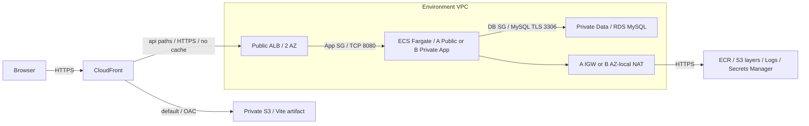
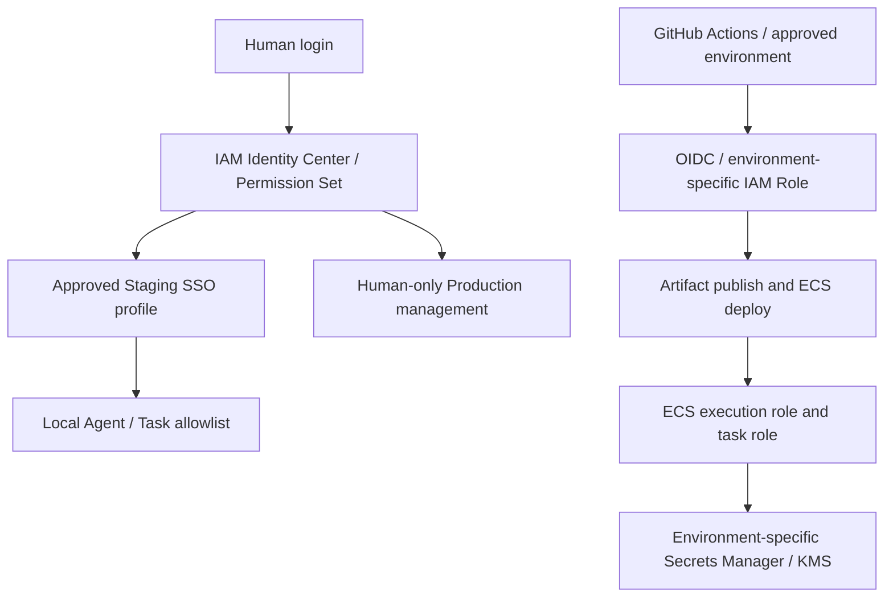

# 13. AWS Deployment Architecture / Cost Gate

작성일: 2026-10-02. TASK-023 / DEC-027 **Pending Human Approval**.

이 문서는 승인 검토용 설계다. Resource 생성, IAM 설정, GitHub Environment 변경, 배포를 허가하지 않는다. TASK-022 완료 근거는 WORK_LOG의 PR #5 Human Squash Merge 기록이다. 승인된 DEC-019 / DEC-023 / DEC-024 / DEC-026을 유지한다.

## 1. 권장안과 적용 조건

교육용 Staging은 A안, Production-like 실습은 B안을 비교한다. 우선 A안의 짧은 실습 기간과 합성 데이터 사용을 권장한다. B안은 더 높은 고정비를 승인한 뒤 별도로 만든다. 현재 단일 사용자 MVP에는 인증/인가가 없으므로 Private App Subnet만으로 사용자 데이터 접근이 보호되지는 않는다. 실제 개인 웰니스 데이터 입력이나 공개 Production 운영은 권장하지 않는다. 인증 또는 접근 제한을 추가하려면 별도 Human Gate와 Task가 필요하다.

모든 크기와 비용 상한은 제안이며 실측 용량이나 AWS 견적이 아니다. Region별 서비스 / Engine / Class 가용성, 단가와 지원 일정은 Human Gate에서 Claude 세션이 공식 문서로 재확인한다. 미확인 항목은 아래에 `확인 필요`로 표시한다.

## 2. Architecture Option 비교

| 항목 | A — 교육 / 비용 최적화 | B — Production-like |
|---|---|---|
| 공통 Resource | Private S3, CloudFront, ACM, ECR, ECS Fargate, Public ALB, RDS MySQL, Secrets Manager, CloudWatch, Budget | A와 같은 서비스, 환경별 전용 Resource |
| Network | VPC 1개, 2 AZ의 Public Subnet(ALB / ECS), 2 AZ의 Private Data Subnet(RDS), IGW | 환경별 VPC, 2 AZ Public(ALB / NAT), 2 AZ Private App(ECS), 2 AZ Private Data(RDS), IGW |
| App outbound | ECS Public IPv4 → IGW → ECR / S3 image layer / Logs / Secrets Manager HTTPS | ECS Private App → 같은 AZ NAT → AWS HTTPS endpoint; Data Subnet에는 인터넷 기본 경로 없음 |
| NAT / Endpoint | NAT 없음, 유료 Interface Endpoint 없음 | NAT 2개(AZ별 1개), S3 Gateway Endpoint 제안; Interface Endpoint는 초기 제외 |
| ECS 제안 | x86_64 Linux, 0.5 vCPU / 1 GiB, Desired Count 1 | x86_64 Linux, 0.5 vCPU / 1 GiB, Desired Count 2, AZ 분산 |
| RDS 제안 | db.t4g.micro, gp3 20 GiB, Single-AZ, Public access 비활성 | db.t4g.small, gp3 20 GiB, Multi-AZ DB instance(primary + standby), Public access 비활성 |
| 비용 | ALB / RDS 상시 고정비는 남음. Public IPv4 / burst credit 비용 고려 | NAT 2개, 추가 Task, Multi-AZ와 환경 복제로 고정비 증가 |
| 보안 장점 / 약점 | RDS 격리, ECS inbound는 ALB SG만 허용. ECS Public IP와 인터넷 outbound는 노출 위험 | App / Data에 Public IP 없음. NAT outbound는 인터넷 접근 통제 자체를 보장하지 않음 |
| SPOF / 가용성 | Task 1개와 Single-AZ DB 장애 시 중단. ALB의 2 AZ가 이를 해결하지 않음 | Task / DB AZ 장애 대응 강화. 단일 Region 장애와 논리적 DB 오류는 남음 |
| 운영 복잡도 | 낮음, SG / Route / Public IP 이해 필요 | 높음, AZ별 Route / NAT / 장애 / 비용 관리 필요 |
| 배포 / 롤백 | Task 교체 중 임시 2개분 비용. 실패 시 이전 digest 재배포, 중단 위험 | Rolling 배포 중 임시 최대 4개분 비용 제안. 동일 digest 롤백, DB 변경은 별도 복구 |
| 학생 적합성 | 짧은 실습 및 비용 구조 학습에 권장 | 격리 / HA / 운영 학습에 적합, 비용 승인 필수 |

B의 저비용 변형인 NAT 1개는 cross-AZ 전송비와 NAT AZ 장애라는 SPOF를 만든다. NAT 없는 Endpoint 전용 구성은 ECR API / DKR, Logs, Secrets Manager Interface Endpoint 및 S3 Gateway 경로를 모두 설계해야 하고 외부 인터넷은 사용할 수 없다. AZ별 Endpoint 시간비와 데이터비를 NAT와 비교한 뒤 별도 승인한다. Endpoint만 추가하면서 NAT를 유지하면 비용이 중복될 수 있다.

## 3. Network Flow / Routing

- CloudFront의 default origin은 S3 REST origin이며 Website endpoint를 쓰지 않는다. S3 Block Public Access + OAC로 distribution 한정 읽기만 제안한다.
- `/api`와 `/api/*`는 ALB origin으로 보내고 path를 그대로 보존한다. POST 포함 필요한 HTTP method, query(days 등), Content-Type과 필요한 header를 전달하며 API cache는 비활성화한다. API 4xx / 5xx를 SPA HTML / 200으로 바꾸지 않는다.
- SPA fallback은 정적 origin의 확장자 없는 화면 경로에만 적용하도록 TASK-024에서 설계한다. distribution 전체 403 / 404 변환은 API 오류를 숨길 수 있다. HTML은 짧은 cache, hash asset은 긴 cache를 제안한다.
- ALB origin DNS / 인증서 이름을 일치시켜 CloudFront → ALB HTTPS를 사용한다. ALB SG는 CloudFront origin-facing managed prefix list를 허용하고 listener는 비민감 문서에 값이 없는 origin 검증 header 조건을 추가하도록 제안한다. Prefix list만으로 다른 distribution을 구별할 수 없으므로 직접 ALB 우회도 차단해야 한다. 상세 저장 / 교체 정책은 TASK-025 승인 대상이다.
- ALB → ECS는 VPC 내부 TCP 8080 제안이며 이 구간은 TLS 종료 후 평문이라는 잔여 위험을 승인해야 한다. ECS SG는 ALB SG만, RDS SG는 ECS SG만 3306 허용한다. RDS에 Public IP / 인터넷 / PC 직접 접속을 열지 않는다. DB TLS 인증서 검증 방식은 후속 배포 Task에서 검증한다.
- ALB와 ECS의 응답 경로 및 health check를 SG에 반영한다. 새 Health API / Dependency는 TASK-024의 별도 Gate 대상이며 현재 구현된 것으로 간주하지 않는다.
- 대안인 별도 API hostname은 CORS와 환경별 Vite build 설정이 필요하다. 동일 origin `/api` 방식을 권장하며 API Contract 자체는 변경하지 않는다.

## 4. 사람 / Agent / CI-CD Security Boundary

- Human이 SSO 로그인한다. Agent는 Contract에 지정된 최소 권한 Staging Profile만 사용하고 Production 관리 Profile, 인증 Cache 읽기, 자격 증명 출력, Access Key 생성은 금지한다. 이번 Task는 Profile을 사용하지 않는다.
- Permission Set 제안은 Human read-only, Staging task-scoped operator, Human-only Production operator의 분리다. 관리자 / 조직 / IAM / 비용 확대 권한은 로컬 Agent에서 제외한다. 실제 action / Resource / duration / permission boundary는 TASK-025에서 승인한다.
- GitHub OIDC role은 Repository / Branch 또는 Environment subject와 audience를 제한한다. Staging / Production deploy role 및 IaC role을 분리하고 deploy role에 IAM / Network / DB 삭제 권한을 주지 않는다. Production Required Reviewer와 self-review 방지 가능 여부를 GitHub plan에서 확인한다. 지원 불가 시 우회 없이 HUMAN_REQUIRED로 정지한다.
- ECS execution role은 image pull / log / 시작 시 DB 비밀번호 주입에 필요한 특정 Secret 및 필요한 KMS 권한만 가진다. task role은 앱의 AWS 호출이 없으면 권한을 부여하지 않는다. 앱 DB 사용자는 필요한 schema DML 최소 권한, migration 관리자는 분리한다.
- DB 비밀번호는 환경별 Secrets Manager에 저장하고 CI artifact / Vite build / Source / Prompt / Log에 넣지 않는다. 시작 시 환경변수 주입을 제안하며 rotation 뒤 Task 재배포 필요성과 오래된 연결 종료를 검증한다. 자동 rotation은 추가 Resource / 비용 / 정책 승인 없이는 켜지 않는다.
- 저장 데이터 / S3 / RDS / ECR / Logs 암호화를 제안한다. KMS key 방식과 추가 단가는 TASK-025에서 확정한다. 요청 body, DB 비밀번호, 개인 metric을 log로 남기지 않는다.

## 5. RDS 8.0 유지 vs 8.4 LTS

공식 지원 표를 읽은 참고 결과는 8.0 표준 지원 종료 **2026-07-31**, Extended Support 시작 **2026-08-01**, 3년차 가격 시작 **2028-08-01**, 종료 **2029-07-31**이다. 따라서 2026-10-02 신규 설계에서 8.0을 무료 표준 지원으로 예산화하지 않는다. Human Gate에서 이 일정과 Region별 제공 minor를 재확인해야 한다. [AWS RDS MySQL version 일정](https://docs.aws.amazon.com/AmazonRDS/latest/UserGuide/MySQL.Concepts.VersionMgmt.html)

Extended Support는 실행 vCPU-hour 기반 추가 과금이며 Region / 지원 연차에 따라 달라진다. Multi-AZ primary와 standby의 과금도 포함해 계산한다. 가격 페이지의 미국 Region 예시는 서울 견적이 아니다. **서울 1·2년차 / 3년차 단가와 최종 월 금액은 확인 필요**다. [AWS RDS MySQL 가격](https://aws.amazon.com/rds/mysql/pricing/)

| 대안 | 장점 | 비용 / 위험 | 권장 / 승인 조건 |
|---|---|---|---|
| RDS 8.0 유지 | Local / Testcontainers 8.0.46과 major 일치 | 유료 Extended Support, RDS patch suffix 차이, 향후 upgrade 필요 | 짧은 호환성 실습만 고려; 지원 단가와 사용 기한 승인 |
| RDS 8.4 LTS 전환 | 신규 배포의 8.0 연장 지원 부담 회피 방향 | Local / Image / CI / Driver / SQL / Flyway 호환 검증 필요 | 권장 방향, DEC-023 변경을 포함한 별도 Decision과 실행 Task 승인 필수 |

8.4 정확한 minor와 표준 지원 종료일, db.t4g Class / gp3 / Multi-AZ의 서울 가용성은 확인 필요다. 8.4 선택만으로 DEC-023을 대체하거나 Local / Testcontainers / CI를 변경하지 않는다. RDS 생성 전 동일 major 검증 완료를 선행 조건으로 삼는다. Extended Support enrollment 설정 / opt-out 시 AWS upgrade 동작도 공식 문서 확인 후 IaC에 명시해야 한다. [AWS Extended Support](https://docs.aws.amazon.com/AmazonRDS/latest/UserGuide/extended-support.html)

## 6. Cost Decision Matrix

산정 입력 제안: 월 730시간 상시 운영과 월 80시간 단기 실습을 각각 산정한다. 환경당 정적 데이터 1 GiB, ECR 보관 5 GiB, Log ingestion 1 GiB/월, 사용자 전송 10 GiB/월, HTTPS 10만 요청/월, ALB 평균 1 LCU를 가정한다. NAT processed GB / AZ 간 GB는 별도 입력하며 0으로 누락하지 않는다. 할인 / Free Tier / Credit / Savings Plan은 적용하지 않는다. USD 기준, 세금 / 환율 / Domain 구입비는 별도다.

| 비용 요인 | A 산식 / 수량 | B 산식 / 수량 | 공식 근거 / 현재 상태 |
|---|---|---|---|
| Fargate | h × (0.5 CPU단가 + 1 GiB단가) | A의 2배 + rolling 중 추가 Task시간 | [Fargate](https://aws.amazon.com/fargate/pricing/) / 서울 단가 확인 필요 |
| ALB | h × ALB단가 + LCU-hour × 단가 | 환경당 동일, 트래픽별 증가 | [ELB](https://aws.amazon.com/elasticloadbalancing/pricing/) / 확인 필요 |
| RDS | h × micro단가 + 20 GiB gp3 + backup 초과 + CPU credit | Multi-AZ small 견적 + storage / backup / credit | [RDS](https://aws.amazon.com/rds/mysql/pricing/) / 확인 필요 |
| RDS Extended Support | 과금 vCPU × h × 연차별 단가 | primary + standby 과금 vCPU로 산정 | 위 RDS 가격 / 서울 단가 확인 필요 |
| NAT | 0 | 2 × h × 시간단가 + processed GB × 단가 | [VPC](https://aws.amazon.com/vpc/pricing/) / 확인 필요 |
| Endpoint | 초기 0 | S3 Gateway, 추가 Interface는 서비스 × AZ × h 및 GB | [PrivateLink](https://aws.amazon.com/privatelink/pricing/) / 확인 필요 |
| Public IPv4 | ALB 사용 주소 + Public Task 주소의 address-hour | ALB + NAT 주소의 address-hour | [VPC](https://aws.amazon.com/vpc/pricing/) / 주소 수·단가 확인 필요 |
| CloudFront / S3 | 전송 GB / 요청 + S3 storage / 요청 / version 보관 | 환경별 합산 | [CloudFront](https://aws.amazon.com/cloudfront/pricing/), [S3](https://aws.amazon.com/s3/pricing/) / 확인 필요 |
| ECR | storage GB-month + 적용 전송 | 환경 / 보관 digest별 합산 | [ECR](https://aws.amazon.com/ecr/pricing/) / 확인 필요 |
| Secrets / KMS / Logs | 저장 개수 / API calls / key / ingestion / retention / alarms | 환경별 합산, ALB access log S3도 포함 | [Secrets Manager](https://aws.amazon.com/secrets-manager/pricing/), [KMS](https://aws.amazon.com/kms/pricing/), [CloudWatch](https://aws.amazon.com/cloudwatch/pricing/) / 확인 필요 |
| 기타 | Route 53 zone / queries, cross-AZ / internet egress, snapshot, 감사 저장 | 같은 항목 + 환경 복제 / 복구 실습 | [Route 53](https://aws.amazon.com/route53/pricing/), [Calculator](https://calculator.aws/) / 확인 필요 |

월 합계는 위 항목 합산이며 **A / B 모두 금액 확인 필요**다. 배포 중 겹치는 Task, Staging + Production 동시 운영, restore clone 및 Snapshot 잔존 비용을 합산한다. RDS 중지만으로 storage / backup 비용이 없어지지 않으며 ALB / NAT는 Task 중지 후에도 비용이 남는다. RDS stop 기간 / 자동 재시작은 [AWS DB stop 문서](https://docs.aws.amazon.com/AmazonRDS/latest/UserGuide/USER_StopInstance.html)에서 확인 필요다.

비용 승인 제안은 A Staging 월 USD 100, B 단일 환경 월 USD 300, B 두 환경 월 USD 600이다. 이는 서비스 가격 추정이 아닌 **승인 요청 상한**이다. 공식 견적이 상한을 넘으면 구성 축소 또는 상한 재승인 전 생성하지 않는다. Budget 50 / 80 / 100% 및 forecast 알림을 제안하며 Budget은 강제 지출 차단 장치가 아니다. Human이 일별 비용을 확인하고 상한 접근 시 새 Resource / 확대 / 실습을 중지한다. 자동 파괴적 삭제는 하지 않는다.

## 7. 운영 / Backup / Rollback / 정리

- 제안 Logging은 앱 INFO / 오류 및 ECS deploy event, ALB 4xx / 5xx / latency / unhealthy target, ECS CPU / memory, RDS 연결 / storage 지표다. Log retention은 A 7일 / B 30일, ALB access log는 환경별 S3 30일 lifecycle 제안. body / query의 개인 정보 노출을 검토한다. CloudTrail 관리 이벤트 감사와 저장 비용도 TASK-025에서 확정한다.
- A backup retention 7일, B 14일을 제안한다. RDS 암호화 / deletion protection, backup / maintenance window 분리, 삭제 전 final snapshot과 Human 승인, 수동 Snapshot 30일 보관 후 별도 삭제 승인을 제안한다. 실제 RPO / RTO는 restore 및 smoke test로 측정 전 확인 필요이며 Multi-AZ는 backup 대체가 아니다.
- ECR immutable tag / digest와 S3 artifact version을 검증된 Commit에 연결한다. 이전 Frontend artifact와 Backend digest를 함께 기록하고 API 호환성이 유지될 때만 재배포한다. DB migration은 이전 container로 자동 되돌릴 수 없으며 파괴적 migration / snapshot restore / Production rollback은 별도 Human 승인 대상이다.
- 실습 종료일 제안은 생성 후 7일이다. 환경 / Owner 역할 / Task / 만료일 tag inventory를 만들고 Human에게 삭제 목록과 데이터 보존 영향을 제시한다. RDS final snapshot 확보 후 앱·ALB·NAT·EIP·Endpoint·ECR·S3 version·Logs·Secrets·DNS의 잔존 비용을 점검한다. 보존 Snapshot / 감사 Log는 승인된 만료일에 별도로 정리한다.

## 8. Human Decision Matrix / 승인 기록

| 결정 항목 | 권장 제안 | 대안 / 승인 대기 |
|---|---|---|
| Architecture | A 교육 Staging부터 | B Production-like; 선택 필요 |
| Region | ap-northeast-2(서울) | 다른 Region 가격 / 지연 비교, 서비스 가용성 확인 필요 |
| 계정 / 환경 분리 | 같은 계정의 전용 VPC / DB / bucket / Role로 교육 Staging만 먼저 | Production 전 별도 계정 권장; 공유 계정은 IAM 오류 blast radius 잔여 위험 승인 |
| SSO / Permission Set | 사람 ReadOnly / Staging scoped operator / Human-only Prod operator | 상세 TASK-025 Gate, 실제 식별정보 기록 금지 |
| Subnet / NAT / Endpoint | A Public App + Private Data / NAT 없음 | B Private App + Private Data / AZ별 NAT 2개 / S3 Gateway |
| RDS | 8.4 방향, A micro / 20 GiB / Single-AZ | 8.0 유료 유지 또는 B small / Multi-AZ, 버전 별도 결정 필요 |
| ECS | 0.5 vCPU / 1 GiB / A 1개 | B 2개, 부하 및 JVM memory / startup 실측 필요 |
| Domain / HTTPS | 소유 Domain의 환경별 hostname + ALB origin hostname / ACM | Domain 소유 / DNS 권한 / 구매 비용 확인 필요; CF viewer 인증서 us-east-1 및 ALB 지역 인증서 요건 확인 필요 |
| Logging / Backup | 7절 retention / 지표 / 삭제 보호 | 보존 기간 / RPO / RTO 승인 필요 |
| 데이터 노출 | 합성 데이터만, 인증 없는 교육용 공개 접근 위험 확인 | 인증 / 접근 제한은 별도 승인 Task; Private ECS가 해결하지 않음 |
| 비용 / 정리 | A 100 / B 300(환경당) USD 월 상한, 7일 실습 | 공식 견적 / 알림 / 삭제 및 Snapshot 보존 승인 필요 |

인증서 근거: [CloudFront HTTPS](https://docs.aws.amazon.com/AmazonCloudFront/latest/DeveloperGuide/cnames-and-https-requirements.html). Region 근거: [AWS Regional Services](https://aws.amazon.com/about-aws/global-infrastructure/regional-product-services/). S3 보호 근거: [CloudFront OAC](https://docs.aws.amazon.com/AmazonCloudFront/latest/DeveloperGuide/private-content-restricting-access-to-s3.html). 해당 세부 요건은 Human Gate에서 확인 필요다.

Human은 이 Diff의 옵션 / 개별 값 / 제외 사항 / 공식 확인 결과 / 비용 견적 날짜를 연결해 승인하거나 수정한다. 현재 승인자는 없으며 DEC-027은 Pending이다. 승인 전 TASK-023 IN_PROGRESS, TASK-024 BLOCKED를 유지한다. DEC-027 승인 후에도 실제 Resource 생성 / IAM / Production 배포 승인은 후속 Task의 별도 Gate이며 TASK-024 실행은 별도 명시 지시가 필요하다.
